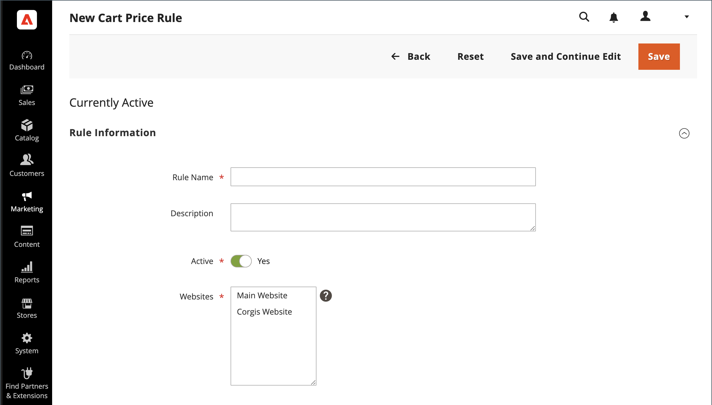
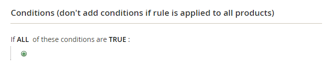

# カタログ価格ルールの作成

一連の条件が満たされた場合に特定の製品に割引を適用するには、次の手順に従います。 カタログ価格ルール割引は、商品が買い物かごに入れられる前に有効になります。

## 手順 1：ルールを追加

1. _管理者_ サイドバーで、**[!UICONTROL Marketing]**/_[!UICONTROL Promotions]_/**[!UICONTROL Catalog Price Rule]**&#x200B;に移動します。

1. 右上隅の「**[!UICONTROL Add New Rule]**」をクリックします。

   _[!UICONTROL Rule Information]_&#x200B;部は、**[!UICONTROL Conditions]**&#x200B;び&#x200B;**[!UICONTROL Actions]**&#x200B;き出し可能な伸縮部を含む。

   {width="700" zoomable="yes"}

1. 「**[!UICONTROL Rule Name]**」フィールドと「**[!UICONTROL Description]**」フィールドに入力します。

   これらのフィールドは内部参照用です。

1. 必要に応じて価格ルールの **[!UICONTROL Status]** を設定します。

   デフォルトでは、ステータスは `Inactive` です。

   ルールを作成したら、必要に応じてステータスを `Active` または `Inactive` に変更することで、ルールのステータスを更新できます。

1. ルールを使用できる **[!UICONTROL Websites]** を選択します。

1. この規則を適用する **[!UICONTROL Customer Groups]** を選択してください。

   - 選択可能なオプションは、_顧客_/_顧客グループ_ で作成および管理する顧客グループによって異なります。
   - 複数のグループを選択するには、Ctrl キー（PC）または Command キー（Mac）を押したまま、各オプションをクリックします。

1.  （Magento Open Sourceのみ） **[!UICONTROL From]** および **[!UICONTROL To]** の日付を入力して、価格ルールが有効になるタイミングを判断します。

   日付を入力するか、**[!UICONTROL Calendar]** （カレンダーアイコン  きます。 日付を空白のままにすると、価格ルールが保存されたときにルールが有効になります。

1. このルールの **[!UICONTROL Priority]** を他のルールとの関連で確立する数値を入力します。

   **[!UICONTROL Priority]** 設定は、製品が複数の価格ルールの条件を満たす場合に適用されるルールを決定します。 優先度が最も高い（数値が最も低い（0、1、2、3 など）ルールが有効になります。

## 手順 2：条件の定義

使用できる条件のほとんどは、既存の属性値に基づいています。 すべての製品にルールを適用する場合は、条件を空白のままにします。

- 少なくとも 1 つの条件付き製品属性の値が空の場合、カタログ価格ルールは製品に適用されません。

- 製品属性条件 `[!UICONTROL Category]` バンドルまたはグループ化された製品に追加すると、すべての子項目が同じカテゴリを共有する場合にのみ、価格ルールが正しく適用されます。 子項目が同じカテゴリにない場合は、代わりに [&#x200B; 買い物かご価格ルール &#x200B;](price-rules-cart-create.md) プロモーションを使用します。

1. 下にスクロールして、「**[!UICONTROL Conditions]**」セクションの  を展開します。

   デフォルトでは、最初の条件が表示され、次の状態になります。

   `If **ALL** of these conditions are **TRUE**:`

   {width="400"}

   ステートメントには 2 つの太字のリンクがあり、クリックすると、ステートメントのその部分のオプションの選択が表示されます。 これらの値の組み合わせを変更することで、様々な条件を作成できます。

1. 次のいずれかの方法で、ステートメントを変更します。

   - 「**[!UICONTROL ALL]**」をクリックし、「`ALL`」または「`ANY`」を選択します。
   - 「**[!UICONTROL TRUE]**」をクリックし、「`TRUE`」または「`FALSE`」を選択します。
   - すべての製品にルールを適用する場合は、条件を変更しません。

   これらの値の組み合わせを変更することで、様々な条件を作成できます。 この例では、デフォルトの条件が使用されます。

1. 次の行の先頭にある「_追加_ （）」アイコンをクリックし、製品属性や組み合わせなど、条件のオプションを選択します。

1. **[!UICONTROL Product Attribute]** の下のリストで、条件の基礎として使用する属性を選択します。

   この例では、条件は `Attribute Set` です。

   {width="400"}

   >[!NOTE]
   >
   >属性をリストに表示するには、プロモーションルールの条件で使用するように設定する必要があります。 詳しくは、[&#x200B; 製品属性 &#x200B;](../catalog/product-attributes.md) を参照してください。

   >[!NOTE]
   >
   >_SKU_ 製品属性と設定可能な製品で `is not one of` 条件を使用する場合は、親と子の両方の製品 SKU を選択する必要があります。 ルール内のすべての子 SKU がリストされないようにするには、設定可能な製品とその子製品の共通 SKU 部分で `does not contain` の条件を使用できます。

   選択した条件がステートメントに表示され、その後にさらに 2 つの太字リンクが表示されます。 オプションは、選択する条件属性によって異なります。 ステートメントには次の内容が含まれています。

   `If **ALL** of these conditions are **TRUE**:  Attribute Set **is** …`

1. 「**[!UICONTROL is]**」をクリックし、満たす条件を示す比較演算子を選択します。

   これらのオプションには、異なる比較のオプションが含まれる場合があります。 この例では、オプションは `is` と `is not` です。

1. 条件の値を選択または入力します。

   条件に応じて、グリッドまたはリストから製品を選択したり、数値を入力したりできます。

   {width="400"}

   条件を完了するためのステートメントに、選択した項目が表示されます。

   `If **ALL** of these conditions are **TRUE**:   Attribute Set **is Default**`

1. ステートメントに別の条件行を追加するには、「_追加_ （）」アイコンをクリックし、次のいずれかを選択します。

   - `Conditions Combination`
   - `Product Attribute`

   必要な条件がすべて完了するまで手順を繰り返します。

   条件ステートメントの一部を削除する場合は、行の最後にある **[!UICONTROL Delete]** （ アイコンをクリックします。

## 手順 3：アクションの定義

1. 「 の「**[!UICONTROL Actions]**」セクションを展開し、次の操作を行います。

   {width="600" zoomable="yes"}

1. **[!UICONTROL Pricing Structure Rules]** で、**[!UICONTROL Apply]** を次のいずれかに設定します。

   - `Apply as percentage of original` – 通常価格のパーセンテージを差し引いて品目を値引きします。 たとえば、通常価格から 10% 引き下げられた最終価格の「値引額」に 10 を入力します。
   - `Apply as fixed amount` – 定価から固定金額を引いて品目を値引きします。 たとえば、最終価格が通常の価格より$10 少ない場合は、「割引額」に 10 と入力します。
   - `Adjust final price to this percentage` – 最終価格を通常価格に対するパーセンテージで調整します。 たとえば、最終価格が通常価格から 75% 引かれた場合は、「割引額」に 25 と入力します。
   - `Adjust final price to discount value` – 最終価格を固定の割引額に設定します。 たとえば、最終価格が$20.00 の場合は、「割引額」に 20 と入力します。

   >[!NOTE]
   >
   >（グローバルの基本通貨から変換せずに）異なる通貨の Web サイト間で一貫して固定金額の割引を適用するには、「**[!UICONTROL Catalog Price Scope]**」オプションを「`Website`」に設定して、各サイトの基本通貨を定義します。

   >[!NOTE]
   >
   >_通常価格_ は、高度な価格（特別/層/グループ）やプロモーションの割引がない基本製品価格を指します。 _最終価格_ は、買い物かごに表示される割引価格を指します。  **_最終_** 製品価格は、次の式を使用して **_最小_** 関連価格として計算されます。 `Final Price=Min(Regular(Base) Price, Group(Tier) Price, Special Price, Catalog Price Rule) + Sum(Min Price per each required custom option)`

   >[!NOTE]
   >
   >**_固定価格_** 製品カスタマイズ可能なオプションは、グループ価格、階層価格、特別価格、カタログ価格ルールの影響を _受けません_。

1. **[!UICONTROL Discount Amount]** を入力します。

1. このルールが適用された後に他のルールの処理を停止するには、**[!UICONTROL Discard Subsequent Rules]** を `Yes` に設定します。

   この値を `Yes` に設定することは、システムが同じ製品に複数の割引（ルール）を適用するのを防ぐための安全策です。

## 手順 4：関連するダイナミック ブロックを追加する

{{ee-feature}}

カタログ価格ルールに関連付けられた [&#x200B; 動的ブロック &#x200B;](../content-design/dynamic-blocks.md) は、条件が満たされるたびにストアフロントに表示されます。 これはオプションの手順です。

1. **[!UICONTROL Related Dynamic Blocks]** のセクションを展開します。

1. [&#x200B; 検索フィルタ &#x200B;](../getting-started/admin-workspace.md) を使用して、ルールに関連付けるダイナミック ブロックを検索します。

1. 最初の列のチェックボックスをオンにして、ダイナミックブロックをルールに関連付けます。

   {width="600" zoomable="yes"}

1. 「**[!UICONTROL Save and Continue Edit]**」をクリックします。

## 手順 5：ルールのスケジュール

{{ee-feature}}

>[!NOTE]
>
>ルールをアクティブに設定するには、スケジュールされた更新として追加する必要があります。 詳しくは、「[&#x200B; スケジュールされた変更 &#x200B;](price-rule-catalog-scheduled-changes.md)」を参照してください。

1. 「_スケジュール済み変更_」ボックスで、ボックスの上部にある「**[!UICONTROL Schedule New Update]**」をクリックします。

   ルールに既存のスケジュールされた更新がある場合は、リストに表示された変更の右側にある「**[!UICONTROL View/Edit]**」をクリックできます。

   既存の更新を編集するか、カタログ価格ルールを別のキャンペーンに割り当てることができます。 「**既存の更新を編集**」オプションはデフォルトで選択されています。

1. ルールをスケジュールするには、**[!UICONTROL Start Date]** を入力し、価格ルールがアクティブになることを **[!UICONTROL End Date]** します。

   日付を入力するか、_カレンダー_ （）から日付を選択できます。

   {width="600" zoomable="yes"}

1. 「**[!UICONTROL Save]**」をクリックします。

1. _ルール情報_ セクションで、**[!UICONTROL Status]** を `active` に設定します。

## 手順 6：ルールを保存してテストする

1. 完了したら、ルールを保存します。

   -  （Magento Open Sourceのみ）「**[!UICONTROL Save and Apply]**」をクリックします。

   -  （Adobe Commerceのみ）「**[!UICONTROL Save]**」をクリックします。

     ルール情報ページのスケジュールされた変更には、更新されたタイムラインが表示されます。

     {width="600" zoomable="yes"}

1. ルールのプロパティを更新します。

   -  （Adobe Commerceのみ） 「**[!UICONTROL Edit]**」をクリックすると、_[!UICONTROL Rule Information]_&#x200B;ページが表示されます。

   -  （Magento Open Sourceのみ）リスト内のルールをクリックして、_[!UICONTROL Rule Information]_&#x200B;ページを表示します。

1. ルールをテストして、正しく動作することを確認します。

   価格ルールは他のシステムルールと共に毎晩自動的に処理されます。 価格ルールを作成する場合は、ルールをテストする前に、ルールがシステムに入り、正しく機能することを確認するのに十分な時間を確保します。 新しいルールが追加されると、Commerceは価格と優先度をそれに応じて再計算します。

## カタログ価格ルールのデモ

カタログ価格ルールの作成については、次のビデオをご覧ください。

>[!VIDEO](https://video.tv.adobe.com/v/3410850?quality=12&learn=on&captions=jpn)

## フィールドの説明

### [!UICONTROL Rule Information]

| フィールド | 説明 |
|-----|-----------|
| [!UICONTROL Rule name] | （必須） ルールの名前は内部参照用です。 |
| [!UICONTROL Description] | ルールの説明には、ルールの目的と使用方法を含める必要があります。 |
| [!UICONTROL Websites] | （必須） ルールを使用できる web サイトを識別します。 |
| [!UICONTROL Customer Groups] | （必須）ルールが適用される顧客グループを識別します。 |
| [!UICONTROL Priority] | このルールの優先度を他のルールと比較して示す数値。 優先順位は高い順に `0,1,2,3...` まります |
| [!UICONTROL Status] |  （Magento Open Sourceのみ） ルールがストア内でアクティブかどうかを判断します。 オプション：`Yes` / `No` |
| [!UICONTROL From] |  （Magento Open Sourceのみ）価格ルールが有効になる最初の日を指定します。 空白のままにすると、価格ルールは保存時に有効になります。 |
| [!UICONTROL To] |  （Magento Open Sourceのみ）価格ルールが有効になる最終日を指定します。 空白のままにすると、価格ルールは無期限に継続されます。 |

{style="table-layout:auto"}

### [!UICONTROL Conditions]

カタログ価格ルールが実行される前に満たす必要がある条件を指定します。 空白の場合、ルールはすべての製品に適用されます。

### [!UICONTROL Actions]

| フィールド | 説明 |
|-----|-----------|
| [!UICONTROL Apply] | 購入に適用される計算のタイプを決定します。 オプション： **[!UICONTROL Apply as percentage of original]**– 通常価格のパーセンテージを差し引いて品目を値引きします。 **[!UICONTROL Apply as fixed amount]** – 定価から固定金額を引いて品目を値引きします。  **[!UICONTROL Adjust final price to this percentage]**– 最終価格を通常価格に対するパーセンテージで調整します。 **[!UICONTROL Adjust final price to discount value]** – 最終価格を固定の割引額に設定します。   **_注：_**&#x200B;通常価格とは、特別価格（特定/階層/グループ）またはプロモーション割引を含まない基本商品価格を指します。 最終価格とは、買い物かごに表示される割引価格を指します。  **_最終&#x200B;_**&#x200B;製品価格は、次の式を使用して&#x200B;**_最小&#x200B;_**&#x200B;関連価格として計算されます。 `Final Price=Min(Regular(Base) Price, Group(Tier) Price, Special Price, Catalog Price Rule) + Sum(Min Price per each required custom option)` |
| [!UICONTROL Discount Amount] | （必須）提供される割引の金額。 |
| [!UICONTROL Discard Subsequent Rules] | この購入に追加ルールを適用できるかどうかを決定します。 同じ購入に複数の割引が適用されないようにするには、「`Yes`」を選択します。 オプション：`Yes` / `No` |

{style="table-layout:auto"}

### [!UICONTROL Related Dynamic Blocks]

{{ee-feature}}

ルールに関連付けられているすべての [&#x200B; ダイナミック ブロック &#x200B;](../content-design/dynamic-blocks.md) を識別します。
