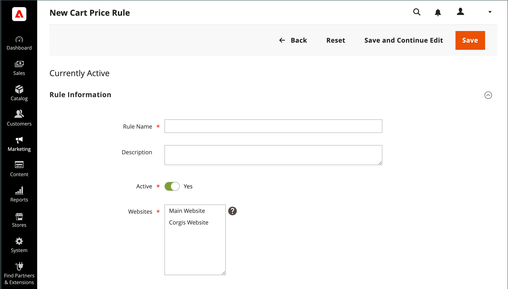
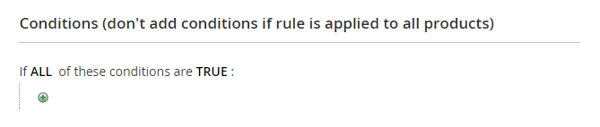
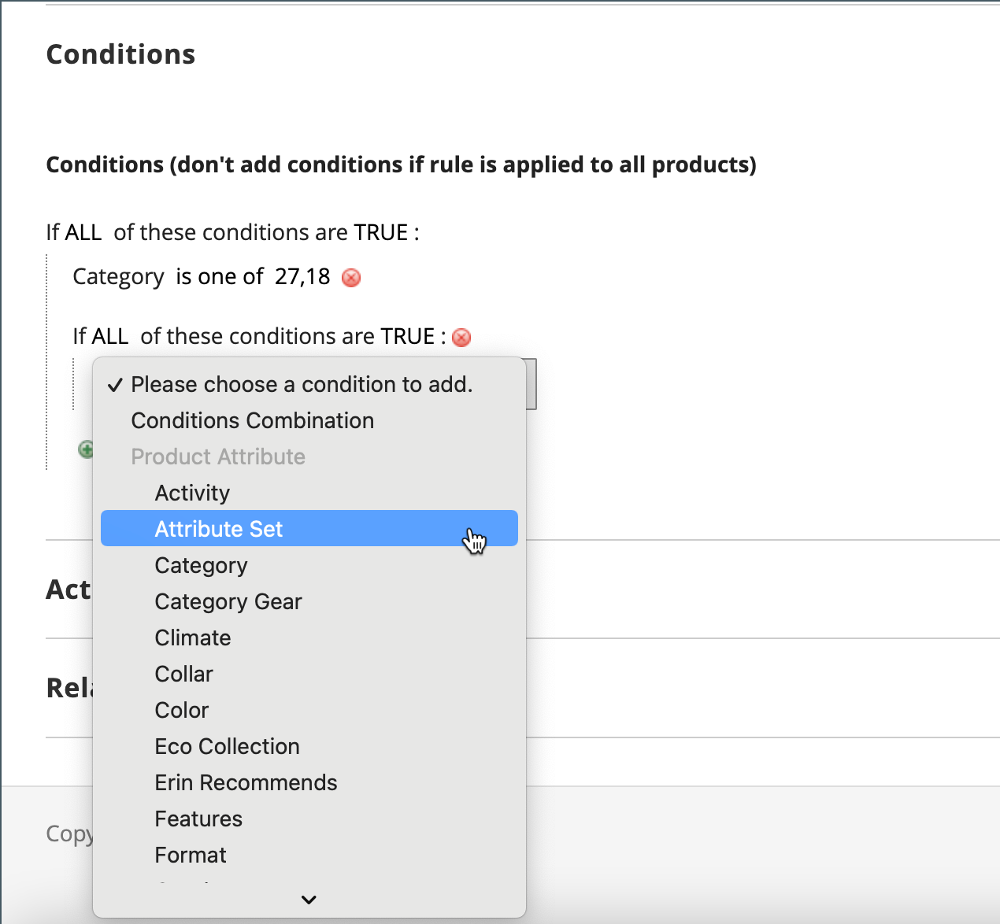
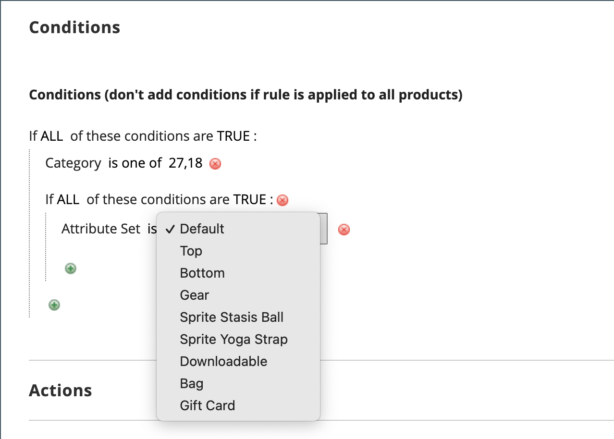
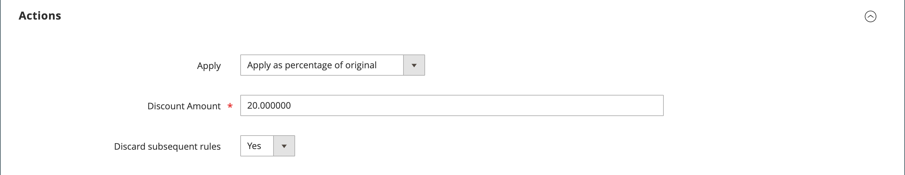
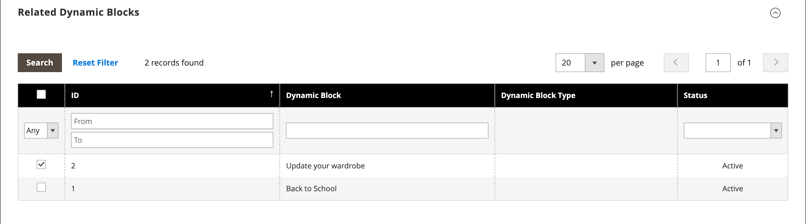
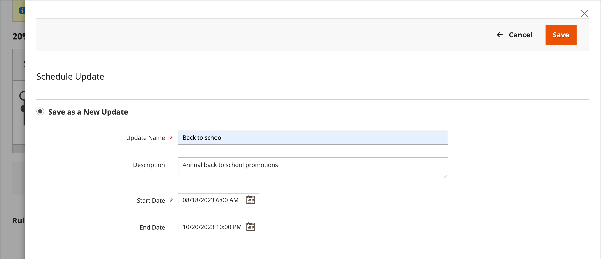
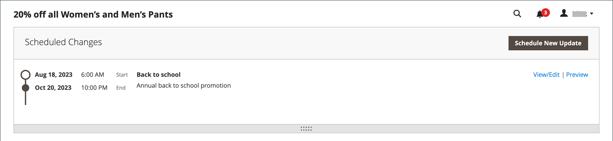

# カタログ価格ルールの作成

次の手順に従って、一連の条件が満たされたときに、特定の製品に割引を適用します。 カタログ価格ルールの割引は、商品をショッピングカートに入れる前に有効になります。

## 手順1：ルールの追加

1. _管理者_ サイドバーで、**[!UICONTROL Marketing]** > _[!UICONTROL Promotions]_>**[!UICONTROL Catalog Price Rule]**に移動します。

1. 右上隅の「**[!UICONTROL Add New Rule]**」をクリックします。

   _[!UICONTROL Rule Information]_セクションには、**[!UICONTROL Conditions]**および&#x200B;**[!UICONTROL Actions]**の拡張可能なセクションが含まれています。

   {width="700" zoomable="yes"}

1. **[!UICONTROL Rule Name]**&#x200B;と&#x200B;**[!UICONTROL Description]**&#x200B;のフィールドに入力します。

   これらのフィールドは内部参照用です。

1. 価格ルールの&#x200B;**[!UICONTROL Status]**&#x200B;を必要に応じて設定します。

   デフォルトでは、ステータスは`Inactive`です。

   ルールを作成した後、必要に応じてステータスを`Active`または`Inactive`に変更することで、ステータスを更新できます。

1. ルールを利用できる&#x200B;**[!UICONTROL Websites]**&#x200B;を選択します。

1. このルールが適用される&#x200B;**[!UICONTROL Customer Groups]**&#x200B;を選択します。

   - 選択できるオプションは、_顧客_ > _顧客グループ_&#x200B;で作成および管理されている顧客グループによって異なります。
   - 複数のグループを選択するには、Ctrl キー（PC）またはCommand キー（Mac）を押しながら、各オプションをクリックします。

1.  （Magento Open Sourceのみ）価格ルールが有効かどうかを判断するには、**[!UICONTROL From]**&#x200B;および&#x200B;**[!UICONTROL To]**&#x200B;日付を入力します。

   日付を入力するか、**[!UICONTROL Calendar]** （）を使用して日付を選択できます。 日付を空白のままにすると、価格ルールが保存されたときにルールが有効になります。

   >[!NOTE]
   >
   >`From`および`To` フィールドは、Adobe Commerceのカタログ価格ルール設定ページから削除されました。カタログ価格ルールで直接変更することはできません。 価格ルールのアクティブ化のスケジュールを設定するには、スケジュールされた更新を作成する必要があります。

1. このルールの&#x200B;**[!UICONTROL Priority]**&#x200B;を他のルールに関連して確立する番号を入力します。

   **[!UICONTROL Priority]**&#x200B;設定は、製品が複数の価格ルールの条件を満たす場合に適用されるルールを決定します。 優先度が最も高いルール（最小値、例：0、1、2、3..） 効果を発揮します。

## 手順2：条件の定義

使用可能な条件のほとんどは、既存の属性値に基づいています。 すべての製品にルールを適用するには、条件を空白のままにします。

- 少なくとも1つの条件付き製品属性に空の値がある場合、カタログ価格ルールは製品に適用されません。

- バンドルまたはグループ化された製品に`[!UICONTROL Category]`個の製品属性条件を追加した場合、すべての子品目が同じカテゴリを共有する場合にのみ、価格ルールが正しく適用されます。 子アイテムが同じカテゴリにない場合は、代わりに[買い物かご価格ルール ](price-rules-cart-create.md)のプロモーションを使用してください。」

1. 下にスクロールして、**[!UICONTROL Conditions]** セクションのを展開します。

   最初の条件はデフォルトで表示され、次のように表示されます。

   `If **ALL** of these conditions are **TRUE**:`

   {width="400"}

   ステートメントには2つの太字のリンクがあり、クリックすると、ステートメントのその部分のオプションの選択範囲を表示できます。 これらの値の組み合わせを変更することで、異なる条件を作成できます。

1. 次のいずれかの方法でステートメントを変更します。

   - **[!UICONTROL ALL]**&#x200B;をクリックし、`ALL`または`ANY`を選択します。
   - **[!UICONTROL TRUE]**&#x200B;をクリックし、`TRUE`または`FALSE`を選択します。
   - すべての製品にルールを適用するには、条件を変更しないでください。

   これらの値の組み合わせを変更することで、異なる条件を作成できます。 この例では、デフォルトの条件が使用されます。

1. 次の行の先頭にある&#x200B;_追加_ （）アイコンをクリックし、製品属性や組み合わせなどの条件のオプションを選択します。

1. **[!UICONTROL Product Attribute]**&#x200B;の下のリストで、条件のベースとして使用する属性を選択します。

   この例では、条件は`Attribute Set`です。

   {width="400"}

   >[!NOTE]
   >
   >リストに属性を表示するには、プロモーションルール条件で使用するように設定する必要があります。 詳しくは、[製品属性](../catalog/product-attributes.md)を参照してください。

   >[!NOTE]
   >
   >`is not one of`条件を&#x200B;_SKU_&#x200B;製品属性と設定可能な製品で使用する場合、親製品と子製品の両方のSKUを選択する必要があります。 ルール内のすべての子SKUをリストしないようにするには、設定可能な製品とその子製品の共通SKU部分で`does not contain`条件を使用できます。

   選択した条件がステートメントに表示され、その後に2つの太字のリンクが表示されます。 オプションは、選択する条件属性によって異なります。 声明は今こう述べている。

   `If **ALL** of these conditions are **TRUE**:  Attribute Set **is** …`

1. **[!UICONTROL is]**&#x200B;をクリックし、満たす条件を記述する比較演算子を選択します。

   これらのオプションには、異なる比較のオプションが含まれる場合があります。 この例では、オプションは`is`と`is not`です。

1. 条件の値を選択または入力します。

   条件に応じて、グリッドやリストから商品を選択したり、数値を入力したりできます。

   {width="400"}

   選択した項目がステートメントに表示され、条件が完了します。

   `If **ALL** of these conditions are **TRUE**:   Attribute Set **is Default**`

1. ステートメントに別の条件行を追加するには、_追加_ （）アイコンをクリックし、次のいずれかを選択します。

   - `Conditions Combination`
   - `Product Attribute`

   必要な条件がすべて完了するまで、このプロセスを繰り返します。

   条件ステートメントの一部を削除する場合は、行の最後にある&#x200B;**[!UICONTROL Delete]** （ アイコン）をクリックします。

## 手順3：アクションの定義

1.  「**[!UICONTROL Actions]**」セクションを展開し、次の操作を行います。

   {width="600" zoomable="yes"}

1. **[!UICONTROL Pricing Structure Rules]**&#x200B;で、**[!UICONTROL Apply]**&#x200B;を次のいずれかに設定します。

   - `Apply as percentage of original` – 通常価格の割合を引いて商品を割引します。 例：「割引額」に「10」と入力すると、最終価格が通常価格から10%下げられます。
   - `Apply as fixed amount` – 定額を通常価格から引いて商品を割引します。 例：最終価格が通常の価格より10 ドル少ない場合は、「割引額」に「10」と入力します。
   - `Adjust final price to this percentage` – 最終価格を通常価格に対する割合で調整します。 例：「割引額」に「25」と入力すると、最終価格が通常価格から75%下げられます。
   - `Adjust final price to discount value` – 最終価格を固定割引額に設定します。 例：「割引額」に「20」と入力すると、最終価格は$20.00になります。

   >[!NOTE]
   >
   >異なる通貨を持つweb サイト全体で固定額の割引を一貫して適用するには、**[!UICONTROL Catalog Price Scope]** オプションを`Website`に設定し、各サイトの基本通貨を定義します。

   >[!NOTE]
   >
   >_正規価格_&#x200B;とは、高度な価格設定（特別/階層/グループ）やプロモーション割引のない基本製品価格を指します。 _最終価格_&#x200B;とは、ショッピングカートに表示される割引価格を指します。  最終価格&#x200B;**_最終価格_**&#x200B;は、次の式を使用して&#x200B;**_最小_**&#x200B;関連価格として計算されます： `Final Price=Min(Regular(Base) Price, Group(Tier) Price, Special Price, Catalog Price Rule) + Sum(Min Price per each required custom option)`

   >[!NOTE]
   >
   >**_固定価格_**&#x200B;製品のカスタマイズ可能なオプションは、グループ価格、階層価格、特別価格、カタログ価格のルールの影響を受ける&#x200B;_not_&#x200B;です。

1. **[!UICONTROL Discount Amount]**&#x200B;を入力します。

1. このルールが適用された後に他のルールの処理を停止するには、**[!UICONTROL Discard Subsequent Rules]**&#x200B;を`Yes`に設定します。

   この値を`Yes`に設定すると、同じ製品に複数の割引（ルール）が適用されるのを防ぐことができます。

## 手順4：関連する動的ブロックの追加

{{ee-feature}}

条件が満たされるたびに、カタログ価格ルールに関連付けられている[動的ブロック ](../content-design/dynamic-blocks.md)がストアフロントに表示されます。 これはオプションの手順です。

1.  「**[!UICONTROL Related Dynamic Blocks]**」セクションを展開します。

1. [検索フィルター](../getting-started/admin-workspace.md)を使用して、ルールに関連付ける動的ブロックを見つけます。

1. 最初の列のチェックボックスを選択して、ダイナミックブロックをルールに関連付けます。

   {width="600" zoomable="yes"}

1. **[!UICONTROL Save and Continue Edit]**&#x200B;をクリックします。

## 手順5：ルールのスケジュール設定

{{ee-feature}}

>[!NOTE]
>
>ルールをアクティブに設定するには、スケジュールされた更新として追加する必要があります。 詳しくは、[変更予定](price-rule-catalog-scheduled-changes.md)を参照してください。

1. 「_変更予定_」ボックスで、ボックスの上部にある「**[!UICONTROL Schedule New Update]**」をクリックします）。

   ルールに既存のスケジュール済み更新がある場合は、リストされた変更の右側にある&#x200B;**[!UICONTROL View/Edit]**&#x200B;をクリックできます。

   既存の更新を編集するか、カタログ価格ルールを別のキャンペーンに割り当てることができます。 デフォルトでは、**既存の更新を編集** オプションが選択されています。

1. ルールをスケジュールするには、価格ルールをアクティブにする&#x200B;**[!UICONTROL Start Date]**&#x200B;と&#x200B;**[!UICONTROL End Date]**&#x200B;を入力します。

   日付を入力するか、_カレンダー_ （）から日付を選択できます。

   {width="600" zoomable="yes"}

1. **[!UICONTROL Save]**&#x200B;をクリックします。

1. _ルール情報_ セクションで、**[!UICONTROL Status]**&#x200B;を`active`に設定します。

## 手順6：ルールの保存とテスト

1. 完了したら、ルールを保存します。

   -  （Magento Open Sourceのみ）「**[!UICONTROL Save and Apply]**」をクリックします。

   -  （Adobe Commerceのみ）「**[!UICONTROL Save]**」をクリックします。

     ルール情報ページには、ルールのスケジュール済み変更に更新されたタイムラインが表示されます。

     {width="600" zoomable="yes"}

1. ルールのプロパティを更新：

   -  （Adobe Commerceのみ） **[!UICONTROL Edit]**&#x200B;をクリックして、_[!UICONTROL Rule Information]_ページを表示します。

   -  （Magento Open Sourceのみ）リスト内のルールをクリックすると、_[!UICONTROL Rule Information]_ページが表示されます。

1. ルールをテストして、正しく動作することを確認します。

   価格ルールは、毎晩他のシステムルールで自動的に処理されます。 価格ルールを作成する場合は、ルールをテストして正しく動作することを確認する前に、システムに取り込むのに十分な時間を確保してください。 新しいルールが追加されると、Commerceでは、それに応じて価格と優先順位が再計算されます。

## カタログ価格ルールのデモ

このビデオでは、カタログ価格ルールの作成について説明します。

>[!VIDEO](https://video.tv.adobe.com/v/343834?quality=12&learn=on)

## フィールドの説明

### [!UICONTROL Rule Information]

| フィールド | 説明 |
|-----|-----------|
| [!UICONTROL Rule name] | （必須）ルールの名前は内部参照用です。 |
| [!UICONTROL Description] | ルールの説明には、ルールの目的を含め、その使用方法を説明する必要があります。 |
| [!UICONTROL Websites] | （必須）ルールを使用できるWeb サイトを識別します。 |
| [!UICONTROL Customer Groups] | （必須）ルールが適用される顧客グループを識別します。 |
| [!UICONTROL Priority] | このルールの他のルールに対する優先度を示す数値。 最上位から最下位までの優先度は`0,1,2,3...`です |
| [!UICONTROL Status] |  （Magento Open Sourceのみ）ルールがストアでアクティブかどうかを判断します。 オプション：`Yes` / `No` |
| [!UICONTROL From] |  （Magento Open Sourceのみ）価格ルールが有効になっている最初の日を指定します。 空白のままにすると、プライスルールは保存時に有効になります。 |
| [!UICONTROL To] |  （Magento Open Sourceのみ）価格ルールが有効になっている最終日を指定します。 空白のままにすると、価格規則は無期限に続きます。 |

{style="table-layout:auto"}

### [!UICONTROL Conditions]

カタログ価格ルールを実行する前に満たす必要がある条件を指定します。 空白のままにすると、ルールはすべての製品に適用されます。

### [!UICONTROL Actions]

| フィールド | 説明 |
|-----|-----------|
| [!UICONTROL Apply] | 購入に適用される計算のタイプを指定します。 オプション： **[!UICONTROL Apply as percentage of original]**– 通常価格の割合を引いて商品を割引します。 **[!UICONTROL Apply as fixed amount]** – 定額を通常価格から引いて商品を割引します。 **[!UICONTROL Adjust final price to this percentage]**– 最終価格を通常価格に対する割合で調整します。 **[!UICONTROL Adjust final price to discount value]** – 最終価格を固定割引額に設定します。   **_Note:_**&#x200B;通常の価格とは、高度な価格設定（特別/階層/グループ）やプロモーション割引のない基本製品価格を指します。 最終価格とは、ショッピングカートに表示される割引価格のことです。  最終価格&#x200B;**_最終価格_**&#x200B;は、次の式を使用して&#x200B;**_最小_**&#x200B;関連価格として計算されます： `Final Price=Min(Regular(Base) Price, Group(Tier) Price, Special Price, Catalog Price Rule) + Sum(Min Price per each required custom option)` |
| [!UICONTROL Discount Amount] | （必須）提供される割引の金額。 |
| [!UICONTROL Discard Subsequent Rules] | この購入に追加のルールを適用できるかどうかを判断します。 同じ購入に複数の割引が適用されないようにするには、`Yes`を選択します。 オプション：`Yes` / `No` |

{style="table-layout:auto"}

### [!UICONTROL Related Dynamic Blocks]

{{ee-feature}}

ルールに関連付けられている[動的ブロック ](../content-design/dynamic-blocks.md)を識別します。
