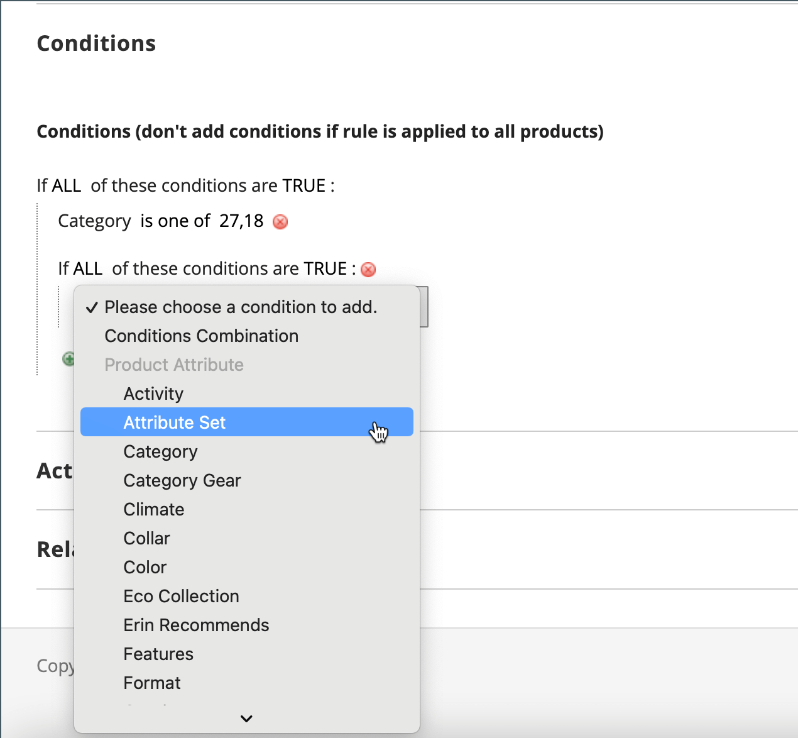

# カタログ価格ルールの作成

一連の条件が満たされた場合に、特定の製品に割引を適用するには、次の手順に従います。 カタログ価格ルールの割引は、商品が買い物かごに入れられる前に有効になります。

## 手順 1：ルールを追加する

1. 次の日： _管理者_ サイドバー、移動 **[!UICONTROL Marketing]** > _[!UICONTROL Promotions]_>**[!UICONTROL Catalog Price Rule]**.

1. 右上隅で、 **[!UICONTROL Add New Rule]**.

   The _[!UICONTROL Rule Information]_セクションは、次の拡張可能なセクションを含む：**[!UICONTROL Conditions]**および&#x200B;**[!UICONTROL Actions]**.

   {width="700" zoomable="yes"}

1. 次を完了： **[!UICONTROL Rule Name]** および **[!UICONTROL Description]** フィールド。

   これらのフィールドは、内部参照用です。

1. を設定します。 **[!UICONTROL Status]** 必要に応じて価格ルールを設定します。

   デフォルトでは、ステータスは `Inactive`.

   >[!NOTE]
   >
   >ルールを作成した後、ステータスを「 `Active` または `Inactive` 必要に応じて。

1. を選択します。 **[!UICONTROL Websites]** ルールを使用できる場所。

1. を選択します。 **[!UICONTROL Customer Groups]** このルールを適用する先に設定します。

   複数のグループを選択するには、Ctrl キー (PC) または Command キー (Mac) を押しながら各オプションをクリックします。

   >[!NOTE]
   >
   >このリストのオプションは、で作成および管理する顧客グループによって異なります。 _顧客_ > _顧客グループ_.

1.  (Magento Open Sourceのみ ) **[!UICONTROL From]** および **[!UICONTROL To]** 価格ルールが有効な日付を指定します。

   日付を入力するか、 **[!UICONTROL Calendar]** () をクリックして日付を選択します。 日付を空白のままにすると、価格ルールを保存すると、ルールが有効になります。

1. 数値を入力して、 **[!UICONTROL Priority]** 他のルールとの関連でのこのルールの

   >[!NOTE]
   >
   >The _[!UICONTROL Priority]_設定は、同じカタログ製品が複数の価格ルールに設定された条件を満たす場合に重要です。 優先度が最も高い（1 が最も高い）ルールが、製品に対してアクティブになります。

## 手順 2：条件の定義

使用可能な条件のほとんどは、既存の属性値に基づいています。 すべての製品にルールを適用する場合は、条件を空白のままにします。

>[!NOTE]
>
>1 つ以上の条件付き製品属性の値が空の場合、カタログ価格ルールは製品に適用されません。

>[!NOTE]
>
>を適用するには `Category` 任意の製品属性条件 [バンドル](../catalog/product-create-bundle.md) または [グループ化](../catalog/product-create-grouped.md) 製品の場合、ルールを正しく適用するには、すべての子製品を同じカテゴリに割り当てる必要があります。 そうでない場合、 [買い物かごの価格ルール](price-rules-cart-create.md) プロモーションを使用します。

1. 下にスクロールして展開  の **[!UICONTROL Conditions]** 」セクションに入力します。

   最初の条件がデフォルトで表示され、次の状態になります。

   `If **ALL** of these conditions are **TRUE**:`

   {width="400"}

   ステートメントには 2 つの太字のリンクがあり、このリンクをクリックすると、ステートメントのその部分のオプションの選択を表示できます。 これらの値の組み合わせを変更することで、異なる条件を作成できます。

1. 次のいずれかの方法で、文を変更します。

   - クリック **[!UICONTROL ALL]** を選択し、 `ALL` または `ANY`.
   - クリック **[!UICONTROL TRUE]** を選択し、 `TRUE` または `FALSE`.
   - 条件を変更せずに、すべての製品にルールを適用します。

   これらの値の組み合わせを変更することで、異なる条件を作成できます。 この例では、デフォルトの条件が使用されます。

1. 次をクリック： _追加_ () アイコンをクリックし、製品属性や組み合わせなど、条件のオプションを選択します。

1. の下のリストで **[!UICONTROL Product Attribute]**」で、条件の基準として使用する属性を選択します。

   この例では、条件は次のようになります。 `Attribute Set`.

   {width="400"}

   >[!NOTE]
   >
   >属性をリストに表示するには、プロモーションルールの条件で使用するように設定する必要があります。 詳しくは、 [製品属性](../catalog/product-attributes.md).

   >[!NOTE]
   >
   >を使用する場合、 `is not one of` ～との条件 _SKU_ 製品属性と設定可能な製品（親製品 SKU と子製品 SKU の両方を選択する必要があります）。 ルール内のすべての子 SKU がリストされないようにするには、 `does not contain` 設定可能な製品とその子製品の共通の SKU 部分を使用した条件。

   選択した条件がステートメントに表示され、その後にさらに 2 つの太字のリンクが続きます。 オプションは、選択した条件属性に応じて異なります。 次のようなステートメントが表示されます。

   `If **ALL** of these conditions are **TRUE**:  Attribute Set **is** …`

1. クリック **[!UICONTROL is]** を選択し、満たす条件を記述する比較演算子を選択します。

   これらのオプションには、異なる比較用のオプションが含まれる場合があります。 この例では、次のオプションがあります。 `is` および `is not`.

1. 条件の値を選択または入力します。

   条件に応じて、グリッドまたはリストから製品を選択したり、数値を入力したりできます。

   {width="400"}

   選択した項目が、条件を完了するためにステートメント内に表示されます。

   `If **ALL** of these conditions are **TRUE**:   Attribute Set **is Default**`

1. 文に別の条件行を追加するには、 _追加_ () アイコンをクリックし、次のいずれかを選択します。

   - `Conditions Combination`
   - `Product Attribute`

   必要なすべての条件が完了するまで、この手順を繰り返します。

   条件文の一部を削除する場合は、 **[!UICONTROL Delete]** ( アイコンをクリックします。

## 手順 3：アクションの定義

1. 展開 の **[!UICONTROL Actions]** 」セクションで次の操作を実行します。

   {width="600" zoomable="yes"}

1. の下 **[!UICONTROL Pricing Structure Rules]**，設定 **[!UICONTROL Apply]** を次のいずれかに変更します。

   - `Apply as percentage of original`  — 通常価格の割合を引くことで、割引品目。 たとえば、通常の価格から 10%引き下げた最終価格に対しては、「割引額」に「10」と入力します。
   - `Apply as fixed amount`  — 通常の価格から固定金額を引くことによる割引品目。 例：通常の価格より$10 の最終価格に対しては、「割引額」に「10」と入力します。
   - `Adjust final price to this percentage`  — 最終価格を通常の価格のパーセンテージで調整します。 たとえば、通常の価格から 75%下がった最終価格に対しては、「割引額」に「25」と入力します。
   - `Adjust final price to discount value`  — 最終価格を固定の割引額に設定します。 例：最終価格が$20.00 の場合、「割引金額」に「20」と入力します。

   >[!NOTE]
   >
   >_定価_ は、高度な価格（特別/階層/グループ）やプロモーションの割引を含まない、基本製品価格を指します。 _最終価格_ は、買い物かごに表示される割引価格を指します。  The **_最終_** 製品価格は **_最小_** 関連する価格。次の式を使用します。  `Final Price=Min(Regular(Base) Price, Group(Tier) Price, Special Price, Catalog Price Rule) + Sum(Min Price per each required custom option)`

   >[!NOTE]
   >
   >**_固定価格_** 製品のカスタマイズ可能なオプションは次のとおりです。 _not_ グループ価格、Tier Price、特別価格、またはカタログ価格のルールの影響を受けます。

1. 次を入力します。 **[!UICONTROL Discount Amount]**.

1. このルールの適用後に他のルールの処理を停止するには、 **[!UICONTROL Discard Subsequent Rules]** から `Yes`.

   >[!NOTE]
   >
   >これを `Yes` は、システムが同じ製品に複数の割引（ルール）を適用するのを防ぐための保護策です。

## 手順 4：関連する動的ブロックを追加する

{{ee-feature}}

[動的ブロック](../content-design/dynamic-blocks.md) カタログ価格ルールに関連付けられている値は、条件が満たされるたびにストアフロントに表示されます。 これはオプションの手順です。

1. 展開 の **[!UICONTROL Related Dynamic Blocks]** 」セクションに入力します。

1. 以下を使用します。 [検索フィルター](../getting-started/admin-workspace.md) をクリックして、ルールに関連付ける動的ブロックを見つけます。

1. 動的ブロックをルールに関連付けるには、最初の列のチェックボックスをオンにします。

   {width="600" zoomable="yes"}

1. クリック **[!UICONTROL Save and Continue Edit]**.

## 手順 5：ルールのスケジュール設定

{{ee-feature}}

>[!NOTE]
>
>ルールを「アクティブ」に設定する場合は、スケジュールされた更新として追加する必要があります。 詳しくは、 [予定されている変更](price-rule-catalog-scheduled-changes.md).

1. Adobe Analytics の _予定されている変更_ ボックス、 **[!UICONTROL Schedule New Update]** をクリックします )。

   ルールに既にスケジュールされた更新がある場合、 **[!UICONTROL View/Edit]** をクリックします。

   既存の更新を編集するか、カタログ価格ルールを別のキャンペーンに割り当てることができます。 The **既存の更新を編集** オプションはデフォルトで選択されています。

1. ルールをスケジュールするには、 **[!UICONTROL Start Date]** および **[!UICONTROL End Date]** 価格ルールがアクティブになることを示します。

   日付を入力するか、 _カレンダー_ () をクリックします。

   {width="600" zoomable="yes"}

1. クリック **[!UICONTROL Save]**.

1. Adobe Analytics の _ルール情報_ セクション、 **[!UICONTROL Status]** から `active`.

## 手順 6：ルールを保存してテストする

1. 完了したら、ルールを保存します。

   -  (Magento Open Sourceのみ ) クリック **[!UICONTROL Save and Apply]**.

   -  (Adobe Commerceのみ ) クリック **[!UICONTROL Save]**.

     ルール情報ページでは、ルールの「予定された変更」に更新されたタイムラインが表示されます。

     {width="600" zoomable="yes"}

1. ルールのプロパティを更新します。

   -  (Adobe Commerceのみ ) クリック **[!UICONTROL Edit]** 表示する _[!UICONTROL Rule Information]_ページに貼り付けます。

   -  (Magento Open Sourceのみ ) リスト内のルールをクリックすると、 _[!UICONTROL Rule Information]_ページに貼り付けます。

1. ルールをテストして、正しく動作することを確認します。

   価格ルールは、他のシステムルールと共に毎晩自動的に処理されます。 価格ルールを作成する場合は、ルールをテストして正しく動作することを確認する前に、システムに入るのに十分な時間を割いてください。 新しいルールが追加されると、Commerce は価格と優先度をそれに応じて再計算します。

## カタログ価格ルールのデモ

カタログ価格ルールの作成については、このビデオをご覧ください。

>[!VIDEO](https://video.tv.adobe.com/v/343834?quality=12)

## フィールドの説明

### [!UICONTROL Rule Information]

| フィールド | 説明 |
|-----|-----------|
| [!UICONTROL Rule name] | （必須）ルールの名前は内部参照用です。 |
| [!UICONTROL Description] | ルールの説明には、ルールの目的を含め、ルールの使用方法を説明する必要があります。 |
| [!UICONTROL Websites] | （必須）ルールを使用できる Web サイトを識別します。 |
| [!UICONTROL Customer Groups] | （必須）ルールを適用する顧客グループを識別します。 |
| [!UICONTROL Priority] | 他のルールに対するこのルールの優先度を示す数値。 最も高い優先順位は 1 です。 |
| [!UICONTROL Status] |  (Magento Open Sourceのみ ) ルールがストア内でアクティブかどうかを指定します。 オプション： `Yes` / `No` |
| [!UICONTROL From] |  (Magento Open Sourceのみ ) 価格ルールが有効になる最初の日を指定します。 空白の場合、価格ルールは保存時に有効になります。 |
| [!UICONTROL To] |  (Magento Open Sourceのみ ) 価格ルールが有効になる最終日を指定します。 空白のままにすると、価格ルールは無期限に継続されます。 |

{style="table-layout:auto"}

### [!UICONTROL Conditions]

カタログ価格ルールが実行される前に満たす必要がある条件を指定します。 空白の場合、ルールはすべての製品に適用されます。

### [!UICONTROL Actions]

| フィールド | 説明 |
|-----|-----------|
| [!UICONTROL Apply] | 購入に適用される計算のタイプを決定します。 オプション：  **[!UICONTROL Apply as percentage of original]**— 通常価格の割合を引くことで、割引品目。 **[!UICONTROL Apply as fixed amount]**  — 通常の価格から固定金額を引くことによる割引品目。  **[!UICONTROL Adjust final price to this percentage]**— 最終価格を通常の価格のパーセンテージで調整します。 **[!UICONTROL Adjust final price to discount value]**  — 最終価格を固定の割引額に設定します。   **_注意：_**通常の価格とは、高度な価格（特別/階層/グループ）やプロモーションの割引が適用されない、基本製品価格を指します。 最終価格は、買い物かごに表示される割引価格を指します。  The**_最終&#x200B;_**製品価格は**_最小&#x200B;_**関連する価格。次の式を使用します。  `Final Price=Min(Regular(Base) Price, Group(Tier) Price, Special Price, Catalog Price Rule) + Sum(Min Price per each required custom option)` |
| [!UICONTROL Discount Amount] | （必須）提供される割引の金額。 |
| [!UICONTROL Discard Subsequent Rules] | この購入に追加のルールを適用できるかどうかを指定します。 同じ購入に複数の割引が適用されないようにするには、 `Yes`. オプション： `Yes` / `No` |

{style="table-layout:auto"}

### [!UICONTROL Related Dynamic Blocks]

{{ee-feature}}

任意の [動的ブロック](../content-design/dynamic-blocks.md) ルールに関連付けられている
