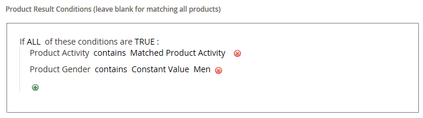

# 関連製品ルールの作成

{{ee-feature}}

関連商品ルールの作成プロセスは、価格ルールの設定に似ています。 まず、一致させる条件を定義し、表示する商品を選択します。 トリガーして、関連製品、アップセルおよびクロスセルを表示できるアクティブなルールが、いつでも複数ある場合があります。 各ルールの優先度によって、商品ブロックがページ上で表示される順序が決まります。

>[!NOTE]
>
>ターゲットのルールで属性を使用するには、[_[!UICONTROL Use for Promo Rule Conditions]_](../catalog/product-attributes.md) プロパティを `Yes` に設定する必要があります。

>[!NOTE]
>
>`All Store Views` スコープの値は、すべての製品属性の [!UICONTROL Products to Match] 条件と [!UICONTROL Products to Display] 条件の両方で常に使用されます。 これは、ストアの表示や web サイトによって製品属性の値が異なる場合にも適用されます。

## 関連製品ルールの作成

1. _管理者_ サイドバーで、**[!UICONTROL Marketing]**/_[!UICONTROL Promotions]_/**[!UICONTROL Related Product Rules]**&#x200B;に移動します。

1. 右上隅の「**[!UICONTROL Add Rule]**」をクリックします。

   {width="600" zoomable="yes"}

1. **[!UICONTROL Rule Information]** を次のように入力します。

   - 管理で作業する際にルールを識別する **[!UICONTROL Rule Name]** を入力します。

   - **[!UICONTROL Priority]**：他のルールの結果が同じ場所をターゲットとする場合に、ページ上での結果の表示順序を指定する数値を入力します。 `1` が最優先事項です。

   - ルールを有効にするには、**[!UICONTROL Status]** を `Active` に設定します。

   - **[!UICONTROL Apply To]** を次のいずれかに設定します。

      - `Related Products`
      - `Up-sells`
      - `Cross-sells`

   - ルールを特定の期間アクティブにする場合は、**[!UICONTROL From]** と **[!UICONTROL To]** の日付を入力します。

   - **[!UICONTROL Result Limit]**：結果リストに表示するレコード数を入力します。 最大数は 20 です。

   - ルールが特定の [&#x200B; 顧客セグメント &#x200B;](../customers/customer-segments.md) に適用される場合は、**[!UICONTROL Customer Segments]** を `Specified` に設定し、リストから顧客セグメントを選択します。

   - ルールが特定の [Real-Time CDP オーディエンス &#x200B;](../customers/audience-activation.md) に適用される場合は、**[!UICONTROL Real-Time CDP Audience]** を `Specified` に設定し、リストからReal-Time CDP オーディエンスを選択します。 この機能はベータ版です。 ベータ版プログラムへの参加を希望される場合は、[dataconnection@adobe.com](mailto:dataconnection@adobe.com) にリクエストを送信してください。

     {width="500"}

1. 左側のパネルで「**[!UICONTROL Products to Match]**」を選択し、[&#x200B; カタログ価格ルール &#x200B;](price-rules-catalog.md) の場合と同様に条件を作成します。

   {width="500"}

1. 左側のパネルで「**[!UICONTROL Products to Display]**」を選択し、[&#x200B; カタログ価格ルール &#x200B;](price-rules-catalog.md) の場合と同様に結果条件を作成します。

   {width="500"}

   表示された結果に含める製品を説明する条件を入力します。

1. 完了したら、「**[!UICONTROL Save]**」をクリックします。

## 関連製品ルールの削除

1. _管理者_ サイドバーで、**[!UICONTROL Marketing]**/_[!UICONTROL Promotions]_/**[!UICONTROL Related Product Rules]**&#x200B;に移動します。

1. 削除する関連製品ルールを見つけます。

1. ルールをクリックして詳細ページを開きます。

1. 右上隅の「**[!UICONTROL Delete]**」をクリックします。

1. アクションを確定するには、「**[!UICONTROL OK]**」をクリックします。

## 関連する製品ルールのデモ

関連する製品ルールの作成については、次のビデオをご覧ください。

>[!VIDEO](https://video.tv.adobe.com/v/3411064?quality=12&learn=on&captions=jpn)

## フィールドの説明

| フィールド | 説明 |
|--- |--- |
| [!UICONTROL Rule Name] | 内部使用のルールを識別する名前。 |
| [!UICONTROL Priority] | ページ上の同じ場所をターゲットとする他の結果セットと共に表示される場合に、ルールの結果が表示されるシーケンスを決定します。 この値は、優先度が 1 の任意の整数に設定できます。 例えば、適用されるアップセルルールが複数ある場合、優先度が最も高いアップセルルールが他のアップセルルールより先に表示されます。 結果の各セット内の製品の並べ替え順はランダムです。 手動で設定されたアップセル、クロスセルおよび関連製品は、常にルールベースの製品プロモーションの前のページに表示されます。 |
| [!UICONTROL Status] | ルールのアクティブなステータスを制御します。 オプション：`Active` / `Inactive` |
| [!UICONTROL Apply To] | ルールに関連付けられている製品関係のタイプを識別します。 オプション：`Related Products`/`Up-sells`/`Cross-sells` |
| [!UICONTROL From Date] | 一定期間ルールがアクティブな場合、この設定によってルールが最初にアクティブになる日付が決まります。 |
| [!UICONTROL To Date] | 一定期間ルールがアクティブな場合、この設定によってルールが最後にアクティブになった日付が決まります。 |
| [!UICONTROL Result Limit] | 一度に結果に表示される製品数を決定します。 最大数は 20 です。 一致する結果が見つかった場合、ページが更新されるたびに製品がブロック内を循環します。 |
| [!UICONTROL Customer Segments] | ルールが適用される顧客セグメントを識別します。 オプション：`All` / `Specified` |

{style="table-layout:auto"}
