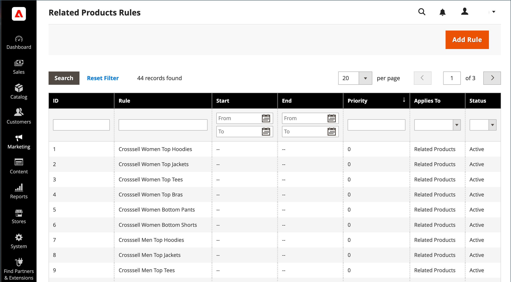

# 関連製品ルール（ターゲットルール）

{{ee-feature}}

関連商品ルールは、関連商品、アップセル、クロスセルとして顧客に提示される商品の選択をターゲットにすることができます。 各製品ルールを[顧客セグメント ](../customers/customer-segments.md)に関連付けて、ターゲットマーチャンダイジングの動的な表示を生成できます。

複数のアクティブなルールを同時にトリガーできるので、各ルールに優先度を設定できます。 ルールを適用し、ページに商品を表示する順序を定義します。

関連する製品ルールにアクセスするには、**[!UICONTROL Marketing]** > _[!UICONTROL Promotions]_>**[!UICONTROL Related Product Rules]**に移動します。

{width="700" zoomable="yes"}

## 列の説明

| 列 | 説明 |
|--- |--- |
| [!UICONTROL ID] | 関連する各製品ルールに割り当てられる一意の数値識別子 |
| [!UICONTROL Rule] | 関連製品ルールの名前 |
| [!UICONTROL Start] | 動的カレンダーフィールド （_[!UICONTROL To:]_および_[!UICONTROL From:]_）を使用して、ルールの作成時に定義されたとおりに、ルールの開始日に基づいてリストをフィルタリングします。 |
| [!UICONTROL End] | 動的カレンダーフィールド （_[!UICONTROL To:]_および_[!UICONTROL From:]_）を使用して、ルールの作成時に定義されたとおりに、ルールの終了日に基づいてリストをフィルタリングします。 |
| [!UICONTROL Priority] | ルールに定義された優先度に基づいてリストをフィルタリングするには、このフィールドにテキストを入力します。 |
| [!UICONTROL Applies To] | このオプションは、`Related Products`、`Up-sells`および`Cross-sells`に適用されるルールのリストをフィルタリングします。 |
| [!UICONTROL Status] | このオプションを使用して、ルールの状態（`Active`または`Inactive`）に基づいてリストをフィルタリングします。 |

{style="table-layout:auto"}

## ルールの優先順位

どの時点でも、関連商品、アップセル、クロスセルを表示するためにトリガーできるいくつかのアクティブなルールが存在する場合があります。 各ルールの優先順位によって、ページに表示される製品の順序が決まります。 値は任意の整数に設定でき、`1`が最も優先度が高くなります。

製品関係ルールに含めることができる製品IDの数は、最大20の`Result Limit`値によって決まります。 特定のルールベースの製品プロモーションの`Result Limit`と組み合わされた`Configurable Maximum`値が`Real Limit`になり、リストに表示できる一致する製品の実際の数が決定されます。

[結果制限] + [設定可能な最大値] = [実際の制限]

例えば、優先度が`1`、`2`、`3`の3つのルールがあるとします。

- _ルール 1_&#x200B;には2つの一致する製品が返され、_ルール 2_&#x200B;には6つの一致する製品が返され、_ルール 3_&#x200B;には20個の一致する製品が返されました。
- 設定では、_[!UICONTROL Maximum Number of Products for Related Products List]_は`6`に設定されています。

  | ルール | 優先度 | 一致する製品 |
  |---|---|-----|
  | ルール 1 | `1` | `2` |
  | ルール 2 | `2` | `6` |
  | ルール 3 | `3` | `20` |

最初のルールで、_設定可能な最大制限_&#x200B;で許可されている数を超え、_実数の制限_&#x200B;未満の製品が返された場合、_実数の制限_&#x200B;に達するまで、他のルールの一致する製品が（優先順に）使用されます。

優先度により、_ルール 1_&#x200B;から返された一致する製品を最初に使用して、使用可能な26個のスロットをすべて埋めることができます。 ルール 1では2つの一致する商品しか返されなかったため、さらに24個を追加する余地があります。 _ルール 2_&#x200B;は次に優先順位が高く、さらに6つの一致する商品が返されます。 現在、18個のスロットが使用可能です。 _ルール 3_&#x200B;は次の優先度を持ち、残りの18個のスロットを満たすのに十分な一致する製品があります。 利用可能なすべてのスロットが満たされ、設定されている回転モードに応じて、製品は各優先度の中でIDによってシャッフルまたは順序付けされ、設定可能な最大制限に減らされる場合があります。 この場合、残りの6つの商品が店舗に表示されます。

>[!NOTE]
>
>選択した製品は、回転モードに関係なく、常にルールベースの製品の前に表示されます。

## ルールベースの製品リレーションの設定

製品関係ルールの動作と一致した製品の表示は、設定設定によって決定されます。 これらの設定は、ルールに一致する製品の数と、それらの製品が表示される順序を決定します。

1. _管理者_ サイドバーで、**[!UICONTROL Stores]** > _[!UICONTROL Settings]_>**[!UICONTROL Configuration]**に移動します。

1. 左側のパネルで、**[!UICONTROL Catalog]**&#x200B;を展開し、下の&#x200B;**[!UICONTROL Catalog]**&#x200B;を選択します。

1. 拡張&#x200B;**[!UICONTROL Rules-Based Product Relations]**&#x200B;を展開します。

   {width="600" zoomable="yes"}

1. **[!UICONTROL Maximum Number of Products in the Related Products List]**&#x200B;を入力します。

1. **[!UICONTROL Show Related Products]**&#x200B;を次のいずれかに設定します：

   - `Both Selected and Rule Based`
   - `Selected Only`
   - `Rule-Based Only`

1. **[!UICONTROL Rotation Mode for Products in Related Product List]**&#x200B;を次のいずれかに設定します：

   - `By Priority, Then by ID`
   - `By Priority, Then Random`
   - `Weighted Random`

1. クロスセル製品の設定を完了するには、次の操作を行います。

   - **[!UICONTROL Maximum Number of Products in the Cross-Sell Product List]**&#x200B;を入力します。

   - **[!UICONTROL Show Cross-Sell Products]**&#x200B;を次のいずれかに設定します：

      - `Both Selected and Rule Based`
      - `Selected Only`
      - `Rule-Based Only`

   - **[!UICONTROL Rotation Mode for Products in Cross-Sell Product List]**&#x200B;を次のいずれかに設定します：

      - `By Priority, Then by ID`
      - `By Priority, Then Random`
      - `Weighted Random`

1. アップセル製品の設定を完了するには、次の操作を行います。

   - **[!UICONTROL Maximum Number of Products in the Upsell Product List]**&#x200B;を入力します。

   - **[!UICONTROL Show Upsell Products]**&#x200B;を次のいずれかに設定します：

      - `Both Selected and Rule Based`
      - `Selected Only`
      - `Rule-Based Only`

   - **[!UICONTROL Rotation Mode for Products in Upsell Product List]**&#x200B;を次のいずれかに設定します：

      - `By Priority, Then by ID`
      - `By Priority, Then Random`
      - `Weighted Random`

1. 完了したら、**[!UICONTROL Save Config]**&#x200B;をクリックします。

### 回転モード

| モード | 説明 |
|---|---|
| [!UICONTROL By Priority, Then by ID] | 製品は優先度で並べ替えられ、優先度ごとにIDで並べ替えられます。 優先度の低いルールの製品が表示されるのは、優先度の高いルールの製品が残っておらず、使用可能なスロットを満たしていない場合のみです。 |
| [!UICONTROL By Priority, Then Random] | 製品は優先度でソートされ、各優先度の中でランダム化されます。 優先度の低いルールの製品が表示されるのは、優先度の高いルールの製品が残っておらず、使用可能なスロットを満たしていない場合のみです。 |
| [!UICONTROL Weighted Random] | 優先度の高いルールに属する製品が、優先度の低いルールに属する製品よりも表示される可能性が高くなるように、製品がランダム化されます。 その後、製品は設定可能な最大数に減らし、優先度ごとに再グループ化されます。 このモードでは、優先度の低い製品が残りのスロットに優先度の高いルールの製品が詰まっている場合でも、優先度の低い製品が表示される可能性があります |

{style="table-layout:auto"}

## Real-Time CDPのオーディエンスを活用して、関連する商品ルールを通知する

関連する製品ルールを通知するために、Adobe Commerce インスタンスに[Real-Time CDP オーディエンスを](../customers/audience-activation.md) アクティブ化する方法について説明します。
