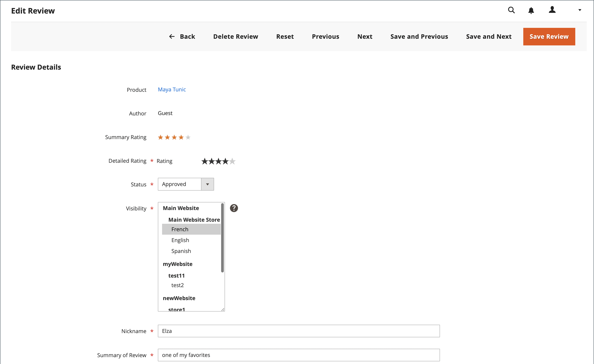

# 中程度の製品レビュー

Commerceの商品レビューの場合、送信された商品レビューを表示するには、そのレビューが承認されている必要があります。 これにより、レビューがストアの公開ディスプレイに適切になります。 送信されたレビューは、承認または却下されるまで、`Pending` ステータスになります。

## 管理者で製品レビューを表示

特定の製品のすべてのレビューを管理者に表示するには、次の手順を実行します。

1. _管理者_ サイドバーで、**[!UICONTROL Catalog]**/**[!UICONTROL Products]** に移動します。

1. 表示する製品を見つけて、_[!UICONTROL Action]_&#x200B;列の&#x200B;**[!UICONTROL Edit]**&#x200B;をクリックします。

1. 製品ページで、下にスクロールして、「**[!UICONTROL Product Reviews]**」セクションの  を展開します。

   このグリッドでは、_[!UICONTROL Action]_&#x200B;の列の&#x200B;**[!UICONTROL Edit]**&#x200B;リンクをクリックして特定のレビューを変更することもできます。

## レビューのステータスを更新

1. _管理者_ サイドバーで、**[!UICONTROL Marketing]**/_[!UICONTROL User Content]_/**[!UICONTROL Pending Reviews]**&#x200B;または&#x200B;**[!UICONTROL All Reviews]**&#x200B;に移動します。

1. リストで、保留中のレビューをクリックして詳細を表示し、必要に応じて編集します。

1. 評価に従って **[!UICONTROL Status]** を変更します。

   - 保留中のレビューを承認するには、「`Approved`」を選択します。

   - レビューを却下するには、「`Not Approved`」を選択します。 承認されていないレビューがページのリストから消え _[!UICONTROL Pending Reviews]_&#x200B;す。

   >[!NOTE]
   >
   >`Pending` と `Not Approved` のステータスを含むレビューは、ストアフロントには表示されません。

1. 該当する場合、異なるストア表示に表示される製品レビューの **[!UICONTROL Visibility]** を設定します。

1. 必要に応じて、**[!UICONTROL Detailed Rating]**、**[!UICONTROL Nickname]**、**[!UICONTROL Summary of Review]** の値を変更します。

   レビューが使用可能なストア表示を変更するには、必要なストア表示を _[!UICONTROL Visibility]_&#x200B;列で選択します。

   {width="600" zoomable="yes"}

1. 完了したら、「**[!UICONTROL Save Review]**」をクリックします。

## バッチ更新

複数のレビューを同時に更新または削除できます。

1. _管理者_ サイドバーで、**[!UICONTROL Marketing]**/_[!UICONTROL User Content]_/**[!UICONTROL All Reviews]**&#x200B;に移動します。

1. 更新するレビューを選択します。

1. 左上隅の _[!UICONTROL Action]_&#x200B;セレクターを使用して、アクションを適用します。

1. **[!UICONTROL Submit]** をクリック

## 製品レビューの削除

1. _管理者_ サイドバーで、**[!UICONTROL Marketing]**/_[!UICONTROL User Content]_/**[!UICONTROL All Reviews]**&#x200B;に移動します。

1. 削除する製品レビューを検索し、編集モードで開きます。

1. メニューバーで、「」ボタン **[!UICONTROL Delete Review]** クリックします。

1. アクションを確定するには、「**[!UICONTROL OK]**」をクリックします。

## ボタンバー

| ボタン | 説明 |
|----------|--------------|
| **[!UICONTROL Back]** | 変更を保存せずにレビューページに戻ります |
| **[!UICONTROL Delete Review]** | レビューを削除 |
| **[!UICONTROL Reset]** | レビューフォーム内の未保存の変更を以前の値にリセットします |
| **[!UICONTROL Previous]** | 前のレビューを開きます |
| **[!UICONTROL Next]** | 次のレビューを開きます |
| **[!UICONTROL Save and Previous]** | 現在の変更を保存し、前回のレビューを開きます。 このボタンは、他のレビューがある場合に表示されます。 |
| **[!UICONTROL Save and Next]** | 現在の変更を保存し、次のビューを開きます。 このボタンは、他のレビューがある場合に表示されます。 |
| **[!UICONTROL Save Review]** | 変更を保存し、レビュー編集ページを閉じます |
