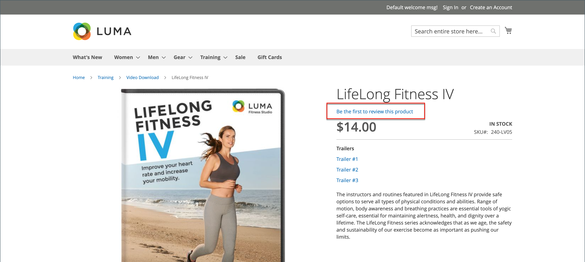
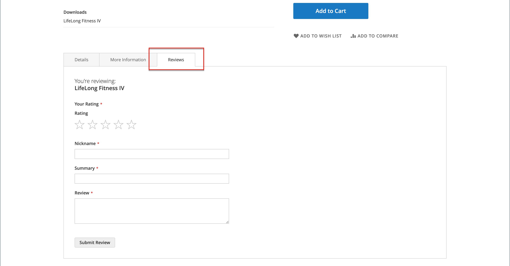
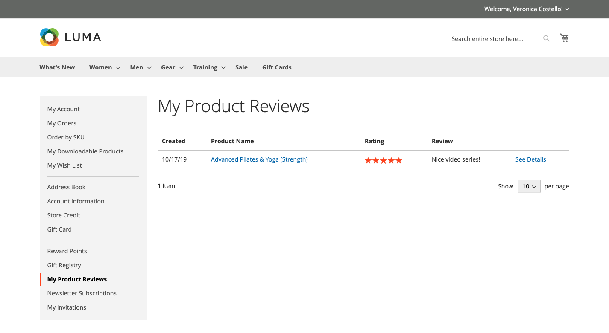
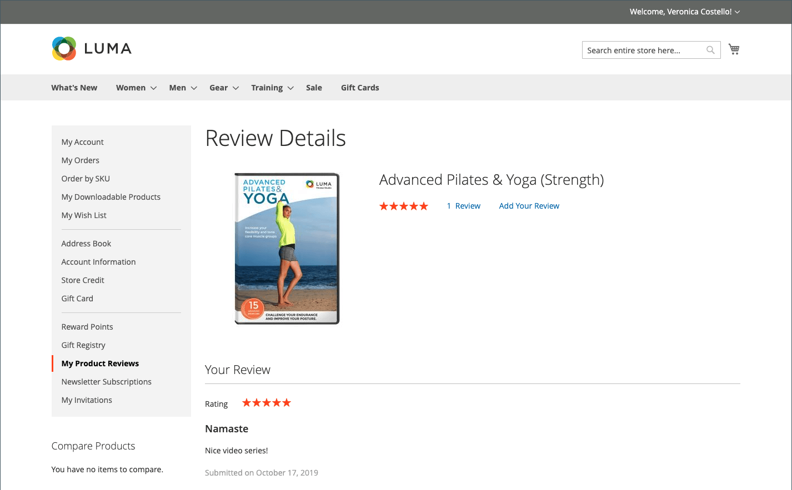
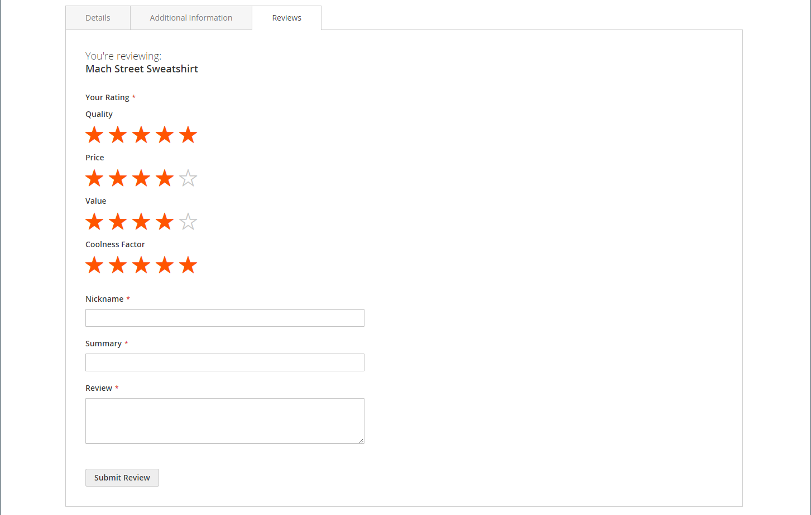
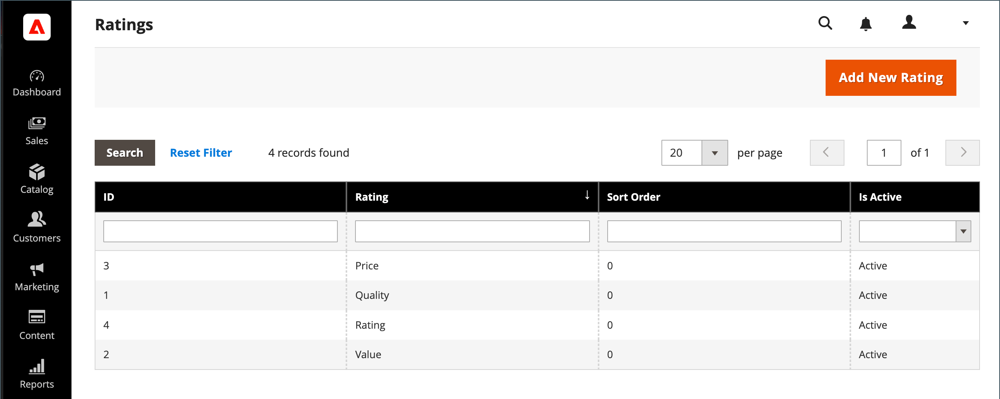
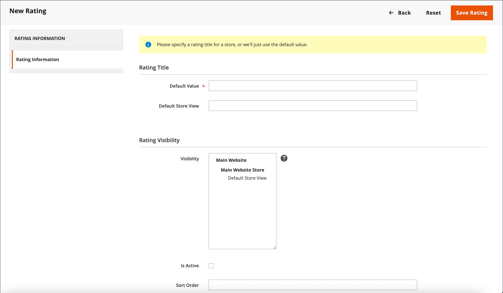
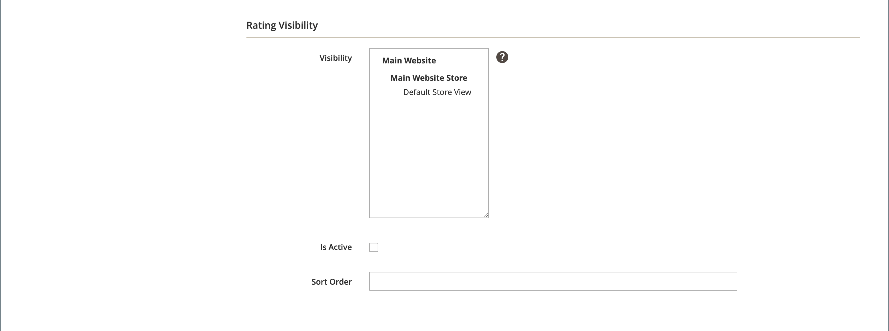
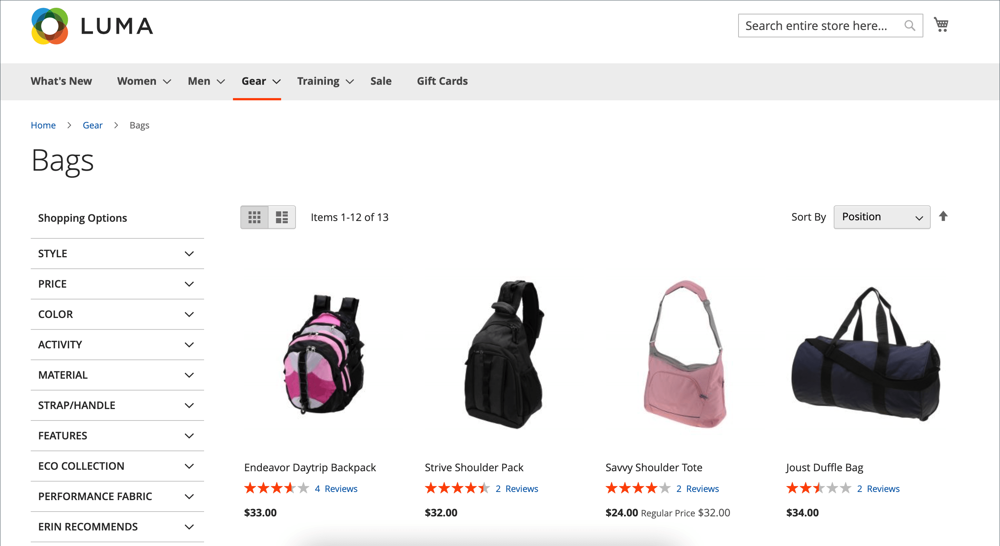

# 製品レビュー

商品レビューは、コミュニティ意識を高めるのに役立ち、あらゆる広告費よりも信頼性が高いと考えられています。 実際、商品レビューを掲載したサイトは、そうでないサイトよりも上位に表示される検索エンジンもあります。 特定の商品を検索してサイトを見つけた顧客にとって、商品レビューは基本的にストアのランディングページです。 商品レビューは、ストアを見つけやすくし、エンゲージメントを維持し、多くの場合、売上につながります。

Commerceには、管理者から管理できるネイティブの商品レビュー機能が搭載されています。 [Commerce Marketplace](../getting-started/commerce-marketplace.md)の拡張機能を使用して、ホスト型のレビュー管理システムを使用することもできます。

>[!NOTE]
>
>Adobe CommerceおよびMagento Open Source リリース 2.4.0 ～ 2.4.3には、Yotpo ベンダーが開発した拡張機能が含まれています。2.4.4 リリース以降、この拡張機能はコアリリースにバンドルされなくなり、Commerce Marketplaceからインストールして更新する必要があります。Marketplaceでは、拡張機能の開発者が提供する最新のドキュメントにもアクセスできます。
>  > バンドル拡張機能を有効にして設定している場合は、2.4.4 アップグレードプロセスの一環としてcomposer.json ファイルを更新し、拡張機能の更新を今後も管理する必要があります。詳しくは、_アップグレードガイド_&#x200B;の[&#x200B; アップグレードモジュール &#x200B;](https://experienceleague.adobe.com/docs/commerce-operations/upgrade-guide/modules/upgrade.html?lang=ja)を参照してください。

## ストアフロントでの製品レビュー

ネイティブの製品レビュー機能が有効になっている場合、顧客はカタログ内の任意の製品のレビューを書くことができます。 レビューは、次のリンクをクリックして製品ページから書き出すことができます。

- **既存のレビューを含む製品のレビュー**&#x200B;を追加します。

- **既にレビューが行われていない製品について、この製品**&#x200B;をいち早くレビューしてください。

「[!UICONTROL Reviews]」タブには、現在のすべてのレビューと、レビューの送信に使用されたフォームが一覧表示されます。

設定によって、顧客が商品レビューを書く前にストアでアカウントを開く必要があるか、または顧客がゲストとしてレビューを送信できるかどうかを判断します。 レビュー担当者にアカウントを開設するように求めることで、匿名の提出を防ぎ、レビューの質を向上させることができます。

{width="700" zoomable="yes"}

星の数は、製品の満足度を示します。 訪問者はリンクをクリックしてレビューを読み、自分でレビューを書くことができます。 インセンティブとして、レビューを投稿した顧客にはポイントが付与されます。 レビューが送信されると、管理者にモデレーション用に送信されます。 承認されると、レビューはストアで公開されます。

{width="700" zoomable="yes"}

### [!UICONTROL My Product Reviews]

顧客アカウントダッシュボードの&#x200B;_[!UICONTROL My Product Reviews]_&#x200B;セクションには、顧客によって送信され、公開用に承認されたすべてのレビューが一覧表示されます。 各レビュー概要には、レビューが提出された日、製品ページへのリンク、レビューの詳細が含まれます。

{width="700" zoomable="yes"}

1. アカウントのサイドバーで、お客様は&#x200B;**[!UICONTROL My Product Reviews]**&#x200B;を選択します。

1. 完全なレビューを表示するには、**[!UICONTROL See Details]**&#x200B;をクリックします。

   {width="700" zoomable="yes"}

## 製品レビュー機能の有効化

Commerceの製品レビュー機能は、デフォルトで有効になっています。

>[!NOTE]
>
>これらのフィールドを`No`に設定し、Commerce製品レビューを無効にするには、**システム値を使用** チェックボックスをオフにする必要があります。

1. _管理者_ サイドバーで、**[!UICONTROL Stores]** > _[!UICONTROL Settings]_>**[!UICONTROL Configuration]**&#x200B;に移動します。

1. 左側のパネルで「**[!UICONTROL Catalog]**」を展開し、下の「**[!UICONTROL Catalog]**」を選択します。

1. **[!UICONTROL Product Reviews]** セクションのを展開します。

   {width="600" zoomable="yes"}

1. **[!UICONTROL Enabled]**&#x200B;を`Yes`に設定します。

   これは、製品レビューを有効にするデフォルト設定です。

1. **[!UICONTROL Allow Guests to Write Reviews]**&#x200B;を`Yes`に設定します。

   これは、顧客が商品レビューを作成するためにストアのアカウントを開く必要があるかどうかを決定するデフォルト設定です。

1. 完了したら、**[!UICONTROL Save Config]**&#x200B;をクリックします。

## カスタム評価の作成

Commerceの商品レビュー機能を利用すれば、顧客は商品レビューを提出するときに評価を割り当てることができます。 デフォルトの評価は、品質、価格、価値です。 これらに加えて、独自のカスタムレーティングを追加できます。 カタログページに表示される5つ星の評価は、各製品の平均です。

{width="700" zoomable="yes"}

1. _管理者_ サイドバーで、**[!UICONTROL Stores]** > _[!UICONTROL Attributes]_>**[!UICONTROL Rating]**&#x200B;に移動します。

1. 右上隅の「**[!UICONTROL Add New Rating]**」をクリックします。

   {width="700" zoomable="yes"}

1. _[!UICONTROL Rating Title]_&#x200B;セクションで、新しい評価の&#x200B;**[!UICONTROL Default Value]**&#x200B;を入力します。

   該当する場合は、各ストアビューの翻訳も入力します。

   {width="600" zoomable="yes"}

1. _評価表示_ セクションで、評価を使用するストアビューに&#x200B;**[!UICONTROL Visibility In]**&#x200B;を設定します。

   複数のストアビューを選択するには、Ctrl キー（PC）またはCommand キー（Mac）を押しながら、各項目をクリックします。

   >[!NOTE]
   >
   >評価は、ストアビューに割り当てられていない限り表示されません。

1. **[!UICONTROL Sort Order]**&#x200B;の場合、他の人と共にリストされたときに、この評価の順序を決定する番号を入力します。

1. ストアフロントで評価を表示する場合は、**[!UICONTROL Is Active]** チェックボックスを選択します。

   {width="600" zoomable="yes"}

1. 完了したら、**[!UICONTROL Save Rating]**&#x200B;をクリックします。

   すべてのレビューの平均評価は、カタログ製品グリッドページに各製品について表示されます。

   {width="700" zoomable="yes"}
