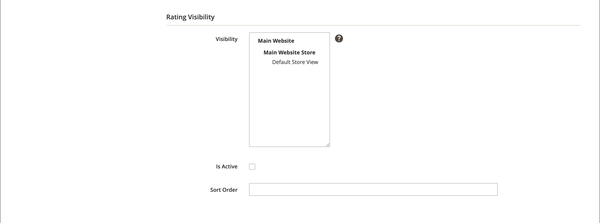

# 製品レビュー

製品レビューはコミュニティの感覚を構築するのに役立ち、広告のお金が買うことができるよりも信頼できると考えられています。 実際、一部の検索エンジンでは、製品レビューのあるサイトのランキングがそうでないサイトよりも高くなっています。 特定の製品を検索してサイトを見つけたユーザーにとって、製品レビューは基本的にストアのランディングページです。 製品レビューは、顧客が店舗を見つけ、顧客の関心を維持し、多くの場合、販売につなげるのに役立ちます。

Commerceには、管理者から管理できるネイティブの製品レビュー機能が含まれています。 また、[Commerce Marketplace](../getting-started/commerce-marketplace.md) の拡張機能を使用して、ホストされているレビュー管理システムを使用することもできます。

>[!NOTE]
>
>Adobe CommerceおよびMagento Open Source リリース 2.4.0 から 2.4.3 には、Yotpo ベンダーが開発した拡張機能が含まれています。 2.4.4 リリース以降、この拡張機能はコアリリースにバンドルされなくなり、Commerce Marketplaceからインストールして更新する必要があります。 また、Marketplace では、拡張機能開発者が提供する最新のドキュメントにもアクセスできます。
>&#x200B;>  
>&#x200B;>バンドルされた拡張機能を有効にして設定してある場合は、2.4.4 のアップグレードプロセスの一環として composer.json ファイルを更新し、今後、拡張機能の更新を管理する必要があります。 詳しくは、『 [&#x200B; アップグレードガイド &#x200B;](https://experienceleague.adobe.com/docs/commerce-operations/upgrade-guide/modules/upgrade.html?lang=ja) の _アップグレードモジュール_ を参照してください。

## ストアフロントでの商品レビュー

ネイティブの製品レビュー機能が有効になっている場合、顧客はカタログ内の任意の製品のレビューを記述できます。 レビューは、以下をクリックして製品ページから書き込むことができます。

- 既存のレビューを含む製品の **レビューを追加** します。

- 既存のレビューがない製品については **この製品を最初に確認してくださ**。

「[!UICONTROL Reviews]」タブには、現在のすべてのレビューと、レビューの送信に使用されたフォームが一覧表示されます。

設定によって、顧客が商品レビューを書く前にストアでアカウントを開く必要があるか、または顧客がレビューをゲストとして送信できるかどうかを決定します。 レビュー担当者にアカウントのオープンを要求すると、匿名の送信が防止され、レビューの品質が向上します。

{width="700" zoomable="yes"}

星の数は、製品の満足度評価を示します。 訪問者は、リンクをクリックしてレビューを読み、自分で書くことができます。 インセンティブとして、お客様はレビューを送信する際に報酬ポイントを受け取ることができます。 レビューが送信されると、管理者に送信され、モデレートされます。 承認されると、レビューがストアに公開されます。

{width="700" zoomable="yes"}

### [!UICONTROL My Product Reviews]

顧客アカウントダッシュボードの「_[!UICONTROL My Product Reviews]_」セクションには、顧客から送信され、公開用に承認されたすべてのレビューが一覧表示されます。 各レビューの概要には、レビューが送信された日付、製品ページへのリンク、レビューの詳細が含まれます。

{width="700" zoomable="yes"}

1. アカウントのサイドバーで、顧客が **[!UICONTROL My Product Reviews]** を選択します。

1. 完全なレビューを表示するには、**[!UICONTROL See Details]** をクリックします。

   {width="700" zoomable="yes"}

## 製品レビュー機能の有効化

Commerceの製品レビュー機能は、デフォルトで有効になっています。

>[!NOTE]
>
>これらのフィールドをCommerceの商品レビューに対して `No` 効または無効にするには、「システム値を使用 **チェックボックスをオフ** する必要があります。

1. _管理者_ サイドバーで、**[!UICONTROL Stores]**/_[!UICONTROL Settings]_/**[!UICONTROL Configuration]**&#x200B;に移動します。

1. 左側のパネルで「**[!UICONTROL Catalog]**」を展開し、その下にある「**[!UICONTROL Catalog]**」を選択します。

1. 「」を展開し、「**[!UICONTROL Product Reviews]**」セクションを展開します。

   {width="600" zoomable="yes"}

1. **[!UICONTROL Enabled]** を `Yes` に設定します。

   これは、製品レビューを有効にするデフォルト設定です。

1. **[!UICONTROL Allow Guests to Write Reviews]** を `Yes` に設定します。

   これは、顧客が商品レビューを書くことができるように、ストアでアカウントを開く必要があるかどうかを決定するデフォルトの設定です。

1. 完了したら、「**[!UICONTROL Save Config]**」をクリックします。

## カスタム評価の作成

Commerce商品レビューを使用すると、お客様は商品レビューを送信する際に評価を割り当てることができます。 デフォルトの評価は、品質、価格、値です。 これらに加えて、独自のカスタム評価を追加できます。 カタログページに表示される 5 つ星の評価は、各製品の平均です。

{width="700" zoomable="yes"}

1. _管理者_ サイドバーで、**[!UICONTROL Stores]**/_[!UICONTROL Attributes]_/**[!UICONTROL Rating]**&#x200B;に移動します。

1. 右上隅の「**[!UICONTROL Add New Rating]**」をクリックします。

   {width="700" zoomable="yes"}

1. [_[!UICONTROL Rating Title]_] セクションで、新しい評価の&#x200B;**[!UICONTROL Default Value]**&#x200B;を入力します。

   該当する場合は、各ストア表示の翻訳も入力します。

   {width="600" zoomable="yes"}

1. _評価の表示_ セクションで、評価を使用するストア ビューに **[!UICONTROL Visibility In]** を設定します。

   複数のストアビューを選択するには、Ctrl キー（PC）または Command キー（Mac）を押しながら、各項目をクリックします。

   >[!NOTE]
   >
   >評価は、ストア表示に割り当てられていない限り、表示されません。

1. **[!UICONTROL Sort Order]**：この評価の順序を決定する数値を入力します。

1. ストアフロントに評価を表示する場合は、「**[!UICONTROL Is Active]**」チェックボックスをオンにします。

   {width="600" zoomable="yes"}

1. 完了したら、「**[!UICONTROL Save Rating]**」をクリックします。

   すべてのレビューの平均評価は、カタログの製品グリッドページに製品ごとに表示されます。

   {width="700" zoomable="yes"}
