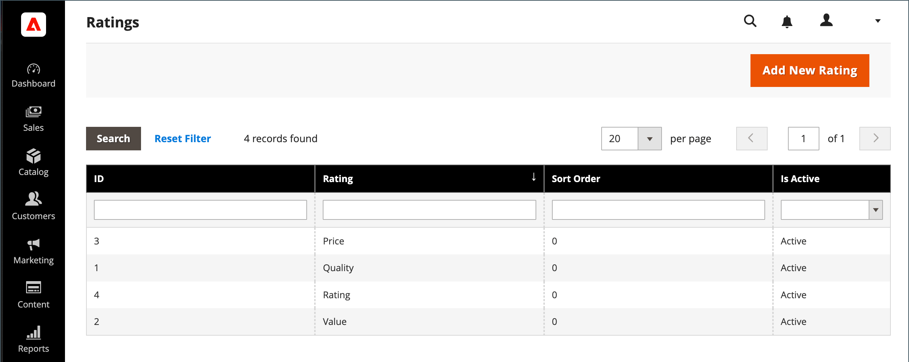

# 製品レビュー

製品レビューは、コミュニティの感覚を構築するのに役立ち、広告のお金が購入できる以上に信頼性が高いと見なされます。 実際、一部の検索エンジンでは、商品レビューのあるサイトが、ないサイトよりも高いランクを持っています。 特定の製品を検索してサイトを見つけたユーザーの場合、製品レビューは基本的に、ストアのランディングページになります。 商品レビューは、顧客が店舗を見つけ、関与を維持し、多くの場合は販売につながるのに役立ちます。

コマースには、管理者から管理できるネイティブの製品レビュー機能が含まれています。 拡張機能は、 [Commerce Marketplace](../getting-started/commerce-marketplace.md) ホストされたレビュー管理システムを使用する場合。

>[!NOTE]
>
>Adobe CommerceとMagento Open Sourceのリリース 2.4.0 ～ 2.4.3 には、Yotpo ベンダーが開発した拡張機能が含まれていました。 2.4.4 リリース以降、この拡張機能はコアリリースにバンドルされなくなり、Commerce Marketplaceからインストールおよび更新する必要があります。 また、Marketplace では、拡張機能の開発者が提供する最新のドキュメントにアクセスできます。
>  
>バンドルされた拡張機能を有効にして設定済みの場合、2.4.4 アップグレードプロセスの一環として composer.json ファイルを更新し、今後の拡張機能の更新を管理する必要があります。 詳しくは、 [モジュールのアップグレード](https://experienceleague.adobe.com/docs/commerce-operations/upgrade-guide/modules/upgrade.html) （内） _アップグレードガイド_ を参照してください。

## ストアフロントでの製品レビュー

ネイティブの「製品レビュー」機能を有効にすると、顧客はカタログ内の任意の製品のレビューを書き込むことができます。 レビューは、次のアイコンをクリックすると、製品ページから書き込むことができます。

- **レビューを追加** 既存のレビューを持つ製品の場合

- **この製品を初めてレビューする** 既存のレビューがない製品の場合。

The [!UICONTROL Reviews] 「 」タブには、現在のレビューがすべて表示され、レビューの送信に使用されたフォームが表示されます。

設定によって、顧客が商品レビューを書き込む前にストアでアカウントを開く必要があるか、ゲストとしてレビューを送信できるかが決まります。 レビュー担当者にアカウントを開くよう求めると、匿名の送信を防ぎ、レビューの質を向上させます。

{width="700" zoomable="yes"}

星の数は、製品の満足度を示します。 訪問者は、このリンクをクリックしてレビューを読み、独自のレビューを書き込むことができます。 顧客は、インセンティブとして、レビューを送信した際の報酬ポイントを受け取ることができます。 レビューが送信されると、管理者にモデレート用に送信されます。 承認されると、レビューがストアに公開されます。

{width="700" zoomable="yes"}

### [!UICONTROL My Product Reviews]

The _[!UICONTROL My Product Reviews]_顧客アカウントダッシュボードの「 」セクションには、顧客が送信し、公開用に承認したすべてのレビューが一覧表示されます。 各レビューサマリには、レビューが送信された日付、製品ページへのリンク、レビューの詳細が含まれます。

{width="700" zoomable="yes"}

1. 顧客がアカウントのサイドバーで **[!UICONTROL My Product Reviews]**.

1. 完全なレビューを表示するには、次をクリックします。 **[!UICONTROL See Details]**.

   {width="700" zoomable="yes"}

## 製品レビュー機能を有効にする

「コマース製品レビュー」機能は、デフォルトで有効になっています。

>[!NOTE]
>
>これらのフィールドを `No` コマース製品レビューを無効にする場合は、 **システム値を使用** チェックボックス。

1. 次の日： _管理者_ サイドバー、移動 **[!UICONTROL Stores]** > _[!UICONTROL Settings]_>**[!UICONTROL Configuration]**.

1. 左側のパネルで、を展開します。 **[!UICONTROL Catalog]** を選択し、 **[!UICONTROL Catalog]** の下に

1. 展開  の **[!UICONTROL Product Reviews]** 」セクションに入力します。

   {width="600" zoomable="yes"}

1. 設定 **[!UICONTROL Enabled]** から `Yes`.

   これは、製品レビューを有効にするデフォルトの設定です。

1. 設定 **[!UICONTROL Allow Guests to Write Reviews]** から `Yes`.

   これは、製品レビューを書き込むために顧客がストアのアカウントを開く必要があるかどうかを決定するデフォルトの設定です。

1. 完了したら、「 **[!UICONTROL Save Config]**.

## カスタムの評価を作成

コマース製品レビューを使用すると、顧客は製品レビューを送信する際に評価を割り当てることができます。 デフォルトの評価は、品質、価格、値です。 これらに加えて、独自のカスタム評価を追加できます。 カタログページに表示される 5 つ星の評価は、各製品の平均です。

{width="700" zoomable="yes"}

1. 次の日： _管理者_ サイドバー、移動 **[!UICONTROL Stores]** > _[!UICONTROL Attributes]_>**[!UICONTROL Rating]**.

1. 右上隅で、 **[!UICONTROL Add New Rating]**.

   {width="700" zoomable="yes"}

1. Adobe Analytics の _[!UICONTROL Rating Title]_セクションに、**[!UICONTROL Default Value]**新しい評価用。

   該当する場合は、各ストア表示の翻訳も入力します。

   {width="600" zoomable="yes"}

1. Adobe Analytics の _評価の表示_ セクション、設定 **[!UICONTROL Visibility In]** を、評価が使用されるストア表示に追加します。

   複数のストア表示を選択するには、Ctrl キー (PC) または Command キー (Mac) を押しながら各項目をクリックします。

   >[!NOTE]
   >
   >評価は、ストア表示に割り当てられない限り、表示されません。

1. の場合 **[!UICONTROL Sort Order]**」、他のユーザーと共に表示される際のこの評価の順序を決定する数値を入力します。

1. ストアフロントに評価を表示する場合は、 **[!UICONTROL Is Active]** チェックボックス。

   {width="600" zoomable="yes"}

1. 完了したら、「 **[!UICONTROL Save Rating]**.

   すべてのレビューの平均評価は、カタログ商品グリッドページの各商品に対して表示されます。

   {width="700" zoomable="yes"}
