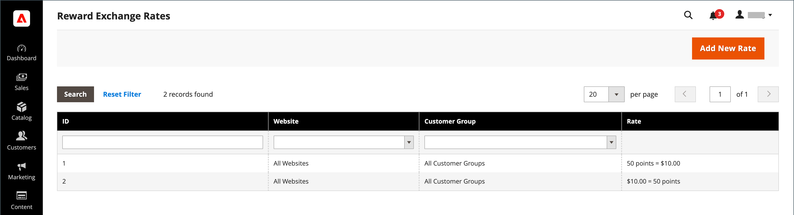

# 為替レートの報酬

{{ee-feature}}

報酬為替レートは、注文額と獲得ポイントの価値に基づいて獲得されるポイント数を決定します。 異なる為替レートは、異なる Web サイトや異なる顧客グループに適用できます。 異なる Web サイトや顧客グループからの複数の為替レートが同じ顧客に適用される場合、次の優先順位ルールが適用されます。

## 為替レートの優先度

**1**：特定の Web サイトおよび特定の顧客グループに適用されます。

**2**：すべての Web サイトと特定の顧客グループに適用されます。

**3**：特定の Web サイトとすべての顧客グループに適用されます。

**4**：すべての Web サイトとすべての顧客グループに適用されます。

通貨をポイントに変換する場合、ポイント数を割ることはできません。 残りの通貨は切り捨てられます。 例えば、$2.00 が 10 ポイントに変換されると、ポイントは$2.00 のグループで獲得されます。したがって、7.00 ドルの注文は 30 ポイントを獲得し、残りの 1.00 ドルは切り捨てられます。 注文の金額は、商人が受け取る金額、または総計 — 送料、税金、割引、店舗クレジット、ギフトカードと定義されます。 ポイントは、注文に未請求の品目がない場合に獲得されます（すべての品目が支払済みまたは取り消し済みです）。 管理者ユーザーが、キャンセルした注文の報酬ポイントを顧客に獲得させたくない場合は、そのポイントを顧客の管理ページから手動で差し引くことができます。

## 為替レートの設定

{width="700" zoomable="yes"}

1. 次の日： _管理者_ サイドバー、移動 **[!UICONTROL Stores]** > _[!UICONTROL Other Settings]_>**[!UICONTROL Reward Exchange Rates]**.

1. 右上隅で、 **[!UICONTROL Add New Rate]**.

1. Adobe Analytics の **[!UICONTROL Reward Exchange Rate Information]** セクションで、以下の操作を実行します。

   {width="600" zoomable="yes"}

   - 設定 **[!UICONTROL Website]** 報酬の為替レートが適用されるサイトに対して

   - 設定 **[!UICONTROL Customer Group]** 報酬の為替レートが適用されるグループに対して。

   - 設定 **[!UICONTROL Direction]** を次のいずれかに変更します。

      - `Points to Currency`
      - `Currency to Points`

   「方向」設定の場合、金額は Web サイトのベース通貨で表されます。

1. 次を入力します。 **[!UICONTROL Rate]** 次の値に従う _[!UICONTROL Direction]_設定。

   | 方向 | レート設定 |
   |---------|-------------|
   | [!UICONTROL Points to Currency] | 最初の _[!UICONTROL Rate]_「 」フィールドで、ポイント数を入力します。 2 番目の_[!UICONTROL Rate]_ 「 」フィールドで、ポイントの金額を入力します。 |
   | [!UICONTROL Currency to Points] | 最初の  _[!UICONTROL Rate]_「金額」フィールドに、金額を入力します。 2 番目の_[!UICONTROL Rate]_ 「 」フィールドに、金額で表されるポイント数を入力します。 |

   ポイントを通貨に変換する場合、ポイント数を割ることはできません。 例えば、10 ポイントが 2.00 ドルに変換された場合、10 個のグループでポイントを交換する必要があります。 したがって、25 ポイントが 4.00 ドルで引き換えられ、5 ポイントが顧客の残高に残ります。

   この両方でコンバージョンを設定することをお勧めします。 `Points to Currency` および `Currency to Points`.

1. 完了したら、「 **[!UICONTROL Save]**.

## 報酬の為替レートを削除します

1. 次の日： _管理者_ サイドバー、移動 **[!UICONTROL Stores]** > _[!UICONTROL Other Settings]_>**[!UICONTROL Reward Exchange Rates]**.

1. 削除する報酬の交換レートを見つけ、編集モードで開きます。

1. メニューバーで、 **[!UICONTROL Delete]**.

1. アクションを確定するには、 **[!UICONTROL OK]**.

## フィールドの説明

| フィールド | 説明 |
|--- |--- |
| [!UICONTROL Website] | 報酬率が適用される Web サイト。 |
| [!UICONTROL Customer Group] | 報酬率が適用される顧客グループ。 |
| [!UICONTROL Direction] | 為替レートで定義されるトランザクションのタイプを決定します。 オプション：  **[!UICONTROL Points to Currency]**— 注文額に対してクレジットとして適用できるポイント数を定義します。 最初の _[!UICONTROL Rate]_「 」フィールドで、ポイント数を入力します。 2 番目の_[!UICONTROL Rate]_ 「 」フィールドで、ポイントの金額を入力します。 **[!UICONTROL Currency to Points]**  — 顧客ポイントを獲得できる注文の金額を定義します。 最初の  _[!UICONTROL Rate]_「金額」フィールドに、金額を入力します。 2 番目の_[!UICONTROL Rate]_ 「 」フィールドに、金額で表されるポイント数を入力します。 |
