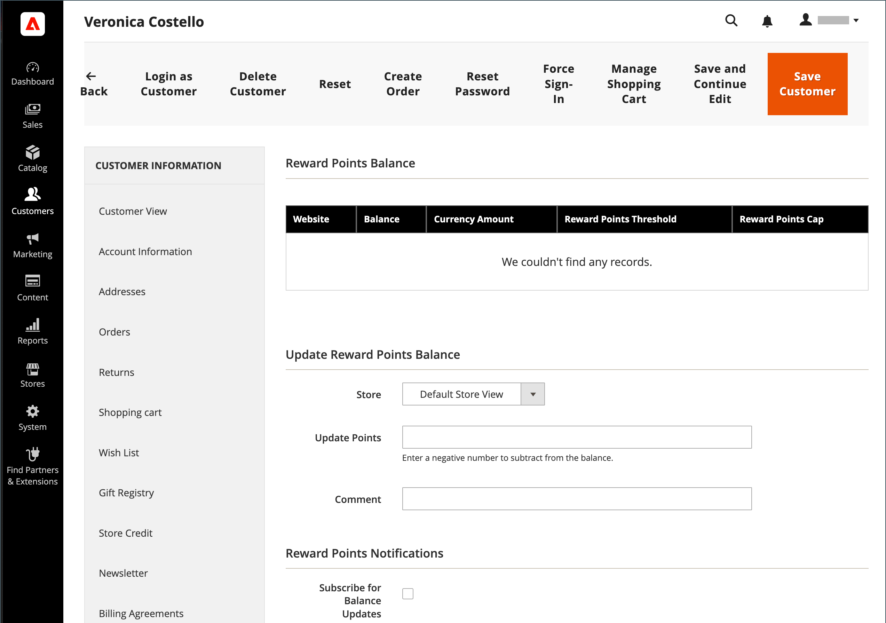

# ポイントプログラムとロイヤルティプログラム

{{ee-feature}}

Adobe Commerceの&#x200B;_報酬ポイント_ システムは、顧客エンゲージメントを促進し、顧客ロイヤルティを向上させる独自のプログラムを実装することができます。 幅広い取引や顧客行動に対してポイントを付与し、ポイント配分、残高、有効期限を制御する設定が可能です。 顧客は、ポイントと通貨の間で設定したコンバージョン率に基づいて、購入に向けてポイントを引き換えることができます。

## ショッピングカートの価格ルール

ポイントは、[買い物かごルール ](price-rules-cart.md)に基づいて顧客に付与されます。 彼らは価格ルールの唯一の行動として、または割引と一緒に報酬を受けることができます。

## 顧客残高

報酬ポイント残高は、管理者ユーザーごとに管理できます。 ストアフロントで有効にしている場合、顧客はポイント残高の詳細も表示できます。

## ポイントの交換

>[!NOTE]
>
>チェックアウト時にお客様と管理者ユーザーが報酬ポイントを引き換えるには、[報酬交換率](reward-exchange-rates.md)の設定が必要です。

ポイントは、チェックアウト時に管理者ユーザーと顧客（有効な場合）が利用できます。 「支払い方法」セクションでは、有効な支払い方法の上に「自分の報酬ポイントを使用」チェックボックスが表示されます。 利用可能なポイントと通貨換算レートが含まれています。 利用可能残高が注文の合計金額を超える場合、追加の支払い方法は必要ありません。 注文に適用される報酬ポイントの数は、店舗のクレジットカードまたはギフトカードと同様に、注文合計と共に表示され、総計から引かれます。 ポイントが店舗のクレジットまたはギフトカードと共に使用される場合、最初にポイントが差し引かれます。 その後、注文の合計がポイントの引き換え可能数を超えた場合、店舗のクレジットまたはギフトカードが差し引かれます。

>[!NOTE]
>
>リワードポイントやストアクレジットは、注文の課税対象を減らすことはありません。 これらの割引が適用される前に、小計に対して税金が計算されます。 ポイントまたはクレジットは、顧客が支払う最後の金額を減らすだけです。

>[!NOTE]
>
>COD購入の場合は、注文が請求されるまで支払いの受領確認ができないため、報酬ポイントの使用はお勧めしません。

## ポイントを返金

ポイントが付与された注文は、注文で交換された金額までポイント残高に返金できます。 [_新しいクレジットメモ_ ページ ](../stores-purchase/credit-memo-create.md)で、顧客の残高に適用されるポイント数を入力できます。 デフォルトでは、フィールドには、順序で使用されたポイントの全数が含まれます。

## ストアの報酬ポイント操作を有効にする

報酬ポイント設定は、報酬ポイントをストアに表示する方法を決定し、基本的な操作パラメーターを定義します。

{width="600" zoomable="yes"}

### 手順1: 報酬ポイントの設定

1. _管理者_ サイドバーで、**[!UICONTROL Stores]** > _[!UICONTROL Settings]_>**[!UICONTROL Configuration]**に移動します。

1. 左側のパネルで、**[!UICONTROL Customers]**&#x200B;を展開し、**[!UICONTROL Reward Points]**&#x200B;を選択します。

1. **[!UICONTROL Reward Points]** セクションのを展開し、次の操作を行います。

   - 報酬ポイントを有効にするには、**[!UICONTROL Enable Reward Points Functionality]**&#x200B;を`Yes`に設定します。

   - 顧客が独自の報酬ポイントを獲得できるようにするには、**[!UICONTROL Enable Reward Points Functionality on Storefront]**&#x200B;を`Yes`に設定します。

   - 顧客が報酬の詳細な履歴を表示できるようにするには、**[!UICONTROL Customers May See Reward Point History]**&#x200B;を`Yes`に設定します。

1. **[!UICONTROL Reward Points Balance Redemption Threshold]**&#x200B;の場合、引き換え前に発生する必要があるポイント数を入力します（最小値は空白）。

1. **[!UICONTROL Cap Reward Points Balance At]**&#x200B;について、顧客が獲得できる最大ポイント数を入力します（制限なし、空白）。

1. **[!UICONTROL Reward Points Expire in (days)]**&#x200B;の場合、報酬ポイントの有効期限が切れるまでの日数を入力します（有効期限がない場合は空白）。

1. **[!UICONTROL Reward Points Expiry Calculation]**&#x200B;を次のいずれかに設定します：

   - `Static` – 設定で設定された日数に基づいて、報酬ポイントの残りの有効期間を決定します。 設定の有効期限が変更された場合、既存のポイントの有効期限は変更されません。

   - `Dynamic` – 報酬ポイント残高が増加するたびに、残りの日数を計算します。 設定の有効期限が変更された場合、既存のすべてのポイントの有効期限は、それに応じて更新されます。

1. 利用可能な報酬ポイントを自動的に返金する場合は、**[!UICONTROL Refund Reward Points Automatically]**&#x200B;を`Yes`に設定します。

1. ポイントを獲得した注文が全額返金または一部返金された場合に、購入を通じて獲得したポイントを無効にするには、**[!UICONTROL Deduct Reward Points from Refund Amount Automatically]**&#x200B;を`Yes`に設定します。

   >[!NOTE]
   >
   >返金された注文で獲得したポイントのみが影響を受けます。

1. 報酬ポイント プログラムを説明するコンテンツ ページに&#x200B;**[!UICONTROL Landing Page]**&#x200B;を設定します。

   デフォルトの報酬ポイントページを独自の情報で更新してください。

1. 完了したら、**[!UICONTROL Save Config]**&#x200B;をクリックします。

### 手順2: 顧客の行動に対して獲得したポイントを設定できます

このステップでは、さまざまな顧客活動に対して獲得できる報酬ポイントの数を指定します。 顧客がポイントを割り当てられたアクションを完了すると、顧客に対して獲得したポイント数を示すメッセージが表示されます。

1. **[!UICONTROL Actions for Acquiring Reward Points by Customer]** セクションのを展開します。

   {width="600" zoomable="yes"}

1. 設定された[ ポイント交換率](reward-exchange-rates.md)に基づいて購入に対するポイントの獲得を許可するには、**[!UICONTROL Purchase]**&#x200B;を`Yes`に設定します。

   >[!NOTE]
   >
   >_first_&#x200B;注文の報酬ポイントを獲得するには、お客様が&#x200B;_登録してから_&#x200B;支払い方法でトランザクションが取得される必要があります。 ほとんどの支払い方法は、注文が行われたときにトランザクション _自動的に_&#x200B;をキャプチャするように設定できますが、顧客アカウントの登録が完了する&#x200B;_前_&#x200B;に設定できます。

1. **[!UICONTROL Registration]**&#x200B;に、顧客アカウントを開設するために獲得したポイント数を入力します。

1. **[!UICONTROL Newsletter Signup]**&#x200B;に、ニュースレターを購読する登録済み顧客が獲得したポイント数を入力します。

1. **[!UICONTROL Converting Invitation to Customer]**&#x200B;に、招待状を送信した顧客が獲得したポイント数を入力すると、受信者は顧客アカウントを開きます。

   招待を送信する顧客のポイントを獲得するために使用できる招待コンバージョンの数を制限できます（制限なし）。 これをおこなうには、**[!UICONTROL Invitation to Customer Conversions Quantity Limit]** フィールドに数値を入力します。

1. **[!UICONTROL Converting Invitation to Order]**&#x200B;について、次の操作を行った受信者に招待状を送信した顧客が獲得したポイント数を入力します。

   - **注文への招待コンバージョン数の制限**&#x200B;に対して、受信者が最初の注文を行ったときに招待を送信する顧客が獲得したポイント数を入力します（無制限の場合は空白）。

   - **[!UICONTROL Invitation Conversion to Order Reward]**&#x200B;の場合、`Each` オプションを選択して、受信者の注文ごとにポイントを獲得するか、`First` オプションを選択して、受信者の最初の注文に対してのみポイントを獲得します。

1. **[!UICONTROL Review Submission]**&#x200B;に、公開用に承認されたレビューを提出した顧客が獲得したポイント数を入力します。

1. 次に、顧客あたりのポイント獲得に使用できるレビュー数を制限するには、**[!UICONTROL Rewarded Reviews Submission Quantity Limit]** フィールドに番号を入力します（制限なし）。

1. 完了したら、**[!UICONTROL Save Config]**&#x200B;をクリックします。

### 手順3: 電子メール通知設定を完了する

1. **[!UICONTROL Email Notification Settings]** セクションのを展開します。

   {width="600" zoomable="yes"}

1. 残高の更新と有効期限の通知の送信者として表示されるストア連絡先に&#x200B;**[!UICONTROL Email Sender]**&#x200B;を設定します。

1. 残高の更新と今後の有効期限について顧客に通知するようにデフォルトで顧客を購読する場合は、**[!UICONTROL Subscribe Customers by Default]**&#x200B;を`Yes`に設定します。

1. 顧客のポイント残高が更新されるたびに顧客に送信される通知に使用されるテンプレートに&#x200B;**[!UICONTROL Balance Update Email]**&#x200B;を設定します。

1. ポイントのバッチの有効期限に達したときに顧客に送信される通知に使用されるテンプレートに&#x200B;**[!UICONTROL Reward Points Expiry Warning Email]**&#x200B;を設定します。

1. **[!UICONTROL Expiry Warning Before (days)]**&#x200B;の場合、ポイントが失効するまでの日数を入力すると、通知が送信されます。

1. 完了したら、**[!UICONTROL Save Config]**&#x200B;をクリックします。

## 報酬ポイント残高の更新

報酬ポイントの残高は、管理者から更新できます。

1. _管理者_ サイドバーで、**[!UICONTROL Customers]** > **[!UICONTROL All Customers]**&#x200B;に移動します。

1. グリッドで顧客を見つけ、_[!UICONTROL Action]_列の&#x200B;**[!UICONTROL Edit]**をクリックします。

1. _顧客情報_&#x200B;で、**[!UICONTROL Reward Points]** セクションを選択します。

1. **[!UICONTROL Update Points]**&#x200B;の数値を入力：

   - 報酬ポイントの金額を更新するには、合計ポイント残高を増やすための数値を入力します。
   - 報酬ポイントの金額を減算するには、合計ポイント残高を減らしたい負の数を入力します。

1. 必要に応じて、報酬ポイントの調整に関連する&#x200B;**[!UICONTROL Comments]**&#x200B;を入力します。

   {width="700" zoomable="yes"}

1. 必要に応じて、お客様を&#x200B;_報酬ポイント通知_&#x200B;に登録します。

   - **[!UICONTROL Subscribe for Balance Updates]**
   - **[!UICONTROL Subscribe for Points Expiration Notifications]**

1. **[!UICONTROL Save Customer]**&#x200B;をクリックします。

報酬ポイントに関連するすべてのアクションは、ストアフロントのアカウントの顧客の&#x200B;_[!UICONTROL Reward Points History]_ブロックに表示されます。

## フィールドの説明

| フィールド | 説明 |
|--- |--- |
| [!UICONTROL Balance] | 顧客の報酬ポイントの現在の残高 |
| [!UICONTROL Amount Balance] | 当座現金残高の金額 |
| [!UICONTROL Points] | 加算または減算されたポイントの数 |
| [!UICONTROL Amount] | 追加または減算された金額 |
| [!UICONTROL Rate] | [ ポイント換算レート ](reward-exchange-rates.md) |
| [!UICONTROL Website] | 報酬ポイント履歴が割り当てられているWeb サイト |
| [!UICONTROL Reason] | ポイント付与の理由： **[!UICONTROL Making purchases]**– 顧客が購入するたびに、ポイントを獲得できます。 **[!UICONTROL Registering on the site]**  – 登録時に発生する（1回）。 **[!UICONTROL Subscribing to a newsletter]**– 初回サブスクリプション （1回）に対して発生しました。 **[!UICONTROL Sending Invitations]**  – 友達をサイトに招待してポイントを獲得します。 **[!UICONTROL Converting Invitations to Customer]**— サイトに登録している主要な友人を対象に、送信した招待ごとにポイントを獲得します。 **[!UICONTROL Converting Invitations to Order]**  – 招待状を送信した結果、各販売に対してポイントを獲得します。 **[!UICONTROL Review Submission]**– 製品レビューを提出することでポイントを獲得できます。 |
| [!UICONTROL Created] | 報酬ポイントの更新日時 |
| [!UICONTROL Expired] | 期限切れの報酬ポイントの数 |
| [!UICONTROL Comment] | ポイントを追加または減算する際のコメント |

{style="table-layout:auto"}

