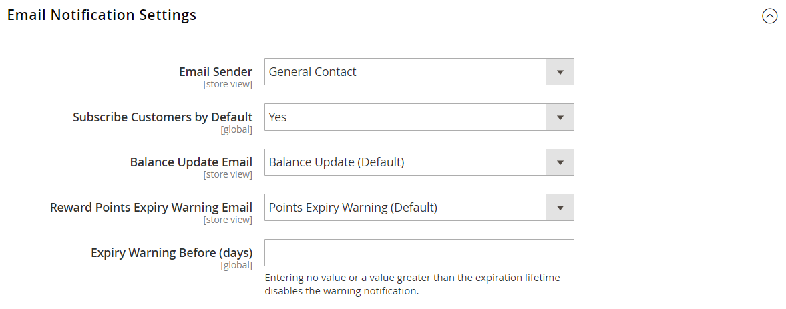
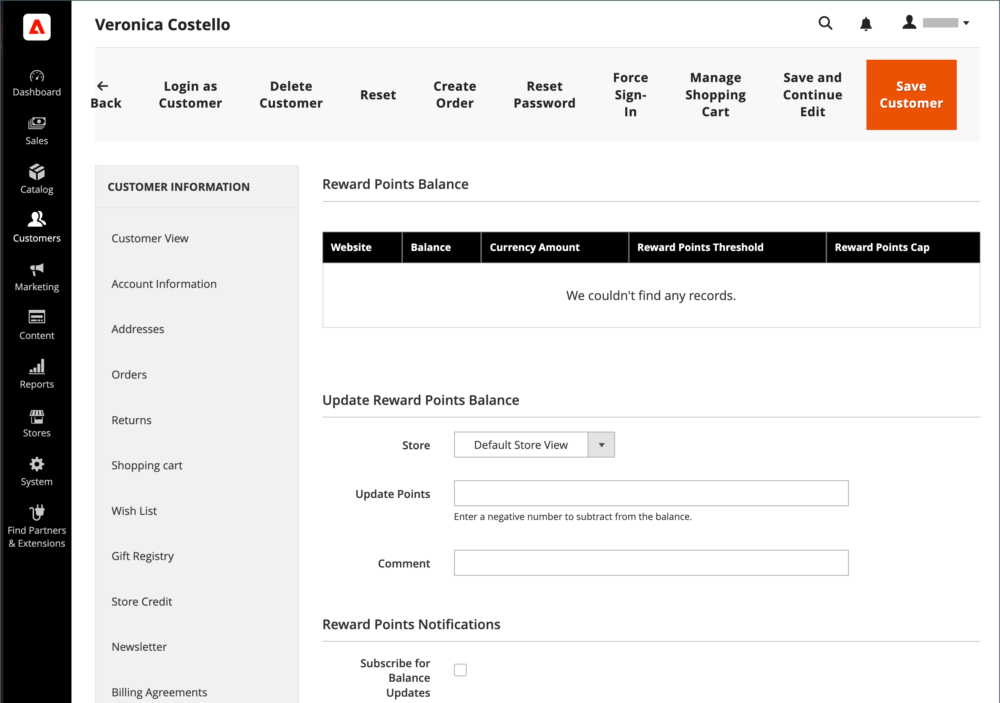

# 報酬およびロイヤルティプログラム

{{ee-feature}}

この _報酬ポイント_ Adobe Commerceのシステムを使用すると、顧客エンゲージメントを高め、顧客ロイヤルティを促進する独自のプログラムを実装できます。 ポイント付与は幅広い取引や顧客活動に対して付与でき、ポイントの配分、残高、有効期限を制御する構成を設定できます。 顧客は、報酬ポイントと通貨の間で確立したコンバージョン率に基づいて、購入に対するポイントを引き換えることができます。

## 買い物かご価格ルール

ポイントは、次の条件に基づいて顧客に付与されます [買い物かごルール](price-rules-cart.md). それらは、価格ルールの唯一のアクションとして、または割引と共に報われます。

## 顧客残高

報酬ポイント残高は、顧客ごとに管理者ユーザーが管理できます。 ストアフロントで有効にすると、お客様はポイント残高の詳細を表示することもできます。

## ポイントの交換

>[!NOTE]
>
>[報酬為替レート](reward-exchange-rates.md) チェックアウト時にお客様および管理者ユーザーが報酬ポイントを引き換えるには、設定が必要です。

ポイントは、（有効になっている場合は）管理者ユーザーおよび顧客がチェックアウト時に交換できます。 「支払い方法」セクションで、有効な支払い方法の上に「報酬ポイントを使用」チェックボックスが表示されます。 利用可能なポイントと為替レートが含まれています。 請求可能残高が注文の総計よりも大きい場合は、追加の支払い方法は必要ありません。 注文に適用される報酬ポイントの数は、店舗のクレジットやギフトカードと同様に、注文合計と共に表示され、総計から差し引かれます。 報酬ポイントがストアクレジットまたはギフトカードと共に使用される場合、最初に報酬ポイントが差し引かれます。 注文の合計が交換できる報酬ポイント数を超える場合、ストアクレジットまたはギフトカードが差し引かれます。

>[!NOTE]
>
>報酬ポイントは、注文が請求されるまで支払いの受領を確認できないので、代金引換購入での使用はお勧めしません。

## 報酬ポイントへの返金

ご注文に報酬ポイントが付与された場合、ご注文の金額を上限として報酬ポイント残高に返金されます。 日 [_新規クレジット・メモ_ ページ](../stores-purchase/credit-memo-create.md)、顧客の残高に適用されるポイント数を入力できます。 デフォルトでは、フィールドには、その順序で使用されたポイントの完全な数が含まれます。

## ストアの報酬ポイント操作を有効にする

報酬ポイントの設定は、ストアでの報酬ポイントの表示方法を決定し、基本的な操作パラメーターを定義します。

{width="600" zoomable="yes"}

### 手順 1. 報酬ポイントの設定

1. 日 _Admin_ サイドバー、に移動 **[!UICONTROL Stores]** > _[!UICONTROL Settings]_>**[!UICONTROL Configuration]**.

1. 左側のパネルで、を展開します **[!UICONTROL Customers]** を選択します **[!UICONTROL Reward Points]**.

1. を展開  この **[!UICONTROL Reward Points]** を選択し、次の操作を実行します。

   - 報酬ポイントをアクティブにするには、次のように設定します **[!UICONTROL Enable Reward Points Functionality]** 対象： `Yes`.

   - 顧客が独自の報酬ポイントを獲得できるようにするには、を設定します **[!UICONTROL Enable Reward Points Functionality on Storefront]** 対象： `Yes`.

   - 顧客が報酬の詳細な履歴を表示できるようにするには、次のように設定します **[!UICONTROL Customers May See Reward Point History]** 対象： `Yes`.

1. の場合 **[!UICONTROL Reward Points Balance Redemption Threshold]**&#x200B;を入力し、交換する前に獲得する必要があるポイント数を入力します（最小値は空白）。

1. の場合 **[!UICONTROL Cap Reward Points Balance At]**&#x200B;に設定し、顧客が累積できる最大ポイント数を入力します（無制限の場合は空白）。

1. の場合 **[!UICONTROL Reward Points Expire in (days)]**：報酬ポイントの有効期限が切れるまでの日数を入力します（有効期限がない場合は空白にします）。

1. を設定 **[!UICONTROL Reward Points Expiry Calculation]** を次のいずれかに変更します。

   - `Static`  – 設定で設定された日数に基づいて、報酬ポイントの残りの有効期間を決定します。 設定の有効期限が変更された場合、既存のポイントの有効期限は変更されません。

   - `Dynamic`  – 報酬ポイント残高が増加した場合に、残りの日数を計算します。 設定の有効期限が変更されると、それに応じて既存のすべてのポイントの有効期限が更新されます。

1. 利用可能な報酬ポイントを自動的に払い戻す場合は、次のように設定します **[!UICONTROL Refund Reward Points Automatically]** 対象： `Yes`.

1. ポイントを獲得した注文が全額返金または一部返金された場合に、購入によって獲得した報酬ポイントを無効にするには、次のように設定します **[!UICONTROL Deduct Reward Points from Refund Amount Automatically]** 対象： `Yes`.

   >[!NOTE]
   >
   >返金される注文で獲得したポイントのみが影響を受けます。

1. を設定 **[!UICONTROL Landing Page]** をクリックします。

   デフォルトの報酬ポイントのページには、必ず自分の情報を反映してください。

1. 完了したら、 **[!UICONTROL Save Config]**.

### 手順 2. 顧客アクティビティに獲得したポイントの設定

このステップでは、様々な顧客アクティビティに対して獲得できる報酬ポイントの数を指定します。 顧客がポイントが割り当てられたアクションを完了すると、獲得したポイント数を示すメッセージが顧客に表示されます。

1. を展開  この **[!UICONTROL Actions for Acquiring Reward Points by Customer]** セクション。

   {width="600" zoomable="yes"}

1. 設定されたに基づいて購入に対して報酬ポイントを獲得できるようにします [報酬為替レート](reward-exchange-rates.md)、設定 **[!UICONTROL Purchase]** 対象： `Yes`.

   >[!NOTE]
   >
   >ユーザーの報酬ポイントを獲得する _第 1_ 注文するには、顧客を登録する必要があります _次の前_ トランザクションは、支払い方法でキャプチャされます。 ほとんどの支払い方法は、トランザクションをキャプチャするように設定できます _自動_ 注文時、ただし _次の前_ 顧客アカウントの登録が完了しました。

1. の場合 **[!UICONTROL Registration]**、顧客アカウントを開設するために獲得したポイント数を入力します。

1. の場合 **[!UICONTROL Newsletter Signup]**：ニュースレターを購読する登録ユーザーが獲得したポイント数を入力します。

1. の場合 **[!UICONTROL Converting Invitation to Customer]**&#x200B;を入力します。招待を送信した顧客が獲得したポイント数を入力すると、受信者が顧客アカウントを開設します。

   招待状を送信した顧客のポイント獲得に使用できる招待状コンバージョンの数を制限できます（制限なしでは空白）。 それには、 **[!UICONTROL Invitation to Customer Conversions Quantity Limit]** フィールド。

1. の場合 **[!UICONTROL Converting Invitation to Order]**&#x200B;にポイントを入力します。このポイント数は、招待状を送付した顧客が注文を行い、以下の操作を行ったときのポイント数です。

   - の場合 **注文コンバージョンの数量制限への招待**、受信者が初回注文を行ったときに招待を送信した顧客が獲得したポイント数を入力します（無制限の場合は空白）。

   - の場合 **[!UICONTROL Invitation Conversion to Order Reward]**&#x200B;を選択し、 `Each` 受信者の注文ごとにポイントを獲得するオプション、または `First` 受信者が最初に注文した注文に対してのみポイントを獲得するオプション。

1. の場合 **[!UICONTROL Review Submission]**&#x200B;に、公開用に承認されたレビューを送信した顧客が獲得したポイント数を入力します。

1. 次に、顧客ごとにポイントを獲得するために使用できるレビューの数を制限するには、で数を入力します **[!UICONTROL Rewarded Reviews Submission Quantity Limit]** フィールド （無制限の場合は空白）。

1. 完了したら、 **[!UICONTROL Save Config]**.

### 手順 3. メール通知設定の完了

1. を展開  この **[!UICONTROL Email Notification Settings]** セクション。

   {width="600" zoomable="yes"}

1. を設定 **[!UICONTROL Email Sender]** を残高更新および有効期限通知の送信者として表示される店舗連絡先に送信します。

1. 顧客にデフォルトで通知を送信して、残高の更新や今後の有効期限に関する通知を受け取りたい場合は、を設定します **[!UICONTROL Subscribe Customers by Default]** 対象： `Yes`.

1. を設定 **[!UICONTROL Balance Update Email]** 顧客のポイント残高が更新されるたびに顧客に送信される通知に使用されるテンプレート。

1. を設定 **[!UICONTROL Reward Points Expiry Warning Email]** を、ポイントのバッチの有効期限に達した場合に顧客に送信される通知に使用されるテンプレートに変更します。

1. の場合 **[!UICONTROL Expiry Warning Before (days)]**：通知が送信されるポイントの期限が切れるまでの日数を入力します。

1. 完了したら、 **[!UICONTROL Save Config]**.

## 報酬ポイント残高の更新

報酬ポイントの残高は、管理者から更新できます。

1. 日 _Admin_ サイドバー、に移動 **[!UICONTROL Customers]** > **[!UICONTROL All Customers]**.

1. グリッドで顧客を見つけて、 **[!UICONTROL Edit]** が含まれる _[!UICONTROL Action]_列。

1. 次の下 _顧客情報_、を選択します **[!UICONTROL Reward Points]** セクション。

1. 次の数を入力 **[!UICONTROL Update Points]**:

   - 報酬ポイントの金額を更新するには、合計ポイント残高を増やす数を入力します。
   - 報酬ポイントの金額を減算するには、合計ポイント残高を減らす負の数を入力します。

1. Enter **[!UICONTROL Comments]** 必要に応じて、報酬ポイントの調整に関連します。

   {width="700" zoomable="yes"}

1. オプションで、顧客をに登録します _報酬ポイント通知_:

   - **[!UICONTROL Subscribe for Balance Updates]**
   - **[!UICONTROL Subscribe for Points Expiration Notifications]**

1. クリック **[!UICONTROL Save Customer]**.

報酬ポイントに関連するすべてのアクションは、顧客のに表示されます _[!UICONTROL Reward Points History]_ストアフロントで自分のアカウントにブロックします。

## フィールドの説明

| フィールド | 説明 |
|--- |--- |
| [!UICONTROL Balance] | クライアントの報酬ポイントの現在の残高 |
| [!UICONTROL Amount Balance] | 現在の現金残高の金額 |
| [!UICONTROL Points] | 加算または減算されたポイント数 |
| [!UICONTROL Amount] | 加算または減算された金額 |
| [!UICONTROL Rate] | この [報酬為替レート](reward-exchange-rates.md) |
| [!UICONTROL Website] | 報酬ポイントの履歴が割り当てられている Web サイト |
| [!UICONTROL Reason] | ポイント付与の理由： **[!UICONTROL Making purchases]**– お客様が購入するたびに、ポイントを獲得できます。 **[!UICONTROL Registering on the site]**  – 登録時に発生（1 回） **[!UICONTROL Subscribing to a newsletter]**– 初回定期購読/購買に対して見越計上されます（1 回）。 **[!UICONTROL Sending Invitations]**  – 友だちを招待してポイントを獲得できます。 **[!UICONTROL Converting Invitations to Customer]**– 招待メールを送信するたびにポイントを獲得し、その招待メールにサイトへの登録をリードします。 **[!UICONTROL Converting Invitations to Order]**  – 送信された招待によって得られた各販売のポイントを獲得します。 **[!UICONTROL Review Submission]**– 製品レビューを送信すると、ポイントが獲得できます。 |
| [!UICONTROL Created] | 報酬ポイントの更新日時 |
| [!UICONTROL Expired] | 期限切れの報酬ポイントの数 |
| [!UICONTROL Comment] | ポイントを追加または削除する際のコメント |

{style="table-layout:auto"}

## リソースのトラブルシューティング

報酬ポイントに関する問題のトラブルシューティングについて詳しくは、Commerce サポートナレッジベースの次の記事を参照してください。

- [一部注文のロイヤルティポイント](https://experienceleague.adobe.com/docs/commerce-knowledge-base/kb/support-tools/patches/v1-0-8/mdva-31295-magento-patch-loyalty-points-on-partial-orders.html)
- [404 エラー – 複数配送チェックアウトでの報酬ポイントの削除](https://experienceleague.adobe.com/docs/commerce-knowledge-base/kb/troubleshooting/storefront/magento-2.4.0-404-error-removing-rewards-points-on-multi-shipping-checkout.html)
