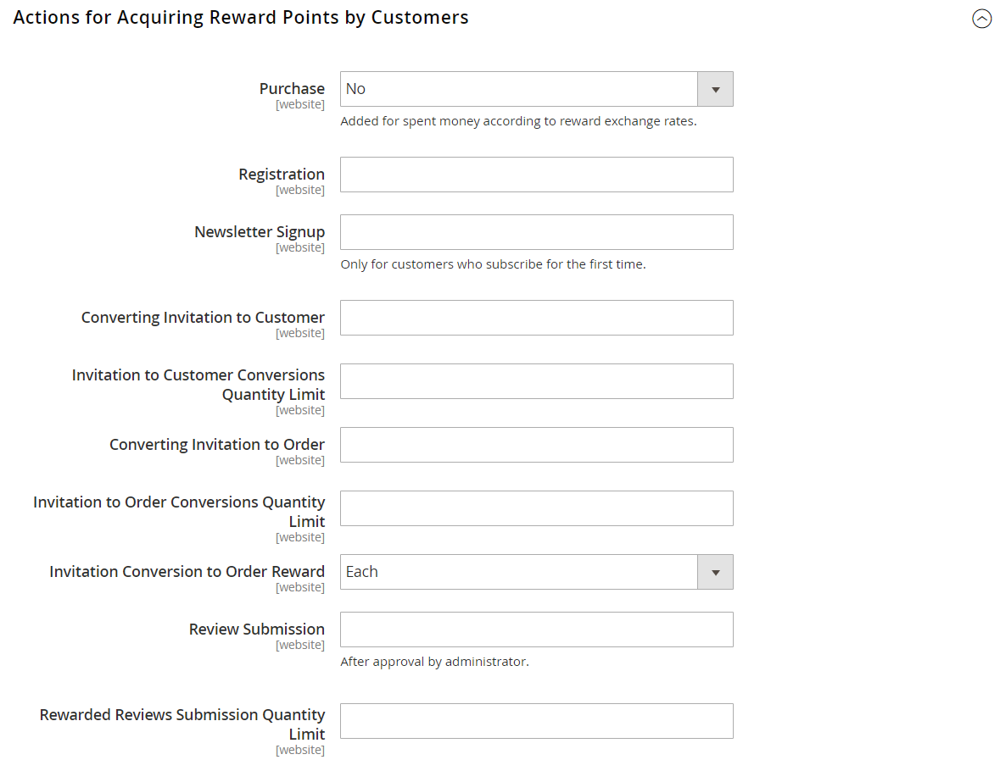

# 報酬およびロイヤルティプログラム

{{ee-feature}}

Adobe Commerceの _報酬ポイント_ システムを使用すると、顧客エンゲージメントを高め、顧客ロイヤルティを高める独自のプログラムを実装できます。 ポイント付与は幅広い取引や顧客活動に対して付与でき、ポイントの配分、残高、有効期限を制御する構成を設定できます。 顧客は、報酬ポイントと通貨の間で確立したコンバージョン率に基づいて、購入に対するポイントを引き換えることができます。

## 買い物かご価格ルール

ポイントは、[ 買い物かごルール ](price-rules-cart.md) に基づいて、顧客に付与できます。 それらは、価格ルールの唯一のアクションとして、または割引と共に報われます。

## 顧客残高

報酬ポイント残高は、顧客ごとに管理者ユーザーが管理できます。 ストアフロントで有効にすると、お客様はポイント残高の詳細を表示することもできます。

## ポイントの交換

>[!NOTE]
>
>[ 報酬為替レート ](reward-exchange-rates.md) チェックアウト中にお客様および管理者ユーザーが報酬ポイントを引き換えるには、設定が必要です。

ポイントは、（有効になっている場合は）管理者ユーザーおよび顧客がチェックアウト時に交換できます。 「支払い方法」セクションで、有効な支払い方法の上に「報酬ポイントを使用」チェックボックスが表示されます。 利用可能なポイントと為替レートが含まれています。 請求可能残高が注文の総計よりも大きい場合は、追加の支払い方法は必要ありません。 注文に適用される報酬ポイントの数は、店舗のクレジットやギフトカードと同様に、注文合計と共に表示され、総計から差し引かれます。 報酬ポイントがストアクレジットまたはギフトカードと共に使用される場合、最初に報酬ポイントが差し引かれます。 注文の合計が交換できる報酬ポイント数を超える場合、ストアクレジットまたはギフトカードが差し引かれます。

>[!NOTE]
>
>報酬ポイントとストアクレジットは、注文の課税標準を減らしません。 税金は、これらの割引が適用される前に小計で計算されます。 ポイントまたはクレジットは、お客様が支払う最終的な金額を減らすだけです。

>[!NOTE]
>
>報酬ポイントは、注文が請求されるまで支払いの受領を確認できないので、代金引換購入での使用はお勧めしません。

## 報酬ポイントへの返金

ご注文に報酬ポイントが付与された場合、ご注文の金額を上限として報酬ポイント残高に返金されます。 [_新規クレジットメモ_ ページ ](../stores-purchase/credit-memo-create.md) では、顧客の残高に適用するポイント数を入力できます。 デフォルトでは、フィールドには、その順序で使用されたポイントの完全な数が含まれます。

## ストアの報酬ポイント操作を有効にする

報酬ポイントの設定は、ストアでの報酬ポイントの表示方法を決定し、基本的な操作パラメーターを定義します。

{width="600" zoomable="yes"}

### 手順 1. 報酬ポイントの設定

1. _管理者_ サイドバーで、**[!UICONTROL Stores]**/_[!UICONTROL Settings]_/**[!UICONTROL Configuration]**に移動します。

1. 左側のパネルで「**[!UICONTROL Customers]**」を展開し、「**[!UICONTROL Reward Points]**」を選択します。

1.  展開セレクター **[!UICONTROL Reward Points]** を展開し、以下を実行します。

   - 報酬ポイントをアクティブにするには、**[!UICONTROL Enable Reward Points Functionality]** を `Yes` に設定します。

   - 顧客が独自の報酬ポイントを獲得できるようにするには、**[!UICONTROL Enable Reward Points Functionality on Storefront]** を `Yes` に設定します。

   - 顧客が報酬の詳細な履歴を表示できるようにするには、**[!UICONTROL Customers May See Reward Point History]** を `Yes` に設定します。

1. **[!UICONTROL Reward Points Balance Redemption Threshold]** に、交換する前に獲得する必要があるポイント数を入力します（最小値を指定しない場合は空白）。

1. **[!UICONTROL Cap Reward Points Balance At]**：顧客が獲得できる最大ポイント数を入力します（無制限の場合は空白にします）。

1. **[!UICONTROL Reward Points Expire in (days)]**：報酬ポイントが期限切れになるまでの日数を入力します（有効期限がない場合は空白にします）。

1. **[!UICONTROL Reward Points Expiry Calculation]** を次のいずれかに設定します。

   - `Static` – 設定で設定された日数に基づいて、報酬ポイントの残りの有効期間を決定します。 設定の有効期限が変更された場合、既存のポイントの有効期限は変更されません。

   - `Dynamic` – 報酬ポイントの残高が増加した場合に、残りの日数を計算します。 設定の有効期限が変更されると、それに応じて既存のすべてのポイントの有効期限が更新されます。

1. 利用可能な報酬ポイントを自動的に払い戻す場合は、**[!UICONTROL Refund Reward Points Automatically]** を `Yes` に設定します。

1. 購入によって獲得したポイントの全額または一部が返金された場合に獲得した報酬ポイントを無効にするには、**[!UICONTROL Deduct Reward Points from Refund Amount Automatically]** を `Yes` に設定します。

   >[!NOTE]
   >
   >返金される注文で獲得したポイントのみが影響を受けます。

1. 報酬ポイントプログラムについて説明するコンテンツページに **[!UICONTROL Landing Page]** を設定します。

   デフォルトの報酬ポイントのページには、必ず自分の情報を反映してください。

1. 完了したら、「**[!UICONTROL Save Config]**」をクリックします。

### 手順 2. 顧客アクティビティに獲得したポイントの設定

このステップでは、様々な顧客アクティビティに対して獲得できる報酬ポイントの数を指定します。 顧客がポイントが割り当てられたアクションを完了すると、獲得したポイント数を示すメッセージが顧客に表示されます。

1. 「」を展開し、「**[!UICONTROL Actions for Acquiring Reward Points by Customer]**」セクションを展開します。

   {width="600" zoomable="yes"}

1. 設定された [ 報酬為替レート ](reward-exchange-rates.md) に基づいて購入に対して報酬ポイントを獲得できるようにするには、**[!UICONTROL Purchase]** を `Yes` に設定します。

   >[!NOTE]
   >
   >_最初の_ 注文に対する報酬ポイントを獲得するには、お客様が _前_ 登録する必要があります。 ほとんどの支払い方法は、注文が行われると _自動的に_ トランザクションをキャプチャするように設定できますが、顧客アカウントの登録が完了すると _前_ キャプチャされます。

1. **[!UICONTROL Registration]**：顧客アカウントを開設するために獲得したポイント数を入力します。

1. **[!UICONTROL Newsletter Signup]** しくは、ニュースレターを購読している登録ユーザーが獲得したポイント数を入力します。

1. **[!UICONTROL Converting Invitation to Customer]**：招待を送信した顧客が獲得したポイント数を入力します。このポイント数を入力すると、受信者が顧客アカウントを開設します。

   招待状を送信した顧客のポイント獲得に使用できる招待状コンバージョンの数を制限できます（制限なしでは空白）。 それには、「**[!UICONTROL Invitation to Customer Conversions Quantity Limit]**」フィールドに数値を入力します。

1. **[!UICONTROL Converting Invitation to Order]**：招待状を送付した顧客が注文を行った受信者に獲得したポイント数を入力し、次の操作を行います。

   - **注文コンバージョン数量制限への招待**」に、受信者が最初の注文を行ったときに顧客が招待を送信した際に獲得したポイント数を入力します（無制限の場合は空白）。

   - **[!UICONTROL Invitation Conversion to Order Reward]** しくは、受信者の注文ごとにポイントを獲得する `Each` オプションを選択するか、受信者による最初の注文に対してのみポイントを獲得する `First` オプションを選択します。

1. **[!UICONTROL Review Submission]**：公開用に承認されたレビューを送信した顧客が獲得したポイント数を入力します。

1. 次に、顧客ごとにポイントを獲得するために使用できるレビューの数を制限するには、**[!UICONTROL Rewarded Reviews Submission Quantity Limit]** のフィールドに数を入力します（制限なしでは空白）。

1. 完了したら、「**[!UICONTROL Save Config]**」をクリックします。

### 手順 3. メール通知設定の完了

1. 「」を展開し、「**[!UICONTROL Email Notification Settings]**」セクションを展開します。

   {width="600" zoomable="yes"}

1. 残高の更新と有効期限の通知の送信者として表示される店舗連絡先に **[!UICONTROL Email Sender]** を設定します。

1. 顧客にデフォルトで残高の更新と今後の有効期限に関する通知を送信する場合は、**[!UICONTROL Subscribe Customers by Default]** を `Yes` に設定します。

1. **[!UICONTROL Balance Update Email]** を、顧客のポイント残高が更新されるたびに顧客に送信される通知に使用されるテンプレートに設定します。

1. ポイントのバッチの有効期限に達した場合に顧客に送信される通知に使用されるテンプレートに **[!UICONTROL Reward Points Expiry Warning Email]** を設定します。

1. **[!UICONTROL Expiry Warning Before (days)]**：通知が送信されるポイントの期限が切れるまでの日数を入力します。

1. 完了したら、「**[!UICONTROL Save Config]**」をクリックします。

## 報酬ポイント残高の更新

報酬ポイントの残高は、管理者から更新できます。

1. _管理者_ サイドバーで、**[!UICONTROL Customers]**/**[!UICONTROL All Customers]** に移動します。

1. グリッドで顧客を見つけ、**[!UICONTROL Edit]** 列の _[!UICONTROL Action]_をクリックします。

1. _顧客情報_ の下で、「**[!UICONTROL Reward Points]**」セクションを選択します。

1. **[!UICONTROL Update Points]** の数を入力：

   - 報酬ポイントの金額を更新するには、合計ポイント残高を増やす数を入力します。
   - 報酬ポイントの金額を減算するには、合計ポイント残高を減らす負の数を入力します。

1. 必要に応じて、報酬ポイントの調整に関連する **[!UICONTROL Comments]** を入力します。

   {width="700" zoomable="yes"}

1. 必要に応じて、顧客を _報酬ポイント通知_ に登録します。

   - **[!UICONTROL Subscribe for Balance Updates]**
   - **[!UICONTROL Subscribe for Points Expiration Notifications]**

1. 「**[!UICONTROL Save Customer]**」をクリックします。

報酬ポイントに関連するすべてのアクションは、ストアフロントの顧客のアカウントの _[!UICONTROL Reward Points History]_ブロックに表示されます。

## フィールドの説明

| フィールド | 説明 |
|--- |--- |
| [!UICONTROL Balance] | クライアントの報酬ポイントの現在の残高 |
| [!UICONTROL Amount Balance] | 現在の現金残高の金額 |
| [!UICONTROL Points] | 加算または減算されたポイント数 |
| [!UICONTROL Amount] | 加算または減算された金額 |
| [!UICONTROL Rate] | [ 報酬為替レート ](reward-exchange-rates.md) |
| [!UICONTROL Website] | 報酬ポイントの履歴が割り当てられている Web サイト |
| [!UICONTROL Reason] | ポイント付与の理由： **[!UICONTROL Making purchases]**– 顧客が購入するたびにポイントを獲得できます。 **[!UICONTROL Registering on the site]** – 登録時に発生（1 回）。 **[!UICONTROL Subscribing to a newsletter]**– 初めてのサブスクリプションに対して見越計上されます（1 回）。 **[!UICONTROL Sending Invitations]** - サイトに参加するように友人を招待してポイントを獲得します。 **[!UICONTROL Converting Invitations to Customer]**- サイトに登録した友人をリードし、送信したすべての招待状に対してポイントを獲得します。 **[!UICONTROL Converting Invitations to Order]** – 送信された招待によって生じた各販売に対してポイントを獲得します。 **[!UICONTROL Review Submission]**– 製品レビューの送信でポイントを獲得できます。 |
| [!UICONTROL Created] | 報酬ポイントの更新日時 |
| [!UICONTROL Expired] | 期限切れの報酬ポイントの数 |
| [!UICONTROL Comment] | ポイントを追加または削除する際のコメント |

{style="table-layout:auto"}

