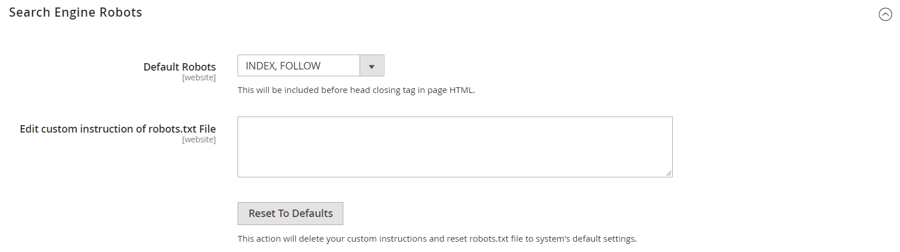

# SEOの概要

_検索エンジン最適化_ （SEO）は、検索エンジンによるページのインデックス作成方法を改善するために、サイトのコンテンツとプレゼンテーションを微調整する方法です。 Commerceには、継続的なSEOの取り組みをサポートする、さまざまな機能が搭載されています。

>[!TIP]
>
>Adobe Commerce as a Cloud Serviceについては、Commerce Storefront ドキュメントの[SEO ガイドライン &#x200B;](https://experienceleague.adobe.com/developer/commerce/storefront/setup/seo/indexing/)を参照してください

## メタデータ

[!BADGE PaaSのみ]{type=Informative url="https://experienceleague.adobe.com/en/docs/commerce/user-guides/product-solutions" tooltip="Adobe Commerce on Cloud プロジェクト（Adobeで管理されるPaaS インフラストラクチャ）とオンプレミス プロジェクトにのみ適用されます。"}

サイトとストアにキーワードが豊富な[&#x200B; メタデータ &#x200B;](meta-data.md)を追加および強化する方法について説明します。

## サイトマップの使用

[!BADGE PaaSのみ]{type=Informative url="https://experienceleague.adobe.com/en/docs/commerce/user-guides/product-solutions" tooltip="Adobe Commerce on Cloud プロジェクト（Adobeで管理されるPaaS インフラストラクチャ）とオンプレミス プロジェクトにのみ適用されます。"}

[&#x200B; サイトマップ &#x200B;](sitemap-xml.md)は、検索エンジンによるストアのインデックス作成方法を改善し、web web クローラーが見落とす可能性のあるページを見つけるように設計されています。 サイトマップでは、すべてのページと画像にインデックスを作成するように設定できます。

## URLの書き換え

[!BADGE PaaSのみ]{type=Informative url="https://experienceleague.adobe.com/en/docs/commerce/user-guides/product-solutions" tooltip="Adobe Commerce on Cloud プロジェクト（Adobeで管理されるPaaS インフラストラクチャ）とオンプレミス プロジェクトにのみ適用されます。"}

[URL書き換え](url-rewrite.md) ツールを使用すると、商品、カテゴリ、またはCMS ページに関連付けられている任意のURLを変更できます。

## 検索エンジンのロボット

Commerceの設定には、サイトをインデックス化するweb web クローラーおよびボットの手順を生成および管理するための設定が含まれています。 `robots.txt`のリクエストが（物理ファイルではなく）Commerceに到達した場合、robots controllerに動的にルーティングされます。 指示は、ほとんどの検索エンジンで認識され、その後に続くディレクティブです。

デフォルトでは、Commerceによって生成されるrobots.txt ファイルには、web web クローラーの手順が含まれており、システムで内部的に使用されるファイルを含むサイトの特定の部分のインデックス作成を避けることができます。 デフォルト設定を使用するか、またはすべての場合や特定の検索エンジンに対して独自のカスタム手順を定義できます。 ネット上には、このテーマについて詳しく解説する記事がたくさんあります。

### カスタム手順の例

**完全なアクセスを許可**

    User-agent:*
    許可しない：

**すべてのフォルダーへのアクセスを許可しない**

    User-agent:*
    許可しない：/

**既定の手順**

    User-agent: *
    Disallow: /index.php/
    Disallow: /*?
    Disallow: /checkout/
    Disallow: /app/
    Disallow: /lib/
    Disallow: /*.php$
    Disallow: /pkginfo/
    Disallow: /report/
    Disallow: /var/
    Disallow: /customer/
    Disallow: /sendfriend/
    Disallow: /14&rbrace; /*SID=

    
    

### `robots.txt`の設定

1. _管理者_ サイドバーで、**[!UICONTROL Content]** > _[!UICONTROL Design]_>**[!UICONTROL Configuration]**&#x200B;に移動します。

1. グリッドの最初の行にある&#x200B;**[!UICONTROL Global]**&#x200B;設定を見つけて、**[!UICONTROL Edit]**&#x200B;をクリックします。

   {width="700" zoomable="yes"}

1. 下にスクロールして、**[!UICONTROL Search Engine Robots]** セクションのを展開し、次の操作を行います。

   {width="600" zoomable="yes"}

   - **[!UICONTROL Default Robots]**&#x200B;を次のいずれかに設定します：

     | オプション | 説明 |
     |------|------------|
     | `INDEX, FOLLOW` | Web web クローラーに対して、サイトのインデックスを作成し、後で変更内容を確認するように指示します。 |
     | `NOINDEX, FOLLOW` | Web web クローラーに対して、サイトのインデックス作成を避けながら、後で変更点を確認するように指示します。 |
     | `INDEX, NOFOLLOW` | Web web クローラーに対して、サイトのインデックスを1回だけ作成するように指示します。ただし、ページ上のリンクには従わないでください。 |
     | `NOINDEX, NOFOLLOW` | Web web クローラーに対して、サイトのインデックス作成を避け、ページ上のリンクに従わないように指示します。 |

     {style="table-layout:auto"}

   - 必要に応じて、カスタムの指示を&#x200B;**[!UICONTROL Edit Custom instruction of robots.txt file]** ボックスに入力します。 例えば、サイトの開発中に、すべてのフォルダーへのアクセスを許可しない場合があります。

   - 既定の指示を復元するには、**[!UICONTROL Reset to Default]**&#x200B;をクリックします。

1. 完了したら、**[!UICONTROL Save Configuration]**&#x200B;をクリックします。
