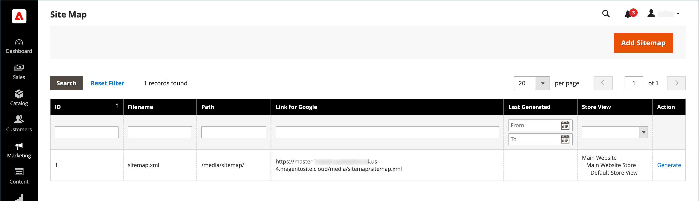
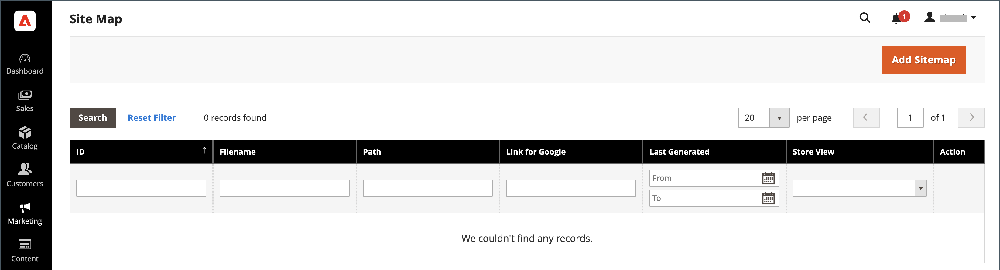
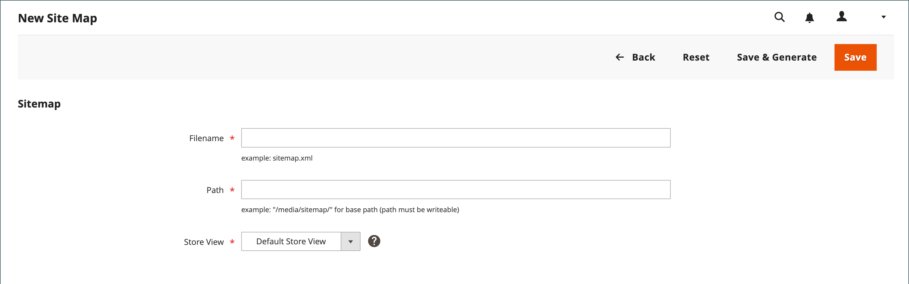
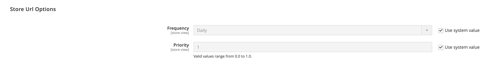
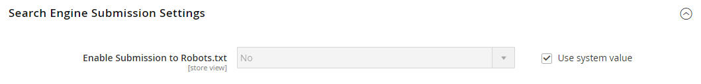

# サイトマップ

>[!TIP]
>
>Adobe Commerce as a Cloud Serviceについては、Commerce Storefront ドキュメントの[SEO ガイドライン ](https://experienceleague.adobe.com/developer/commerce/storefront/setup/seo/indexing/)を参照してください

サイトマップは、検索エンジンによるストアのインデックス付け方法を改善し、webweb クローラーが見落とす可能性のあるページを見つけるように設計されています。 サイトマップでは、すべてのページと画像にインデックスを作成するように設定できます。

有効にすると、Commerceは`sitemap.xml`という名前のファイルを作成します。このファイルは、指定した場所にインストールに保存されます。 この設定では、更新の頻度と、各タイプのコンテンツの優先度を設定できます。 サイトマップは、サイト上のコンテンツが変更されるたびに（毎日、毎週、毎月など）更新される必要があります。

サイトの開発中は、サイトのインデックス作成を避けるために、web web クローラーの`robots.txt` ファイルに手順を含めることができます。 ローンチの前に、サイトのインデックス作成を許可するように手順を変更できます。

技術情報については、_Commerce on Cloud Infrastructure ガイド_&#x200B;の「[ サイトマップとrobots.txt](https://experienceleague.adobe.com/docs/commerce-cloud-service/user-guide/configure-store/robots-sitemap.html)を追加する」を参照してください。

{width="700" zoomable="yes"}

## 手順1: サイトマップの設定

[XML サイトマップ設定](#site-map-configuration)を完了して、何が含まれているか、サイトマップが更新される頻度を決定します。

## 手順2: サイトマップの生成

1. _管理者_ メニューで、**[!UICONTROL Marketing]** > _[!UICONTROL SEO & Search]_>**[!UICONTROL Site Map]**に移動します。

1. **[!UICONTROL Add Site Map]**&#x200B;をクリックします。

   {width="700" zoomable="yes"}

1. サイト マップ **[!UICONTROL Filename]**&#x200B;を入力します。 例：`sitemap.xml`

1. **[!UICONTROL Path]**&#x200B;を入力して、サイトマップファイルがサーバー上のどこに存在するかを判断します。 パスが書き込み可能であることを確認します。

   - `/sitemap/` - サイトマップファイルを&#x200B;_サイトマップ_&#x200B;というディレクトリに配置します。

   - `/` - サイト マップ ファイルをベース パス、またはCommerce インストールのルートに配置します。

   {width="600" zoomable="yes"}

1. 完了したら、**[!UICONTROL Save & Generate]**&#x200B;をクリックします。

   サイトマップがグリッドに表示されるまでに数分かかる場合があります。

## 手順3: robots.txtの設定と有効化（オプション）

インデックスを作成するサイトの一部をクロールするように検索エンジンに指示する手順を使用して、[検索エンジンロボット ](seo-overview.md#search-engine-robots)の設定を完了します。

## 手順4: サイトマップを検索エンジンに送信

Commerce インストールの`sitemap.xml` ファイルへのリンクを提供することで、サイトマップを様々な検索エンジンに送信できます。 リンクをコピーするには、次の操作を行います。

1. _サイトマップ_ リストで、**[!UICONTROL Link for Google]**&#x200B;列のURLを右クリックします。

1. メニューで、**[!UICONTROL Copy Link Address]**&#x200B;を選択します。

詳しくは、特定の検索エンジンの手順を参照してください。 以下に、上位2つの検索エンジンの手順へのリンクを示します。

- [Google](https://support.google.com/webmasters/answer/183669?hl=en)
- [Microsoft®Bing](https://www.bing.com/webmasters/help/Sitemaps-3b5cf6ed)

## 手順5：以前のロボットの指示を復元する（オプション）

元の（デフォルト）制限のいずれかを復元できるようになりました。

## 複数のweb サイトのサイトマップとrobots.txtを管理する

複数のweb サイトがある場合は、サイトマップの作成と送信のプロセスを簡略化できます。 検証済みのすべてのストアのURLを含む1つ以上のサイトマップを[作成](#site-map-configuration)し、サイトマップを単一の場所に保存するだけです。 すべてのサイトは[Google Search Console](https://support.google.com/webmasters/answer/7451001)で確認する必要があります。

マルチストアインスタンスのサイトマップを作成するには、次の操作を行います。

1. Web サイトのルートに`sitemaps`という名前のフォルダーを作成し、各ドメインのサブフォルダーを作成します。

       /sitemaps/domain_1/
     /sitemaps/domain_2/
   
1. _管理者_ サイドバーで、**[!UICONTROL Marketing]** > _[!UICONTROL SEO & Search]_>**[!UICONTROL Site Map]**に移動します。

1. 各ストアのサイトマップリストを作成または編集し、**[!UICONTROL Path]**&#x200B;をストア用に作成したものに設定します。

   `/sitemaps/domain_1/`
   `/sitemaps/domain_2/`

1. 必要に応じて、robots.txt ファイルを更新します。

   検索エンジンのクモが新しいサイトマップに適切に誘導されるようにするには、robots.txt ファイルを更新または作成します。 上部に次の行を追加します。

       Web サイト サイトマップ 
      サイトマップ：https://www.domain_1.com/sitemaps/domain_1/sitemap.xml
      サイトマップ：https://www.domain_2.com/sitemaps/domain_2/sitemap.xml
   
>[!NOTE]
>
>サイトで[Apache](https://experienceleague.adobe.com/docs/commerce-operations/installation-guide/prerequisites/web-server/apache.html) web サーバーエンジンを使用している場合は、Web サイトのルートにある[`.htaccess`](https://httpd.apache.org/docs/current/howto/htaccess.html) ファイルを更新して、他のサイトマップ要求を適切な場所に転送する必要があります。

## 列の説明

| 列 | 説明 |
|------|-----------|
| [!UICONTROL ID] | 現在のサイトマップの順次レコード番号。 |
| [!UICONTROL Filename] | サイトマップのファイル名。 |
| [!UICONTROL Path] | サイトマップがサーバー上に存在する場所。 例：<br/>`/sitemap/` - サイトマップファイルを、Commerce インストールのルートの1つ下の&#x200B;_sitemap_&#x200B;というディレクトリに配置します。<br/>`/` - サイトマップファイルをベースパス、またはCommerce インストールのルートに配置します。 |
| [!UICONTROL Link for Google] | Googleやその他の検索エンジンに送信されるサイトマップのURL。 |
| [!UICONTROL Last Generated] | サイトマップが最後に生成された日時を示します。 |
| [!UICONTROL Store View] | サイトマップが適用されるストアビュー。 |
| [!UICONTROL Generate] | サイトマップを再生成します。 |

{style="table-layout:auto"}

## サイトマップ設定

サイトマップは、サイトのコンテンツが変更されるたびに更新される必要があります。更新は、日単位、週単位、月単位のいずれかになります。 この設定では、各タイプのコンテンツの頻度と優先順位を設定できます。

### 手順1: コンテンツの更新の頻度と優先順位を設定する

1. _管理者_ サイドバーで、**[!UICONTROL Stores]** > _[!UICONTROL Settings]_>**[!UICONTROL Configuration]**に移動します。

1. 左側のパネルで、**[!UICONTROL Catalog]**&#x200B;を展開し、**[!UICONTROL XML Sitemap]**&#x200B;を選択します。

1. **[!UICONTROL Categories Options]** セクションのを展開し、次の操作を行います。

   >[!NOTE]
   >
   >必要に応じて、**[!UICONTROL Use system value]** チェックボックスをオフにして、これらの設定を変更します。

   - **[!UICONTROL Frequency]**&#x200B;を次のいずれかに設定します：

      - `Always`
      - `Hourly`
      - `Daily`
      - `Weekly`
      - `Monthly`
      - `Yearly`
      - `Never`

   - **[!UICONTROL Priority]**&#x200B;に、`0.0`から`1.0`までの値を入力します。 ゼロは最優先度が低い。

   {width="600" zoomable="yes"}

   これらのオプションの詳細なリストについては、_設定リファレンス_&#x200B;の[ カテゴリーオプション ](../configuration-reference/catalog/xml-sitemap.md#categories-options)を参照してください。

1. **[!UICONTROL Products Options]** セクションのを展開し、必要に応じて&#x200B;**[!UICONTROL Frequency]**&#x200B;と&#x200B;**[!UICONTROL Priority]**&#x200B;の設定を完了します。

   これらのオプションの詳細なリストについては、_設定リファレンス_&#x200B;の[製品オプション ](../configuration-reference/catalog/xml-sitemap.md#products-options)を参照してください。

1. 画像がサイトマップに含まれる範囲を判断するには、**[!UICONTROL Add Images into Sitemap]**&#x200B;を次のいずれかに設定します。

   - `None`
   - `Base Only`
   - `All`

   {width="600" zoomable="yes"}

1. **[!UICONTROL CMS Pages Options]** セクションのを展開し、必要に応じて&#x200B;**[!UICONTROL Frequency]**&#x200B;と&#x200B;**[!UICONTROL Priority]**&#x200B;の設定を完了します。

   {width="600" zoomable="yes"}

   これらのオプションの詳細なリストについては、_設定リファレンス_&#x200B;の[CMS Pages Options](../configuration-reference/catalog/xml-sitemap.md#cms-pages-options)を参照してください。

1. **[!UICONTROL Store Url Options]** セクションのを展開し、必要に応じて&#x200B;**[!UICONTROL Frequency]**&#x200B;と&#x200B;**[!UICONTROL Priority]**&#x200B;の設定を完了します。

   {width="600" zoomable="yes"}

   これらのオプションの詳細なリストについては、_設定リファレンス_&#x200B;の「[Url オプションを保存](../configuration-reference/catalog/xml-sitemap.md#store-url-options)」を参照してください。

1. 完了したら、**[!UICONTROL Save Config]**&#x200B;をクリックします。

### 手順2: 生成設定を完了

1. **[!UICONTROL Generation Settings]** セクションのを展開します。

   必要に応じて、「**システム値を使用**」チェックボックスをオフにして、これらの設定を変更します。

   {width="600" zoomable="yes"}

   これらのオプションの詳細なリストについては、_設定リファレンス_&#x200B;の[生成設定](../configuration-reference/catalog/xml-sitemap.md#generation-settings)を参照してください。

1. サイトマップを生成するには、**[!UICONTROL Enabled]**&#x200B;を`Yes`に設定し、次の操作を行います。

   - **[!UICONTROL Generation Method]**&#x200B;を次のいずれかに設定します：

      - `Standard` - メモリ内のすべてのデータを処理します。
      - `Batch` – 大きなカタログにメモリ最適化処理を使用します。 このオプションは、2.4.9 リリース以降で使用できます。

   - サイトマップを更新する時間、分、秒に&#x200B;**[!UICONTROL Start Time]**&#x200B;を設定します。

   - **[!UICONTROL Frequency]**&#x200B;を次のいずれかに設定します：

      - `Daily`
      - `Weekly`
      - `Monthly`

   - **[!UICONTROL Error Email Recipient]**&#x200B;について、サイトマップの更新中にエラーが発生した場合に通知を受け取るユーザーの電子メールアドレスを入力します。

   - エラー通知の送信者として表示されるストア連絡先に&#x200B;**[!UICONTROL Error Email Sender]**&#x200B;を設定します。

   - エラー通知に使用するテンプレートに&#x200B;**[!UICONTROL Error Email Template]**&#x200B;を設定します。

### 手順3: サイトマップファイルの制限の設定

1. **[!UICONTROL Sitemap File Limits]** セクションのを展開します。

   {width="600" zoomable="yes"}

   これらのオプションの詳細なリストについては、_構成リファレンス_&#x200B;の[ サイトマップファイル制限](../configuration-reference/catalog/xml-sitemap.md#sitemap-file-limits)を参照してください。

1. **[!UICONTROL Maximum No of URLs per File]**&#x200B;の場合、サイトマップに含めることができるURLの最大数を入力します。

   デフォルトでは、制限は50,000です。

1. **[!UICONTROL Maximum File Size]**&#x200B;の場合、サイトマップに割り当てられている最大サイズをバイト単位で入力します。

   デフォルトのサイズは10,485,760 バイトです。

### 手順4: 検索エンジンの送信設定

1. **[!UICONTROL Search Engine Submission Settings]** セクションのを展開します。

   {width="600" zoomable="yes"}

1. `robots.txt` ファイルを使用して、サイトをクロールする検索エンジンに指示を提供する場合は、**[!UICONTROL Enable Submission to Robots.txt]**&#x200B;を`Yes`に設定します。

1. 完了したら、**[!UICONTROL Save Config]**&#x200B;をクリックします。

## 大きなカタログ用の代替cronjob

>[!NOTE]
>
>大きなカタログを持つストアの場合は、代替のcronjobを使用して、すべてのデータが生成されるようにすることができます。 `app/code/Magento/Sitemap/etc/config.xml`で、次を置き換えます。
>
>```xml
><jobs>
>   <sitemap_generate>
>       <schedule>
>           <cron_expr>0 0 * * *</cron_expr>
>       </schedule>
>   </sitemap_generate>
></jobs>
>```
>
>次の使用例：
>
>```xml
><jobs>
>   <sitemap_generate_batch>
>       <schedule>
>           <cron_expr>0 0 * * *</cron_expr>
>       </schedule>
>   </sitemap_generate_batch>
></jobs>
>```
>
>この変更により、大規模なカタログに推奨されるサイトマップのバッチ生成が可能になります。
