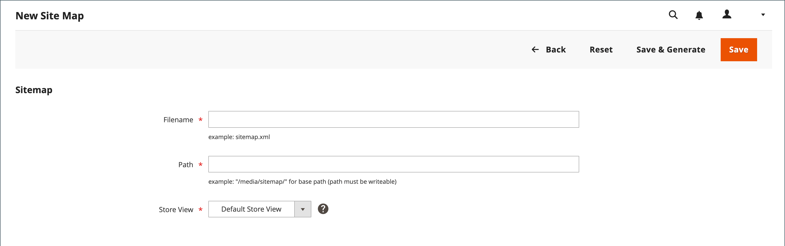

# サイトマップ

>[!TIP]
>
>Adobe Commerce as a Cloud Serviceについては、Commerce ストアフロントドキュメントの [SEO ガイドライン &#x200B;](https://experienceleague.adobe.com/developer/commerce/storefront/setup/seo/indexing/?lang=ja) を参照してください

サイト マップを使用すると、検索エンジンでストアのインデックスを作成する方法が向上し、Web web クローラーが見落とされる可能性のあるページを検索できるようになります。 サイトマップは、すべてのページと画像のインデックスを作成するように設定できます。

有効にすると、Commerceによって `sitemap.xml` という名前のファイルが作成され、インストール環境の指定した場所に保存されます。 この設定を使用すると、更新の頻度や、各タイプのコンテンツの優先度を設定できます。 サイトマップは、サイト上のコンテンツが変更される頻度に合わせて更新する必要があります（日単位、週単位、月単位など）。

サイトの開発中に、サイトのインデックスを作成しないようにするために、web web クローラーの `robots.txt` ファイルに手順を追加することがあります。 その後、ローンチの前に手順を変更して、サイトのインデックスを作成できます。

Commerce技術情報については、[Cloud Infrastructure ガイドの &#x200B;](https://experienceleague.adobe.com/docs/commerce-cloud-service/user-guide/configure-store/robots-sitemap.html?lang=ja) サイトマップとロボットの追加 _を参照してくだ_ い。

{width="700" zoomable="yes"}

## 手順 1. サイトマップの設定

[XML サイトマップ設定 &#x200B;](#site-map-configuration) を完了して、含まれる内容と、サイトマップを更新する頻度を決定します。

## 手順 2. サイトマップを生成

1. _管理者_ メニューで、**[!UICONTROL Marketing]**/_[!UICONTROL SEO & Search]_/**[!UICONTROL Site Map]**&#x200B;に移動します。

1. 「**[!UICONTROL Add Site Map]**」をクリックします。

   {width="700" zoomable="yes"}

1. サイトマップの **[!UICONTROL Filename]** を入力します。 例：`sitemap.xml`

1. **[!UICONTROL Path]** を入力して、サーバー上のサイト マップ ファイルの格納場所を決定します。 パスが書き込み可能であることを確認します。

   - `/sitemap/` - サイトマップファイルを _sitemap_ というディレクトリに配置します。

   - `/` - サイトマップファイルをCommerce インストールのベースパス（ルート）に配置します。

   {width="600" zoomable="yes"}

1. 完了したら、「**[!UICONTROL Save & Generate]**」をクリックします。

   サイト マップがグリッドに表示されるまでに数分かかる場合があります。

## 手順 3. robots.txt の設定と有効化（オプション）

インデックスを作成するサイトの部分を検索エンジンでクロールするように指示する手順を使用して、[&#x200B; 検索エンジンロボット &#x200B;](seo-overview.md#search-engine-robots) 設定を行います。

## 手順 4. 検索エンジンにサイトマップを送信

Commerceのインストール先にある `sitemap.xml` ファイルへのリンクをサイトマップに提供することで、様々な検索エンジンにサイトマップを送信できます。 リンクをコピーするには、次の手順を実行します。

1. _サイトマップ_ リストで、「**[!UICONTROL Link for Google]**」列の URL を右クリックします。

1. メニューで「**[!UICONTROL Copy Link Address]**」を選択します。

詳しくは、特定の検索エンジンの手順を参照してください。 上位 2 つの検索エンジンの手順へのリンクを次に示します。

- [Google](https://support.google.com/webmasters/answer/183669?hl=en)
- [Microsoft® Bing](https://www.bing.com/webmasters/help/Sitemaps-3b5cf6ed)

## ステップ 5：以前のロボットの指示を復元する（オプション）

元の（デフォルトの）制限のいずれかを復元できるようになりました。

## 複数の Web サイトのサイトマップと robots.txt の管理

複数の web サイトがある場合は、サイトマップの作成と送信のプロセスを簡素化できます。 検証されたすべてのストアの URL を含んだ 1 つ以上のサイトマップを [&#x200B; 作成 &#x200B;](#site-map-configuration) し、1 つの場所にサイトマップを保存するだけです。 すべてのサイトは、[Google検索コンソール &#x200B;](https://support.google.com/webmasters/answer/7451001) で検証する必要があります。

マルチストアインスタンス用のサイトマップを作成するには、次の手順を実行します。

1. Web サイトのルートに `sitemaps` というフォルダーを作成し、ドメインごとにサブフォルダーを作成します。

       /sitemaps/domain_1/
       /sitemaps/domain_2/
   
1. _管理者_ サイドバーで、**[!UICONTROL Marketing]**/_[!UICONTROL SEO & Search]_/**[!UICONTROL Site Map]**&#x200B;に移動します。

1. 各ストアのサイトマップのリストを作成または編集し、**[!UICONTROL Path]** をストアに対して作成したリストに設定します。

   `/sitemaps/domain_1/`
   `/sitemaps/domain_2/`

1. 必要に応じて、robots.txt ファイルを更新します。

   検索エンジンスパイダーが新しいサイトマップに正しく誘導されていることを確認するには、robots.txt ファイルを更新または作成します。 次の行を上部に追加します。

       Web サイトマップ 
        サイトマップ：https://www.domain_1.com/sitemaps/domain_1/sitemap.xml
        サイトマップ：https://www.domain_2.com/sitemaps/domain_2/sitemap.xml
   
>[!NOTE]
>
>サイトで [Apache](https://experienceleague.adobe.com/docs/commerce-operations/installation-guide/prerequisites/web-server/apache.html?lang=ja) web サーバーエンジンを使用している場合は、web サイトのルートにある [`.htaccess`](https://httpd.apache.org/docs/current/howto/htaccess.html) ファイルを更新して、その他のサイトマップリクエストを適切な場所に誘導する必要があります。

## 列の説明

| 列 | 説明 |
|------|-----------|
| [!UICONTROL ID] | 現在のサイト マップの順次レコード番号。 |
| [!UICONTROL Filename] | サイト マップのファイル名。 |
| [!UICONTROL Path] | サイト マップがサーバー上に存在する場所。  `/sitemap/` - サイトマップファイルをCommerce インストールのルートの 1 レベル下の _sitemap_ というディレクトリに配置します。  `/` - サイトマップファイルをCommerce インストールのベースパス（ルート）に配置します。 |
| [!UICONTROL Link for Google] | Googleおよびその他の検索エンジンに送信されるサイトマップの URL。 |
| [!UICONTROL Last Generated] | サイト マップが最後に生成された日時を示します。 |
| [!UICONTROL Store View] | サイトマップが適用されるストア表示。 |
| [!UICONTROL Generate] | サイトマップを再生成します。 |

{style="table-layout:auto"}

## サイトマップの設定

サイトマップは、サイト上のコンテンツが変更される頻度（日単位、週単位、月単位のいずれか）で更新する必要があります。 設定では、コンテンツのタイプごとに頻度と優先度を設定できます。

### 手順 1. コンテンツ更新の頻度と優先度を設定する

1. _管理者_ サイドバーで、**[!UICONTROL Stores]**/_[!UICONTROL Settings]_/**[!UICONTROL Configuration]**&#x200B;に移動します。

1. 左側のパネルで「**[!UICONTROL Catalog]**」を展開し、「**[!UICONTROL XML Sitemap]**」を選択します。

1.  展開セレクター **[!UICONTROL Categories Options]** を展開し、以下を実行します。

   >[!NOTE]
   >
   >必要に応じて、「**[!UICONTROL Use system value]**」チェックボックスをオフにして、これらの設定を変更します。

   - **[!UICONTROL Frequency]** を次のいずれかに設定します。

      - `Always`
      - `Hourly`
      - `Daily`
      - `Weekly`
      - `Monthly`
      - `Yearly`
      - `Never`

   - **[!UICONTROL Priority]** の場合は、`0.0` ～ `1.0` の値を入力します。 優先順位が最も低いのはゼロです。

   {width="600" zoomable="yes"}

   これらのオプションの詳細なリストについては、[&#x200B; 設定リファレンス &#x200B;](../configuration-reference/catalog/xml-sitemap.md#categories-options) の _カテゴリオプション_ を参照してください。

1. 「」 **[!UICONTROL Products Options]** クションを展開し、必要に応じて **[!UICONTROL Frequency]** と **[!UICONTROL Priority]** の設定を行います。

   これらのオプションの詳細なリストについては、[Configuration Reference](../configuration-reference/catalog/xml-sitemap.md#products-options) の _Products Options_ を参照してください。

1. サイトマップに画像が含まれる範囲を決定するには、**[!UICONTROL Add Images into Sitemap]** を次のいずれかに設定します。

   - `None`
   - `Base Only`
   - `All`

   {width="600" zoomable="yes"}

1. 「」 **[!UICONTROL CMS Pages Options]** クションを展開し、必要に応じて **[!UICONTROL Frequency]** と **[!UICONTROL Priority]** の設定を行います。

   {width="600" zoomable="yes"}

   これらのオプションの詳細なリストについては、[Configuration Reference](../configuration-reference/catalog/xml-sitemap.md#cms-pages-options) の _CMS ページオプション_ を参照してください。

1. 「」 **[!UICONTROL Store Url Options]** クションを展開し、必要に応じて **[!UICONTROL Frequency]** と **[!UICONTROL Priority]** の設定を行います。

   {width="600" zoomable="yes"}

   これらのオプションの詳細なリストについては、[&#x200B; 設定リファレンス &#x200B;](../configuration-reference/catalog/xml-sitemap.md#store-url-options) の _Url オプションの保存_ を参照してください。

1. 完了したら、「**[!UICONTROL Save Config]**」をクリックします。

### 手順 2. 生成の設定を完了

1. 「」を展開し、「**[!UICONTROL Generation Settings]**」セクションを展開します。

   必要に応じて、「**システム値を使用**」チェックボックスをオフにして、これらの設定を変更します。

   {width="600" zoomable="yes"}

   これらのオプションの詳細なリストについては、[&#x200B; 設定リファレンス &#x200B;](../configuration-reference/catalog/xml-sitemap.md#generation-settings) の _生成設定_ を参照してください。

1. サイトマップを生成するには、**[!UICONTROL Enabled]** を `Yes` に設定して、次の手順を実行します。

   - サイトマップを更新する時、分、秒に **[!UICONTROL Start Time]** を設定します。

   - **[!UICONTROL Frequency]** を次のいずれかに設定します。

      - `Daily`
      - `Weekly`
      - `Monthly`

   - **[!UICONTROL Error Email Recipient]**: サイトマップの更新中にエラーが発生した場合に通知を受け取るユーザーのメールアドレスを入力します。

   - エラー通知の送信者として表示される店舗連絡先に **[!UICONTROL Error Email Sender]** を設定します。

   - エラー通知に使用するテンプレートに **[!UICONTROL Error Email Template]** を設定します。

### 手順 3. サイトマップファイル制限の設定

1. 「」を展開し、「**[!UICONTROL Sitemap File Limits]**」セクションを展開します。

   {width="600" zoomable="yes"}

   これらのオプションの詳細なリストについては、[&#x200B; 設定リファレンス &#x200B;](../configuration-reference/catalog/xml-sitemap.md#sitemap-file-limits) の _サイトマップファイル制限_ を参照してください。

1. **[!UICONTROL Maximum No of URLs per File]**：サイトマップに含めることができる最大 URL 数を入力します。

   デフォルトの上限は 50,000 です。

1. **[!UICONTROL Maximum File Size]**：サイトマップに割り当てる最大サイズ（バイト単位）を入力します。

   デフォルトのサイズは 10,485,760 バイトです。

### 手順 4. 検索エンジン送信設定の指定

1. 「」を展開し、「**[!UICONTROL Search Engine Submission Settings]**」セクションを展開します。

   {width="600" zoomable="yes"}

1. `robots.txt` ファイルを使用してサイトをクロールする検索エンジンに指示を提供する場合は、「**[!UICONTROL Enable Submission to Robots.txt]**」を「`Yes`」に設定します。

1. 完了したら、「**[!UICONTROL Save Config]**」をクリックします。
