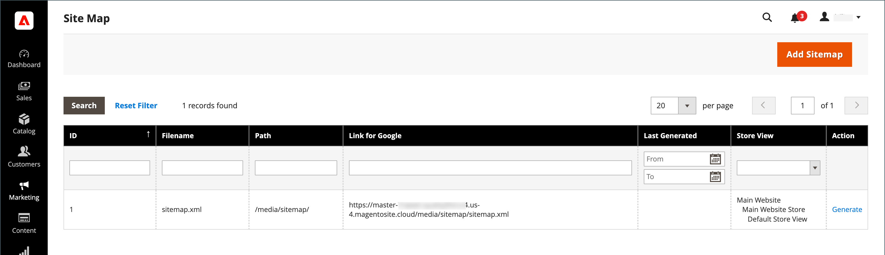

# サイトマップ

サイトマップは、検索エンジンによってストアのインデックスが作成される方法を改善し、Web クローラーが見落とす可能性のあるページを見つけるように設計されています。 サイトマップは、すべてのページと画像のインデックスを作成するように設定できます。

有効にすると、Commerce は、 `sitemap.xml` は、指定した場所にインストールされた場所に保存されます。 この設定を使用すると、更新の頻度と、コンテンツの各タイプの優先度を設定できます。 サイトマップは、サイト上のコンテンツが変更されるたびに（日別、週別、月別など）更新される必要があります。

サイトの開発中に、 `robots.txt` ファイルを使用して、サイトのインデックス作成を回避します。 その後、起動前に手順を変更して、サイトのインデックスを作成できるようにします。

技術情報については、 [サイトマップと robots.txt を追加][1] （内） _Commerce on Cloud Infrastructure ガイド_.

{width="700" zoomable="yes"}

## 手順 1. サイトマップの設定

次を完了： [XML サイトマップの設定](#site-map-configuration) を使用して、何が含まれ、どのくらいの頻度でサイトマップが更新されるかを決定します。

## 手順 2. サイトマップを生成します

1. 次の日： _管理者_ メニュー、移動 **[!UICONTROL Marketing]** > _[!UICONTROL SEO & Search]_>**[!UICONTROL Site Map]**.

1. クリック **[!UICONTROL Add Site Map]**.

   {width="700" zoomable="yes"}

1. サイトマップを入力 **[!UICONTROL Filename]**. 例： `sitemap.xml`

1. 次を入力します。 **[!UICONTROL Path]** を使用して、サーバ上のサイトマップファイルの場所を特定します。 パスが書き込み可能であることを確認します。

   - `/sitemap/`  — サイトマップファイルを、 _sitemap_.

   - `/`  — サイトマップファイルをコマースインストール環境のベースパスまたはルートに配置します。

   {width="600" zoomable="yes"}

1. 完了したら、「 **[!UICONTROL Save & Generate]**.

   サイトマップがグリッドに表示されるまでに数分かかる場合があります。

## 手順 3. robots.txt の設定と有効化（オプション）

次を完了： [検索エンジンロボット](seo-overview.md#search-engine-robots) インデックスを作成するサイトの一部を検索エンジンでクロールするよう指示を含む設定。

## 手順 4. 検索エンジンにサイトマップを送信

サイトマップを様々な検索エンジンに送信するには、サイトマップを `sitemap.xml` ファイルを Commerce インストールに保存します。 リンクをコピーするには、次の手順を実行します。

1. Adobe Analytics の _サイトマップ_ リストで、 **[!UICONTROL Link for Google]** 列。

1. メニューで、「 」を選択します。 **[!UICONTROL Copy Link Address]**.

詳しくは、特定の検索エンジンに関する説明を参照してください。 次に、上位 2 つの検索エンジンの手順へのリンクを示します。

- [Google][2]
- [Microsoft® Bing][3]

## 手順 5：以前のロボットの手順を復元する（オプション）

これで、元の（デフォルトの）制限を復元できます。

## 複数の Web サイト用のサイトマップと robots.txt の管理

複数の Web サイトがある場合は、サイトマップの作成と送信のプロセスを簡略化できます。 簡単に [作成](#site-map-configuration) 検証済みのすべてのストアの URL を含む 1 つ以上のサイトマップを 1 つの場所に保存します。 すべてのサイトをで検証する必要があります。 [Google Search Console](https://support.google.com/webmasters/answer/7451001).

マルチストアインスタンスのサイトマップを作成するには、次の手順を実行します。

1. という名前のフォルダーを作成します。 `sitemaps` web サイトのルートで、各ドメインのサブフォルダーを作成します。

       /sitemaps/domain_1/
       /sitemaps/domain_2/
   
1. 次の日： _管理者_ サイドバー、移動 **[!UICONTROL Marketing]** > _[!UICONTROL SEO & Search]_>**[!UICONTROL Site Map]**.

1. 各ストアのサイトマップリストを作成または編集し、 **[!UICONTROL Path]** をストア用に作成したものに変更します。

   `/sitemaps/domain_1/`
   `/sitemaps/domain_2/`

1. 必要に応じて、 robots.txt ファイルを更新します。

   検索エンジンのスパイダーが新しいサイトマップに正しく送られるように、 robots.txt ファイルを更新または作成できます。 上部に次の行を追加します。

       Web サイトサイトマップ
       サイトマップ： https://www.domain_1.com/sitemaps/domain_1/sitemap.xml
       サイトマップ： https://www.domain_2.com/sitemaps/domain_2/sitemap.xml
   
>[!NOTE]
>
>サイトで [Apache](https://experienceleague.adobe.com/docs/commerce-operations/installation-guide/prerequisites/web-server/apache.html) web サーバーエンジンの場合は、 [`.htaccess`](https://httpd.apache.org/docs/current/howto/htaccess.html) ファイルを Web サイトのルートに配置して、他のサイトマップリクエストを適切な場所に送信します。

## 列の説明

| 列 | 説明 |
|------|-----------|
| [!UICONTROL ID] | 現在のサイトマップの連続したレコード番号。 |
| [!UICONTROL Filename] | サイトマップのファイル名。 |
| [!UICONTROL Path] | サイトマップがサーバー上に存在する場所。 例：  `/sitemap/`  — サイトマップファイルを、 _sitemap_（コマースインストールのルートの 1 レベル下）  `/`  — サイトマップファイルをコマースインストール環境のベースパスまたはルートに配置します。 |
| [!UICONTROL Link for Google] | Googleおよびその他の検索エンジンに送信するサイトマップの URL。 |
| [!UICONTROL Last Generated] | サイトマップが最後に生成された日時を示します。 |
| [!UICONTROL Store View] | サイトマップが適用されるストア表示。 |
| [!UICONTROL Generate] | サイトマップを再生成します。 |

{style="table-layout:auto"}

## サイトマップの設定

サイトマップは、サイト上のコンテンツが変更されるたびに頻繁に更新される必要があります（日別、週別、月別）。 この設定を使用すると、コンテンツのタイプごとに頻度と優先度を設定できます。

### 手順 1. コンテンツ更新の頻度と優先度を設定する

1. 次の日： _管理者_ サイドバー、移動 **[!UICONTROL Stores]** > _[!UICONTROL Settings]_>**[!UICONTROL Configuration]**.

1. 左側のパネルで、を展開します。 **[!UICONTROL Catalog]** を選択します。 **[!UICONTROL XML Sitemap]**.

1. 展開  の **[!UICONTROL Categories Options]** 」セクションで次の操作を実行します。

   >[!NOTE]
   >
   >必要に応じて、 **[!UICONTROL Use system value]** チェックボックスを使用して、これらの設定を変更できます。

   - 設定 **[!UICONTROL Frequency]** を次のいずれかに変更します。

      - `Always`
      - `Hourly`
      - `Daily`
      - `Weekly`
      - `Monthly`
      - `Yearly`
      - `Never`

   - の場合 **[!UICONTROL Priority]**、次の値の間に値を入力 `0.0` および `1.0`. 0 が最も低い優先度です。

   {width="600" zoomable="yes"}

   これらのオプションの詳細なリストについては、 [カテゴリオプション](../configuration-reference/catalog/xml-sitemap.md#categories-options) （内） _設定リファレンス_.

1. 展開  の **[!UICONTROL Products Options]** 「 」セクションに移動して、 **[!UICONTROL Frequency]** および **[!UICONTROL Priority]** 必要に応じて設定します。

   これらのオプションの詳細なリストについては、 [製品オプション](../configuration-reference/catalog/xml-sitemap.md#products-options) （内） _設定リファレンス_.

1. サイトマップに画像が含まれる範囲を決定するには、 **[!UICONTROL Add Images into Sitemap]** を次のいずれかに変更します。

   - `None`
   - `Base Only`
   - `All`

   {width="600" zoomable="yes"}

1. 展開  の **[!UICONTROL CMS Pages Options]** 「 」セクションに移動して、 **[!UICONTROL Frequency]** および **[!UICONTROL Priority]** 必要に応じて設定します。

   {width="600" zoomable="yes"}

   これらのオプションの詳細なリストについては、 [CMS ページオプション](../configuration-reference/catalog/xml-sitemap.md#cms-pages-options) （内） _設定リファレンス_.

1. 展開  の **[!UICONTROL Store Url Options]** 「 」セクションに移動して、 **[!UICONTROL Frequency]** および **[!UICONTROL Priority]** 必要に応じて設定します。

   {width="600" zoomable="yes"}

   これらのオプションの詳細なリストについては、 [ストア URL オプション](../configuration-reference/catalog/xml-sitemap.md#store-url-options) （内） _設定リファレンス_.

1. 完了したら、「 **[!UICONTROL Save Config]**.

### 手順 2. 生成設定を完了

1. 展開  の **[!UICONTROL Generation Settings]** 」セクションに入力します。

   必要に応じて、 **システム値を使用** チェックボックスを使用して、これらの設定を変更できます。

   {width="600" zoomable="yes"}

   これらのオプションの詳細なリストについては、 [生成設定](../configuration-reference/catalog/xml-sitemap.md#generation-settings) （内） _設定リファレンス_.

1. サイトマップを生成するには、 **[!UICONTROL Enabled]** から `Yes` 次の操作を実行します。

   - 設定 **[!UICONTROL Start Time]** を、サイトマップを更新する時間、分、秒に設定します。

   - 設定 **[!UICONTROL Frequency]** を次のいずれかに変更します。

      - `Daily`
      - `Weekly`
      - `Monthly`

   - の場合 **[!UICONTROL Error Email Recipient]**「 」では、サイトマップの更新中にエラーが発生した場合に通知を受け取る人の電子メールアドレスを入力します。

   - 設定 **[!UICONTROL Error Email Sender]** エラー通知の送信者として表示されるストア連絡先に追加します。

   - 設定 **[!UICONTROL Error Email Template]** をエラー通知に使用するテンプレートに追加します。

### 手順 3. サイトマップファイルの制限を設定する

1. 展開  の **[!UICONTROL Sitemap File Limits]** 」セクションに入力します。

   {width="600" zoomable="yes"}

   これらのオプションの詳細なリストについては、 [サイトマップファイルの制限](../configuration-reference/catalog/xml-sitemap.md#sitemap-file-limits) （内） _設定リファレンス_.

1. の場合 **[!UICONTROL Maximum No of URLs per File]**」には、サイトマップに含めることができる URL の最大数を入力します。

   デフォルトでは、制限は 50,000 です。

1. の場合 **[!UICONTROL Maximum File Size]**&#x200B;の場合は、サイトマップに割り当てる最大サイズをバイト単位で入力します。

   デフォルトのサイズは 10,485,760 バイトです。

### 手順 4. 検索エンジンの送信設定を設定

1. 展開  の **[!UICONTROL Search Engine Submission Settings]** 」セクションに入力します。

   {width="600" zoomable="yes"}

1. を使用している場合、 `robots.txt` サイトをクロールする検索エンジンに指示を提供するファイル、 **[!UICONTROL Enable Submission to Robots.txt]** から `Yes`.

1. 完了したら、「 **[!UICONTROL Save Config]**.

[1]: https://experienceleague.adobe.com/docs/commerce-cloud-service/user-guide/configure-store/robots-sitemap.html
[2]: https://support.google.com/webmasters/answer/183669?hl=en
[3]: https://www.bing.com/webmasters/help/Sitemaps-3b5cf6ed
