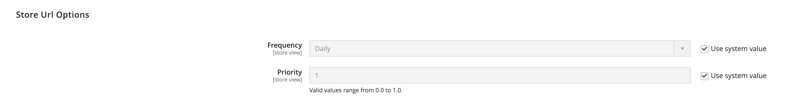

# サイトマップ

サイト マップを使用すると、検索エンジンによるストアのインデックス作成方法が向上し、Web クローラーによって見落とされる可能性のあるページを検索できます。 サイトマップは、すべてのページと画像のインデックスを作成するように設定できます。

有効にすると、Commerceでという名前のファイルが作成されます `sitemap.xml` は、指定した場所にインストールされて保存されます。 この設定を使用すると、更新の頻度や、各タイプのコンテンツの優先度を設定できます。 サイトマップは、サイト上のコンテンツが変更される頻度に合わせて更新する必要があります（日単位、週単位、月単位など）。

サイトが開発中の場合は、に手順を記載することができます。 `robots.txt` サイトのインデックス作成を回避するための web クローラー用ファイル。 その後、ローンチの前に手順を変更して、サイトのインデックスを作成できます。

技術情報については、を参照してください [サイトマップと robots.txt の追加][1] が含まれる _クラウドインフラストラクチャー上のCommerce ガイド_.

{width="700" zoomable="yes"}

## 手順 1. サイトマップの設定

を完了する [XML サイトマップ設定](#site-map-configuration) 含める内容と、サイトマップを更新する頻度を決定します。

## 手順 2. サイトマップを生成

1. 日 _Admin_ メニュー、に移動 **[!UICONTROL Marketing]** > _[!UICONTROL SEO & Search]_>**[!UICONTROL Site Map]**.

1. クリック **[!UICONTROL Add Site Map]**.

   {width="700" zoomable="yes"}

1. サイトマップを入力 **[!UICONTROL Filename]**. 例： `sitemap.xml`

1. を入力 **[!UICONTROL Path]** サイト マップ ファイルが存在するサーバー上の場所を特定します。 パスが書き込み可能であることを確認します。

   - `/sitemap/`  – というディレクトリにサイト マップ ファイルを配置します _サイトマップ_.

   - `/` - サイトマップファイルをCommerce インストールのベースパス（ルート）に配置します。

   {width="600" zoomable="yes"}

1. 完了したら、 **[!UICONTROL Save & Generate]**.

   サイト マップがグリッドに表示されるまでに数分かかる場合があります。

## 手順 3. robots.txt の設定と有効化（オプション）

を完了する [検索エンジンロボット](seo-overview.md#search-engine-robots) インデックスを作成するサイトの部分を検索エンジンがクロールするように指示する指示を含む構成。

## 手順 4. 検索エンジンにサイトマップを送信

次へのリンクを指定することで、様々な検索エンジンにサイトマップを送信できます `sitemap.xml` Commerceのインストール先のファイル。 リンクをコピーするには、次の手順を実行します。

1. が含まれる _サイトマップ_ リストで、 **[!UICONTROL Link for Google]** 列。

1. メニューで、を選択します **[!UICONTROL Copy Link Address]**.

詳しくは、特定の検索エンジンの手順を参照してください。 上位 2 つの検索エンジンの手順へのリンクを次に示します。

- [Google][2]
- [Microsoft®Bing][3]

## ステップ 5：以前のロボットの指示を復元する（オプション）

元の（デフォルトの）制限のいずれかを復元できるようになりました。

## 複数の Web サイトのサイトマップと robots.txt の管理

複数の web サイトがある場合は、サイトマップの作成と送信のプロセスを簡素化できます。 簡単に [作成](#site-map-configuration) 検証済みのすべてのストアの URL を含んだ 1 つ以上のサイトマップで、サイトマップを 1 つの場所に保存します。 すべてのサイトを次で検証する必要があります [Google検索コンソール](https://support.google.com/webmasters/answer/7451001).

マルチストアインスタンス用のサイトマップを作成するには、次の手順を実行します。

1. というフォルダーを作成します。 `sitemaps` web サイトのルートに、各ドメインのサブフォルダーを作成します。

       /sitemaps/domain_1/
       /sitemaps/domain_2/
   
1. 日 _Admin_ サイドバー、に移動 **[!UICONTROL Marketing]** > _[!UICONTROL SEO & Search]_>**[!UICONTROL Site Map]**.

1. 各ストアのサイトマップのリストを作成または編集し、 **[!UICONTROL Path]** ストア用に作成したノードに対して、次の操作を行います。

   `/sitemaps/domain_1/`
   `/sitemaps/domain_2/`

1. 必要に応じて、robots.txt ファイルを更新します。

   検索エンジンスパイダーが新しいサイトマップに正しく誘導されていることを確認するには、robots.txt ファイルを更新または作成します。 次の行を上部に追加します。

       Web サイトマップ
       サイトマップ：https://www.domain_1.com/sitemaps/domain_1/sitemap.xml
       サイトマップ：https://www.domain_2.com/sitemaps/domain_2/sitemap.xml
   
>[!NOTE]
>
>サイトでを使用している場合 [Apache](https://experienceleague.adobe.com/docs/commerce-operations/installation-guide/prerequisites/web-server/apache.html) web サーバーエンジン。を更新してください [`.htaccess`](https://httpd.apache.org/docs/current/howto/htaccess.html) web サイトのルートにファイルを作成して、その他のサイトマップ要求を適切な場所に誘導します。

## 列の説明

| 列 | 説明 |
|------|-----------|
| [!UICONTROL ID] | 現在のサイト マップの順次レコード番号。 |
| [!UICONTROL Filename] | サイト マップのファイル名。 |
| [!UICONTROL Path] | サイト マップがサーバー上に存在する場所。 例：  `/sitemap/`  – というディレクトリにサイト マップ ファイルを配置します _サイトマップ_（Commerce インストールのルートの 1 レベル下）。  `/` - サイトマップファイルをCommerce インストールのベースパス（ルート）に配置します。 |
| [!UICONTROL Link for Google] | Googleおよびその他の検索エンジンに送信されるサイトマップの URL。 |
| [!UICONTROL Last Generated] | サイト マップが最後に生成された日時を示します。 |
| [!UICONTROL Store View] | サイトマップが適用されるストア表示。 |
| [!UICONTROL Generate] | サイトマップを再生成します。 |

{style="table-layout:auto"}

## サイトマップの設定

サイトマップは、サイト上のコンテンツが変更される頻度（日単位、週単位、月単位のいずれか）で更新する必要があります。 設定では、コンテンツのタイプごとに頻度と優先度を設定できます。

### 手順 1. コンテンツ更新の頻度と優先度を設定する

1. 日 _Admin_ サイドバー、に移動 **[!UICONTROL Stores]** > _[!UICONTROL Settings]_>**[!UICONTROL Configuration]**.

1. 左側のパネルで、を展開します **[!UICONTROL Catalog]** を選択します **[!UICONTROL XML Sitemap]**.

1. を展開  この **[!UICONTROL Categories Options]** を選択し、次の操作を実行します。

   >[!NOTE]
   >
   >必要に応じて、 **[!UICONTROL Use system value]** これらの設定を変更するチェックボックス。

   - を設定 **[!UICONTROL Frequency]** を次のいずれかに変更します。

      - `Always`
      - `Hourly`
      - `Daily`
      - `Weekly`
      - `Monthly`
      - `Yearly`
      - `Never`

   - の場合 **[!UICONTROL Priority]**&#x200B;の値を入力してください `0.0` および `1.0`. 優先順位が最も低いのはゼロです。

   {width="600" zoomable="yes"}

   これらのオプションの詳細なリストについては、を参照してください [カテゴリオプション](../configuration-reference/catalog/xml-sitemap.md#categories-options) が含まれる _設定リファレンス_.

1. を展開  この **[!UICONTROL Products Options]** 「」セクションを選択して、 **[!UICONTROL Frequency]** および **[!UICONTROL Priority]** 必要に応じて設定します。

   これらのオプションの詳細なリストについては、を参照してください [製品オプション](../configuration-reference/catalog/xml-sitemap.md#products-options) が含まれる _設定リファレンス_.

1. サイトマップに画像を含める範囲を決定するには、を設定します **[!UICONTROL Add Images into Sitemap]** を次のいずれかに変更します。

   - `None`
   - `Base Only`
   - `All`

   {width="600" zoomable="yes"}

1. を展開  この **[!UICONTROL CMS Pages Options]** 「」セクションを選択して、 **[!UICONTROL Frequency]** および **[!UICONTROL Priority]** 必要に応じて設定します。

   {width="600" zoomable="yes"}

   これらのオプションの詳細なリストについては、を参照してください [CMS ページオプション](../configuration-reference/catalog/xml-sitemap.md#cms-pages-options) が含まれる _設定リファレンス_.

1. を展開  この **[!UICONTROL Store Url Options]** 「」セクションを選択して、 **[!UICONTROL Frequency]** および **[!UICONTROL Priority]** 必要に応じて設定します。

   {width="600" zoomable="yes"}

   これらのオプションの詳細なリストについては、を参照してください [Url オプションの保存](../configuration-reference/catalog/xml-sitemap.md#store-url-options) が含まれる _設定リファレンス_.

1. 完了したら、 **[!UICONTROL Save Config]**.

### 手順 2. 生成の設定を完了

1. を展開  この **[!UICONTROL Generation Settings]** セクション。

   必要に応じて、 **システム値を使用** これらの設定を変更するチェックボックス。

   {width="600" zoomable="yes"}

   これらのオプションの詳細なリストについては、を参照してください [生成設定](../configuration-reference/catalog/xml-sitemap.md#generation-settings) が含まれる _設定リファレンス_.

1. サイトマップを生成するには、を設定します **[!UICONTROL Enabled]** 対象： `Yes` 次の手順を実行します。

   - を設定 **[!UICONTROL Start Time]** サイトマップを更新する時、分、秒。

   - を設定 **[!UICONTROL Frequency]** を次のいずれかに変更します。

      - `Daily`
      - `Weekly`
      - `Monthly`

   - の場合 **[!UICONTROL Error Email Recipient]**&#x200B;で、サイトマップの更新中にエラーが発生した場合に通知を受け取るユーザーのメールアドレスを入力します。

   - を設定 **[!UICONTROL Error Email Sender]** をエラー通知の送信者として表示される店舗連絡先に送信します。

   - を設定 **[!UICONTROL Error Email Template]** をエラー通知に使用されるテンプレートに追加します。

### 手順 3. サイトマップファイル制限の設定

1. を展開  この **[!UICONTROL Sitemap File Limits]** セクション。

   {width="600" zoomable="yes"}

   これらのオプションの詳細なリストについては、を参照してください [サイトマップファイルの制限](../configuration-reference/catalog/xml-sitemap.md#sitemap-file-limits) が含まれる _設定リファレンス_.

1. の場合 **[!UICONTROL Maximum No of URLs per File]**&#x200B;に設定し、サイトマップに含めることができる URL の最大数を入力します。

   デフォルトの上限は 50,000 です。

1. の場合 **[!UICONTROL Maximum File Size]**&#x200B;サイトマップに割り当てる最大サイズ（バイト単位）を入力します。

   デフォルトのサイズは 10,485,760 バイトです。

### 手順 4. 検索エンジン送信設定の指定

1. を展開  この **[!UICONTROL Search Engine Submission Settings]** セクション。

   {width="600" zoomable="yes"}

1. を使用する場合 `robots.txt` ファイル サイトをクロールする検索エンジンに指示を提供するには、次のように設定します **[!UICONTROL Enable Submission to Robots.txt]** 対象： `Yes`.

1. 完了したら、 **[!UICONTROL Save Config]**.

[1]: https://experienceleague.adobe.com/docs/commerce-cloud-service/user-guide/configure-store/robots-sitemap.html
[2]: https://support.google.com/webmasters/answer/183669?hl=en
[3]: https://www.bing.com/webmasters/help/Sitemaps-3b5cf6ed
