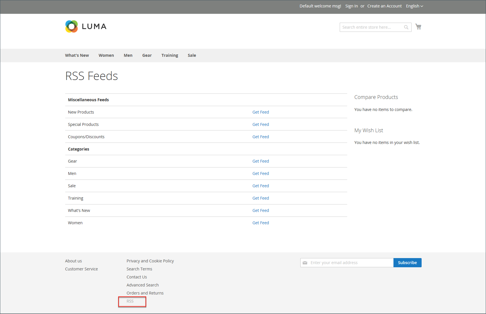

# ソーシャルメディアとRSS フィード

多くのマーチャントは、ブランドや商品の認知度を高めるために、ソーシャルメディアやその他のデジタルツールを利用しています。 Marketplace拡張機能をインストールするか、コンテンツページにプラグインを追加することで、ストアをソーシャルネットワークと統合できます。 RSS フィードを利用して、商品情報をショッピング集計サイトに公開したり、ニュースレターに掲載したりできます。 顧客はRSS フィードを購読して、新製品やプロモーションについて学習できます。

## ソーシャルネットワーク

[Marketplace拡張機能](../getting-started/commerce-marketplace.md)をインストールすると、ストアをソーシャルネットワークに接続できます。 さらに、CMS ブロックに&#x200B;_いいね_ ボタンなどのソーシャルプラグインを簡単に追加でき、ストア全体のページに組み込むことができます。

ソーシャルネットワーキングサイトには、ストアに簡単に追加できる多数のプラグインがあります。 また、Commerce Marketplaceには、ストアをソーシャルメディアと統合するために使用できる拡張機能が多数用意されています。 次の例は、Facebook _いいね_ ボタンをストアに追加する方法を示しています。

>[!NOTE]
>
>Adobe Commerceは、ネイティブの&#x200B;_Magento ソーシャル_ Facebook統合を削除し、拡張機能をサポートしなくなりました。 [Commerce Marketplace](https://marketplace.magento.com/catalogsearch/result/?q=Facebook){:target="_blank"}に移動して、Facebook統合用の代替拡張機能を見つけます。

### 手順1: ボタンコードを取得

1. Metaの開発者向けweb サイトで、[&#x200B; ボタンの設定](https://developers.facebook.com/docs/plugins/like-button) ページに移動します。

1. **[!UICONTROL URL to Like]**&#x200B;の場合は、ユーザーに&#x200B;_いいね_&#x200B;してもらいたいストア内のページのURLを入力します。

   例えば、ストアのホームページのURLを入力します。

1. ボタンの&#x200B;**[!UICONTROL Layout]**&#x200B;を選択します。

1. サイトでボタンと関連するテキストメッセージに使用できる&#x200B;**[!UICONTROL Width]**&#x200B;をピクセル単位で入力します。

1. **[!UICONTROL Action Type]**&#x200B;を次のいずれかに設定します：

   - `Like`
   - `Recommend`

1. **[!UICONTROL Get Code]**&#x200B;をクリックして、生成されたコードをクリップボードにコピーします。

### 手順2: コンテンツブロックの作成

1. ストア管理者に戻ります。

1. _管理者_ サイドバーで、**[!UICONTROL Content]** > _[!UICONTROL Elements]_>**[!UICONTROL Blocks]**&#x200B;に移動します。

1. 右上隅の「**[!UICONTROL Add New Block]**」をクリックします。

1. 内部参照用に記述的な&#x200B;**[!UICONTROL Block Title]**&#x200B;を入力します。

   例：`Facebook Like Button`。

1. ブロックに一意の&#x200B;**[!UICONTROL Identifier]**&#x200B;を割り当て、すべての小文字を使用し、スペースの代わりにアンダースコアを使用します。

   例：`facebook_like_button`。

1. Commerce インスタンスに複数のストアビューがある場合は、ブロックを利用できる各&#x200B;**[!UICONTROL Store View]**&#x200B;を選択します。

1. コンテンツツールに応じて、コードスニペットをブロックコンテンツに追加します。

   - [!DNL Page Builder]を使用する場合は、[HTML Code](../page-builder/html-code.md) ブロックをステージに追加し、Facebook サイトからコピーしたコードのスニペットを貼り付けます。 それ以外は、コードのスニペットを&#x200B;**[!UICONTROL Content]** ボックスに貼り付けます。

   - エディターで、Facebook サイトからコピーしたコードのスニペットを&#x200B;**[!UICONTROL Content]** ボックスに貼り付けます。

1. ブロックを公開する準備ができていない場合は、**[!UICONTROL Enable Block]**&#x200B;を`No`に設定します。

1. 完了したら、**[!UICONTROL Save Block]**&#x200B;をクリックします。

### 手順3: ブロックを配置する

1. コンテンツツールに応じて、ブロックを追加します。

   - [!UICONTROL Page Builder]を使用する場合は、手順に従って[&#x200B; ブロック &#x200B;](../page-builder/block.md)をステージに追加します。

   - _管理者_ サイドバーで、**[!UICONTROL Content]** > _[!UICONTROL Elements]_>**[!UICONTROL Widgets]**&#x200B;に移動します。

1. 右上隅の「**[!UICONTROL Add Widget]**」をクリックし、次の操作を行います。

   -  （Adobe Commerce B2Bでのみ利用可能）「_設定_」セクションで、**[!UICONTROL Type]**&#x200B;を`CMS Static Block`に設定し、**[!UICONTROL Continue]**&#x200B;をクリックします。

   - **[!UICONTROL Design Theme]**&#x200B;が現在のテーマに設定されていることを確認します。

   - **[!UICONTROL Continue]**&#x200B;をクリックします。

1. **[!UICONTROL Storefront Properties]** セクションで、次の操作を行います。

   - **[!UICONTROL Widget Title]**&#x200B;に、内部参照用のタイトルを入力します。

   - **[!UICONTROL Assign to Store Views]**&#x200B;を`All Store Views`に設定するか、アプリを利用できるビューに設定します。 複数のビューを選択するには、Ctrl キー（PC）またはCommand キー（Mac）を押しながら、各オプションをクリックします。

   - **[!UICONTROL Sort Order]** フィールドに数値を入力して、ブロックが割り当てられている場合に、そのブロックが他のコンテンツ要素と同じ場所に表示されるかどうかを判断します。 上の位置はゼロです。

1. _[!UICONTROL Layout Updates]_&#x200B;セクションで、**[!UICONTROL Add Layout Update]**&#x200B;をクリックし、**[!UICONTROL Display On]**&#x200B;をブロックを表示するカテゴリ、製品、またはページに設定します。

   例えば、`All Pages`を選択してヘッダーまたはフッターのいずれかにブロックを配置すると、そのブロックはストアのすべてのページで同じ場所に表示されます。

   ブロックを特定のページに配置するには、次の操作を行います。

   - **[!UICONTROL Display On]**&#x200B;を`Specified Page`に設定し、ブロックを表示する&#x200B;**[!UICONTROL Page]**&#x200B;を選択します。

   - **[!UICONTROL Block Reference]**&#x200B;を選択して、ブロックを配置するページ上の場所を特定します。

   - **[!UICONTROL Template]**&#x200B;の既定の設定を受け入れます。これは`CMS Static Block Default Template`に設定されています。

   - **[!UICONTROL Save and Continue Edit]**&#x200B;をクリックします。

1. 左側のパネルで、**[!UICONTROL Widget Options]**&#x200B;を選択します。

1. **[!UICONTROL Select Block…]**&#x200B;をクリックし、配置するブロックを選択します。

1. 完了したら、**[!UICONTROL Save]**&#x200B;をクリックします。

1. プロンプトが表示されたら、ワークスペースの上部にある手順に従って、インデックスとページキャッシュを更新します。

   ウィジェットが&#x200B;_[!UICONTROL Widgets]_&#x200B;リストに表示されます。

### 手順4: ストア内の場所の確認

ストアフロントに戻り、ブロックが正しい場所にあることを確認します。 ブロックを移動するには、別のページまたはブロック参照を試してウィジェットを再度開きます。

## RSS フィード

RSS （Really Simple Syndication）は、オンラインで情報を配信するために使用されるXML ベースのデータ形式です。 顧客はRSS フィードに登録して、新製品やプロモーションについて学習できます。 RSS フィードは、商品情報をショッピング集計サイトに公開するために使用したり、ニュースレターに含めたりすることもできます。

RSS フィードが有効になっている場合、製品、スペシャル、カテゴリー、クーポンへの追加は、各フィードのサブスクライバーに自動的に送信されます。 公開したすべてのRSS フィードへのリンクは、ストアのフッターにあります。

{width="100"} 

RSS フィードを読むために必要なソフトウェアはフィードリーダーと呼ばれ、見出し、ブログ、ポッドキャストなどを購読することができます。 Google Readerは、無料でオンラインで利用できる多くのフィードリーダーのひとつです。

{width="700" zoomable="yes"}

### RSS フィードを設定するメリット

- ストアまたはブログから最新のアップデートをダウンロードする
- 軽い広告
- 普通株式
- SEOの向上
- 売上の増加

### RSS フィードの種類

| RSS フィード | 説明 |
|--- |--- |
| [!UICONTROL Wish List] | 有効にすると、顧客の要望リストページの上部にRSS フィードのリンクが表示されます。 また、ウィッシュリスト共有ページには、共有ウィッシュリストのフィードへのリンクを含めることができるチェックボックスが含まれています。 |
| [!UICONTROL New Products] | カタログに追加された新製品の通知を公開します。 |
| [!UICONTROL Special Products] | 特別価格の商品の通知を公開します。 |
| [!UICONTROL Coupons / Discounts] | 店舗で利用可能な特別クーポンや割引の通知を公開します。 |
| [!UICONTROL Top Level Category] | 変更の通知をカタログの最上位カテゴリ構造に公開し、メインメニューに反映します。 |
| [!UICONTROL Customer Order Status] | RSS フィードで注文状況を追跡できます。 有効にすると、注文にRSS フィード リンクが表示されます。 |

{style="table-layout:auto"}

### ストアのRSS フィードの設定

1. _管理者_ サイドバーで、**[!UICONTROL Stores]** > _[!UICONTROL Settings]_>**[!UICONTROL Configuration]**&#x200B;に移動します。

1. 右上隅で、フィードを利用できるビューに&#x200B;**[!UICONTROL Store View]**&#x200B;を設定します。

   確認を求められた場合は、**[!UICONTROL OK]**&#x200B;をクリックします。

1. 左側のパネルで、**[!UICONTROL Catalog]**&#x200B;を展開し、**[!UICONTROL RSS Feeds]**&#x200B;を選択します。

1. **[!UICONTROL Rss Config]** セクションのを展開し、**[!UICONTROL Enable RSS]**&#x200B;を`Enable`に設定します。

   {width="600" zoomable="yes"}

   必要に応じて、**[!UICONTROL Use Default]** チェックボックスをオフにして、デフォルト値を変更します。

1. **[!UICONTROL Wish List]** セクションのを展開し、**[!UICONTROL Enable RSS]**&#x200B;を`Enable`に設定します。

1. **[!UICONTROL Catalog]** セクションのを展開し、必要に応じて他のフィードを`Enable`に設定します。

   - **[!UICONTROL New Products]**
   - **[!UICONTROL Special Products]**
   - **[!UICONTROL Coupons/Discounts]**
   - **[!UICONTROL Top Level Category]**

   {width="600" zoomable="yes"}

1. **[!UICONTROL Order]** セクションのを展開し、**[!UICONTROL Customer Order Status Notification]**&#x200B;を`Enable`に設定します。

1. 完了したら、**[!UICONTROL Save Config]**&#x200B;をクリックします。

1. ページ URLの最後に`/rss`が表示されたストアフロントの結果を参照してください。

