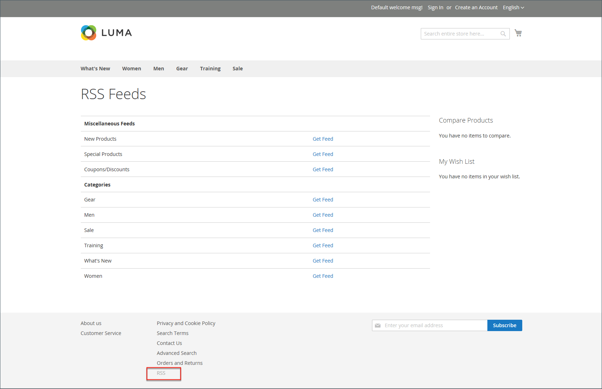

# ソーシャルメディアと RSS フィード

多くのマーチャントは、ソーシャルメディアやその他のデジタルツールを使用して、ブランドや製品の認知度を高めています。 Marketplace 拡張機能をインストールするか、コンテンツページにプラグインを追加することで、ストアをソーシャルネットワークと統合できます。 RSS フィードを使用すると、商品情報をショッピング集計サイトに発行したり、ニュースレターに含めたりできます。 お客様は RSS フィードを購読して、新製品やプロモーションについて知ることができます。

## ソーシャルネットワーク

ストアは、[Marketplace 拡張機能 ](../getting-started/commerce-marketplace.md) をインストールすることで、ソーシャルネットワークに接続できます。 さらに、ストア全体のページに組み込むことができる CMS ブロックに _類似_ ボタンなどのソーシャルプラグインを簡単に追加できます。

ソーシャルネットワーキングサイトには、ストアに簡単に追加できる多数のプラグインがあります。 また、Commerce Marketplace上には、ストアとソーシャルメディアを統合するために使用できる多くの拡張機能があります。 次の例では、「Facebook _いいね_」ボタンをストアに追加する方法を示しています。

>[!NOTE]
>
>Adobe Commerceは、ネイティブの _Magentoのソーシャル_ Facebook統合を削除し、拡張をサポートしなくなりました。 facebook統合の別の拡張機能を見つけるには、[Commerce Marketplace](https://marketplace.magento.com/catalogsearch/result/?q=Facebook){:target=&quot;_blank&quot;} に移動します。

### 手順 1. ボタンコードの取得

1. Meta developers web サイトで、[button setup](https://developers.facebook.com/docs/plugins/like-button) ページに移動します。

1. **[!UICONTROL URL to Like]**：ユーザーに _いいね_ してもらいたいストアのページの URL を入力します。

   例えば、ストアのホームページの URL を入力できます。

1. ボタンの **[!UICONTROL Layout]** を選択します。

1. ボタンおよび関連するテキストメッセージに対して、サイトで使用できる **[!UICONTROL Width]** をピクセル単位で入力します。

1. **[!UICONTROL Action Type]** を次のいずれかに設定します。

   - `Like`
   - `Recommend`

1. 「**[!UICONTROL Get Code]**」をクリックして、生成されたコードをクリップボードにコピーします。

### 手順 2. コンテンツブロックの作成

1. ストア管理者に戻ります。

1. _管理者_ サイドバーで、**[!UICONTROL Content]**/_[!UICONTROL Elements]_/**[!UICONTROL Blocks]**&#x200B;に移動します。

1. 右上隅の「**[!UICONTROL Add New Block]**」をクリックします。

1. 内部参照の説明 **[!UICONTROL Block Title]** を入力します。

   例：`Facebook Like Button`。

1. すべての小文字を使用し、スペースの代わりにアンダースコアを使用して、ブロックに一意の **[!UICONTROL Identifier]** を割り当てます。

   例：`facebook_like_button`。

1. Commerce インスタンスに複数のストア表示がある場合は、ブロックを使用できる **[!UICONTROL Store View]** を 1 つずつ選択します。

1. コンテンツツールに応じて、コードスニペットをブロックコンテンツに追加します。

   - [!DNL Page Builder] を使用する場合は、[HTMLコード ](../page-builder/html-code.md) ブロックをステージに追加し、Facebook サイトからコピーしたコードのスニペットを貼り付けます。 それ以外の場合は、コードのスニペットを **[!UICONTROL Content]** ボックスに貼り付けます。

   - エディターを使用して、Facebook サイトからコピーしたコードのスニペットを「**[!UICONTROL Content]**」ボックスに貼り付けます。

1. ブロックの運用を開始する準備が整っていない場合は、**[!UICONTROL Enable Block]** を `No` に設定します。

1. 完了したら、「**[!UICONTROL Save Block]**」をクリックします。

### 手順 3. ブロックを配置

1. コンテンツツールに応じて、ブロックを追加します。

   - [!UICONTROL Page Builder] を使用する場合は、手順に従ってステージに [ ブロックを追加 ](../page-builder/block.md) します。

   - _管理者_ サイドバーで、**[!UICONTROL Content]**/_[!UICONTROL Elements]_/**[!UICONTROL Widgets]**&#x200B;に移動します。

1. 右上隅の「**[!UICONTROL Add Widget]**」をクリックして、次の操作を行います。

   -  （Adobe Commerce B2B でのみ使用可能） _設定_ セクションで、**[!UICONTROL Type]** を `CMS Static Block` に設定し、**[!UICONTROL Continue]** をクリックします。

   - **[!UICONTROL Design Theme]** が現在のテーマに設定されていることを確認します。

   - 「**[!UICONTROL Continue]**」をクリックします。

1. **[!UICONTROL Storefront Properties]** セクションで、次の操作を行います。

   - **[!UICONTROL Widget Title]**：内部参照のタイトルを入力します。

   - **[!UICONTROL Assign to Store Views]** を `All Store Views` に設定するか、アプリを使用するビューに設定します。 複数のビューを選択するには、Ctrl キー（PC）または Command キー（Mac）を押したまま、各オプションをクリックします。

   - ブロックが他のコンテンツ要素とページ上の同じ場所に表示されるように割り当てられている場合は、**[!UICONTROL Sort Order]** フィールドに数値を入力してブロックの順序を決定します。 一番上の位置はゼロです。

1. [_[!UICONTROL Layout Updates]_] セクションで、[**[!UICONTROL Add Layout Update]**] をクリックし、ブロックを表示するカテゴリ、製品、またはページに&#x200B;**[!UICONTROL Display On]**&#x200B;を設定します。

   例えば、`All Pages` を選択してヘッダーまたはフッターにブロックを配置すると、そのブロックはストアのすべてのページの同じ場所に表示されます。

   特定のページにブロックを配置するには、次の手順を実行します。

   - **[!UICONTROL Display On]** を `Specified Page` に設定し、ブロックを表示する **[!UICONTROL Page]** を選択します。

   - **[!UICONTROL Block Reference]** を選択して、ブロックを配置するページ上の場所を指定します。

   - `CMS Static Block Default Template` に設定されている **[!UICONTROL Template]** のデフォルト設定を受け入れます。

   - 「**[!UICONTROL Save and Continue Edit]**」をクリックします。

1. 左側のパネルで「**[!UICONTROL Widget Options]**」を選択します。

1. **[!UICONTROL Select Block…]** をクリックし、配置するブロックを選択します。

1. 完了したら、「**[!UICONTROL Save]**」をクリックします。

1. プロンプトが表示されたら、ワークスペースの上部にある手順に従って、インデックスとページキャッシュを更新します。

   ウィジェットが _[!UICONTROL Widgets]_&#x200B;リストに表示されます。

### 手順 4. ストア内の場所の確認

ストアフロントに戻り、ブロックが正しい場所にあることを確認します。 ブロックを移動するには、別のページまたはブロック参照を試してウィジェットを再度開きます。

## RSS フィード

RSS （Really Simple Syndication）は、オンラインでの情報配信に使用される XML ベースのデータ形式です。 顧客は RSS フィードを購読して、新しい製品やプロモーションについて知ることができます。 また、RSS フィードを使用して、商品情報をショッピング集計サイトに発行したり、ニュースレターに含めることもできます。

RSS フィードを有効にすると、製品、スペシャル、カテゴリ、およびクーポンへの追加が各フィードの購読者に自動的に送信されます。 公開するすべての RSS フィードへのリンクが、ストアのフッターに表示されます。

{width="100"} 

RSS フィードを読み取るために必要なソフトウェアはフィード リーダーと呼ばれ、人々はヘッドライン、ブログ、ポッドキャストなどを購読できます。 Google Readerは、オンラインで無料で利用できる多くのフィードリーダーの 1 つです。

{width="700" zoomable="yes"}

### RSS フィードを設定する利点

- ストアまたはブログから最新の更新をダウンロードします
- 軽広告
- 普通株式
- SEO の向上
- 売上の増加

### RSS フィードの種類

| RSS フィード | 説明 |
|--- |--- |
| [!UICONTROL Wish List] | 有効化すると、顧客のウィッシュリストページの上部に RSS フィードリンクが表示されます。 また、ウィッシュリスト共有ページには、共有ウィッシュリストからのフィードへのリンクを含めることができるチェックボックスが含まれています。 |
| [!UICONTROL New Products] | カタログに追加された新製品の通知を公開します。 |
| [!UICONTROL Special Products] | 特別価格の製品に関する通知を公開します。 |
| [!UICONTROL Coupons / Discounts] | ストアで利用可能な特別なクーポンや割引の通知を公開します。 |
| [!UICONTROL Top Level Category] | カタログの最上位のカテゴリ構造に対する変更の通知を公開します。この通知は、メインメニューに反映されます。 |
| [!UICONTROL Customer Order Status] | 顧客が RSS フィードで注文の状態を追跡できるようにします。 有効化すると、RSS フィードリンクがオーダーに表示されます。 |

{style="table-layout:auto"}

### ストアの RSS フィードを設定する

1. _管理者_ サイドバーで、**[!UICONTROL Stores]**/_[!UICONTROL Settings]_/**[!UICONTROL Configuration]**&#x200B;に移動します。

1. 右上隅で、フィードを使用できるビューに **[!UICONTROL Store View]** を設定します。

   確認を求めるメッセージが表示されたら、「**[!UICONTROL OK]**」をクリックします。

1. 左側のパネルで「**[!UICONTROL Catalog]**」を展開し、「**[!UICONTROL RSS Feeds]**」を選択します。

1. 「 「**[!UICONTROL Rss Config]**」セクションを展開し、「**[!UICONTROL Enable RSS]**」を「`Enable`」に設定します。

   {width="600" zoomable="yes"}

   必要に応じて、「**[!UICONTROL Use Default]**」チェックボックスをオフにして、デフォルト値を変更します。

1. 「 「**[!UICONTROL Wish List]**」セクションを展開し、「**[!UICONTROL Enable RSS]**」を「`Enable`」に設定します。

1. 必要に応じて、「」セクションを展開し、他のフィードを `Enable` に設定し **[!UICONTROL Catalog]** す。

   - **[!UICONTROL New Products]**
   - **[!UICONTROL Special Products]**
   - **[!UICONTROL Coupons/Discounts]**
   - **[!UICONTROL Top Level Category]**

   {width="600" zoomable="yes"}

1. 「 「**[!UICONTROL Order]**」セクションを展開し、「**[!UICONTROL Customer Order Status Notification]**」を「`Enable`」に設定します。

1. 完了したら、「**[!UICONTROL Save Config]**」をクリックします。

1. ページ URL の末尾に `/rss` を付けた結果をストアフロントで確認します。

