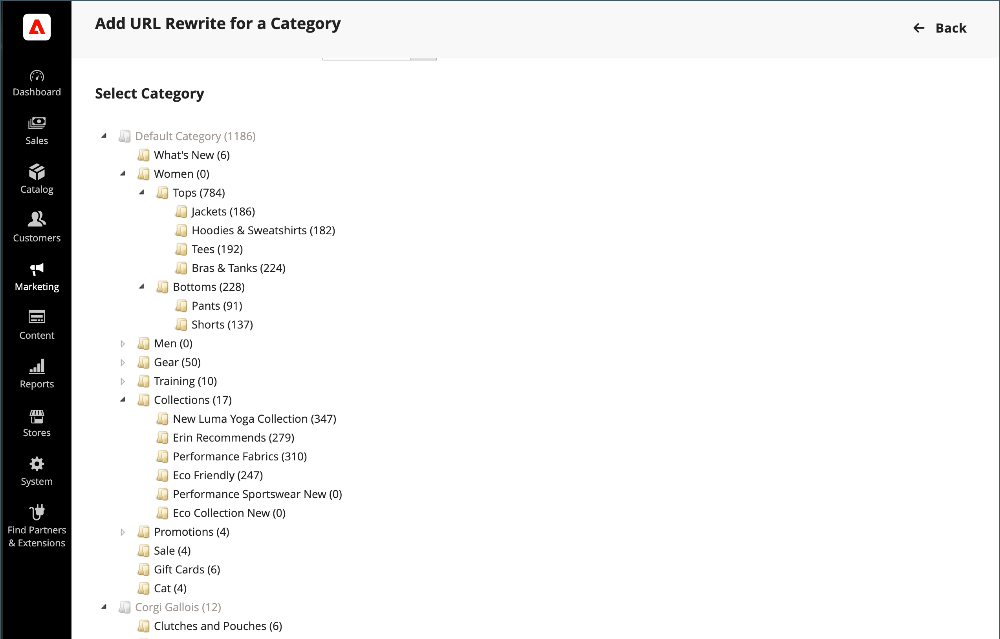
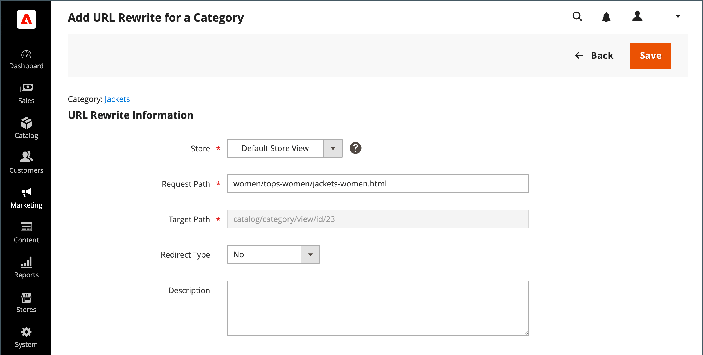

# カテゴリ URLの書き換え

カテゴリがカタログから削除された場合は、カテゴリの書き換えを使用して、ストア内の別のカテゴリのURLにリンクをリダイレクトできます。 _target_ / _元のリクエスト_&#x200B;または&#x200B;_リダイレクト先_ / _リダイレクト先_&#x200B;を考えてみましょう。 人々は、検索エンジンや古いリンクから以前のページに移動する可能性はありますが、このリダイレクトにより、ストアは新しいターゲットに切り替わります。

ストアで[自動リダイレクト &#x200B;](url-redirect-product-automatic.md)が有効になっている場合、カテゴリ [URL キー](../catalog/catalog-urls.md)が変更されたときに書き換えを作成する必要はありません。

{{url-rewrite-skip}}

## 手順1: 書き換えの計画

間違いを避けるには、_リダイレクトから_ パスと&#x200B;_リダイレクトから_ パスを書き留め、URL キーとサフィックス （該当する場合）を含めます。

不明な場合は、ストアの各カテゴリーページを開き、ブラウザーのアドレスバーからパスをコピーします。

**例：**

次にリダイレクト：`gear/backpacks-and-bags.html`

`gear/bags.html`からリダイレクト

## 手順2: 書き換えを作成

{{url-rewrite-params}}

1. _管理者_ サイドバーで、**[!UICONTROL Marketing]** > _[!UICONTROL SEO & Search]_>**[!UICONTROL URL Rewrites]**&#x200B;に移動します。

1. 続行する前に、次の手順を実行して、リクエストパスが使用可能であることを確認します。

   - **[!UICONTROL Request Path]**&#x200B;列の上部にある検索フィルターで、リダイレクトするカテゴリのURL キーを入力し、**[!UICONTROL Search]**&#x200B;をクリックします。

   - ページに複数のリダイレクトレコードがある場合は、該当するストアビューに一致するレコードを見つけ、編集モードでリダイレクトレコードを開きます。

   - 右上隅の「**[!UICONTROL Delete]**」をクリックします。 プロンプトが表示されたら、**[!UICONTROL OK]**&#x200B;をクリックして確認します。

1. _[!UICONTROL URL Rewrites]_&#x200B;ページに戻ったら、**[!UICONTROL Add URL Rewrite]**&#x200B;をクリックします。

1. **[!UICONTROL Create URL Rewrite]**&#x200B;を`For category`に設定し、リダイレクトの宛先であるツリー内のターゲットカテゴリを選択します。

   {width="700" zoomable="yes"}

1. 「_URL書き換え_」セクションで、次の操作を行います。

   - 複数のストアがある場合は、書き換えが適用される&#x200B;**[!UICONTROL Store]**&#x200B;を選択します。

   - **[!UICONTROL Request Path]**&#x200B;に、顧客が要求するカテゴリのURL キーを入力します。 これは、_カテゴリからの_ リダイレクトです。

     >[!NOTE]
     >
     >リクエストパスは、指定されたストアに対して一意である必要があります。 同じリクエストパスを使用するリダイレクトが既に存在する場合、リダイレクトを保存しようとするとエラーが表示されます。 前のリダイレクトは、作成する前に削除する必要があります。

   - **[!UICONTROL Redirect]**&#x200B;を次のいずれかに設定します：

      - `Temporary (302)`
      - `Permanent (301)`

   - 参照用に、書き換えの簡単な説明を入力します。

   {width="700" zoomable="yes"}のURL書き換えを追加

1. リダイレクトを保存する前に、次の点を確認してください。

   - 左上隅のリンクには、ターゲットカテゴリの名前が表示されます。
   - リクエストパスには、元の&#x200B;_カテゴリからの_ リダイレクトのパスが含まれています。

1. 完了したら、**[!UICONTROL Save]** ボタンをクリックします。

   新しいカテゴリの書き換えは、URLの書き換えグリッドの上部に表示されます。

## 手順3: 結果のテスト

1. ストアのホームページに移動します。

1. 次のいずれかの操作を行います。

   - 元の&#x200B;_カテゴリからの_ リダイレクトに移動します。
   - ブラウザーのアドレスバーで、ストア URLの直後に元の&#x200B;_リダイレクト元_ カテゴリへのパスを入力し、**[!UICONTROL Enter]**&#x200B;を押します。

   元のカテゴリリクエストの代わりに、新しいターゲットカテゴリが表示されます。

## フィールドの説明

| フィールド | 説明 |
|--- |--- |
| [!UICONTROL Create URL Rewrite] | 書き換えの種類を示します。 書き換え作成後にタイプを変更することはできません。 オプション：`Custom` / `For category` / `For product` / `For CMS page` |
| [!UICONTROL Request Path] | リダイレクトするカテゴリ。 設定に応じて、リクエストパスには、.htmlまたは.htm サフィックスと親カテゴリが含まれる場合があります。 リクエストパスは一意である必要があり、別のリダイレクトで使用することはできません。 リクエストパスが存在するというエラーが表示された場合は、既存のリダイレクトを削除して、もう一度試してください。 |
| [!UICONTROL Target Path] | システムがリダイレクトの宛先を指すために使用する内部パス。 ターゲットパスはグレー表示され、編集できません。 |
| [!UICONTROL Redirect] | リダイレクトのタイプを指定します。 オプション： **[!UICONTROL No]**- リダイレクトが指定されていません。 多くのオペレーションでは、このタイプのリダイレクトリクエストを作成します。 例えば、商品をカテゴリに追加するたびに、`No` タイプのリダイレクトが各ストアビューに作成されます。 **[!UICONTROL Temporary (302)]** – 書き換えが期間限定であることを検索エンジンに示します。 検索エンジンは通常、一時的な書き換え用のページランク情報を保持しません。 **[!UICONTROL Permanent (301)]**– 書き換えが永続的であることを検索エンジンに示します。 検索エンジンは、通常、永続的な書き換えに使用するページランク情報を保持します。 |
| [!UICONTROL Description] | 内部参照用に書き換える目的を説明します。 |

{style="table-layout:auto"}
