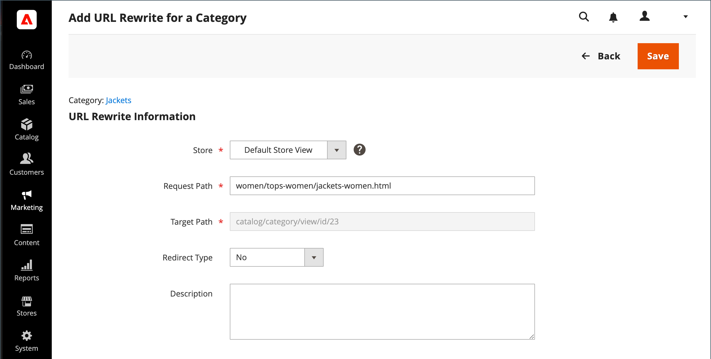

# カテゴリ URL の書き換え

カテゴリがカタログから削除された場合は、カテゴリの書き換えを使用して、ストア内の別のカテゴリの URL へのリンクをリダイレクトできます。 考え方を _ターゲット_ / _オリジナルリクエスト_  または _リダイレクト_ / _リダイレクト_. ユーザーは引き続き検索エンジンや古いリンクから前のページに移動する可能性がありますが、リダイレクトによってストアが新しいターゲットに切り替わります。

次の場合 [自動リダイレクト](url-redirect-product-automatic.md) がストアに対して有効になっているので、カテゴリが [URL キー](../catalog/catalog-urls.md) が変更されました。

{{url-rewrite-skip}}

## 手順 1. 書き換えの計画

間違いを避けるには、 _リダイレクト_ パスと _リダイレクト_ パスおよび URL キーおよびサフィックスを含めます（該当する場合）。

不明な場合は、ストアの各カテゴリページを開き、ブラウザーのアドレスバーからパスをコピーします。

**例：**

リダイレクト先： `gear/backpacks-and-bags.html`

リダイレクト元： `gear/bags.html`

## 手順 2. 書き換えの作成

{{url-rewrite-params}}

1. 次の日： _管理者_ サイドバー、移動 **[!UICONTROL Marketing]** > _[!UICONTROL SEO & Search]_>**[!UICONTROL URL Rewrites]**.

1. 続行する前に、次の手順を実行して、リクエストパスが使用可能であることを確認します。

   - 」をクリックします。 **[!UICONTROL Request Path]** 列で、リダイレクトするカテゴリの URL キーを入力し、 **[!UICONTROL Search]**.

   - ページに複数のリダイレクトレコードがある場合は、該当するストアビューに一致するリダイレクトレコードを探し、編集モードでリダイレクトレコードを開きます。

   - 右上隅で、 **[!UICONTROL Delete]**. プロンプトが表示されたら、「 **[!UICONTROL OK]** をクリックして確定します。

1. 次の場合に、 _[!UICONTROL URL Rewrites]_ページ、クリック&#x200B;**[!UICONTROL Add URL Rewrite]**.

1. 設定 **[!UICONTROL Create URL Rewrite]** から `For category` ツリー内で、リダイレクト先のターゲットカテゴリを選択します。

   {width="700" zoomable="yes"}

1. Adobe Analytics の _URL の書き換え_ セクションで、以下の操作を実行します。

   - 複数の店舗がある場合は、 **[!UICONTROL Store]** ここで、書き換えが適用されます。

   - の場合 **[!UICONTROL Request Path]**」で、顧客がリクエストするカテゴリの URL キーを入力します。 これが _リダイレクト_ カテゴリ。

     >[!NOTE]
     >
     >リクエストパスは、指定したストアに対して一意である必要があります。 同じリクエストパスを使用するリダイレクトが既に存在する場合、リダイレクトを保存しようとするとエラーが表示されます。 以前のリダイレクトを作成する前に、削除する必要があります。

   - 設定 **[!UICONTROL Redirect]** を次のいずれかに変更します。

      - `Temporary (302)`
      - `Permanent (301)`

   - 参照用に、書き換えの簡単な説明を入力します。

   {width="700" zoomable="yes"}

1. リダイレクトを保存する前に、以下を確認します。

   - 左上隅のリンクには、ターゲットカテゴリの名前が表示されます。
   - リクエストパスには、元の _リダイレクト_ カテゴリ。

1. 完了したら、「 **[!UICONTROL Save]** 」ボタンをクリックします。

   「 URL の書き換え」グリッドの上部に、新しいカテゴリの書き換えが表示されます。

## 手順 3. 結果をテストする

1. ストアのホームページに移動します。

1. 次のいずれかの操作を行います。

   - 元のページに移動 _リダイレクト_ カテゴリ。
   - ブラウザーのアドレスバーに、元の _リダイレクト_ category をストア URL の直後に追加し、 **[!UICONTROL Enter]**.

   元のカテゴリリクエストの代わりに新しいターゲットカテゴリが表示されます。

## フィールドの説明

| フィールド | 説明 |
|--- |--- |
| [!UICONTROL Create URL Rewrite] | 書き換えのタイプを示します。 書き換えの作成後は、タイプを変更できません。 オプション： `Custom` / `For category` / `For product` / `For CMS page` |
| [!UICONTROL Request Path] | リダイレクトするカテゴリ。 設定に応じて、リクエストパスには、 .html または.htm サフィックスと親カテゴリが含まれます。 リクエストパスは一意である必要があり、別のリダイレクトで使用することはできません。 リクエストパスが存在するというエラーが表示された場合は、既存のリダイレクトを削除して、もう一度試してください。 |
| [!UICONTROL Target Path] | リダイレクト先を指すためにシステムで使用される内部パス。 ターゲットパスはグレー表示になっており、編集できません。 |
| [!UICONTROL Redirect] | リダイレクトのタイプを決定します。 オプション：  **[!UICONTROL No]**— リダイレクトが指定されていません。 多くの操作では、このタイプのリダイレクトリクエストが作成されます。 例えば、製品をカテゴリに追加するたびに、 `No` ストアビューごとにタイプが作成されます。 **[!UICONTROL Temporary (302)]**  — 書き換えが期間限定であることを検索エンジンに示します。 一般に、検索エンジンでは、一時的な書き換えのためにページのランク情報が保持されません。  **[!UICONTROL Permanent (301)]**— 書き換えが永続的であることを検索エンジンに示します。 通常、検索エンジンは、永続的な書き換えのためにページのランク情報を保持します。 |
| [!UICONTROL Description] | 内部参照用に書き換えの目的を記述します。 |

{style="table-layout:auto"}
