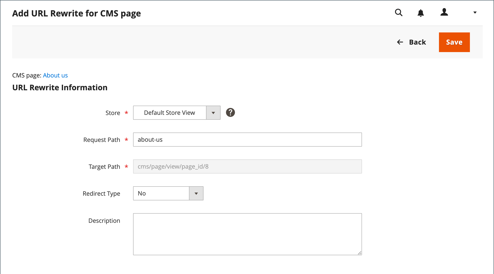

# コンテンツページ URL の書き換え

開始する前に、リダイレクトが達成することを正確に理解しておく必要があります。 考え方を _ターゲット_ / _ソース_ または _リダイレクト_ / _リダイレクト_. ユーザーは引き続き検索エンジンや古いリンクから前のページに移動する可能性がありますが、リダイレクトによってストアが新しいターゲットに切り替わります。

{width="700" zoomable="yes"}

## 手順 1. 書き換えの計画

間違いを避けるには、 _リダイレクト_ ページと _リダイレクト_ ページに貼り付けます。

不明な場合は、ストアの各ページを開き、ブラウザーのアドレスバーからパスをコピーします。

### CMS ページパス

リダイレクト先： `new-page`

リダイレクト元： `old-page`

## 手順 2. 書き換えの作成

{{url-rewrite-params}}

1. 次の日： _管理者_ サイドバー、移動 **[!UICONTROL Marketing]** > _[!UICONTROL SEO & Search]_>**[!UICONTROL URL Rewrites]**.

1. 続行する前に、次の手順を実行して、リクエストパスが使用可能であることを確認します。

   - 」をクリックします。 **[!UICONTROL Request Path]** 列で、リダイレクトするページの URL キーを入力し、 **[!UICONTROL Search]**.

   - ページに複数のリダイレクトレコードがある場合は、該当するストアビューと一致するレコードを探し、編集モードで開きます。

   - 右上隅で、 **[!UICONTROL Delete]**. プロンプトが表示されたら、「 **[!UICONTROL OK]** をクリックして確定します。

1. URL の書き換えページに戻ったら、 **[!UICONTROL Add URL Rewrite]**.

1. 設定 **[!UICONTROL Create URL Rewrite]** から `for CMS page`.

1. グリッドで新しいターゲットページを探し、編集モードで開きます。

   {width="700" zoomable="yes"}

1. 「 URL Rewrite Information 」で、以下の手順を実行します。

   - 複数のストアビューがある場合、 **[!UICONTROL Store]** ここで、書き換えが適用されます。

   - の場合 **[!UICONTROL Request Path]**」で、顧客がリクエストする元のページの URL キーを入力します。 これが _リダイレクト_ ページに貼り付けます。

     >[!NOTE]
     >
     >リクエストパスは、指定されたストアに対して一意である必要があります。 同じリクエストパスを使用するリダイレクトが既に存在する場合、リダイレクトを保存しようとするとエラーが表示されます。 以前のリダイレクトを作成する前に、削除する必要があります。

   - 設定 **[!UICONTROL Redirect]** を次のいずれかに変更します。

      - `Temporary (302)`
      - `Permanent (301)`

   - 参照用に、書き換えの簡単な説明を入力します。

   {width="600" zoomable="yes"}

1. リダイレクトを保存する前に、以下を確認します。

   - 左上隅のリンクには、ターゲットページの名前が表示されます。
   - リクエストパスには、元の _リダイレクト_ ページに貼り付けます。

1. 完了したら、「 **[!UICONTROL Save]**.

   リストの上部にあるグリッドに、新しい書き換えが表示されます。

## 手順 3. 結果をテストする

1. ストアのホームページに移動します。

1. 次のいずれかの操作を行います。

   - 元のページに移動 _リダイレクト_ ページに貼り付けます。
   - ブラウザーのアドレスバーに、元の名前を入力します。 _リダイレクト_ ページをストア URL の直後に開き、 **入力**.

   新しいターゲットページが、元のページリクエストの代わりに表示されます。

## フィールドの説明

| フィールド | 説明 |
|--- |--- |
| [!UICONTROL Create URL Rewrite] | 書き換えのタイプを示します。 書き換えの作成後は、タイプを変更できません。 オプション： `Custom` / `For category` / `For product` / `For CMS page` |
| [!UICONTROL Request Path] | リダイレクトする CMS ページ。 リクエストパスは一意である必要があり、別のリダイレクトで使用することはできません。 リクエストパスが存在するというエラーメッセージが表示された場合は、既存のリダイレクトを削除して、もう一度試してください。 |
| [!UICONTROL Target Path] | 宛先を指すためにシステムで使用される内部パス。 ターゲットパスはグレー表示になっており、編集できません。 |
| [!UICONTROL Redirect] | リダイレクトのタイプを決定します。 オプション：  **[!UICONTROL No]**— リダイレクトが指定されていません。 **[!UICONTROL Temporary (302)]**  — 書き換えが期間限定であることを検索エンジンに示します。 一般に、検索エンジンでは、一時的な書き換えのためにページのランク情報が保持されません。  **[!UICONTROL Permanent (301)]**— 書き換えが永続的であることを検索エンジンに示します。 通常、検索エンジンは、永続的な書き換えのためにページのランク情報を保持します。 |
| [!UICONTROL Description] | 内部参照用に書き換えの目的を記述します。 |

{style="table-layout:auto"}
