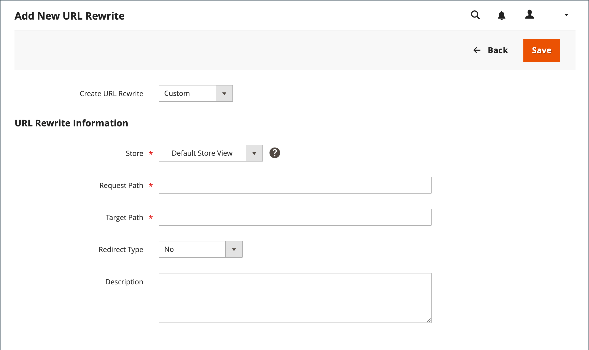

# カスタム URL の書き換え

カスタムの書き換えを使用して、ストアから外部 web サイトにページをリダイレクトするなど、その他のリダイレクトを管理できます。 例えば、2 つのCommerce web サイトがあり、それぞれに独自のドメインを持っている場合があります。 カスタムリダイレクトを使用すると、製品、カテゴリまたはページのリクエストを別の web サイトにリダイレクトできます。 他のリダイレクトタイプとは異なり、カスタムリダイレクトのターゲットは、ストア内の既存のページのリストから選択されません。

開始する前に、リダイレクトの目的を正確に理解しておく必要があります。 ～の観点から考える _ターゲット_ / _ソース_ または _リダイレクト：_ / _リダイレクト元_. 検索エンジンや古いリンクから以前のページに移動する場合もありますが、リダイレクトによってストアが新しいターゲットに切り替わります。

## 手順 1. 書き換えの計画

ミスを避けるために、 _リダイレクト：_ ページとの URL キー _リダイレクト元_ ページ。

不明な場合は各ページを開き、ブラウザーのアドレスバーから URL をコピーします。

**例**

リダイレクト：

    http://www.different-website.com/page.html

リダイレクト元：

    cms-page
    category.html
    category/subcategory.html
    product.html
    category/product.html

## 手順 2. 書き換えの作成

{{url-rewrite-params}}

1. 日 _Admin_ サイドバー、に移動 **[!UICONTROL Marketing]** > _[!UICONTROL SEO & Search]_>**[!UICONTROL URL Rewrites]**.

1. 続行する前に、次の手順を実行して、リクエストパスが使用可能であることを確認します。

   - 検索フィルターの上部にある **[!UICONTROL Request Path]** 列に、リダイレクトされるページの URL キーを入力し、をクリックします **[!UICONTROL Search]**.

   - ページに複数のリダイレクトレコードがある場合は、該当するストア表示に一致するものを見つけて、編集モードで開きます。

   - 右上隅のをクリックします。 **[!UICONTROL Delete]**. プロンプトが表示されたら、 **[!UICONTROL OK]** を確認します。

1. 「URL の書き換え」ページに戻ったら、 **[!UICONTROL Add URL Rewrite]**.

1. を設定 **[!UICONTROL Create URL Rewrite]** 対象： `Custom`.

   {width="600" zoomable="yes"}

1. [ URL 書き換え情報 ] で、次の操作を行います。

   - 複数のストア表示がある場合は、 **[!UICONTROL Store]** 書き換えが適用される場所。

   - の場合 **[!UICONTROL Request Path]**&#x200B;に、リダイレクトする製品、カテゴリまたは CMS ページの URL キーとパス（該当する場合）を入力します。

     >[!NOTE]
     >
     >リクエストパスは、指定したストアに対して一意である必要があります。 同じリクエストパスを使用するリダイレクトが既に存在する場合、リダイレクトを保存しようとするとエラーが発生します。 作成する前に、前のリダイレクトを削除する必要があります。

   - の場合 **[!UICONTROL Target Path]**：宛先の URL を入力します。 ターゲットが別の web サイト上にある場合は、完全修飾 URL を入力します。

   - を設定 **リダイレクト** を次のいずれかに変更します。

      - `Temporary (302)`
      - `Permanent (301)`

   - 参照用に、書き換えの簡単な説明を入力します。

1. リダイレクトを保存する前に、以下を確認してください。

   - この [!UICONTROL Request Path] には、元の URL キーまたはパスが含まれます _リダイレクト元_ ページ。
   - この [!UICONTROL Target Path] には、の URL が含まれます _リダイレクト：_ ページ。

1. 完了したら、 **[!UICONTROL Save]**.

   新しい書き換えが、リストの上部のグリッドに表示されます。

## 手順 3. 結果のテスト

1. ストアのホームページに移動します。

1. 次のいずれかの操作を行います。

   - オリジナルに移動します。 _リダイレクト元_ ページ。
   - ブラウザーのアドレスバーに、元の名前を入力します _リダイレクト元_ ストア URL の直後のページで、を押します。 **Enter**.

   元のページリクエストの代わりに、新しいターゲットページが表示されます。

## フィールドの説明

| フィールド | 説明 |
|--- |--- |
| [!UICONTROL Create URL Rewrite] | 書き換えのタイプを示します。 書き換えの作成後にタイプを変更することはできません。 オプション： `Custom` / `For category` / `For product` / `For CMS page` |
| [!UICONTROL Request Path] | リダイレクトされるページ。 リクエストパスは一意である必要があり、別のリダイレクトで使用することはできません。 リクエストパスが存在するというエラーメッセージが表示された場合は、既存のリダイレクトを削除してもう一度試してください。 |
| [!UICONTROL Target Path] | 宛先を指すためにシステムで使用される内部パス。 ターゲットパスは灰色表示になっており、編集できません。 |
| [!UICONTROL Redirect] | リダイレクトのタイプを決定します。 オプション：  **不可** - リダイレクトが指定されていません。  **[!UICONTROL Temporary (302)]**– 検索エンジンに対して、書き換えが期間限定であることを示します。 検索エンジンは通常、一時的な書き換えのページランク情報を保持しません。 **[!UICONTROL Permanent (301)]**  – 検索エンジンに対して、書き換えが永続的であることを示します。 検索エンジンでは通常、永続的な書き換えの際にページランク情報が保持されます。 |
| [!UICONTROL Description] | 内部参照用の書き換えの目的について説明します。 |

{style="table-layout:auto"}
