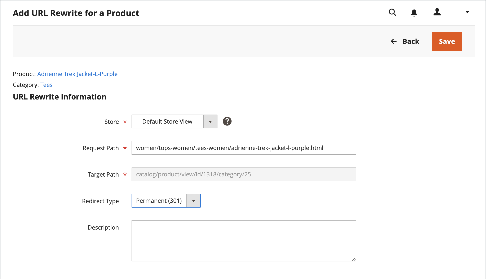

# 製品 URL の書き換え

開始する前に、リダイレクトの目的を正確に理解する必要があります。 _ターゲット_/_元のリクエスト_ または _リダイレクト_/_リダイレクト元_ を考慮します。 検索エンジンや古いリンクから以前のページに移動する場合もありますが、リダイレクトによってストアが新しいターゲットに切り替わります。

ストアで [ 自動リダイレクト ](url-redirect-product-automatic.md) が有効になっている場合、製品 [URL キー ](../catalog/catalog-urls.md) が変更されたときに書き換えを作成する必要はありません。

{{url-rewrite-skip}}

## 手順 1. 書き換えの計画

ミスを避けるために、_リダイレクト先_ パスと _リダイレクト元_ パスを書き留め、URL キーとサフィックス（該当する場合）を含めます。

不明な場合は、ストアで各製品ページを開き、ブラウザーのアドレスバーからパスをコピーします。 製品リダイレクトを作成する際に、[ カテゴリパス ](../catalog/catalog-urls.md) を含めるか除外するかを指定できます。 この例では、カテゴリパスのない製品リダイレクトを作成します。

### カテゴリパスを含む製品

「`gear/bags/impulse-duffle.html`」にリダイレクト。

リダイレクト元：`gear/bags/overnight-duffle.html`

### カテゴリパスのない製品

「`impulse-duffle.html`」にリダイレクト。

リダイレクト元：`overnight-duffle.html`

## 手順 2. 書き換えの作成

{{url-rewrite-params}}

1. _管理者_ サイドバーで、**[!UICONTROL Marketing]**/_[!UICONTROL SEO & Search]_/**[!UICONTROL URL Rewrites]**&#x200B;に移動します。

1. 続行する前に、次の手順を実行して、リクエストパスが使用可能であることを確認します。

   - **[!UICONTROL Request Path]** 列の上部にある検索フィルターで、リダイレクトするページの URL キーを入力し、「リダイレク **[!UICONTROL Search]**」をクリックします。

   - ページに複数のリダイレクトレコードがある場合は、該当するストア表示に一致するものを見つけて、編集モードで開きます。

   - 右上隅の「**[!UICONTROL Delete]**」をクリックします。 プロンプトが表示されたら、「**[!UICONTROL OK]**」をクリックして確認します。

1. URL 書き換えページの右上隅にある「**URL 書き換えを追加**」をクリックします。

1. **[!UICONTROL Create URL Rewrite]** を `For product` に設定します。

1. グリッドで、リダイレクトのターゲット（宛先）となる製品を見つけて、行をクリックします。

   {width="700" zoomable="yes"}

1. カテゴリツリーの下の「**[!UICONTROL Skip Category Selection]**」をクリックします。

   この例では、リダイレクトにカテゴリは含まれません。

   {width="600" zoomable="yes"}

   製品ページの URL 書き換えを追加では、左上隅にターゲットへのリンクが表示され、ターゲットパス フィールドにはパスのシステムバージョンが表示されますが、このバージョンは変更できません。 最初は、「リダイレクトパス」フィールドにもターゲットパスが表示されます。

   - 複数のストア表示がある場合、書き換えが適用されるビューに **[!UICONTROL Store]** を設定します。 それ以外の場合は、各ビューに対して書き換えが作成されます。

   - **[!UICONTROL Request Path]** しくは、元の製品リクエストの URL キーとサフィックス（該当する場合）を入力して、デフォルトを置き換えます。 これは、計画手順で特定した _リダイレクト元_ 製品です。

     >[!NOTE]
     >
     >リクエストパスは、指定したストアに対して一意である必要があります。 同じリクエストパスを使用するリダイレクトが既に存在する場合、リダイレクトを保存しようとするとエラーが発生します。 作成する前に、前のリダイレクトを削除する必要があります。

   - **[!UICONTROL Redirect Type]** を次のいずれかに設定します。

      - `Temporary (302)`
      - `Permanent (301)`

   - 参考までに、書き換えの簡単な **[!UICONTROL Description]** を入力します。

   {width="600" zoomable="yes"}

1. リダイレクトを保存する前に、以下を確認してください。

   - 左上隅のリンクには、ターゲット製品の名前が表示されます。
   - リクエストパスには、元の _リダイレクト元_ 製品のパスが含まれています。

1. 完了したら、「**[!UICONTROL Save]**」をクリックします。

   新しい製品の書き換えが、URL の書き換えグリッドの上部に表示されるようになりました。

## 手順 3. 結果のテスト

1. ストアのホームページに移動します。

1. 次のいずれかの操作を行います。

   - 元の _リダイレクト元_ 製品リクエストページに移動します。
   - ブラウザーのアドレスバーで、ストア URL の直後に元の _リダイレクト元_ 製品へのパスを入力し、**Enter** キーを押します。

   元の製品リクエストではなく、新しいターゲット製品が表示されます。

## フィールドの説明

| フィールド | 説明 |
|--- |--- |
| [!UICONTROL Create URL Rewrite] | 書き換えのタイプを示します。 書き換えの作成後にタイプを変更することはできません。 オプション：`Custom`/`For category`/`For product`/`For CMS page` |
| [!UICONTROL Request Path] | リダイレクトされる製品。 設定に応じて、リクエストパスには、`.html` または `.htm` のサフィックス、カテゴリが含まれる場合があります。 リクエストパスは一意であり、別のリダイレクトで使用することはできません。 リクエストパスが存在するというエラーが表示された場合は、既存のリダイレクトを削除してから再試行してください。 |
| [!UICONTROL Target Path] | リダイレクトの宛先を指すためにシステムで使用される内部パス。 ターゲットパスは灰色表示になっており、編集できません。 |
| [!UICONTROL Redirect] | リダイレクトのタイプを決定します。 オプション： **[!UICONTROL No]**- リダイレクトが指定されていません。 多くの操作では、このタイプのリダイレクトリクエストが作成されます。 例えば、商品をカテゴリに追加するたびに、`No` タイプのリダイレクトが各ストア表示に作成されます。 **[!UICONTROL Temporary (302)]** – 検索エンジンに対して、書き換えが期間限定であることを示します。 検索エンジンは通常、一時的な書き換えのページランク情報を保持しません。  **[!UICONTROL Permanent (301)]**– 検索エンジンに対して、書き換えが永続的であることを示します。 検索エンジンでは通常、永続的な書き換えの際にページランク情報が保持されます。 |
| [!UICONTROL Description] | 内部参照用の書き換えの目的について説明します。 |

{style="table-layout:auto"}

## 複数の URL の書き換え

次の手順を使用すると、複数またはすべての製品の URL 書き換えを同時にすばやく更新できます。

1. _管理者_ サイドバーで、**[!UICONTROL Catalog]**/**[!UICONTROL Products]** に移動します。

1. URL の書き換えを更新するすべての製品を選択します。

1. _[!UICONTROL Actions]_&#x200B;で、複数またはすべての書き換えを更新する&#x200B;**[!UICONTROL Update attributes]**&#x200B;を選択します。

1. _[!UICONTROL PRODUCTS INFORMATION]_&#x200B;の下の「**[!UICONTROL Websites]**」タブをクリックします。

1. 「_[!UICONTROL Add Product To Websites]_」セクションで、URL の書き換えを復元するすべての web サイトを選択します。

1. 更新の準備ができたら、「**[!UICONTROL Save]**」をクリックします。

>[!NOTE]
>
>選択したすべての製品が選択した web サイトに追加され、URL の書き換えが再生成されます。

{width="600" zoomable="yes"}
