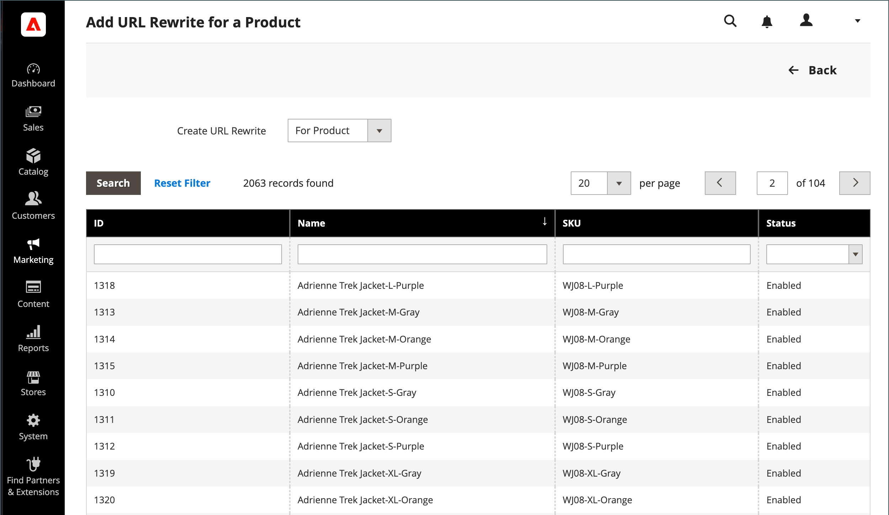
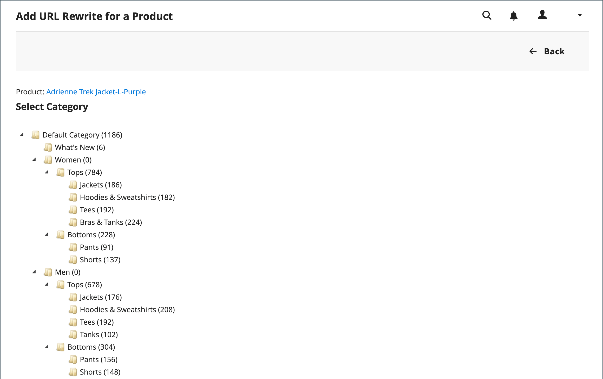
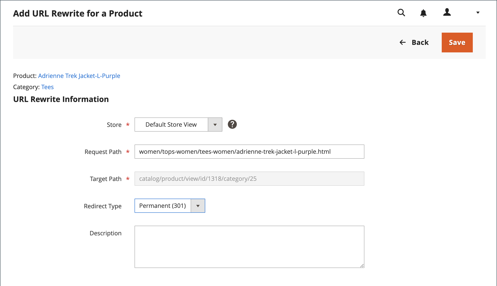
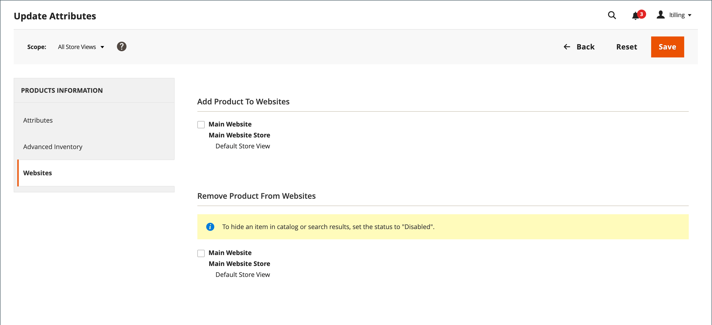

# 製品URLの書き換え

始める前に、リダイレクトで実行する必要があるものを正確に理解していることを確認してください。 _target_ / _元のリクエスト_&#x200B;または&#x200B;_リダイレクト先_ / _リダイレクト先_&#x200B;を考えてみましょう。 人々は、検索エンジンや古いリンクから以前のページに移動する可能性はありますが、このリダイレクトにより、ストアは新しいターゲットに切り替わります。

ストアで[自動リダイレクト ](url-redirect-product-automatic.md)が有効になっている場合、商品[URL キー](../catalog/catalog-urls.md)が変更されたときに書き換えを作成する必要はありません。

{{url-rewrite-skip}}

## 手順1: 書き換えの計画

間違いを避けるには、_リダイレクトから_ パスと&#x200B;_リダイレクトから_ パスを書き留め、URL キーとサフィックス （該当する場合）を含めます。

わからない場合は、ストアの各商品ページを開き、ブラウザーのアドレスバーからパスをコピーします。 製品リダイレクトを作成する場合、[ カテゴリパス ](../catalog/catalog-urls.md)を含めることも除外することもできます。 この例では、カテゴリーパスを使用せずに製品リダイレクトを作成します。

### カテゴリーパスを含む製品

次にリダイレクト：`gear/bags/impulse-duffle.html`

`gear/bags/overnight-duffle.html`からリダイレクト

### カテゴリーパスのない製品

次にリダイレクト：`impulse-duffle.html`

`overnight-duffle.html`からリダイレクト

## 手順2: 書き換えを作成

{{url-rewrite-params}}

1. _管理者_ サイドバーで、**[!UICONTROL Marketing]** > _[!UICONTROL SEO & Search]_>**[!UICONTROL URL Rewrites]**に移動します。

1. 続行する前に、次の手順を実行して、リクエストパスが使用可能であることを確認します。

   - **[!UICONTROL Request Path]**&#x200B;列の上部にある検索フィルターで、リダイレクトするページのURL キーを入力し、**[!UICONTROL Search]**&#x200B;をクリックします。

   - ページに複数のリダイレクトレコードがある場合は、該当するストアビューに一致するレコードを見つけて、編集モードで開きます。

   - 右上隅の「**[!UICONTROL Delete]**」をクリックします。 プロンプトが表示されたら、**[!UICONTROL OK]**&#x200B;をクリックして確認します。

1. URL書き換えページの右上隅にある「**URL書き換えを追加**」をクリックします。

1. **[!UICONTROL Create URL Rewrite]**&#x200B;を`For product`に設定します。

1. グリッドで、リダイレクトのターゲット（宛先）である製品を見つけて、行をクリックします。

   {width="700" zoomable="yes"}

1. カテゴリーツリーの下にある「**[!UICONTROL Skip Category Selection]**」をクリックします。

   この例では、リダイレクトにはカテゴリが含まれていません。

   {width="600" zoomable="yes"}

   製品ページの「URLの書き換えを追加」では、左上隅にターゲットへのリンクが表示され、「ターゲットパス」フィールドには変更できないパスのシステムバージョンが表示されます。 最初は、「リダイレクトパス」フィールドにもターゲットパスが表示されます。

   - 複数のストアビューがある場合は、書き換えが適用されるビューに&#x200B;**[!UICONTROL Store]**&#x200B;を設定します。 それ以外の場合は、ビューごとに書き換えが作成されます。

   - **[!UICONTROL Request Path]**&#x200B;の場合、元の製品リクエストのURL キーとサフィックス（該当する場合）を入力して、デフォルトを置き換えます。 これは、計画手順で特定した&#x200B;_製品からの_ リダイレクトです。

     >[!NOTE]
     >
     >リクエストパスは、指定されたストアに対して一意である必要があります。 同じリクエストパスを使用するリダイレクトが既に存在する場合、リダイレクトを保存しようとするとエラーが表示されます。 前のリダイレクトは、作成する前に削除する必要があります。

   - **[!UICONTROL Redirect Type]**&#x200B;を次のいずれかに設定します：

      - `Temporary (302)`
      - `Permanent (301)`

   - 自分で参照するには、書き換えの概要&#x200B;**[!UICONTROL Description]**&#x200B;を入力します。

   {width="600" zoomable="yes"}

1. リダイレクトを保存する前に、次の点を確認してください。

   - 左上隅のリンクには、ターゲット製品の名前が表示されます。
   - リクエストパスには、_製品からの元の_ リダイレクトのパスが含まれます。

1. 完了したら、**[!UICONTROL Save]**&#x200B;をクリックします。

   URL書き換えグリッドの上部に新しい製品の書き換えが表示されるようになりました。

## 手順3: 結果のテスト

1. ストアのホームページに移動します。

1. 次のいずれかの操作を行います。

   - 元の&#x200B;_製品リクエストページから_ リダイレクトに移動します。
   - ブラウザーのアドレスバーで、ストア URLの直後に&#x200B;_製品からの元の_ リダイレクトへのパスを入力し、**Enter**&#x200B;を押します。

   元の製品リクエストの代わりに、新しいターゲット製品が表示されます。

## フィールドの説明

| フィールド | 説明 |
|--- |--- |
| [!UICONTROL Create URL Rewrite] | 書き換えの種類を示します。 書き換え作成後にタイプを変更することはできません。 オプション：`Custom` / `For category` / `For product` / `For CMS page` |
| [!UICONTROL Request Path] | リダイレクトされる製品。 設定に応じて、リクエストパスには、`.html`または`.htm`のサフィックスとカテゴリが含まれる場合があります。 リクエストパスは一意である必要があり、別のリダイレクトで使用することはできません。 リクエストパスが存在するというエラーが表示された場合は、既存のリダイレクトを削除して、もう一度試してください。 |
| [!UICONTROL Target Path] | システムがリダイレクトの宛先を指すために使用する内部パス。 ターゲットパスはグレー表示され、編集できません。 |
| [!UICONTROL Redirect] | リダイレクトのタイプを指定します。 オプション： **[!UICONTROL No]**- リダイレクトが指定されていません。 多くのオペレーションでは、このタイプのリダイレクトリクエストを作成します。 例えば、商品をカテゴリに追加するたびに、`No` タイプのリダイレクトが各ストアビューに作成されます。 **[!UICONTROL Temporary (302)]** – 書き換えが期間限定であることを検索エンジンに示します。 検索エンジンは通常、一時的な書き換え用のページランク情報を保持しません。 **[!UICONTROL Permanent (301)]**– 書き換えが永続的であることを検索エンジンに示します。 検索エンジンは、通常、永続的な書き換えに使用するページランク情報を保持します。 |
| [!UICONTROL Description] | 内部参照用に書き換える目的を説明します。 |

{style="table-layout:auto"}

## 複数のURL書き換え

次の手順を使用して、複数またはすべての製品のURL書き換えを同時にすばやく更新できます。

1. _管理者_ サイドバーで、**[!UICONTROL Catalog]** > **[!UICONTROL Products]**&#x200B;に移動します。

1. URLの書き換えを更新する製品をすべて選択します。

1. _[!UICONTROL Actions]_で、**[!UICONTROL Update attributes]**を選択して、複数またはすべての書き換えを更新します。

1. _[!UICONTROL PRODUCTS INFORMATION]_で、「**[!UICONTROL Websites]**」タブをクリックします。

1. 「_[!UICONTROL Add Product To Websites]_」セクションで、URLの書き換えを復元するすべてのWeb サイトを選択します。

1. 更新する準備ができたら、**[!UICONTROL Save]**&#x200B;をクリックします。

>[!NOTE]
>
>選択したすべての製品が選択したweb サイトに読み込まれ、URLの書き換えが再生成されます。

{width="600" zoomable="yes"}
