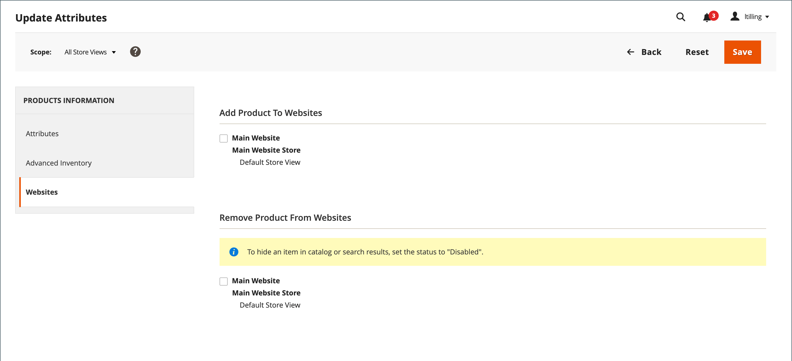

# 製品 URL の書き換え

開始する前に、リダイレクトの目的を正確に理解する必要があります。 ～の観点から考える _ターゲット_ / _元のリクエスト_ または _リダイレクト：_ / _リダイレクト元_. 検索エンジンや古いリンクから以前のページに移動する場合もありますが、リダイレクトによってストアが新しいターゲットに切り替わります。

次の場合 [自動リダイレクト](url-redirect-product-automatic.md) がストアで有効になっている場合、製品の作成時に書き換えを作成する必要はありません [URL キー](../catalog/catalog-urls.md) が変更されました。

{{url-rewrite-skip}}

## 手順 1. 書き換えの計画

間違いを避けるために、を書き留めます _リダイレクト：_ パスと _リダイレクト元_ パスを指定し、URL キーとサフィックス（該当する場合）を含めます。

不明な場合は、ストアで各製品ページを開き、ブラウザーのアドレスバーからパスをコピーします。 製品リダイレクトの作成時に、を含めるか除外するかを指定できます [カテゴリパス](../catalog/catalog-urls.md). この例では、カテゴリパスのない製品リダイレクトを作成します。

### カテゴリパスを含む製品

リダイレクト： `gear/bags/impulse-duffle.html`

リダイレクト元： `gear/bags/overnight-duffle.html`

### カテゴリパスのない製品

リダイレクト： `impulse-duffle.html`

リダイレクト元： `overnight-duffle.html`

## 手順 2. 書き換えの作成

{{url-rewrite-params}}

1. 日 _Admin_ サイドバー、に移動 **[!UICONTROL Marketing]** > _[!UICONTROL SEO & Search]_>**[!UICONTROL URL Rewrites]**.

1. 続行する前に、次の手順を実行して、リクエストパスが使用可能であることを確認します。

   - 検索フィルターの上部にある **[!UICONTROL Request Path]** 列に、リダイレクトするページの URL キーを入力し、クリックします **[!UICONTROL Search]**.

   - ページに複数のリダイレクトレコードがある場合は、該当するストア表示に一致するものを見つけて、編集モードで開きます。

   - 右上隅のをクリックします。 **[!UICONTROL Delete]**. プロンプトが表示されたら、 **[!UICONTROL OK]** を確認します。

1. URL の書き換えページの右上隅にある「」をクリックします。 **URL 書き換えの追加**.

1. を設定 **[!UICONTROL Create URL Rewrite]** 対象： `For product`.

1. グリッドで、リダイレクトのターゲット（宛先）となる製品を見つけて、行をクリックします。

   {width="700" zoomable="yes"}

1. カテゴリ ツリーの下で、 **[!UICONTROL Skip Category Selection]**.

   この例では、リダイレクトにカテゴリは含まれません。

   {width="600" zoomable="yes"}

   製品ページの URL 書き換えを追加では、左上隅にターゲットへのリンクが表示され、ターゲットパス フィールドにはパスのシステムバージョンが表示されますが、このバージョンは変更できません。 最初は、「リダイレクトパス」フィールドにもターゲットパスが表示されます。

   - 複数のストア表示がある場合、を設定します **[!UICONTROL Store]** を変更して、書き換えが適用されるビューに追加します。 それ以外の場合は、各ビューに対して書き換えが作成されます。

   - の場合 **[!UICONTROL Request Path]**：元の製品リクエストの URL キーとサフィックス（該当する場合）を入力して、デフォルトを置き換えます。 これはです _リダイレクト元_ 計画手順で特定した製品。

     >[!NOTE]
     >
     >リクエストパスは、指定したストアに対して一意である必要があります。 同じリクエストパスを使用するリダイレクトが既に存在する場合、リダイレクトを保存しようとするとエラーが発生します。 作成する前に、前のリダイレクトを削除する必要があります。

   - を設定 **[!UICONTROL Redirect Type]** を次のいずれかに変更します。

      - `Temporary (302)`
      - `Permanent (301)`

   - 参考のために、概要を入力してください **[!UICONTROL Description]** 書き換え

   {width="600" zoomable="yes"}

1. リダイレクトを保存する前に、以下を確認してください。

   - 左上隅のリンクには、ターゲット製品の名前が表示されます。
   - リクエストパスには、オリジナルの _リダイレクト元_ 製品。

1. 完了したら、 **[!UICONTROL Save]**.

   新しい製品の書き換えが、URL の書き換えグリッドの上部に表示されるようになりました。

## 手順 3. 結果のテスト

1. ストアのホームページに移動します。

1. 次のいずれかの操作を行います。

   - オリジナルに移動します。 _リダイレクト元_ 製品リクエストページ。
   - ブラウザーのアドレスバーに、元のアドレスへのパスを入力します _リダイレクト元_ ストア URL の直後にある製品で、を押します。 **Enter**.

   元の製品リクエストではなく、新しいターゲット製品が表示されます。

## フィールドの説明

| フィールド | 説明 |
|--- |--- |
| [!UICONTROL Create URL Rewrite] | 書き換えのタイプを示します。 書き換えの作成後にタイプを変更することはできません。 オプション： `Custom` / `For category` / `For product` / `For CMS page` |
| [!UICONTROL Request Path] | リダイレクトされる製品。 設定に応じて、リクエストパスには次が含まれる場合があります。 `.html` または `.htm` 接尾辞およびカテゴリ。 リクエストパスは一意であり、別のリダイレクトで使用することはできません。 リクエストパスが存在するというエラーが表示された場合は、既存のリダイレクトを削除してから再試行してください。 |
| [!UICONTROL Target Path] | リダイレクトの宛先を指すためにシステムで使用される内部パス。 ターゲットパスは灰色表示になっており、編集できません。 |
| [!UICONTROL Redirect] | リダイレクトのタイプを決定します。 オプション：  **[!UICONTROL No]**- リダイレクトが指定されていません。 多くの操作では、このタイプのリダイレクトリクエストが作成されます。 例えば、商品をカテゴリに追加するたびに、のリダイレクトが発生します `No` タイプは、ストア表示ごとに作成されます。 **[!UICONTROL Temporary (302)]**  – 検索エンジンに対して、書き換えが期間限定であることを示します。 検索エンジンは通常、一時的な書き換えのページランク情報を保持しません。  **[!UICONTROL Permanent (301)]**– 検索エンジンに対して、書き換えが永続的であることを示します。 検索エンジンでは通常、永続的な書き換えの際にページランク情報が保持されます。 |
| [!UICONTROL Description] | 内部参照用の書き換えの目的について説明します。 |

{style="table-layout:auto"}

## 複数の URL の書き換え

次の手順を使用すると、複数またはすべての製品の URL 書き換えを同時にすばやく更新できます。

1. 日 _Admin_ サイドバー、に移動 **[!UICONTROL Catalog]** > **[!UICONTROL Products]**.

1. URL の書き換えを更新するすべての製品を選択します。

1. 次の下 _[!UICONTROL Actions]_、を選択&#x200B;**[!UICONTROL Update attributes]**複数またはすべての書き換えを更新します。

1. 次の下 _[!UICONTROL PRODUCTS INFORMATION]_を選択し、**[!UICONTROL Websites]**タブ。

1. が含まれる _[!UICONTROL Add Product To Websites]_セクションで、URL の書き換えを復元するすべての web サイトを選択します。

1. 更新の準備ができたら、 **[!UICONTROL Save]**.

>[!NOTE]
>
>選択したすべての製品が選択した web サイトに追加され、URL の書き換えが再生成されます。

{width="600" zoomable="yes"}
