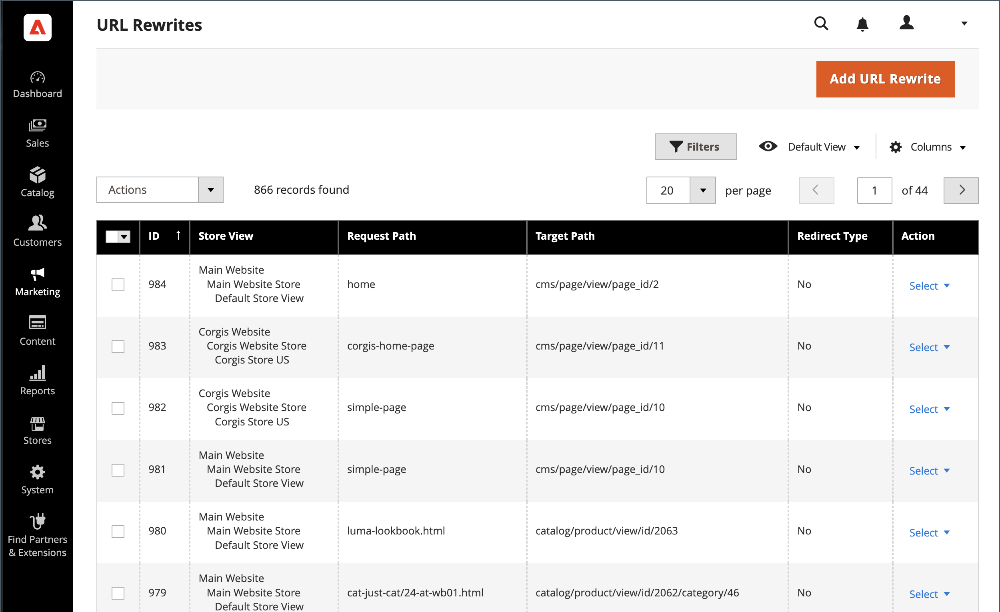

# URL の書き換え

>[!TIP]
>
>Adobe Commerce as a Cloud Serviceについては、Commerce ストアフロントドキュメントの [SEO ガイドライン &#x200B;](https://experienceleague.adobe.com/developer/commerce/storefront/setup/seo/indexing/?lang=ja) を参照してください

URL リライトツールを使用すると、商品、カテゴリまたはCMSページに関連付けられている URL を変更できます。 URL の書き換えを行うと、Commerceによって永続的なリダイレクト（301）が自動的に作成され、古い URL を指すすべてのリンクが新しいアドレスにリダイレクトされます。

>[!NOTE]
>
>複数またはすべての製品の URL リライトを同時に更新するには、[&#x200B; 複数の URL リライト &#x200B;](url-rewrite-product.md#multiple-url-rewrites) を参照してください。

>[!BEGINSHADEBOX  「書き換えとリダイレクトについて」 ]

多くの場合、_rewrite_ および _redirect_ という用語は同じ意味で使用されますが、演算は異なります。

* **URL 書き換え** - ブラウザーのアドレスバーに表示される内容を変更せずに、ある URL を別の URL に内部でマッピングするサーバーサイドプロセス。 訪問者が URL をリクエストすると、サーバーはバックグラウンドで別の URL として処理しますが、ブラウザーは元の URL を表示し続けます。

* **URL リダイレクト** - ブラウザーに HTTP 応答を送信し、別の URL への移動を指示します。 ブラウザーのアドレスバーが更新され、新しい URL が表示されます。 リダイレクトは、一時的（302）または永続的（301）に設定できます。

>[!ENDSHADEBOX]

## 書き換えツールの仕組み

Adobe Commerceでは、商品、カテゴリ、ページの URL キーを変更すると、SEO 値を保持するために、URL リライトツールによって永続的なリダイレクト（301）がデフォルトで作成されます。 この動作により、既存のリンクが引き続き機能し、検索エンジンのランキングが維持されます。

デフォルトでは [&#x200B; 自動 URL リダイレクト &#x200B;](url-redirect-product-automatic.md) がストアに対して有効になっており、各製品の「URL キー」フィールドで **古い URL の永続的なリダイレクトを作成** チェックボックスが選択されています。

{{url-rewrite-skip}}

{width="600" zoomable="yes"}

{{url-rewrite-params}}

## URL 書き換えデモ

URL の書き換えの管理については、次のビデオをご覧ください。

>[!VIDEO](https://video.tv.adobe.com/v/3410126?captions=jpn&quality=12&learn=on)

## URL 書き換えの作成

URL リライトツールを使用して、商品およびカテゴリのリダイレクトや、ストア内の任意のページのカスタムリダイレクトを作成します。 URL 書き換え設定を適用すると、前の URL を指す既存のリンクは、新しいアドレスにシームレスにリダイレクトされます。

URL の書き換えは、次の場所に作成できます。

* 値の大きいキーワードを追加すると、検索エンジンによる商品のインデックス作成方法が改善されます。

* 季節的な一時的な変更や永続的な変更に URL を追加します。

* CMS コンテンツページを含む、ページの有効なパスを追加します。 例えば、製品やカテゴリを常に内部 ID で参照するシステムで、よりユーザーや SEO に対応した URL を作成できます。

作成した URL の書き換えは、サイト構造を変更せずに既存のカテゴリまたはカスタムページにリダイレクトできるため、マーケティングキャンペーンで覚えやすい URL を簡単に作成できます。

{width="700" zoomable="yes"}

Commerceには、次の URL 書き換えタイプがあります。

* [製品の書き換え](url-rewrite-product.md)
* [カテゴリの書き換え](url-rewrite-category.md)
* [CMSページの書き換え](url-rewrite-cms-page.md)
* [カスタム書き換え](url-rewrite-custom.md)

### ユースケースと例

URL の書き換えは、次のシナリオで一般的に使用されます。

#### 内部システム URL を SEO に対応する URL に変更する

Commerceでは内部で ID ベースの URL を使用しますが、顧客向けに SEO に対応した URL を作成できます。

**システム URL （内部）:**

    http://www.example.com/catalog/category/id/6

**カスタマーフェイシング URL:**

    http://www.example.com/peripherals/keyboard.html

#### 製品のブランド変更または URL の最適化

製品の名前を変更したり、SEO の URL を改善したりする場合、既存のリンクを保持するリダイレクトを作成します。

**元の URL:**

    http://www.example.com/peripherals/keyboard.html

**最適化された新しい URL:**

    http://www.example.com/ergonomic-keyboard.html

書き換えツールは、古い URL から新しい URL に 301 リダイレクトを自動的に作成するので、顧客や検索エンジンはシームレスに正しいページに移動します。

#### プロモーションランディングページ

マーケティングキャンペーン用の一時的または永続的なカスタム URL を作成：

**プロモーション URL:**

    http://www.example.com/all-on-sale.html
    http://www.example.com/save-now/spring-sale

## 追加の URL 管理設定

次の節では、Commerceで web サーバーの書き換えと正規 URL を設定する方法について説明します。

### Web サーバーの書き換えの設定

>[!NOTE]
>
>ここでは、URL 書き換えツール機能とは異なる、web サーバーレベルの URL 書き換えについて説明します。 Web サーバーの書き換えは、技術的な URL 形式（`index.php` の削除など）を処理し、URL 書き換えツールは、コンテンツの変更に対するリダイレクトを管理します。

Web サーバーの書き換えを有効にする機能は、Commerceの初期設定の一部であり、通常はインストール時に設定されます。 有効にすると、web サーバー（Apache または Nginx）はファイル名 `index.php` を URL から自動的に削除し、よりクリーンで SEO に対応したアドレスを作成します。
次の例は、web サーバーの書き換えが有効な場合と有効でない場合の URL の表示方法を示しています。

**Web サーバーの書き換えのない URL**

    http://www.yourdomain.com/magento/index.php/storeview/url-identifier

**Web サーバーの書き換え後の URL**

    http://www.yourdomain.com/magento/storeview/url-identifier

#### Web サーバーの書き換えを有効または無効にする：

1. _管理者_ サイドバーで、**[!UICONTROL Stores]**/_[!UICONTROL Settings]_/**[!UICONTROL Configuration]**&#x200B;に移動します。

1. **[!UICONTROL General]** が展開されている左パネルで、「**[!UICONTROL Web]**」を選択します。

1. 「」を展開し、「**[!UICONTROL Search Engine Optimization]**」セクションを展開します。

   {width="600" zoomable="yes"}

1. **[!UICONTROL Use Web Server Rewrites]** を好みに合わせて設定します。

1. 完了したら、「**[!UICONTROL Save Config]**」をクリックします。

### 正規 URL の指定

SEO の目的では、各 web ページに個別の URL を 1 つだけ含める必要があります。

複数の URL でアクセス可能な単一のページがある場合、または異なるページに同様のコンテンツが含まれている場合、Googleでは、これらを同じページの重複バージョンと見なします。 Googleは 1 つの URL を正規バージョンとして選択し、その URL をクロールします。他のすべての URL は重複 URL と見なされ、クロールの頻度が低くなります。

どの URL が正規かをGoogleに明示的に伝えない場合、選択が行われるか、または両方の URL が等しい重み付けと見なされる可能性があります。 これにより、望ましくない動作が発生する可能性があり、無効なクロール予算と低分散バックリンクのリスクがあります。

Web サイトのセットアップ方法によっては、インデックスにサイトの複数のバージョンが含まれる場合があります。例：

    https://www.example.com
    https://www.example.com/
    http://www.example.com
    https://example.com
    https://www.example.com/index.html

正規ページを指定するには、[Google Search Central ドキュメント &#x200B;](https://developers.google.com/search/docs/crawling-indexing/consolidate-duplicate-urls) を参照してください。
