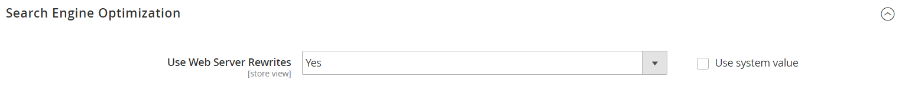

# URLの書き換え

>[!TIP]
>
>Adobe Commerce as a Cloud Serviceについては、Commerce Storefront ドキュメントの[SEO ガイドライン &#x200B;](https://experienceleague.adobe.com/developer/commerce/storefront/setup/seo/indexing/?lang=ja)を参照してください

URL書き換えツールを使用すると、商品、カテゴリ、またはCMS ページに関連付けられているURLを変更できます。 URLの書き換えを行うと、Commerceは永続的なリダイレクト（301）を自動的に作成し、古いURLを指すリンクが新しいアドレスにリダイレクトされるようにします。

>[!NOTE]
>
>複数またはすべての製品のURL書き換えを同時に更新するには、[複数のURL書き換え](url-rewrite-product.md#multiple-url-rewrites)を参照してください。

>[!BEGINSHADEBOX  「書き換えとリダイレクトについて」 ]

_rewrite_&#x200B;および&#x200B;_redirect_&#x200B;という用語は、しばしば同じ意味で使用されますが、これらは異なる操作です。

* **URL書き換え** — ブラウザーのアドレスバーに表示される内容を変更せずに、内部で1つのURLを別のURLにマッピングするサーバーサイドプロセス。 訪問者がURLをリクエストすると、サーバーはバックグラウンドで別のURLとして処理しますが、ブラウザーは元のURLを引き続き表示します。

* **URL リダイレクト** – 別のURLに移動するように指示するHTTP応答をブラウザーに送信します。 ブラウザーのアドレスバーが更新され、新しいURLが表示されます。 リダイレクトには、一時的（302）または永続的（301）を指定できます。

>[!ENDSHADEBOX]

## 書き換えツールの動作

Adobe Commerceでは、URL書き換えツールは、デフォルトで永続的なリダイレクト（301）を作成し、商品、カテゴリ、ページのURL キーを変更したときにSEO値を保持します。 この動作により、既存のリンクが引き続き機能し、検索エンジンのランキングが維持されます。

デフォルトでは、ストアに対して[自動URL リダイレクト &#x200B;](url-redirect-product-automatic.md)が有効になっており、各製品の「URL キー」フィールドで「**古いURLの永続的なリダイレクトを作成**」チェックボックスが選択されています。

{{url-rewrite-skip}}

{width="600" zoomable="yes"}

{{url-rewrite-params}}

## URL書き換えデモ

URL書き換えの管理について詳しくは、次のビデオをご覧ください。

>[!VIDEO](https://video.tv.adobe.com/v/3410126?captions=jpn&quality=12&learn=on)

## URLの書き換えを作成

URL書き換えツールを使用して、ストア内の任意のページの製品およびカテゴリのリダイレクト、およびカスタムリダイレクトを作成します。 URL書き換え設定が適用されると、以前のURLを指す既存のリンクは、新しいアドレスにシームレスにリダイレクトされます。

URLの書き換えは、次の場所に作成できます。

* 価値の高いキーワードを追加し、検索エンジンによる商品のインデックス作成方法を改善します。

* 一時的な季節変更または永続的な変更のURLを追加します。

* CMS コンテンツページを含む、ページの有効なパスを追加します。 例えば、URLを作成して、内部IDで商品やカテゴリーを常に参照するシステム上で、よりユーザー向けまたはSEO向けのURLを作成できます。

作成したURLの書き換えにより、サイト構造を変更することなく、既存のカテゴリーやカスタムページにリダイレクトできるため、マーケティングキャンペーンの覚えやすいURLを容易に作成できます。

{width="700" zoomable="yes"}

Commerceでは、次のURL書き換えタイプを提供しています。

* [製品の書き換え](url-rewrite-product.md)
* [カテゴリの書き換え](url-rewrite-category.md)
* [CMS ページの書き換え](url-rewrite-cms-page.md)
* [カスタム書き換え](url-rewrite-custom.md)

### ユースケースと例

URLの書き換えは、一般的に次のシナリオで使用されます。

#### 内部システム URLをSEO対応URLに変更する

Commerceでは、社内でID ベースのURLを使用していますが、顧客向けにSEO フレンドリーなURLを作成することもできます。

**システム URL （内部）:**

    http://www.example.com/catalog/category/id/6

**顧客向けURL:**

    http://www.example.com/peripherals/keyboard.html

#### 商品のリブランディングまたはURL最適化

製品の名前を変更したり、SEOのURLを改善したりする場合は、既存のリンクを保持するリダイレクトを作成します。

**元のURL:**

    http://www.example.com/peripherals/keyboard.html

**新しい最適化URL:**

    http://www.example.com/ergonomic-keyboard.html

書き換えツールは、古いURLから新しいURLへの301 リダイレクトを自動的に作成するため、顧客と検索エンジンは正しいページにシームレスに誘導されます。

#### プロモーションランディングページ

マーケティングキャンペーン用に一時的または永続的なカスタム URLを作成します。

**プロモーション URL:**

    http://www.example.com/all-on-sale.html
    http://www.example.com/save-now/spring-sale

## 追加のURL管理設定

次の節では、CommerceのWeb サーバー書き換えと正規URLの設定方法について説明します。

### Web サーバー書き換えの設定

>[!NOTE]
>
>この節では、Web サーバーレベルのURL書き換えについて説明します。これは、URL書き換えツール機能とは異なります。 Web サーバーの書き換えでは、技術的なURLの書式設定（`index.php`の削除など）を処理し、URLの書き換えツールでは、コンテンツの変更に対するリダイレクトを管理します。

Web サーバーの書き換えを有効にすることは、Commerceの初期設定の一部であり、通常はインストール時に設定されます。有効にすると、Web サーバー（ApacheまたはNginx）はURLからファイル名`index.php`を自動的に削除し、よりクリーンでSEOに適したアドレスを作成します。
次の例は、web サーバーの書き換えが有効になっているURLと、有効になっていないURLの表示方法を示しています。

Web サーバーの書き換えのない&#x200B;**URL**

    http://www.yourdomain.com/magento/index.php/storeview/url-identifier

Web サーバーの書き換え&#x200B;**を含む** URL

    http://www.yourdomain.com/magento/storeview/url-identifier

#### Web サーバーの書き換えを有効または無効にします。

1. _管理者_ サイドバーで、**[!UICONTROL Stores]** > _[!UICONTROL Settings]_>**[!UICONTROL Configuration]**&#x200B;に移動します。

1. **[!UICONTROL General]**&#x200B;が展開されている左側のパネルで、**[!UICONTROL Web]**&#x200B;を選択します。

1. **[!UICONTROL Search Engine Optimization]** セクションのを展開します。

   {width="600" zoomable="yes"}

1. **[!UICONTROL Use Web Server Rewrites]**&#x200B;を好みに合わせて設定します。

1. 完了したら、**[!UICONTROL Save Config]**&#x200B;をクリックします。

### 正規URLの指定

SEOの目的では、各web ページに個別のURLをひとつだけ割り当てる必要があります。

複数のURLでアクセスできる1つのページがある場合、または同様の内容を持つ別のページがある場合、Googleでは同じページの重複バージョンとして見なされます。 Googleは、正規バージョンとして1つのURLを選択し、それをクロールします。その他のすべてのURLは重複したURLと見なされ、クロールされる頻度が低くなります。

どのURLが正規化されているかをGoogleに明示的に伝えない場合は、選択を行うか、両方とも同じ重みと見なすかもしれません。 これは望ましくない行動につながり、効果的なクロール予算や分散したバックリンクが少なくなるリスクがあります。

web サイトの設定方法によっては、インデックスにサイトの複数のバージョンが含まれている場合があります。例えば、次のようになります。

    https://www.example.com
    https://www.example.com/
    http://www.example.com
    https://example.com
    https://www.example.com/index.html

正規ページを指定するには、[Google Search Central ドキュメント &#x200B;](https://developers.google.com/search/docs/crawling-indexing/consolidate-duplicate-urls)を参照してください。
