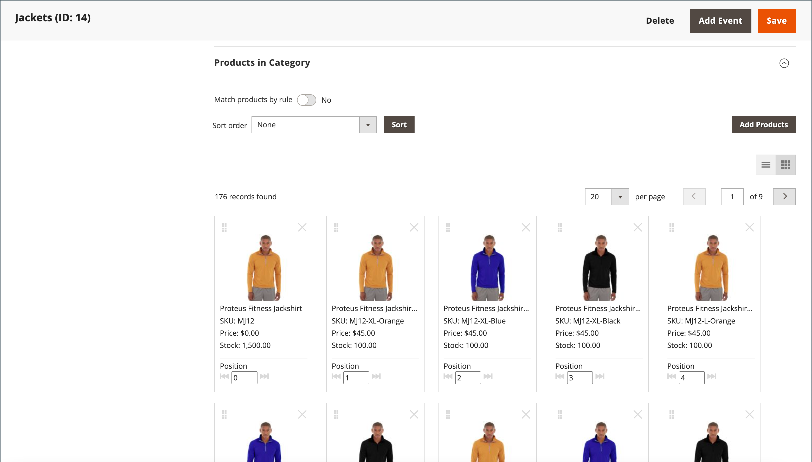
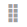

# ビジュアルマーチャンダイザー

{{ee-feature}}

この _ビジュアルマーチャンダイザー_ は、製品を配置し、カテゴリリストに表示する製品を決定する条件を適用できる高度なツールのセットです。 その結果、カタログの変更に合わせて調整される製品を動的に選択することができます。 次で作業できます _視覚モード_：各製品をグリッド上のタイルとして表示したり、カテゴリ内の製品のリストから操作したりできます。 各モードでは同じツールを使用でき、右上隅のボタンを使用して各タイプの表示を切り替えることができます。

{width="600" zoomable="yes"}

## ビジュアルマーチャンダイザーへのアクセス

1. 日 _Admin_ サイドバー、に移動 **[!UICONTROL Catalog]** > **[!UICONTROL Categories]**.

1. カテゴリツリーをドリルダウンし、編集するカテゴリをクリックします。

1. 下にスクロールして展開  この **[!UICONTROL Products in Category]** セクション。

1. 「」をクリックします _タイルとして表示_ （  ）ボタンをクリックし、商品をグリッドとして表示します。

1. 完了したら、 **[!UICONTROL Save Category]**.

## 商品の位置の変更

1. の使用 [並べ替え順序](../catalog/navigation-product-listings.md) 移動する商品を表示します。

   - **方法 1：ドラッグ&amp;ドロップ**

     つかむ _ドラッグ_ （）を選択し、製品を適切な位置にドロップします。 各製品の数は、新しい位置を反映するように調整されます。

   - **方法 2：位置の値を設定する**

     が含まれる _位置_ コントローラ （）を選択し、製品タイルに製品を表示する番号を入力します。 Enter `0` をクリックして、製品をリストの先頭に配置します。

1. 完了したら、 **[!UICONTROL Save Category]**.

>[!NOTE]
>
>新規インストールでは、Adobe Commerceがカテゴリ ID を予約します `2` デフォルトストアのルートカタログ用。 ビジュアルマーチャンダイザーは、ID 番号がのカテゴリのみを使用できます `3` 以上。

## ワークスペースコントロール

| 制御 | 説明 |
|--- |--- |
|  | リストとして表示 |
|  | タイルとして表示 |
|  | ルールによる一致 – なし |
|  | ルールによる一致 – はい |
|  | ドラッグ |
|  | 位置 |
|  | カテゴリから削除 |
|  | ページごとに表示 |
|  | 次/前に移動 |

{style="table-layout:auto"}
