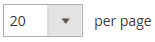

# Visual Merchandiser

{{ee-feature}}

The _Visual Merchandiser_ は、製品の位置付けや、カテゴリリストに表示される製品を決定する条件の適用を可能にする、一連の高度なツールです。 結果は、カタログ内の変更に合わせて調整される、動的な製品選択になる場合があります。 以下で作業できます。 _視覚モード_：各製品をグリッド上のタイルとして表示するか、カテゴリ内の製品のリストから操作できるようにします。 各モードで同じツールを使用でき、右上隅のボタンを使用して、各タイプの表示を切り替えることができます。

{width="600" zoomable="yes"}

## Visual Merchandiser へのアクセス

1. 次の日： _管理者_ サイドバー、移動 **[!UICONTROL Catalog]** > **[!UICONTROL Categories]**.

1. カテゴリツリーをドリルダウンし、編集するカテゴリをクリックします。

1. 下にスクロールして展開  の **[!UICONTROL Products in Category]** 」セクションに入力します。

1. 次をクリック： _タイルとして表示_ (  ) ボタンをクリックして、製品をグリッドとして表示します。

1. 完了したら、「 **[!UICONTROL Save Category]**.

## 製品の位置の変更

1. 以下を使用します。 [並べ替え順](../catalog/navigation-product-listings.md) をクリックして、移動する製品を表示します。

   - **方法 1：ドラッグ&amp;ドロップ**

     を取得 _ドラッグ_ () をクリックし、商品を配置します。 各製品の数は、新しい位置を反映するように調整されます。

   - **方法 2：位置値を設定**

     Adobe Analytics の _位置_ コントローラ () を商品タイルで、商品を表示する番号を入力します。 入力 `0` をクリックして、製品をリストの一番上に配置します。

1. 完了したら、「 **[!UICONTROL Save Category]**.

>[!NOTE]
>
>クリーンなインストールでは、Adobe Commerceはカテゴリ ID を予約します `2` デフォルトのストアのルートカタログの場合。 ビジュアルマーチャンダイザーは、ID 番号が `3` 以上

## Workspace のコントロール

| 制御 | 説明 |
|--- |--- |
|  | リストとして表示 |
|  | タイルとして表示 |
|  | ルールで一致 — いいえ |
|  | ルールで一致 — はい |
|  | ドラッグ |
|  | 位置 |
|  | カテゴリから削除 |
|  | ページごとに表示 |
|  | 次へ/前へ移動 |

{style="table-layout:auto"}
