# [!DNL Page Builder] チュートリアル パート 1: シンプルなページ

この3つの部分で構成される演習に従って、独自のデザインのコンテンツ豊富なページを簡単に作成できるシンプルなページを作成して、[!DNL Page Builder] ワークスペースに慣れましょう。

{width="700" zoomable="yes"}

>[!NOTE]
>
>これらのチュートリアル演習は、2.4.1 リリースの[!DNL Page Builder] ワークスペースに対する最近の変更を反映するように更新されます。

## 始める前に

この演習を開始する前に、作業中にセッションがタイムアウトしないように、[管理者セッション有効期間](../systems/security-admin.md)を増やすことをお勧めします。

必要なコンテンツ管理設定を確認します。

- WYSIWYG エディターは、[WYSIWYG オプション &#x200B;](../content-design/editor.md#configure-the-editor)設定で有効になっています。

- [!DNL Page Builder]は、[詳細コンテンツツール &#x200B;](setup.md)設定で有効になっています。

### チュートリアル画像アセットのダウンロード

1. [`simple-page-assets`](./assets/simple-page-assets.zip) ファイルをダウンロードし、ローカルシステムにファイルを保存します。

1. ダウンロードしたファイルに移動し、圧縮されたファイルを抽出します。

   Windows システムで右クリックし、**[!UICONTROL Extract All]** ファイルを選択します。 次に、宛先フォルダーを選択し、**[!UICONTROL Extract]**&#x200B;をクリックします。

   Macでは、zip ファイルをダブルクリックして、抽出したファイルを保存先のフォルダーに移動することができます。

   フォルダーには、次の画像ファイルが含まれています。

   ![[!DNL Page Builder] ウォークスルーのファイル – シンプルなページアセット &#x200B;](./assets/pb-tutorial-simple-page-assets.png){width="500"}

このチュートリアルの3つの部分を順番に進めます。

## パート 1：バナー付きのフルブリード行

シンプルなページの演習のこの部分では、フルブリードの行とバナーを持つページを作成します。 行には、デスクトップとモバイルデバイスの異なる背景画像があります。

バナー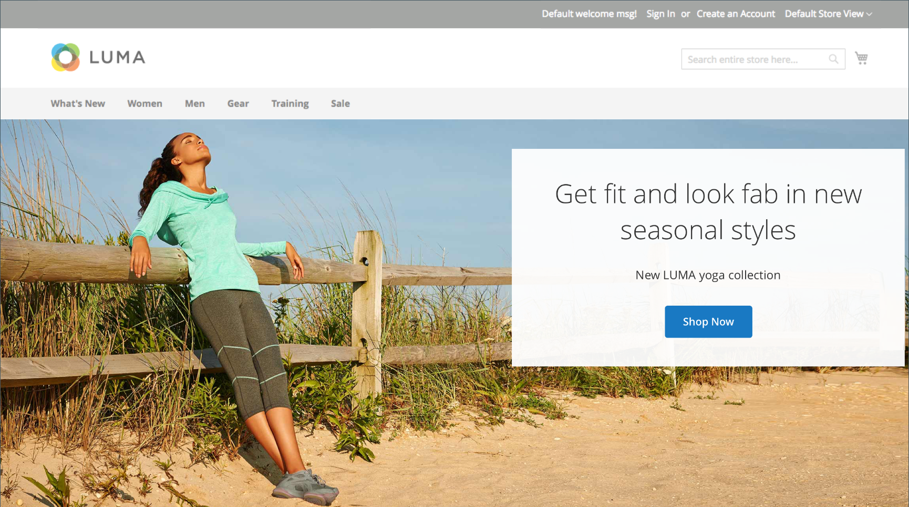{width="700" zoomable="yes"}付きの[!DNL Page Builder]件のフルブリード行

### 手順1：ページの作成

1. _管理者_ サイドバーで、**[!UICONTROL Content]** > _[!UICONTROL Elements]_>**[!UICONTROL Pages]**&#x200B;に移動します。

1. 右上隅の「**[!UICONTROL Add New Page]**」をクリックし、次の操作を行います。

   - このページがストアで公開されないようにするには、**[!UICONTROL Enable Page]**&#x200B;を`No`に設定します。

   - **[!UICONTROL Page Title]**&#x200B;に対して、`Simple Page`と入力します。

   {width="600" zoomable="yes"}

1. **[!UICONTROL Design]** セクションのを展開します。

   **[!UICONTROL Layout]**&#x200B;がデフォルトで`Page -- Full Width`に設定されていることに注意してください。 5つの標準[&#x200B; レイアウト &#x200B;](../content-design/page-layout.md) オプションに加えて、[!DNL Page Builder]では、ページ、カテゴリ、製品の全幅レイアウトが追加されます。

1. サンプルデータが使用可能な場合は、**[!UICONTROL New Theme]**&#x200B;を`Magento Luma`に設定します。 そうでない場合は、別の利用可能なテーマを選択するか、空白のままにしてデフォルトのテーマを使用できます。

   _[!UICONTROL New Theme]_&#x200B;設定を使用すると、デフォルトのテーマを上書きしたり、別のテーマをページに適用したりできます。

   >[!NOTE]
   >
   >全幅レイアウトは、互換性のある[&#x200B; テーマ &#x200B;](../content-design/themes.md)でのみ使用できます。

   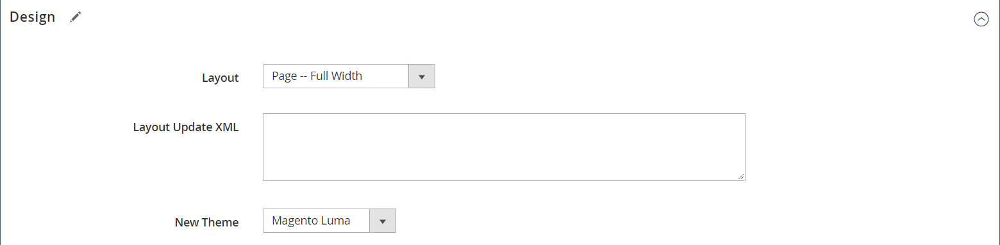{width="600" zoomable="yes"}

1. 右上隅の「**[!UICONTROL Save]**」をクリックします。

   ページを保存すると、ページの左上隅に「_シンプルなページ_」という名前が表示されます。

### 手順2：行の書式設定

1. **[!UICONTROL Content]** セクションのを展開します。

   このアクションは、空の行を含む[!DNL Page Builder] プレビューを表示します。

   >[!NOTE]
   >
   >[&#x200B; コンテンツ見出し](workspace.md) フィールドはオプションです。 デフォルトでは、テーマに従って見出しレベル 1 （H1）として書式設定されます。 この演習では、_コンテンツ見出し_&#x200B;は空白のままです。

   {width="600" zoomable="yes"}

1. コンテンツのプレビュー領域の内側にある&#x200B;**[!UICONTROL Edit with Page Builder]**&#x200B;をクリックします。

   拡張された[!DNL Page Builder] [&#x200B; ワークスペース &#x200B;](workspace.md)では、左側のパネルに、ステージでコンテンツを構築するために使用できるコンテンツツールが表示されます。

1. 空の行にマウスポインターを置くと、ツールボックスが表示されます。

   各コンテンツコンテナには、類似したオプションのセットを持つツールボックスがあります。

   ![[!DNL Page Builder]行のツールボックス &#x200B;](./assets/pb-layout-page-add-content-row-tools.png){width="600" zoomable="yes"}

1. 行ツールボックスで、_設定_ （{width="20"} アイコンを選択します。

1. _[!UICONTROL Appearance]_&#x200B;で、**全裁ち落とし**&#x200B;を選択します。

   「全裁ち落とし」設定は、行と背景のコンテンツ領域の左右の境界線を、ページの全幅に拡張します。

   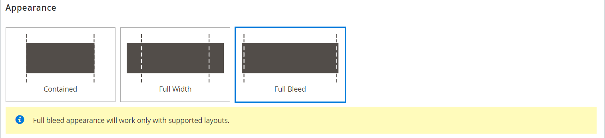{width="600" zoomable="yes"}

1. _[!UICONTROL Advanced]_&#x200B;セクションまでスクロールして、すべての&#x200B;**[!UICONTROL Margins and Padding]**&#x200B;設定を`0`に設定します。

   この設定により、バナーが行の全幅を拡張します。

   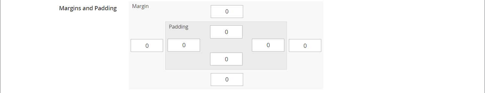{width="600" zoomable="yes"}

1. 設定を保存して[!DNL Page Builder] ワークスペースに戻るには、ページの上部までスクロールし、右上隅の「**[!UICONTROL Save]**」をクリックします。

### ステップ 3：バナーを追加する

>[!NOTE]
>
>[!DNL Page Builder]には、_Banner_&#x200B;という新しいコンテンツタイプがあります。このステップで紹介します。 以前はコンテンツメニューの&#x200B;_バナー_ オプションでしたが、現在は&#x200B;_動的ブロック_&#x200B;になっています。

1. [!DNL Page Builder] パネルで、**[!UICONTROL Media]**&#x200B;を展開し、**バナー**&#x200B;のプレースホルダーをステージにドラッグします。

   {width="600" zoomable="yes"}
1. バナーコンテナにカーソルを合わせると、ツールボックスが表示されます。

   >[!NOTE]
   >
   >ステージには2つのコンテンツコンテナがあり、それぞれに個別のツールボックスがあります。 バナーは行の内側にネストされているため、正しいツールボックスで作業していることを確認してください。

   ツールボックスに加えて、_画像をアップロード_&#x200B;および&#x200B;_ギャラリーから選択_ ボタンが含まれているため、ステージから直接バナーを素早く変更できます。

   {width="600" zoomable="yes"}

1. バナーツールボックスで、_設定_ （{width="20"}）アイコンを選択します。

1. _[!UICONTROL Appearance]_&#x200B;で、**[!UICONTROL Collage Right]**&#x200B;を選択します。

   コラージュの右設定では、バナーの右側にコンテンツが配置されます。

   {width="600" zoomable="yes"}

1. _[!UICONTROL Background]_&#x200B;セクションまでスクロールして、バナーの背景画像を設定します。

   - **[!UICONTROL Background Image]**&#x200B;の場合、「**アップロード**」をクリックします。

     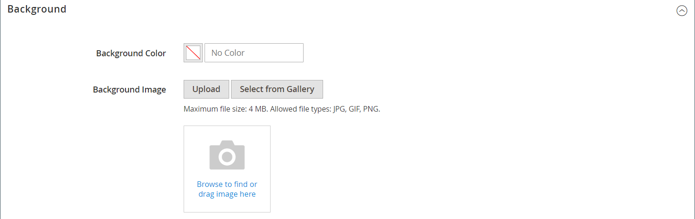{width="600" zoomable="yes"}

     抽出した単純なページアセットを保存したディレクトリに移動し、`wide-banner-background.jpg` ファイルを選択します。

     画像がアップロードされ、アップロードされた画像のサムネールが表示されます。 ファイル名、画像サイズおよびファイルサイズは以下のとおりです。

     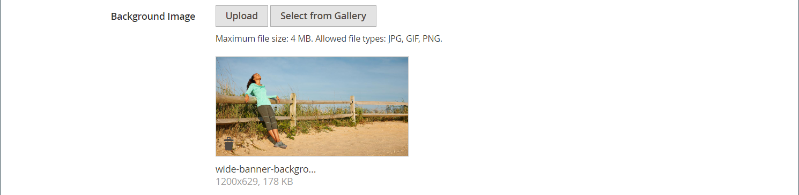{width="600" zoomable="yes"}

   - **[!UICONTROL Background Mobile Image]**&#x200B;の場合、「**アップロード**」をクリックします。

     同じファイルディレクトリで、`wide-banner-background-mobile.jpg` ファイルを選択します。

     モバイル背景画像は、モバイルデバイスに使用され、デスクトップブラウザーウィンドウがモバイルデバイスの幅にリサイズされるたびに使用されます。

     {width="600" zoomable="yes"}

   - ページの先頭までスクロールして&#x200B;**[!UICONTROL Save]**&#x200B;をクリックし、設定を保存して[!DNL Page Builder] ワークスペースに戻ります。

     背景がステージに表示され、行の全幅が拡張されます。

     {width="600" zoomable="yes"}

   行の右側に表示されるプレースホルダーテキストに注目してください。 このテキストの位置は、_Collage Right_&#x200B;のアピアランス設定を反映しています。

1. プレースホルダーテキストをクリックし、次のメッセージを2行として入力します。

   `Get fit and look fab in new seasonal styles.`

   `New LUMA yoga collection`

   エディターツールバーがテキストボックスの上に表示されます。 テキストは、ステージから直接入力するか、バナーツールボックスで&#x200B;_設定_&#x200B;を選択して入力および書式設定できます。

   {width="600" zoomable="yes"}

1. テキストに書式を適用する：

   - テキストの最初の行を選択します。 次に、**形式**&#x200B;の下のエディターツールバーで、`Heading 2`を選択します。

     {width="600" zoomable="yes"}

   - 2行目のテキストを選択します。 次に、**形式**&#x200B;の下のエディターツールバーで、`Paragraph`を選択します。

   書式設定では、現在のテーマに関連付けられているスタイルシートのスタイルが適用されます。

   書式設定されたテキストを含むコンテンツステージの{width="600" zoomable="yes"}
__

1. バナーツールボックスを表示するには、_設定_ （{width="20"}）アイコンをもう一度選択してから、_[!UICONTROL Content]_&#x200B;セクションまでスクロールします。

   テキストが「_メッセージテキスト_」ボックスに表示されます。 テキストは、ステージまたはバナー設定の&#x200B;_[!UICONTROL Content]_&#x200B;セクションから入力および編集できます。

   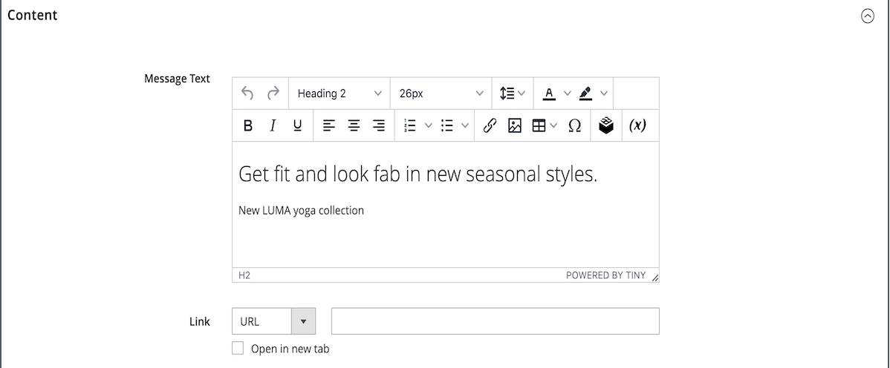{width="600" zoomable="yes"}

1. _[!UICONTROL Content]_&#x200B;セクションを続けて、バナーリンクとボタンを設定します。

   - **リンク**&#x200B;を`Category`に設定し、**[!UICONTROL Select]**&#x200B;をクリックしてカテゴリーツリーを表示します。

   - リンクされたカテゴリとして`What's New`を選択します。

     {width="600" zoomable="yes"}

   - **[!UICONTROL Show Button]**&#x200B;を`Always`に設定します。

   - **[!UICONTROL Button Text]**&#x200B;に対して、`Shop Now`をボタンに表示されるテキストとして入力します。

   - **[!UICONTROL Button Type]**&#x200B;の場合、`Primary`の既定値を受け入れます。

     現在のテーマのボタンスタイルによって、ボタンの形式が決まります。

1. バナーオーバーレイを設定します。

   オーバーレイを使用して、「アピアランス」設定で定義されているアクティブコンテンツ領域に背景色を適用できます。 バナーの背景画像は、バナーの全幅にわたって表示されたままになります。

   - **[!UICONTROL Show Overlay]**&#x200B;を`Always`に設定します。

   - **[!UICONTROL Overlay Color]**&#x200B;に対して、次のいずれかの操作を行います。

      - カラーの正方形をクリックし、白いスウォッチを選択します。
      - 「_色なし_」テキストボックスをクリックし、`White`または16進数値`#ffffff`を入力します。

     次に、**[!UICONTROL Apply]**&#x200B;をクリックします。

     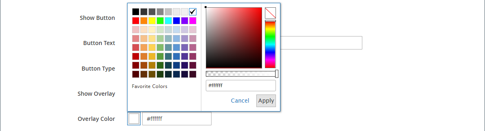{width="600" zoomable="yes"}

   - ページの先頭までスクロールして&#x200B;**[!UICONTROL Save]**&#x200B;をクリックし、設定を保存して[!DNL Page Builder] ワークスペースに戻ります。

     ボタンは、ステージのバナーメッセージの下に表示されます。

     テキストメッセージとボタンを含むコンテンツステージの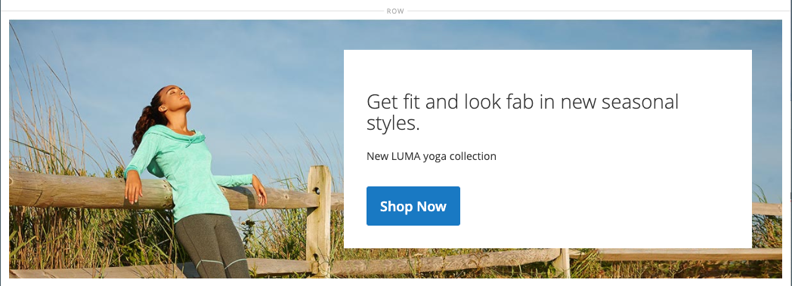{width="600" zoomable="yes"}

1. ステージの右上隅で、_フルスクリーンを閉じる_ （）アイコンをクリックします。

   このアイコンをクリックすると、プレビューが表示されたページの&#x200B;_[!UICONTROL Content]_&#x200B;セクションに戻ります。

   2つのワークスペースモードは、いつでも切り替えることができます。

1. 右上隅の&#x200B;**[!UICONTROL Save]**&#x200B;矢印をクリックし、**[!UICONTROL Save & Close]**&#x200B;を選択します。

1. プロンプトが表示されたら、ページ上部のメッセージの[Cache Management](../systems/cache-management.md) リンクをクリックし、無効なキャッシュを更新します。

## パート 2:2つの同じ列を持つ行が含まれる

この部分では、ページに行を追加し、その行を2つの等しい列に分割します。 次に、リンクされた画像を各列に追加します。 手順では、最初の行の前に新しい各行が追加され、[!DNL Page Builder] パネルがステージに合わせて並べられます。 演習の最後に、行を単純ページの例に一致するように並べ替えます。

{width="600" zoomable="yes"}

### 手順1：行を追加する

1. ページグリッドで、この演習の最初の部分で作成した&#x200B;_シンプルなページ_&#x200B;を見つけ、_[!UICONTROL Action]_&#x200B;列の&#x200B;**[!UICONTROL Edit]**&#x200B;を選択します。

1. **[!UICONTROL Content]** セクションのを展開します。

1. コンテンツのプレビュー領域の内側にある&#x200B;**[!UICONTROL Edit with Page Builder]**&#x200B;をクリックします。

1. _[!UICONTROL Layout]_&#x200B;の下の[!DNL Page Builder] パネルで、**[!UICONTROL Row]**&#x200B;プレースホルダーをステージにドラッグし、バナーの上に配置します。

   赤いガイドラインは、2つの行の境界を示します。

   {width="600" zoomable="yes"}

1. 新しい行にカーソルを合わせてツールボックスを表示し、_設定_ （{width="20"}）アイコンを選択します。

   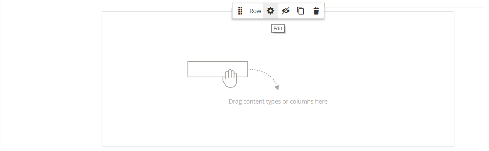{width="600" zoomable="yes"}

1. _[!UICONTROL Appearance]_&#x200B;で、**Contained**&#x200B;のデフォルト設定を受け入れます。

   この設定は、行のコンテンツ領域を、テーマで定義されたページの幅に制限します。

   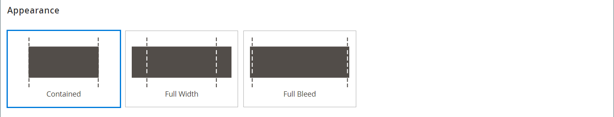{width="600" zoomable="yes"}

1. 右上隅の「**[!UICONTROL Save]**」をクリックして設定を保存し、[!DNL Page Builder] ワークスペースに戻ります。

### 手順2：列の追加

1. _[!UICONTROL Layout]_&#x200B;の下の[!DNL Page Builder] パネルで、**[!UICONTROL Column]**&#x200B;プレースホルダーを新しい行にドラッグします。

   {width="600" zoomable="yes"}

   行は同じ幅の2つの列に分けられます。 各列は、コンテンツ用の個別のコンテナであり、専用のツールボックスがオプションで用意されています。

   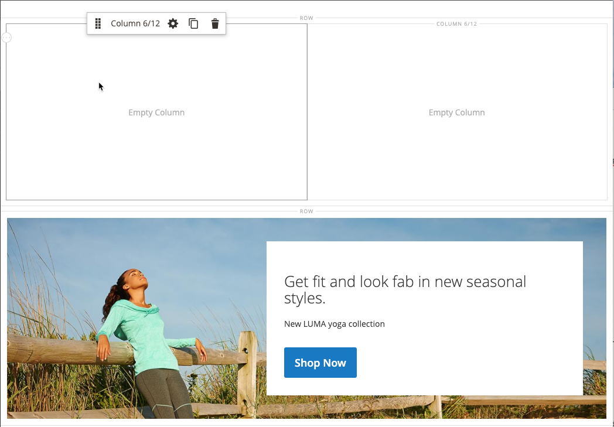{width="600" zoomable="yes"}

1. 最初の列の左上隅にある円形の&#x200B;_グリッド_ コントロール（）をクリックして、グリッドガイドラインを表示します。

   グリッドは、コンテンツが一貫して調整され、デスクトップとモバイルデバイスの両方で正しくレンダリングされることを保証します。 グリッドサイズの設定について詳しくは、[!DNL Page Builder]設定トピックの「[設定 [!DNL Page Builder]](setup.md#configure-page-builder)」セクションを参照してください。

   各列コンテナの上部境界にある括弧（6/12）の数値は、各列のグリッド分割数と行の分割数の合計数を示します。

   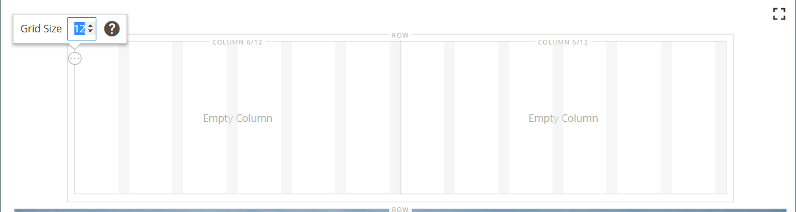{width="600" zoomable="yes"}

### 手順3：リンクを含む画像の追加

このステップでは、画像をバナーにアップロードする方法を説明します。

1. [!DNL Page Builder] パネルで、**[!UICONTROL Media]** セクションを展開し、**[!UICONTROL Image]** プレースホルダーを最初の列にドラッグします。

   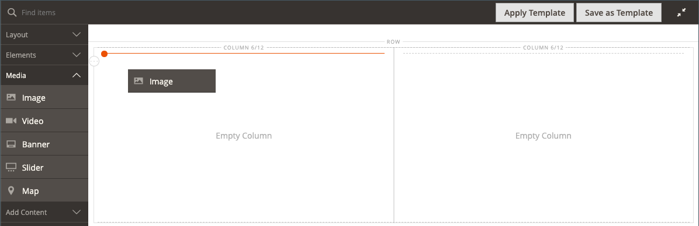{width="600" zoomable="yes"}

1. サンプルイメージをプレースホルダーに挿入します。

   {width="600" zoomable="yes"}

   システム上にある画像の場合は、次のいずれかの方法を選択できます。

   - **画像ファイルをアップロード**：最初の列で、**[!UICONTROL Upload Image]**&#x200B;をクリックします。 次に、抽出した単純なページアセットを保存したディレクトリに移動し、`small-banner-1.jpg` ファイルを選択します。

     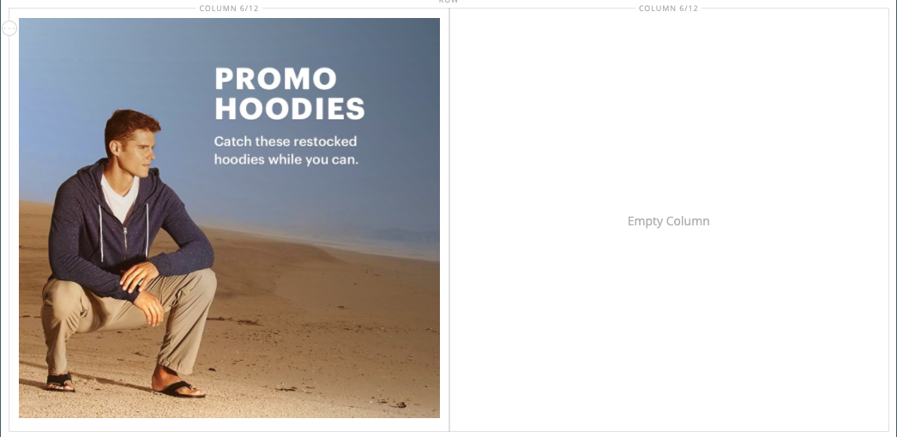{width="600" zoomable="yes"}

     この操作を繰り返して、`small-banner-2.jpg` ファイルを2番目の列に追加します。

   - **画像ファイルをドラッグします**: デスクトップで、シンプルなページアセットフォルダーを開き、[!DNL Page Builder] ステージで作業している管理ブラウザーウィンドウと並べて配置します。 次に、シンプルなページアセットフォルダーからファイル `small-banner-1.jpg`をドラッグし、最初の列にドロップします。

     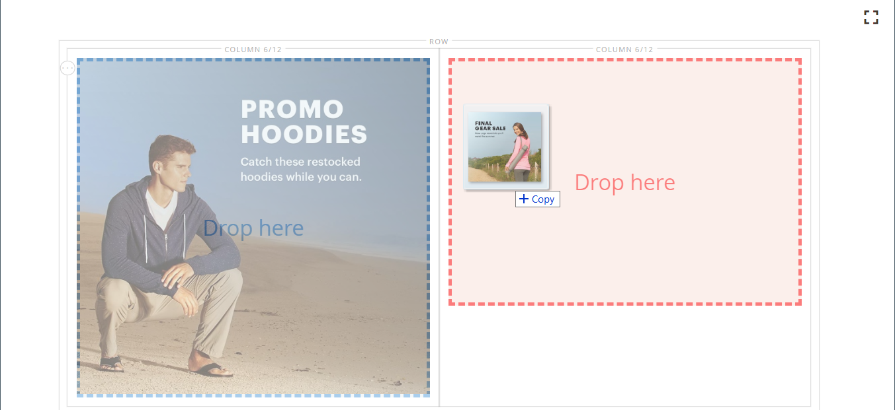{width="600" zoomable="yes"}

     この操作を繰り返して、`small-banner-2.jpg` ファイルを2番目の列に追加します。

1. 各画像にリンクするカタログのページを決定します。

1. 最初の列の画像にカーソルを合わせてツールボックスを表示し、_設定_ （{width="20"}）アイコンを選択します。

   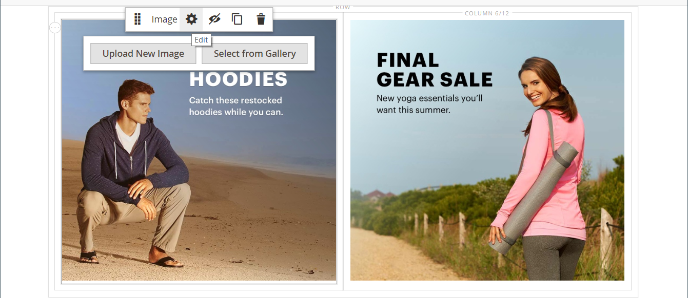{width="600" zoomable="yes"}

1. 画像をカテゴリにリンクします。

   - 下にスクロールして、**Link**&#x200B;を`Category`に設定します。

   - カテゴリーツリーで、ドリルダウンして`Men's Hoodies & Sweatshirt` カテゴリを選択します。

   - 右上隅の設定を&#x200B;**[!UICONTROL Save]**&#x200B;し、[!DNL Page Builder] ワークスペースに戻ります。

1. 前の手順を繰り返して、2列目の画像を&#x200B;_歯車_ カテゴリにリンクします。

1. ステージの右上隅で、_フルスクリーンを閉じる_ （）アイコンをクリックします。

   このアイコンをクリックすると、プレビューが表示されたページの&#x200B;_[!UICONTROL Content]_&#x200B;セクションに戻ります。

1. 右上隅の&#x200B;**[!UICONTROL Save]**&#x200B;矢印をクリックし、**[!UICONTROL Save & Close]**&#x200B;を選択します。

1. プロンプトが表示されたら、ページ上部のメッセージの[Cache Management](../systems/cache-management.md) リンクをクリックし、無効なキャッシュを更新します。

## パート 3：不均等な列を持つ全角行

このページの最後の行には、製品レビューのコンテンツが表示されています。 全幅の行を追加し、幅の異なる2つの列に分割します。 最初の列に背景画像が追加され、一致する背景色が行に適用されて統一された効果が得られます。

{width="500"}

### 手順1：行を追加する

1. ページグリッドで、この演習の最初の部分で作成した&#x200B;_シンプルなページ_&#x200B;を見つけ、_[!UICONTROL Action]_&#x200B;列の&#x200B;**[!UICONTROL Edit]**&#x200B;を選択します。

1. **[!UICONTROL Content]** セクションのを展開します。

1. コンテンツのプレビュー領域の内側にある&#x200B;**[!UICONTROL Edit with Page Builder]**&#x200B;をクリックします。

1. _[!UICONTROL Layout]_&#x200B;の下の[!DNL Page Builder] パネルで、**[!UICONTROL Row]**&#x200B;プレースホルダーをステージにドラッグし、この演習の2番目の部分で作成した行の上に配置します。

   赤いガイドラインは、2つの行の境界を示します。

   {width="600" zoomable="yes"}

1. 新しい行にカーソルを合わせてツールボックスを表示し、_設定_ （{width="20"}）アイコンを選択します。

   {width="600" zoomable="yes"}

1. _[!UICONTROL Appearance]_&#x200B;の下の行を編集ページで、**[!UICONTROL Full Width]**&#x200B;を選択します。

   この設定は、コンテンツ領域をテーマで定義される最大ページ幅に制限します。 背景色や画像は制限されず、行の幅が広くなります。

   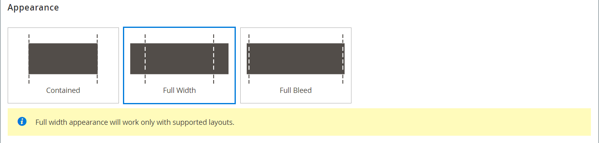{width="600" zoomable="yes"}

1. _[!UICONTROL Background]_&#x200B;セクションに、`#f1f1f1`を&#x200B;**[!UICONTROL Background Color]**&#x200B;として入力します。

   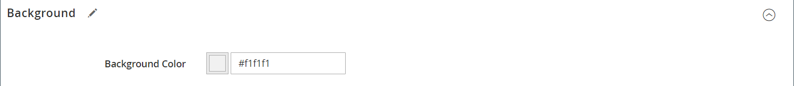{width="600" zoomable="yes"}

1. _[!UICONTROL Advanced]_&#x200B;セクションまでスクロールし、すべての&#x200B;**マージンとパディング**&#x200B;の値を`0`に設定します。

   {width="600" zoomable="yes"}

1. ページの先頭までスクロールして&#x200B;**[!UICONTROL Save]**&#x200B;をクリックし、設定を保存して[!DNL Page Builder] ワークスペースに戻ります。

   行の背景色は淡いベージュになっています。

   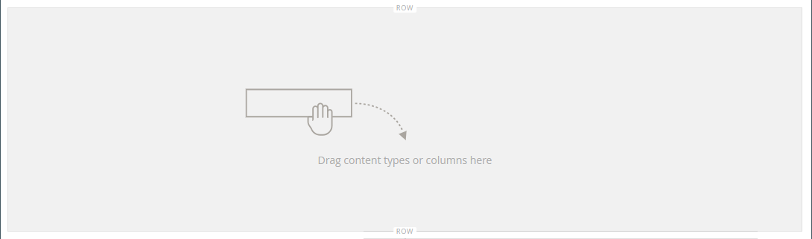{width="600" zoomable="yes"}

### 手順2：幅の異なる列を追加する

1. _[!UICONTROL Layout]_&#x200B;の下の[!DNL Page Builder] パネルで、**[!UICONTROL Column]**&#x200B;プレースホルダーをステージの一番上の行にドラッグします。

   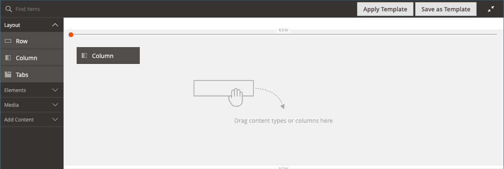{width="600" zoomable="yes"}

1. 最初の列の右端を、グリッド上の12の4つの位置（`4/12`）にドラッグします。

   2番目の列のサイズは、12 （`8/12`）のうち8つに調整されます。

   {width="600" zoomable="yes"}

1. 最初の列コンテナにカーソルを合わせてツールボックスを表示し、_設定_ （{width="20"}）アイコンを選択します。

1. _[!UICONTROL Advanced]_&#x200B;セクションまでスクロールし、すべての&#x200B;**マージンとパディング**&#x200B;の値を`0`に設定します。

   {width="600" zoomable="yes"}

1. ページの先頭までスクロールして&#x200B;**[!UICONTROL Save]**&#x200B;をクリックし、設定を保存して[!DNL Page Builder] ワークスペースに戻ります。

### 手順3：最初の列に画像を追加する

1. [!DNL Page Builder] パネルで、**[!UICONTROL Media]**&#x200B;を展開し、**[!UICONTROL Image]** コンテンツタイプを最初の列にドラッグします。

   {width="600" zoomable="yes"}

1. 画像プレースホルダーで、**[!UICONTROL Upload Image]**&#x200B;をクリックします。

   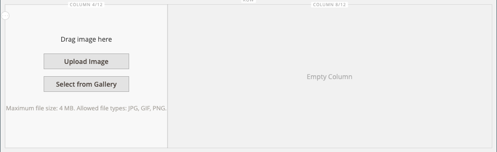{width="600" zoomable="yes"}

1. 抽出した単純なページアセットを保存したディレクトリに移動し、`review-image.jpg` ファイルを選択します。

   アップロードされた画像は最初の列に表示され、行の背景色とシームレスにブレンドされます。

   {width="600" zoomable="yes"}

### 手順4：レビューコンテンツを2列目に追加する

行の2番目の列には、5つ星の評価画像や書式設定されたテキストメッセージなど、顧客レビューのコンテンツを含める必要があります。

1. [!DNL Page Builder] パネルで、**[!UICONTROL Elements]** セクションを展開し、**[!UICONTROL Text]** コンテンツタイプを2番目の列にドラッグします。

   {width="600" zoomable="yes"}

1. テキスト要素をクリックして、エディターツールバーを表示します。

1. ツールバーで、_画像を挿入_ （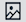）アイコンをクリックし、次の操作を行います。

   {width="600" zoomable="yes"}

   - _[!UICONTROL Insert/edit image]_&#x200B;ダイアログで、_[!UICONTROL Source]_ フィールドの横にある&#x200B;_検索_ （）アイコンをクリックします。

     {width="600" zoomable="yes"}

   - _[!UICONTROL Select Images]_&#x200B;ページで、**[!UICONTROL Choose Files]**&#x200B;をクリックします。

   - 単純なページアセットを保存したフォルダーで、`rating.png`を選択します。

   - ページに戻り、画像タイルをダブルクリックして選択し、そのURLをSource フィールドに挿入します。

     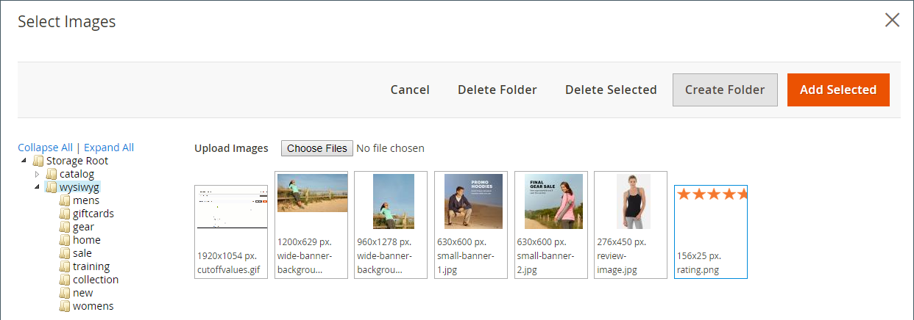{width="600" zoomable="yes"}

   - **[!UICONTROL Image Description]**&#x200B;の場合、`5-Star Rating`と入力し、**[!UICONTROL OK]**&#x200B;をクリックして画像を列に挿入します。

   - エディターツールバーで、**中央揃え** （）をクリックして、列の中央に画像を配置します。

     {width="600" zoomable="yes"}

1. 5つ星の画像のすぐ後に挿入ポイントを置き、Enter/Return キーを押して新しい行を開始し、次のテキストを入力します。

   `Awesome Tank!`

   `I'm a long distance runner and it keeps me pretty comfortable, although these companies always act like their shirts are magical and really it's just pretty basic stuff. Still it's a great shirt, and I would recommend it.`

   `Antonia Racer Tank – Reviewed by Allyson`

   テキストは入力中に中央に配置されます。

   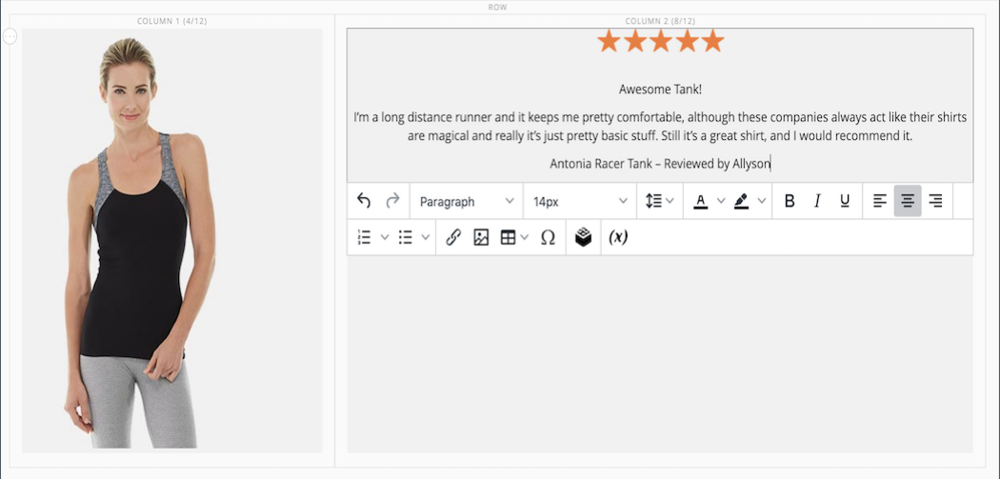{width="600" zoomable="yes"}

1. テキストの書式設定：

   - テキストの最初の行の任意の場所をクリックし、**形式**&#x200B;の下のエディターツールバーで、`Heading 2`を選択します。

   - 残りのテキストを選択し、**形式**&#x200B;の下のエディターツールバーで、`Paragraph`を選択します。

   テキストは、テーマに関連付けられているスタイルシートに従って書式設定されます。

1. 画像のサイズを取得して、コンテンツを列の垂直方向に中央に配置できるようにします。

   - 最初の列の画像にカーソルを合わせてツールボックスを表示し、_設定_ （{width="20"}）アイコンを選択します。

   - 画像のサムネールの下に、画像の寸法をメモします。

     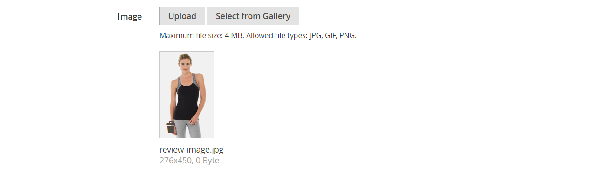{width="600" zoomable="yes"}

   - 右上隅で、**閉じる**&#x200B;をクリックします。

1. コンテンツを2列目で垂直方向に中央に配置します。

   - 2番目の列にカーソルを合わせてツールボックスを表示し、_設定_ （{width="20"}）アイコンを選択します。

   >[!NOTE]
   >
   >正しいツールボックスを表示するには、テキストコンテナではなく列コンテナを選択してください。

   - **[!UICONTROL Minimum Height]**&#x200B;に対して、最初の列の画像の高さをピクセル単位で`450`と入力します。

   - **[!UICONTROL Vertical Alignment]**&#x200B;を`Center`に設定します。

   {width="600" zoomable="yes"}

1. _[!UICONTROL Advanced]_&#x200B;セクションまでスクロールして、すべての&#x200B;**[!UICONTROL Margins and Padding]**&#x200B;値を0に設定します（`0`）。

   {width="600" zoomable="yes"}

1. ページの上部までスクロールし、右上隅の&#x200B;**[!UICONTROL Save]**&#x200B;をクリックして設定を保存し、[!DNL Page Builder] ワークスペースに戻ります。

   {width="600" zoomable="yes"}

### 手順5：カタログ製品リンクの挿入

1. `Antonia Racer Tank` テキストを選択し、エディターツールバーの&#x200B;_リンクを挿入_ （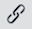）アイコンをクリックします。

1. _リンクを挿入_ ダイアログで、カタログ製品へのリンクを指定します。

   - 製品&#x200B;**[!UICONTROL URL]**&#x200B;を入力します。

     相対URLまたは完全修飾URLを入力できます。 この例では、次の相対リンクが入力されます。

     `../antonia-racer-tank.html`

   - （オプション）「**タイトル**」に、製品名を入力します。

     タイトルリンク属性は、一部のブラウザーでツールチップとして使用されます。

     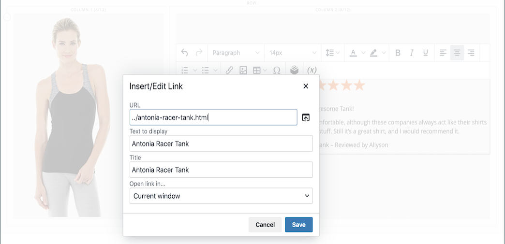{width="600" zoomable="yes"}

   - 完了したら、**[!UICONTROL OK]**&#x200B;をクリックしてリンクを保存します。

     リンクされたテキストがバナーでハイライト表示されるようになりました。

     {width="600" zoomable="yes"}

1. ステージの右上隅で、_フルスクリーンを閉じる_ （）アイコンをクリックします。

   このアイコンをクリックすると、プレビューが表示されたページの&#x200B;_[!UICONTROL Content]_&#x200B;セクションに戻ります。

1. 右上隅の「**[!UICONTROL Save]**」をクリックします。

### 手順6：行の並べ替え

3つの行がすべて完了したら、最後の手順は、元の&#x200B;_単純ページ_&#x200B;の例に一致するように行を並べ替えることです。 元の例と一致させるには、最初の行を下に移動し、最後の行を上に移動する必要があります。

1. 必要に応じて、**[!UICONTROL Content]** セクションのを展開します。

1. コンテンツのプレビュー領域の内側にある&#x200B;**[!UICONTROL Edit with Page Builder]**&#x200B;をクリックします。

1. ステージの最初の行にカーソルを合わせてツールボックスを表示し、_移動_ （）アイコンを選択します。

   {width="600" zoomable="yes"}

1. 行のすべてのコンテンツが選択されていることを確認するには、マウスボタンを押しながら、ページの下部にある赤いガイドラインの下の位置に行をドラッグします。

   >[!NOTE]
   >
   >画像などのコンテンツの一部だけを誤って移動した場合は、コンテンツを属する場所に戻して、もう一度試します。

   {width="600" zoomable="yes"}

1. このプロセスを繰り返して、最初の行を2番目の位置に移動します。

   ページ上の行の順序が、シンプルなページの例と一致するようになりました。

1. ステージの右上隅で、_フルスクリーンを閉じる_ （）アイコンをクリックします。

   このアイコンをクリックすると、プレビューが表示されたページの&#x200B;_[!UICONTROL Content]_&#x200B;セクションに戻ります。

1. 右上隅の&#x200B;**[!UICONTROL Save]**&#x200B;矢印をクリックし、**[!UICONTROL Save & Close]**&#x200B;を選択します。

1. プロンプトが表示されたら、ページ上部のメッセージの[Cache Management](../systems/cache-management.md) リンクをクリックし、無効なキャッシュを更新します。

簡易ページの演習が完了しました。 後で参照できるように、作成した作業を保存します。

準備ができたら、[&#x200B; パート 2: ブロック &#x200B;](2-blocks.md)に進みます。
