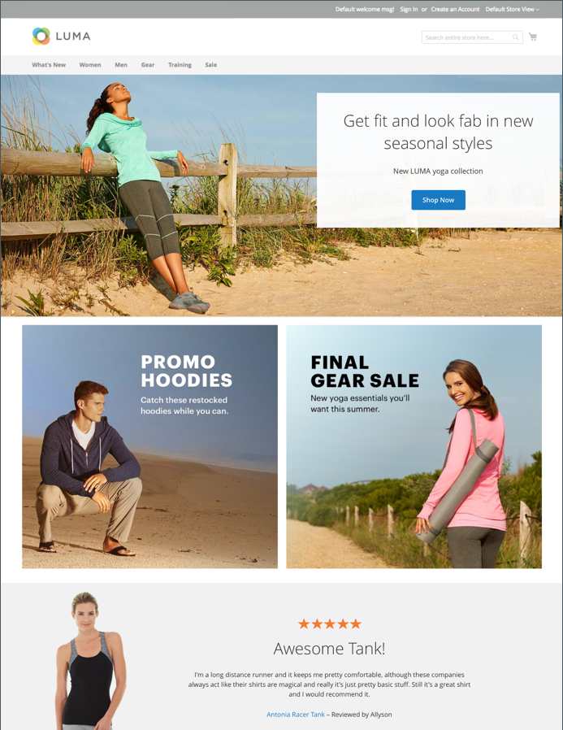
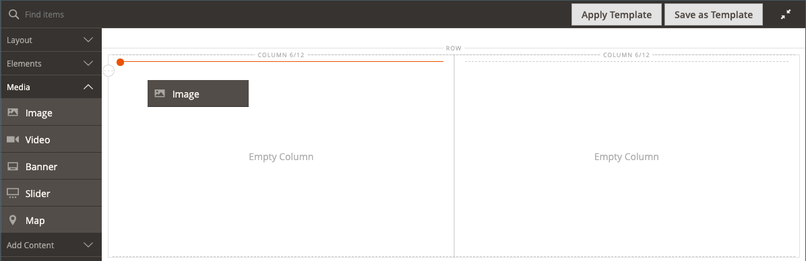
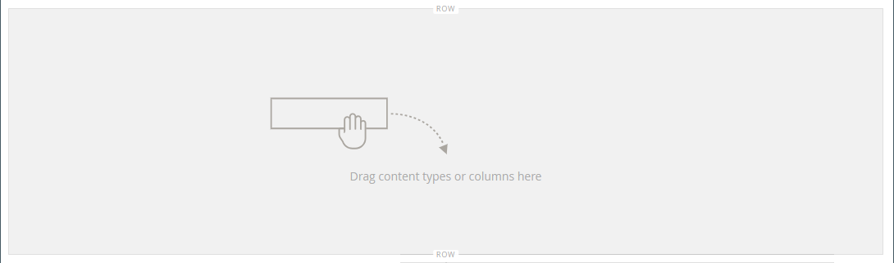
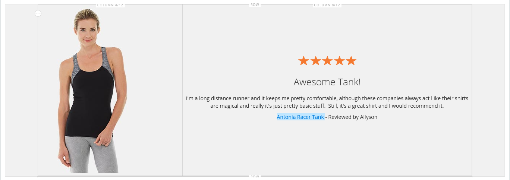

# [!DNL Page Builder] ガイド第 1 章：シンプルなページ

この 3 つのパートから成る演習に従って、 [!DNL Page Builder] ワークスペースを作成して、独自のデザインのコンテンツに富んだページを簡単に作成できることを示す簡単なページを作成します。

{width="700" zoomable="yes"}

>[!NOTE]
>
>これらのチュートリアルの演習は、 [!DNL Page Builder] workspace（2.4.1 リリース） 以前のAdobe Commerceリリースを使用している場合は、 [!DNL Page Builder] に含まれるチュートリアル演習 [[!DNL Commerce] 2.3 ユーザーガイド](https://docs.magento.com/user-guide/v2.3/cms/page-builder-learn.html).

## 始める前に

この演習を開始する前に、 [管理セッションの有効期間](../systems/security-admin.md) を使用して、作業中にセッションがタイムアウトするのを防ぎます。

次の必要なコンテンツ管理設定を確認します。

- WYSIWYG Editor が有効になっている場合は、 [WYSIWYG オプション](../content-design/editor.md#configure-the-editor) 設定。

- [!DNL Page Builder] が有効な場合は、 [高度なコンテンツツール](setup.md) 設定。

### ウォークスルー画像アセットをダウンロードする

1. をダウンロードします。 [`simple-page-assets`](./assets/simple-page-assets.zip) ファイルを作成し、ローカルシステムにファイルを保存します。

1. ダウンロードしたファイルに移動し、圧縮されたファイルを展開します。

   Windows システムでは、右クリックして「 」を選択します。 **[!UICONTROL Extract All]** ファイル。 次に、保存先フォルダーを選択し、 **[!UICONTROL Extract]**.

   Macシステムでは、zip ファイルをダブルクリックして、抽出したファイルを保存先フォルダーに移動するだけで済みます。

   このフォルダーには、次の画像ファイルが含まれます。

   ![[!DNL Page Builder] ウォークスルーファイル — シンプルページアセット](./assets/pb-tutorial-simple-page-assets.png){width="500"}

このチュートリアルの 3 つの部分を順に実行します。

## 第 1 部：全裁ち落とし行（バナー付き）

「シンプルページ」の演習のこの部分では、フルブリードの行とバナーを含むページを作成します。 デスクトップとモバイルデバイスでは、行に異なる背景画像が表示されます。

![[!DNL Page Builder] バナー付きの完全な裁ち落とし行](./assets/pb-tutorial1-full-bleed-with-banner.png){width="700" zoomable="yes"}

### 手順 1：ページの作成

1. 次の日： _管理者_ サイドバー、移動 **[!UICONTROL Content]** > _[!UICONTROL Elements]_>**[!UICONTROL Pages]**.

1. 右上隅で、 **[!UICONTROL Add New Page]** 次の操作を実行します。

   - このページがストアで公開されないようにするには、 **[!UICONTROL Enable Page]** から `No`.

   - の場合 **[!UICONTROL Page Title]**，と入力します。 `Simple Page`.

   {width="600" zoomable="yes"}

1. 展開  の **[!UICONTROL Design]** 」セクションに入力します。

   次の点に注意してください。 **[!UICONTROL Layout]** が `Page -- Full Width` デフォルトでは。 5 つの標準に加えて [レイアウト](../content-design/page-layout.md) オプション， [!DNL Page Builder] ページ、カテゴリ、製品の全幅レイアウトを追加します。

1. サンプルデータが使用可能な場合は、 **[!UICONTROL New Theme]** から `Magento Luma`. それ以外の場合は、別の使用可能なテーマを選択するか、空白のままにしてデフォルトのテーマを使用できます。

   The _[!UICONTROL New Theme]_設定を使用して、デフォルトのテーマを上書きし、ページに別のテーマを適用することができます。

   >[!NOTE]
   >
   >全幅レイアウトは、互換性のある [テーマ](../content-design/themes.md).

   {width="600" zoomable="yes"}

1. 右上隅で、 **[!UICONTROL Save]**.

   ページを保存する際に、名前 _単純なページ_ がページの左上隅に表示されます。

### 手順 2：行の書式設定

1. 展開  の **[!UICONTROL Content]** 」セクションに入力します。

   このアクションでは、 [!DNL Page Builder] 空の行でプレビューします。

   >[!NOTE]
   >
   >The [コンテンツ見出し](workspace.md) フィールドはオプションです。 デフォルトでは、テーマに応じて見出しレベル 1(H1) の形式で表示されます。 この演習では、 _コンテンツ見出し_ が空白のままの場合、

   {width="600" zoomable="yes"}

1. クリック **[!UICONTROL Edit with Page Builder]** または、コンテンツプレビュー領域内に配置します。

   展開された [!DNL Page Builder] [workspace](workspace.md)の場合は、左側のパネルに、ステージでコンテンツを作成するために使用できるコンテンツツールが表示されます。

1. 空の行の上にマウスポインターを置くと、ツールボックスが表示されます。

   各コンテンツコンテナには、同様のオプションのセットを持つツールボックスがあります。

   ![[!DNL Page Builder] 行ツールボックス](./assets/pb-layout-page-add-content-row-tools.png){width="600" zoomable="yes"}

1. 行ツールボックスで、 _設定_ ({width="20"} アイコン。

1. の下 _[!UICONTROL Appearance]_を選択します。**裁ち落とし（最大）**.

   「裁ち落としの外観」設定では、行と背景のコンテンツ領域の左右の境界線が、ページの幅いっぱいに引き伸ばされます。

   {width="600" zoomable="yes"}

1. 下にスクロールして、 _[!UICONTROL Advanced]_「 」セクションと「**[!UICONTROL Margins and Padding]**設定 `0`.

   この設定により、バナーが行の幅いっぱいに広がります。

   {width="600" zoomable="yes"}

1. 設定を保存してに戻るには、以下を実行します。 [!DNL Page Builder] ワークスペースで、ページの上部までスクロールし、 **[!UICONTROL Save]** をクリックします。

### 手順 3：バナーを追加する

>[!NOTE]
>
>[!DNL Page Builder] には、という名前の新しいコンテンツタイプがあります。 _バナー_：この手順で取り上げます。 以前は _バナー_ コンテンツメニューの「 」オプションが _ダイナミックブロック_.

1. Adobe Analytics の [!DNL Page Builder] パネル、展開 **[!UICONTROL Media]** をクリックし、 **バナー** プレースホルダーをステージに追加します。

   {width="600" zoomable="yes"}
1. バナーコンテナの上にマウスポインターを置くと、ツールボックスが表示されます。

   >[!NOTE]
   >
   >ステージに 2 つのコンテンツコンテナが追加され、それぞれが別々のツールボックスになります。 バナーは行の中に入れ子になっているので、正しいツールボックスで作業していることを確認してください。

   ツールボックスに加えて、 _画像をアップロード_ および _ギャラリーから選択_ ボタンが含まれているので、ステージから直接バナーをすばやく変更できます。

   {width="600" zoomable="yes"}

1. バナーツールボックスで、 _設定_ ( {width="20"} ) アイコンをクリックします。

1. の下 _[!UICONTROL Appearance]_を選択します。**[!UICONTROL Collage Right]**.

   「右揃え」設定では、コンテンツがバナーの右側に配置されます。

   {width="600" zoomable="yes"}

1. 下にスクロールして、 _[!UICONTROL Background]_「 」セクションに移動して、バナーの背景画像を設定します。

   - の場合 **[!UICONTROL Background Image]**&#x200B;をクリックし、 **アップロード**.

     {width="600" zoomable="yes"}

     抽出したシンプルページアセットを保存したディレクトリに移動し、を選択します。 `wide-banner-background.jpg` ファイル。

     画像がアップロードされ、アップロードされた画像のサムネールが表示されます。 ファイル名、画像のサイズ、ファイルサイズについては、以下に説明します。

     {width="600" zoomable="yes"}

   - の場合 **[!UICONTROL Background Mobile Image]**&#x200B;をクリックし、 **アップロード**.

     同じファイルディレクトリで、 `wide-banner-background-mobile.jpg` ファイル。

     モバイルの背景画像は、モバイルデバイスに使用されるほか、デスクトップブラウザーウィンドウがモバイルデバイスの幅に合わせてサイズ変更される場合にも使用されます。

     {width="600" zoomable="yes"}

   - ページの先頭までスクロールし、をクリックします。 **[!UICONTROL Save]** 設定を保存し、に戻るには、以下の手順に従います。 [!DNL Page Builder] ワークスペース。

     背景はステージに表示され、行の幅全体に広がります。

     {width="600" zoomable="yes"}

   行の右側に表示されるプレースホルダーテキストに注目します。 このテキストの位置は、 _右揃え_ 外観の設定。

1. プレースホルダーテキストをクリックし、次のメッセージを 2 行で入力します。

   `Get fit and look fab in new seasonal styles.`

   `New LUMA yoga collection`

   テキストボックスの上にエディターツールバーが表示されます。 テキストは、ステージから直接入力するか、「 」を選択して書式設定できます _設定_ 」を選択します。

   {width="600" zoomable="yes"}

1. テキストに書式を適用します。

   - テキストの最初の行を選択します。 次に、エディターツールバーで、 **形式**&#x200B;を選択します。 `Heading 2`.

     {width="600" zoomable="yes"}

   - テキストの 2 行目を選択します。 次に、エディターツールバーで、 **形式**&#x200B;を選択します。 `Paragraph`.

   形式設定では、現在のテーマに関連付けられているスタイルシートからスタイルが適用されます。

   {width="600" zoomable="yes"}
__

1. カーソルを合わせてバナーツールボックスを表示し、 _設定_ ( {width="20"} ) アイコンを再度クリックし、スクロールして _[!UICONTROL Content]_」セクションに入力します。

   テキストが _メッセージテキスト_ ボックス。 テキストは、ステージまたは _[!UICONTROL Content]_」セクションに表示されます。

   {width="600" zoomable="yes"}

1. 次で続行： _[!UICONTROL Content]_「 」セクションで、バナーのリンクとボタンを設定します。

   - 設定 **リンク** から `Category`をクリックし、 **[!UICONTROL Select]** をクリックして、カテゴリツリーを表示します。

   - 選択 `What's New` をリンクされたカテゴリとして使用します。

     {width="600" zoomable="yes"}

   - 設定 **[!UICONTROL Show Button]** から `Always`.

   - の場合 **[!UICONTROL Button Text]**，と入力します。 `Shop Now` を、ボタンに表示されるテキストとして使用します。

   - の場合 **[!UICONTROL Button Type]**&#x200B;を受け入れ、 `Primary` デフォルト。

     現在のテーマのボタンのスタイルによって、ボタンの形式が決まります。

1. バナーオーバーレイを設定します。

   オーバーレイを使用して、「外観」設定で定義されたアクティブなコンテンツ領域に背景色を適用できます。 バナーの背景画像は、バナーの幅全体にわたって表示されたままになります。

   - 設定 **[!UICONTROL Show Overlay]** から `Always`.

   - の場合 **[!UICONTROL Overlay Color]**、次のいずれかの操作を行います。

      - カラースクエアをクリックし、白のスウォッチを選択します。
      - をクリックします。 _カラーなし_ テキストボックスに `White` または 16 進値 `#ffffff`.

     次に、「 **[!UICONTROL Apply]**.

     {width="600" zoomable="yes"}

   - ページの先頭までスクロールし、をクリックします。 **[!UICONTROL Save]** 設定を保存し、に戻るには、以下の手順に従います。 [!DNL Page Builder] ワークスペース。

     このボタンは、ステージ上のバナーメッセージの下に表示されます。

     {width="600" zoomable="yes"}

1. ステージの右上隅で、 _全画面表示を閉じる_ () アイコンをクリックします。

   このアイコンをクリックすると、 _[!UICONTROL Content]_」セクションにプレビューが表示されます。

   2 つのワークスペースモードは、いつでも必要に応じて切り替えることができます。

1. 右上隅で、 **[!UICONTROL Save]** 矢印と選択 **[!UICONTROL Save & Close]**.

1. プロンプトが表示されたら、 [キャッシュ管理](../systems/cache-management.md) リンクをクリックして、無効なキャッシュを更新します。

## パート 2:2 つの等しい列を持つ行が含まれます

この演習のこの部分では、ページに行を追加し、その行を 2 つの等しい列に分割します。 次に、各列にリンクされた画像を追加します。 手順では、各新しい行が最初の行の前に追加され、 [!DNL Page Builder] パネルはステージと並んでいます。 演習の最後に、単純なページの例に合うように行を並べ替えます。

{width="600" zoomable="yes"}

### 手順 1：行を追加

1. ページグリッドで、 _単純なページ_ この演習の最初の部分で作成し、「 **[!UICONTROL Edit]** （内） _[!UICONTROL Action]_列。

1. 展開  の **[!UICONTROL Content]** 」セクションに入力します。

1. クリック **[!UICONTROL Edit with Page Builder]** または、コンテンツプレビュー領域内に配置します。

1. Adobe Analytics の [!DNL Page Builder] 下のパネル _[!UICONTROL Layout]_、**[!UICONTROL Row]**ステージのプレースホルダーを追加し、バナーの上に配置します。

   赤いガイドラインは、2 つの行の間の境界を示します。

   {width="600" zoomable="yes"}

1. 新しい行の上にマウスポインターを置いてツールボックスを表示し、 _設定_ ( {width="20"} ) アイコンをクリックします。

   {width="600" zoomable="yes"}

1. の下 _[!UICONTROL Appearance]_を受け入れ、**含む**デフォルト設定です。

   この設定は、行のコンテンツ領域を、テーマで定義されたページの幅に制限します。

   {width="600" zoomable="yes"}

1. 右上隅で、 **[!UICONTROL Save]** 設定を保存し、に戻るには、以下の手順に従います。 [!DNL Page Builder] ワークスペース。

### 手順 2：列を追加する

1. Adobe Analytics の [!DNL Page Builder] 下のパネル _[!UICONTROL Layout]_、**[!UICONTROL Column]**プレースホルダーを新しい行に追加します。

   {width="600" zoomable="yes"}

   これで、行が同じ幅の 2 つの列に分割されます。 各列は、コンテンツ用の個別のコンテナで、独自のオプション用ツールボックスがあります。

   {width="600" zoomable="yes"}

1. 最初の列の左上隅で、円をクリックします。 _グリッド_ コントロール () をクリックして、グリッドのガイドラインを表示します。

   グリッドを使用すると、コンテンツの整列が一貫しておこなわれ、デスクトップとモバイルの両方のデバイスでコンテンツが正しくレンダリングされます。 グリッドサイズの設定について詳しくは、 [設定 [!DNL Page Builder]](setup.md#configure-page-builder) セクション内 [!DNL Page Builder] トピックを設定します。

   各列コンテナの上の枠の(6/12)の括弧内の数字は、各列のグリッド分割数と、行の分割総数を示します。

   {width="600" zoomable="yes"}

### 手順 3：リンクを含む画像を追加する

この手順では、画像をバナーにアップロードする方法を学びます。

1. Adobe Analytics の [!DNL Page Builder] パネル、展開 **[!UICONTROL Media]** セクションを開き、 **[!UICONTROL Image]** プレースホルダーを最初の列に追加します。

   {width="600" zoomable="yes"}

1. プレースホルダーにサンプル画像を挿入します。

   {width="600" zoomable="yes"}

   ご使用のシステム上にある am イメージの場合、次のいずれかの方法を選択できます。

   - **画像ファイルをアップロード**：最初の列で、 **[!UICONTROL Upload Image]**. 次に、抽出したシンプルページアセットを保存したディレクトリに移動し、 `small-banner-1.jpg` ファイル。

     {width="600" zoomable="yes"}

     この操作を繰り返して、 `small-banner-2.jpg` ファイルを 2 列目にコピーします。

   - **画像ファイルをドラッグします。**：デスクトップで、シンプルページアセットフォルダーを開き、を操作している Admin ブラウザーウィンドウの横に配置します。 [!DNL Page Builder] ステージ。 次に、ファイルをドラッグします。 `small-banner-1.jpg` をシンプルページの assets フォルダーから削除し、最初の列にドロップします。

     {width="600" zoomable="yes"}

     この操作を繰り返して、 `small-banner-2.jpg` ファイルを 2 列目にコピーします。

1. カタログ内のどのページを各画像にリンクするかを決定します。

1. 最初の列の画像の上にマウスポインターを置いてツールボックスを表示し、 _設定_ ( {width="20"} ) アイコンをクリックします。

   {width="600" zoomable="yes"}

1. 画像をカテゴリにリンク：

   - 下にスクロールして、 **リンク** から `Category`.

   - カテゴリツリーで、ドリルダウンして「 `Men's Hoodies & Sweatshirt` カテゴリ。

   - 右上隅に、 **[!UICONTROL Save]** 設定を行い、 [!DNL Page Builder] ワークスペース。

1. 前の手順を繰り返して、2 列目の画像を _ギア_ カテゴリ。

1. ステージの右上隅で、 _全画面表示を閉じる_ () アイコンをクリックします。

   このアイコンをクリックすると、 _[!UICONTROL Content]_」セクションにプレビューが表示されます。

1. 右上隅で、 **[!UICONTROL Save]** 矢印と選択 **[!UICONTROL Save & Close]**.

1. プロンプトが表示されたら、 [キャッシュ管理](../systems/cache-management.md) リンクをクリックして、無効なキャッシュを更新します。

## 第 3 部：列が同じでない全幅の行

このページの最後の行には、製品レビューのコンテンツが記載されています。 全幅の行を追加し、異なる幅の 2 列に分割します。 1 列目に背景画像が追加され、統一された効果を得るために行に適用される一致する背景色が設定されます。

{width="500"}

### 手順 1：行を追加

1. ページグリッドで、 _単純なページ_ この演習の最初の部分で作成し、「 **[!UICONTROL Edit]** （内） _[!UICONTROL Action]_列。

1. 展開  の **[!UICONTROL Content]** 」セクションに入力します。

1. クリック **[!UICONTROL Edit with Page Builder]** または、コンテンツプレビュー領域内に配置します。

1. Adobe Analytics の [!DNL Page Builder] 下のパネル _[!UICONTROL Layout]_、**[!UICONTROL Row]**プレースホルダーをステージに追加し、この演習の 2 番目の部分で作成した行の上に配置します。

   赤いガイドラインは、2 つの行の間の境界を示します。

   {width="600" zoomable="yes"}

1. 新しい行の上にマウスポインターを置いてツールボックスを表示し、 _設定_ ({width="20"} ) アイコンをクリックします。

   {width="600" zoomable="yes"}

1. 行を編集ページの _[!UICONTROL Appearance]_を選択します。**[!UICONTROL Full Width]**.

   この設定により、コンテンツ領域がテーマで定義されているページの幅の最大値に制限されます。 背景色や画像は制限されず、行の幅全体を広げます。

   {width="600" zoomable="yes"}

1. Adobe Analytics の _[!UICONTROL Background]_セクションに入力 `#f1f1f1` として&#x200B;**[!UICONTROL Background Color]**.

   {width="600" zoomable="yes"}

1. 下にスクロールして、 _[!UICONTROL Advanced]_「 」セクションと「**余白とパディング**の値 `0`.

   {width="600" zoomable="yes"}

1. ページの先頭までスクロールし、をクリックします。 **[!UICONTROL Save]** 設定を保存し、に戻るには、以下の手順に従います。 [!DNL Page Builder] ワークスペース。

   行の背景色が薄いベージュになりました。

   {width="600" zoomable="yes"}

### 手順 2：異なる幅の列を追加する

1. Adobe Analytics の [!DNL Page Builder] 下のパネル _[!UICONTROL Layout]_、**[!UICONTROL Column]**プレースホルダーをステージの上の行に追加します。

   {width="600" zoomable="yes"}

1. 最初の列の右の境界線を 12 の 4 つにドラッグします (`4/12`) の位置を指定します。

   2 番目の列のサイズは、12 の 8 に調整されます (`8/12`) をクリックします。

   {width="600" zoomable="yes"}

1. 最初の列コンテナの上にマウスポインターを置いてツールボックスを表示し、 _設定_ ( {width="20"} ) アイコンをクリックします。

1. 下にスクロールして、 _[!UICONTROL Advanced]_「 」セクションと「**余白とパディング**の値 `0`.

   {width="600" zoomable="yes"}

1. ページの先頭までスクロールし、をクリックします。 **[!UICONTROL Save]** 設定を保存し、に戻るには、以下の手順に従います。 [!DNL Page Builder] ワークスペース。

### 手順 3：最初の列に画像を追加する

1. Adobe Analytics の [!DNL Page Builder] パネル、展開 **[!UICONTROL Media]** をクリックし、 **[!UICONTROL Image]** コンテンツタイプを最初の列に設定します。

   {width="600" zoomable="yes"}

1. 画像プレースホルダーで、 **[!UICONTROL Upload Image]**.

   {width="600" zoomable="yes"}

1. 抽出したシンプルページアセットを保存したディレクトリに移動し、を選択します。 `review-image.jpg` ファイル。

   アップロードされた画像は最初の列に表示され、行の背景色とシームレスにブレンドされます。

   {width="600" zoomable="yes"}

### 手順 4:2 列目にレビューコンテンツを追加する

行の 2 列目には、5 つ星の評価画像や書式付きテキストメッセージなど、顧客のレビューによるコンテンツを含める必要があります。

1. Adobe Analytics の [!DNL Page Builder] パネル、展開 **[!UICONTROL Elements]** セクションを開き、 **[!UICONTROL Text]** コンテンツタイプを 2 列目に設定します。

   {width="600" zoomable="yes"}

1. テキスト要素内をクリックして、エディターツールバーを表示します。

1. ツールバーで、 _画像を挿入_ () アイコンをクリックし、次の操作を実行します。

   {width="600" zoomable="yes"}

   - Adobe Analytics の _[!UICONTROL Insert/edit image]_ダイアログで、_&#x200B;検索文字列&#x200B;_(  ) アイコンをクリックします。_[!UICONTROL Source]_ フィールドに入力します。

     {width="600" zoomable="yes"}

   - 次の日： _[!UICONTROL Select Images]_ページ、クリック&#x200B;**[!UICONTROL Choose Files]**.

   - シンプルページアセットを保存したフォルダーで、「 」を選択します。 `rating.png`.

   - ページに戻るには、画像タイルをダブルクリックして選択し、「ソース」フィールドに URL を挿入します。

     {width="600" zoomable="yes"}

   - の場合 **[!UICONTROL Image Description]**，と入力します。 `5-Star Rating` をクリックします。 **[!UICONTROL OK]** をクリックして、画像を列に挿入します。

   - エディターのツールバーで、 **中央揃え** () をクリックして、画像を列の中央に配置します。

     {width="600" zoomable="yes"}

1. 5 つ星の画像の直後にカーソルを置き、Enter/Return キーを押して新しい行を開始し、次のテキストを入力します。

   `Awesome Tank!`

   `I'm a long distance runner and it keeps me pretty comfortable, although these companies always act like their shirts are magical and really it's just pretty basic stuff. Still it's a great shirt, and I would recommend it.`

   `Antonia Racer Tank – Reviewed by Allyson`

   入力時にテキストが中央揃えになります。

   {width="600" zoomable="yes"}

1. テキストを書式設定します。

   - テキストの最初の行の任意の場所をクリックし、エディターツールバーの下の **形式**&#x200B;を選択します。 `Heading 2`.

   - 残りのテキストを選択し、エディターツールバーの下で **形式**&#x200B;を選択します。 `Paragraph`.

   テキストは、テーマに関連付けられたスタイルシートに従って書式設定されます。

1. コンテンツを列内で垂直方向に中央揃えできるように、画像のサイズを取得します。

   - 最初の列の画像の上にマウスポインターを置いてツールボックスを表示し、 _設定_ ({width="20"} ) アイコンをクリックします。

   - 画像のサムネールの下に、画像のサイズをメモします。

     {width="600" zoomable="yes"}

   - 右上隅で、 **閉じる**.

1. コンテンツを 2 列目に垂直方向に中央揃えします。

   - 2 番目の列の上にマウスポインターを置いてツールボックスを表示し、 _設定_ ({width="20"} ) アイコンをクリックします。

   >[!NOTE]
   >
   >正しいツールボックスを表示するには、テキストコンテナではなく列コンテナを選択する必要があります。

   - の場合 **[!UICONTROL Minimum Height]**，と入力します。 `450` は、最初の列の画像の高さ（ピクセル単位）です。

   - 設定 **[!UICONTROL Vertical Alignment]** から `Center`.

   {width="600" zoomable="yes"}

1. 下にスクロールして、 _[!UICONTROL Advanced]_「 」セクションと「**[!UICONTROL Margins and Padding]**値がゼロ ( `0` ) をクリックします。

   {width="600" zoomable="yes"}

1. ページの上部に戻り、右上隅の「 」をクリックします。 **[!UICONTROL Save]** 設定を保存し、に戻るには、以下の手順に従います。 [!DNL Page Builder] ワークスペース。

   {width="600" zoomable="yes"}

### 手順 5：カタログ製品リンクを挿入する

1. を選択します。 `Antonia Racer Tank` テキストを入力し、 _リンクを挿入_ () アイコンをクリックします。

1. Adobe Analytics の _リンクを挿入_ ダイアログで、カタログ商品へのリンクを指定します。

   - 製品を入力 **[!UICONTROL URL]**.

     相対 URL または完全修飾 URL を入力できます。 この例では、次の相対リンクが入力されます。

     `../antonia-racer-tank.html`

   - （オプション）の場合 **タイトル**」に、製品名を入力します。

     タイトルリンク属性は、一部のブラウザーではツールチップとして使用されます。

     {width="600" zoomable="yes"}

   - 完了したら、「 **[!UICONTROL OK]** をクリックしてリンクを保存します。

     リンクされたテキストがバナーでハイライト表示されます。

     {width="600" zoomable="yes"}

1. ステージの右上隅で、 _全画面表示を閉じる_ () アイコンをクリックします。

   このアイコンをクリックすると、 _[!UICONTROL Content]_」セクションにプレビューが表示されます。

1. 右上隅で、 **[!UICONTROL Save]**.

### 手順 6：行を並べ替える

3 つの行がすべて完了したら、最後の手順は、元の行に合わせて行を並べ替えることです _単純なページ_ 例： 元の例に合わせるには、最初の行を一番下に移動し、最後の行を一番上に移動する必要があります。

1. 必要に応じて、を展開します。  の **[!UICONTROL Content]** 」セクションに入力します。

1. クリック **[!UICONTROL Edit with Page Builder]** または、コンテンツプレビュー領域内に配置します。

1. ステージの最初の行の上にマウスポインターを置いてツールボックスを表示し、 _移動_ ( ) アイコンをクリックします。

   {width="600" zoomable="yes"}

1. 行内のすべてのコンテンツが選択されていることを確認したら、マウスボタンを押したまま、行を、ページ下部の赤いガイドラインの下にある位置にドラッグします。

   >[!NOTE]
   >
   >誤ってコンテンツの一部（画像など）のみを移動した場合は、コンテンツをそのコンテンツの属する場所に戻して、もう一度試してください。

   {width="600" zoomable="yes"}

1. この手順を繰り返して、最初の行を 2 番目の位置に移動します。

   ページ上の行の順序が、単純なページの例と一致するようになりました。

1. ステージの右上隅で、 _全画面表示を閉じる_ () アイコンをクリックします。

   このアイコンをクリックすると、 _[!UICONTROL Content]_」セクションにプレビューが表示されます。

1. 右上隅で、 **[!UICONTROL Save]** 矢印と選択 **[!UICONTROL Save & Close]**.

1. プロンプトが表示されたら、 [キャッシュ管理](../systems/cache-management.md) リンクをクリックして、無効なキャッシュを更新します。

「シンプルページ」の演習を完了しました。 後で参照できるように、作成した作業を保持します。

準備が整ったら、次に進みます。 [パート 2：ブロック](2-blocks.md).
