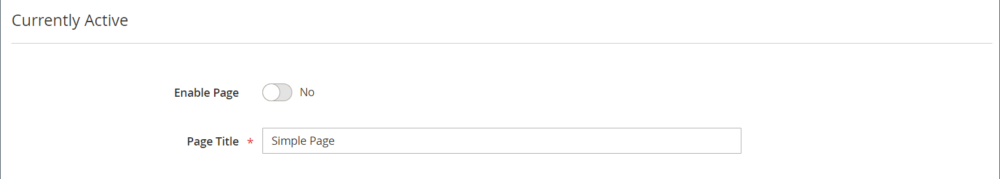
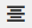
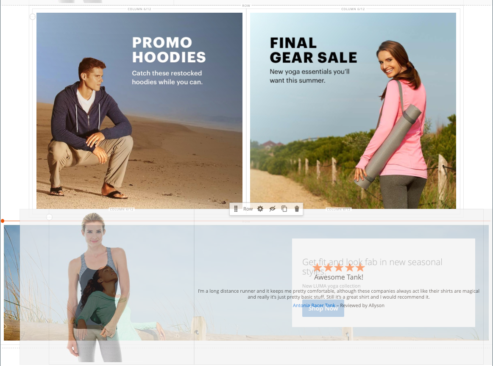

# [!DNL Page Builder] チュートリアル第 1 部：シンプルなページ

この 3 つのパートから成る演習に従って、 [!DNL Page Builder] workspace：独自のデザインのコンテンツに富んだページを簡単に作成できるシンプルなページを作成します。

{width="700" zoomable="yes"}

>[!NOTE]
>
>これらのチュートリアルの演習は、の最近の変更を反映して更新されました [!DNL Page Builder] workspace 2.4.1 リリース。 以前のAdobe Commerce リリースを使用している場合は、 [!DNL Page Builder] に含まれているチュートリアル演習 [[!DNL Commerce] 2.3 ユーザーガイド](https://docs.magento.com/user-guide/v2.3/cms/page-builder-learn.html).

## 始める前に

この演習を開始する前に、を増やすことを推奨します [管理セッションの有効期間](../systems/security-admin.md) を使用して、作業中にセッションがタイムアウトしないようにします。

必要なコンテンツ管理設定を確認します。

- で WYSIWYG エディターが有効になっている [WYSIWYG オプション](../content-design/editor.md#configure-the-editor) 設定。

- [!DNL Page Builder] では有効になっています [高度なコンテンツツール](setup.md) 設定。

### チュートリアル画像アセットのダウンロード

1. をダウンロード [`simple-page-assets`](./assets/simple-page-assets.zip) ファイルを作成し、ローカルシステムにファイルを保存します。

1. ダウンロードしたファイルに移動し、zip 形式のファイルを解凍します。

   Windows システムでは、右クリックして次のコマンドを選択します。 **[!UICONTROL Extract All]** ファイル。 次に、保存先フォルダーを選択し、 **[!UICONTROL Extract]**.

   Mac システムでは、zip ファイルをダブルクリックするだけで、抽出したファイルを保存先フォルダーに移動できます。

   フォルダーには、次の画像ファイルが含まれています。

   ![[!DNL Page Builder] チュートリアルファイル – 単純なページアセット](./assets/pb-tutorial-simple-page-assets.png){width="500"}

このチュートリアルの 3 つの部分を順番に実行します。

## パート 1：バナー付きフルブリード行

シンプルなページの演習のこの部分では、裁ち落とし行とバナーが満杯のページを作成します。 行の背景画像は、デスクトップとモバイルデバイスで異なります。

![[!DNL Page Builder] バナー付きフルブリードロー](./assets/pb-tutorial1-full-bleed-with-banner.png){width="700" zoomable="yes"}

### 手順 1：ページを作成する

1. 日 _Admin_ サイドバー、に移動 **[!UICONTROL Content]** > _[!UICONTROL Elements]_>**[!UICONTROL Pages]**.

1. 右上隅のをクリックします。 **[!UICONTROL Add New Page]** 次の手順を実行します。

   - このページがストアで公開されないようにするには、次を設定します **[!UICONTROL Enable Page]** 対象： `No`.

   - の場合 **[!UICONTROL Page Title]**、と入力します `Simple Page`.

   {width="600" zoomable="yes"}

1. を展開  この **[!UICONTROL Design]** セクション。

   に注意してください **[!UICONTROL Layout]** はに設定されています。 `Page -- Full Width` デフォルトでは。 5 つの標準に加えて [layout](../content-design/page-layout.md) オプション、 [!DNL Page Builder] ページ、カテゴリ、製品に全幅レイアウトを追加します。

1. サンプルデータが使用可能な場合は、を設定します **[!UICONTROL New Theme]** 対象： `Magento Luma`. それ以外の場合は、別の使用可能なテーマを選択するか、空白のままにしてデフォルトのテーマを使用できます。

   この _[!UICONTROL New Theme]_設定を使用して、デフォルトのテーマを上書きしたり、ページに別のテーマを適用したりできます。

   >[!NOTE]
   >
   >全幅レイアウトは、互換のでのみ使用できます [テーマ](../content-design/themes.md).

   {width="600" zoomable="yes"}

1. 右上隅のをクリックします。 **[!UICONTROL Save]**.

   ページを保存すると、名前 _シンプルなページ_ ページの左上隅に表示されます。

### 手順 2：行のフォーマット

1. を展開  この **[!UICONTROL Content]** セクション。

   このアクションにより、が表示されます [!DNL Page Builder] 空の行でプレビューします。

   >[!NOTE]
   >
   >この [コンテンツの見出し](workspace.md) フィールドはオプションです。 デフォルトでは、テーマに従って見出しレベル 1 （H1）の形式になっています。 この演習では、 _コンテンツの見出し_ は空白のままにします。

   {width="600" zoomable="yes"}

1. クリック **[!UICONTROL Edit with Page Builder]** またはコンテンツプレビュー領域内です。

   展開済み [!DNL Page Builder] [workspace](workspace.md)左側のパネルには、ステージでコンテンツを作成するためのコンテンツツールが表示されます。

1. 空の行の上にマウスポインターを置くと、ツールボックスが表示されます。

   各コンテンツコンテナには、同様のオプションのセットを持つツールボックスがあります。

   ![[!DNL Page Builder] 行ツールボックス](./assets/pb-layout-page-add-content-row-tools.png){width="600" zoomable="yes"}

1. 行ツールボックスで、 _設定_ （{width="20"} アイコン。

1. 次の下 _[!UICONTROL Appearance]_、を選択&#x200B;**全出血**.

   フルブリードアピアランスの設定では、行と背景のコンテンツ領域の左右の境界線がページの全幅に拡張されます。

   {width="600" zoomable="yes"}

1. にスクロール ダウンします。 _[!UICONTROL Advanced]_section と set all **[!UICONTROL Margins and Padding]**設定 `0`.

   この設定により、バナーが行の全幅を拡張します。

   {width="600" zoomable="yes"}

1. 設定を保存し、に戻るには [!DNL Page Builder] ワークスペースで、ページの上部までスクロールし、 **[!UICONTROL Save]** 右上隅

### 手順 3：バナーの追加

>[!NOTE]
>
>[!DNL Page Builder] には、という名前の新しいコンテンツタイプがあります _バナー_&#x200B;この手順で紹介します。 以前は何でしたか？ _バナー_ コンテンツ メニューのオプションが _動的ブロック_.

1. が含まれる [!DNL Page Builder] パネル、展開 **[!UICONTROL Media]** をドラッグします。 **バナー** ステージへのプレースホルダー。

   {width="600" zoomable="yes"}
1. バナーコンテナの上にマウスポインターを置くと、ツールボックスが表示されます。

   >[!NOTE]
   >
   >ステージに 2 つのコンテンツコンテナが追加され、それぞれに個別のツールボックスが表示されます。 バナーは行内にネストされているので、正しいツールボックスで作業していることを確認してください。

   ツールボックスに加えて、 _画像をアップロード_ および _ギャラリーから選択_ ボタンを使用すると、ステージから直接バナーに素早く変更を加えることができます。

   {width="600" zoomable="yes"}

1. バナーツールボックスで、 _設定_ （ {width="20"} ） アイコンをクリックします。

1. 次の下 _[!UICONTROL Appearance]_、を選択&#x200B;**[!UICONTROL Collage Right]**.

   右にコラージュ設定では、コンテンツがバナーの右側に配置されます。

   {width="600" zoomable="yes"}

1. にスクロール ダウンします。 _[!UICONTROL Background]_セクションに移動して、バナーの背景画像を設定します。

   - の場合 **[!UICONTROL Background Image]**&#x200B;を選択し、 **Upload**.

     {width="600" zoomable="yes"}

     抽出したシンプルなページアセットを保存したディレクトリに移動して、 `wide-banner-background.jpg` ファイル。

     画像がアップロードされ、アップロードされた画像のサムネールが表示されます。 ファイル名、画像のサイズおよびファイルサイズについては、以下で説明します。

     {width="600" zoomable="yes"}

   - の場合 **[!UICONTROL Background Mobile Image]**&#x200B;を選択し、 **Upload**.

     同じファイルディレクトリで、 `wide-banner-background-mobile.jpg` ファイル。

     モバイルの背景画像はモバイルデバイスで使用され、デスクトップブラウザーウィンドウのサイズがモバイルデバイスの幅に変更された場合にも使用されます。

     {width="600" zoomable="yes"}

   - ページの先頭までスクロールして戻り、 **[!UICONTROL Save]** 設定を保存し、に戻ります [!DNL Page Builder] ワークスペース。

     背景がステージ上に表示され、行の全幅を拡張します。

     {width="600" zoomable="yes"}

   行の右側にプレースホルダーテキストが表示されます。 このテキストの位置は、 _コラージュ権限_ 外観設定。

1. プレースホルダーテキストをクリックし、次のメッセージを 2 行で入力します。

   `Get fit and look fab in new seasonal styles.`

   `New LUMA yoga collection`

   テキストボックスの上にエディターツールバーが表示されます。 テキストの入力と書式設定は、ステージから直接行うことも、 _設定_ バナーのツールボックスで調整します。

   {width="600" zoomable="yes"}

1. テキストに書式を適用する：

   - テキストの 1 行目を選択します。 次に、の下にあるエディターツールバーで **形式**、を選択 `Heading 2`.

     {width="600" zoomable="yes"}

   - 2 行目のテキストを選択します。 次に、の下にあるエディターツールバーで **形式**、を選択 `Paragraph`.

   形式設定は、現在のテーマに関連付けられているスタイルシートのスタイルを適用します。

   {width="600" zoomable="yes"}
__

1. カーソルを合わせてバナーツールボックスを表示し、 _設定_ （ {width="20"} ）アイコンをもう一度クリックし、 _[!UICONTROL Content]_セクション。

   にテキストが表示されていることに注意してください。 _メッセージテキスト_ ボックス。 テキストの入力と編集は、ステージまたは _[!UICONTROL Content]_バナー設定の「」セクション。

   {width="600" zoomable="yes"}

1. 継続#セツゾク# _[!UICONTROL Content]_セクションで、バナーリンクとボタンを設定します。

   - を設定 **リンク** 対象： `Category`を選択し、 **[!UICONTROL Select]** カテゴリ ツリーを表示します。

   - を選択 `What's New` をリンクされたカテゴリとして設定します。

     {width="600" zoomable="yes"}

   - を設定 **[!UICONTROL Show Button]** 対象： `Always`.

   - の場合 **[!UICONTROL Button Text]**、と入力します `Shop Now` をボタンに表示されるテキストとして使用します。

   - の場合 **[!UICONTROL Button Type]**、を承認します `Primary` デフォルト。

     現在のテーマのボタンのスタイルによって、ボタンの形式が決まります。

1. バナーオーバーレイを設定します。

   オーバーレイを使用して、アピアランス設定で定義されたアクティブなコンテンツ領域に背景色を適用できます。 バナーの背景画像は、バナーの全幅に対して表示されたままになります。

   - を設定 **[!UICONTROL Show Overlay]** 対象： `Always`.

   - の場合 **[!UICONTROL Overlay Color]**&#x200B;次のいずれかの操作をおこないます。

      - カラーの四角形をクリックし、白いスウォッチを選択します。
      - 内をクリック _カラーなし_ テキストボックスに「」と入力 `White` または 16 進数値 `#ffffff`.

     次に、 **[!UICONTROL Apply]**.

     {width="600" zoomable="yes"}

   - ページの先頭までスクロールして戻り、 **[!UICONTROL Save]** 設定を保存し、に戻ります [!DNL Page Builder] ワークスペース。

     ボタンは、ステージのバナーメッセージの下に表示されます。

     {width="600" zoomable="yes"}

1. ステージの右上隅にあるをクリックします _全画面表示を閉じる_ （） アイコンをクリックします。

   このアイコンをクリックすると、に戻ります _[!UICONTROL Content]_プレビューが表示されたページの「」セクション。

   2 つのワークスペースモードは、必要に応じていつでも切り替えることができます。

1. 右上隅のをクリックします **[!UICONTROL Save]** 矢印と選択 **[!UICONTROL Save & Close]**.

1. プロンプトが表示されたら、 [キャッシュ管理](../systems/cache-management.md) ページ上部のメッセージ内のリンクをクリックし、無効なキャッシュを更新します。

## パート 2:2 つの等しい列を持つ行

演習のこの部分では、ページに行を追加し、その行を 2 つの等しい列に分割します。 次に、各列にリンク画像を追加します。 この手順では、新しい各行を最初の行の前に追加して、 [!DNL Page Builder] ステージに合わせてパネルを並べます。 演習の最後では、簡単なページの例と一致するように行を並べ替えます。

{width="600" zoomable="yes"}

### 手順 1：行を追加

1. ページグリッドで、を見つけます。 _シンプルなページ_ この練習の最初のパートで作成し、を選択していること **[!UICONTROL Edit]** が含まれる _[!UICONTROL Action]_列。

1. を展開  この **[!UICONTROL Content]** セクション。

1. クリック **[!UICONTROL Edit with Page Builder]** またはコンテンツプレビュー領域内です。

1. が含まれる [!DNL Page Builder] 下のパネル _[!UICONTROL Layout]_、ドラッグ：**[!UICONTROL Row]**プレースホルダーをステージに追加して、バナーの上に配置します。

   赤いガイドラインは、2 行の境界を示します。

   {width="600" zoomable="yes"}

1. 新しい行にカーソルを合わせてツールボックスを表示し、 _設定_ （ {width="20"} ） アイコンをクリックします。

   {width="600" zoomable="yes"}

1. 次の下 _[!UICONTROL Appearance]_、を承認します&#x200B;**含まれる**デフォルト設定。

   この設定により、テーマで定義されているページの幅に行のコンテンツ領域が制限されます。

   {width="600" zoomable="yes"}

1. 右上隅のをクリックします。 **[!UICONTROL Save]** 設定を保存し、に戻ります [!DNL Page Builder] ワークスペース。

### 手順 2：列の追加

1. が含まれる [!DNL Page Builder] 下のパネル _[!UICONTROL Layout]_、ドラッグ：**[!UICONTROL Column]**新しい行へのプレースホルダー。

   {width="600" zoomable="yes"}

   これで、行が同じ幅の 2 つの列に分割されました。 各列は、コンテンツ用の個別のコンテナであり、専用のオプションのツールボックスを持ちます。

   {width="600" zoomable="yes"}

1. 最初の列の左上隅にある円形をクリックします _グリッド_ コントロール （）を選択して、グリッドガイドラインを表示します。

   グリッドにより、コンテンツの一貫性が確保され、デスクトップとモバイルデバイスの両方で正しくレンダリングされます。 グリッド サイズの設定については、 [設定 [!DNL Page Builder]](setup.md#configure-page-builder) セクション： [!DNL Page Builder] 設定トピック。

   各列コンテナの上部の境界線の括弧内の数字（6/12）は、各列のグリッド分割数と、行内の分割数の合計を示します。

   {width="600" zoomable="yes"}

### 手順 3：リンクを使用した画像の追加

この手順では、画像をバナーにアップロードする方法を説明します。

1. が含まれる [!DNL Page Builder] パネルの、 **[!UICONTROL Media]** を選択してドラッグ **[!UICONTROL Image]** 最初の列へのプレースホルダー。

   {width="600" zoomable="yes"}

1. サンプル画像をプレースホルダに挿入します。

   {width="600" zoomable="yes"}

   システム上の画像の場合は、次のいずれかの方法を選択できます。

   - **画像ファイルのアップロード**：最初の列で、 **[!UICONTROL Upload Image]**. 次に、抽出したシンプルなページアセットを保存したディレクトリに移動して、を選択します。 `small-banner-1.jpg` ファイル。

     {width="600" zoomable="yes"}

     このアクションを繰り返して、 `small-banner-2.jpg` ファイルを 2 番目の列に追加します。

   - **画像ファイルをドラッグ**：デスクトップで、シンプルページアセットフォルダーを開いて、を使用している管理者ブラウザーウィンドウの横に配置します [!DNL Page Builder] ステージ。 次に、ファイルをドラッグします `small-banner-1.jpg` simple page assets フォルダーから、最初の列にドロップします。

     {width="600" zoomable="yes"}

     このアクションを繰り返して、 `small-banner-2.jpg` ファイルを 2 番目の列に追加します。

1. 各画像にリンクするページをカタログから決定します。

1. 最初の列の画像の上にマウスポインターを置いてツールボックスを表示し、 _設定_ （ {width="20"} ） アイコンをクリックします。

   {width="600" zoomable="yes"}

1. 画像をカテゴリにリンクする：

   - 下にスクロールして設定 **リンク** 対象： `Category`.

   - カテゴリツリーでドリルダウンし、 `Men's Hoodies & Sweatshirt` カテゴリ。

   - 右上隅に **[!UICONTROL Save]** 設定を選択し、に戻ります。 [!DNL Page Builder] ワークスペース。

1. 前の手順を繰り返して、2 列目の画像をにリンクします _歯車_ カテゴリ。

1. ステージの右上隅にあるをクリックします _全画面表示を閉じる_ （） アイコンをクリックします。

   このアイコンをクリックすると、に戻ります _[!UICONTROL Content]_プレビューが表示されたページの「」セクション。

1. 右上隅のをクリックします **[!UICONTROL Save]** 矢印と選択 **[!UICONTROL Save & Close]**.

1. プロンプトが表示されたら、 [キャッシュ管理](../systems/cache-management.md) ページ上部のメッセージ内のリンクをクリックし、無効なキャッシュを更新します。

## パート 3：列が等しくない全幅の行

このページの最後の行には、製品レビューのコンテンツが表示されます。 全幅の行を追加し、幅の異なる 2 つの列に分割します。 最初の列に背景画像が追加され、一致する背景色が行に適用されて、統一された効果が得られます。

{width="500"}

### 手順 1：行を追加

1. ページグリッドで、を見つけます。 _シンプルなページ_ この練習の最初のパートで作成し、を選択していること **[!UICONTROL Edit]** が含まれる _[!UICONTROL Action]_列。

1. を展開  この **[!UICONTROL Content]** セクション。

1. クリック **[!UICONTROL Edit with Page Builder]** またはコンテンツプレビュー領域内です。

1. が含まれる [!DNL Page Builder] 下のパネル _[!UICONTROL Layout]_、ドラッグ：**[!UICONTROL Row]**ステージにプレースホルダーを配置し、この演習の 2 番目の部分で作成した行の上に配置します。

   赤いガイドラインは、2 行の境界を示します。

   {width="600" zoomable="yes"}

1. 新しい行にカーソルを合わせてツールボックスを表示し、 _設定_ （{width="20"} ） アイコンをクリックします。

   {width="600" zoomable="yes"}

1. の下にある行を編集ページで _[!UICONTROL Appearance]_、を選択&#x200B;**[!UICONTROL Full Width]**.

   この設定により、コンテンツ領域が、テーマで定義されている最大ページ幅に制限されます。 背景色や画像に制限はなく、行の全幅を広げます。

   {width="600" zoomable="yes"}

1. が含まれる _[!UICONTROL Background]_セクション、を入力 `#f1f1f1` as the **[!UICONTROL Background Color]**.

   {width="600" zoomable="yes"}

1. にスクロール ダウンします。 _[!UICONTROL Advanced]_section と set all **余白とパディング**値：至 `0`.

   {width="600" zoomable="yes"}

1. ページの先頭までスクロールして戻り、 **[!UICONTROL Save]** 設定を保存し、に戻ります [!DNL Page Builder] ワークスペース。

   行の背景色が淡いベージュになります。

   {width="600" zoomable="yes"}

### 手順 2：異なる幅の列の追加

1. が含まれる [!DNL Page Builder] 下のパネル _[!UICONTROL Layout]_、ドラッグ：**[!UICONTROL Column]**ステージの一番上の行へのプレースホルダー。

   {width="600" zoomable="yes"}

1. 最初の列の右側の境界線をドラッグして、「4/12」にします（`4/12`）をグリッド上に配置します。

   2 番目の列のサイズは、8/12 に調整されます（`8/12`）に設定します。

   {width="600" zoomable="yes"}

1. 最初の列コンテナにポインタを合わせてツールボックスを表示し、 _設定_ （ {width="20"} ） アイコンをクリックします。

1. にスクロール ダウンします。 _[!UICONTROL Advanced]_section と set all **余白とパディング**値：至 `0`.

   {width="600" zoomable="yes"}

1. ページの先頭までスクロールして戻り、 **[!UICONTROL Save]** 設定を保存し、に戻ります [!DNL Page Builder] ワークスペース。

### 手順 3：最初の列への画像の追加

1. が含まれる [!DNL Page Builder] パネル、展開 **[!UICONTROL Media]** をドラッグして **[!UICONTROL Image]** 最初の列にコンテンツタイプを追加します。

   {width="600" zoomable="yes"}

1. 画像のプレースホルダーでをクリックします **[!UICONTROL Upload Image]**.

   {width="600" zoomable="yes"}

1. 抽出したシンプルなページアセットを保存したディレクトリに移動して、 `review-image.jpg` ファイル。

   アップロードされた画像は最初の列に表示され、行の背景色とシームレスにブレンドされます。

   {width="600" zoomable="yes"}

### 手順 4:2 列目へのレビューコンテンツの追加

行の 2 番目の列には、顧客レビューのコンテンツ（5 つ星評価の画像と書式設定されたテキストメッセージを含む）が含まれている必要があります。

1. が含まれる [!DNL Page Builder] パネルの、 **[!UICONTROL Elements]** 「」セクションをドラッグします。 **[!UICONTROL Text]** 2 番目の列にコンテンツタイプを追加します。

   {width="600" zoomable="yes"}

1. テキスト要素内をクリックして、エディターツールバーを表示します。

1. ツールバーで、 _画像の挿入_ （） アイコンをクリックし、次の操作を実行します。

   {width="600" zoomable="yes"}

   - が含まれる _[!UICONTROL Insert/edit image]_ダイアログで、_&#x200B;検索&#x200B;_（  ）アイコンが表示されます。_[!UICONTROL Source]_ フィールド。

     {width="600" zoomable="yes"}

   - 日 _[!UICONTROL Select Images]_ページ、クリック&#x200B;**[!UICONTROL Choose Files]**.

   - シンプルなページアセットを保存したフォルダーで、を選択します。 `rating.png`.

   - ページに戻り、画像タイルをダブルクリックして選択し、その URL をソースフィールドに挿入します。

     {width="600" zoomable="yes"}

   - の場合 **[!UICONTROL Image Description]**、と入力します `5-Star Rating` をクリックして、 **[!UICONTROL OK]** をクリックして、画像を列に挿入します。

   - エディターツールバーで、 **中央揃え** （）を選択して、画像を列の中央に配置します。

     {width="600" zoomable="yes"}

1. 5 つ星の画像の直後に挿入ポイントを置き、Enter/Return キーを押して新しい行を開始し、次のテキストを入力します。

   `Awesome Tank!`

   `I'm a long distance runner and it keeps me pretty comfortable, although these companies always act like their shirts are magical and really it's just pretty basic stuff. Still it's a great shirt, and I would recommend it.`

   `Antonia Racer Tank – Reviewed by Allyson`

   入力したテキストが中央揃えになります。

   {width="600" zoomable="yes"}

1. テキストの書式を設定します。

   - テキストの 1 行目とエディターツールバーの下の任意の場所をクリックします **形式**、を選択 `Heading 2`.

   - 残りのテキストを選択し、の下にあるエディターツールバーで **形式**、を選択 `Paragraph`.

   テキストは、テーマに関連付けられたスタイルシートに従って書式設定されます。

1. コンテンツを垂直方向に列の中央に配置できるように、画像のサイズを取得します。

   - 最初の列の画像の上にマウスポインターを置いてツールボックスを表示し、 _設定_ （{width="20"} ） アイコンをクリックします。

   - 画像のサムネールの下に、画像のサイズが表示されます。

     {width="600" zoomable="yes"}

   - 右上隅のをクリックします。 **閉じる**.

1. コンテンツを 2 列目に垂直方向の中央に配置します。

   - 2 番目の列にカーソルを合わせてツールボックスを表示し、 _設定_ （{width="20"} ） アイコンをクリックします。

   >[!NOTE]
   >
   >正しいツールボックスを表示するには、必ずテキストコンテナではなく列コンテナを選択します。

   - の場合 **[!UICONTROL Minimum Height]**、と入力します `450` 最初の列の画像の高さをピクセル単位で指定します。

   - を設定 **[!UICONTROL Vertical Alignment]** 対象： `Center`.

   {width="600" zoomable="yes"}

1. にスクロール ダウンします。 _[!UICONTROL Advanced]_section と set all **[!UICONTROL Margins and Padding]**値をゼロに（ `0` ）に設定します。

   {width="600" zoomable="yes"}

1. ページの先頭までスクロールして戻り、右上隅のをクリックします。 **[!UICONTROL Save]** 設定を保存し、に戻ります [!DNL Page Builder] ワークスペース。

   {width="600" zoomable="yes"}

### 手順 5：カタログ製品リンクの挿入

1. 「」を選択します `Antonia Racer Tank` テキストを入力し、 _リンクを挿入_ （） アイコンが表示されます。

1. が含まれる _リンクを挿入_ ダイアログで、カタログ製品へのリンクを指定します。

   - 製品を入力 **[!UICONTROL URL]**.

     相対 URL または完全修飾 URL のいずれかを入力できます。 この例では、次の相対リンクが入力されます。

     `../antonia-racer-tank.html`

   - （オプション） **タイトル**、製品名を入力します。

     タイトルリンク属性は、一部のブラウザーでツールヒントとして使用されます。

     {width="600" zoomable="yes"}

   - 完了したら、 **[!UICONTROL OK]** をクリックしてリンクを保存します。

     リンクされたテキストがバナーでハイライト表示されます。

     {width="600" zoomable="yes"}

1. ステージの右上隅にあるをクリックします _全画面表示を閉じる_ （） アイコンをクリックします。

   このアイコンをクリックすると、に戻ります _[!UICONTROL Content]_プレビューが表示されたページの「」セクション。

1. 右上隅のをクリックします。 **[!UICONTROL Save]**.

### 手順 6：行の並べ替え

3 つの行がすべて完了したら、最後の手順は、元の行に一致するように行を再配置することです _シンプルなページ_ 例えば、のようになります。 元の例と一致させるには、最初の行を一番下に、最後の行を一番上に移動する必要があります。

1. 必要に応じて、を展開  この **[!UICONTROL Content]** セクション。

1. クリック **[!UICONTROL Edit with Page Builder]** またはコンテンツプレビュー領域内です。

1. ステージの最初の行の上にマウスポインターを置いてツールボックスを表示し、 _移動_ （ ） アイコンをクリックします。

   {width="600" zoomable="yes"}

1. マウスボタンを押したまま、行内のすべてのコンテンツが選択されていることを確認し、行をページ下部の赤いガイドラインの下にドラッグします。

   >[!NOTE]
   >
   >コンテンツの一部（画像など）のみを誤って移動した場合は、コンテンツが属する場所にコンテンツを戻して、もう一度試してください。

   {width="600" zoomable="yes"}

1. この手順を繰り返して、1 行目を 2 行目に移動します。

   ページの行の順序が、シンプルなページの例と一致するようになりました。

1. ステージの右上隅にあるをクリックします _全画面表示を閉じる_ （） アイコンをクリックします。

   このアイコンをクリックすると、に戻ります _[!UICONTROL Content]_プレビューが表示されたページの「」セクション。

1. 右上隅のをクリックします **[!UICONTROL Save]** 矢印と選択 **[!UICONTROL Save & Close]**.

1. プロンプトが表示されたら、 [キャッシュ管理](../systems/cache-management.md) ページ上部のメッセージ内のリンクをクリックし、無効なキャッシュを更新します。

これで、シンプルなページの演習は完了です。 作成した作業は保持しておくと、後で参照できます。

準備ができたら、次に進みます。 [パート 2：ブロック](2-blocks.md).
