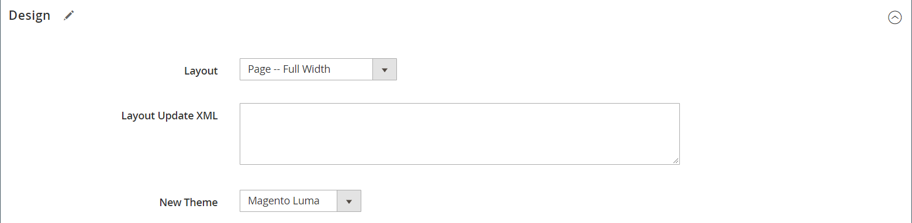
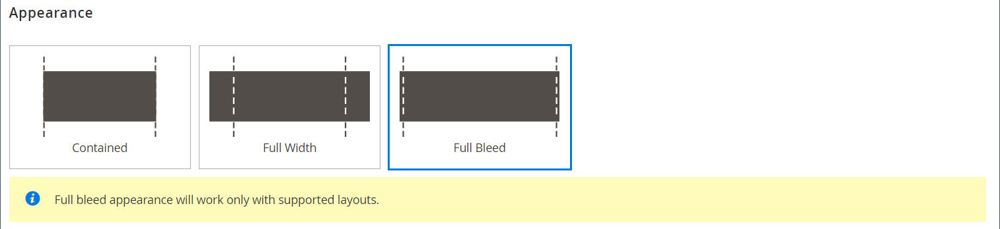
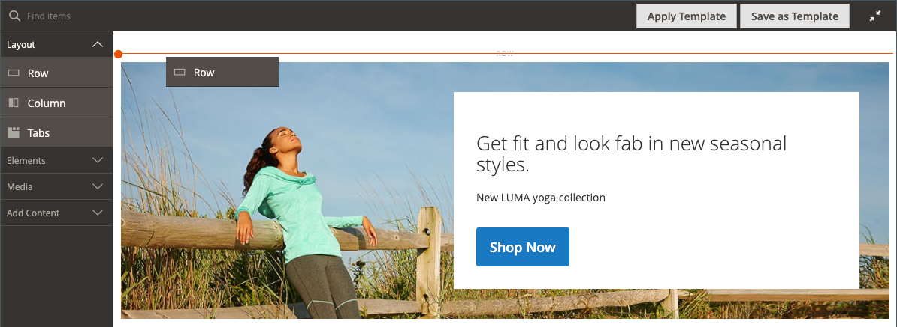
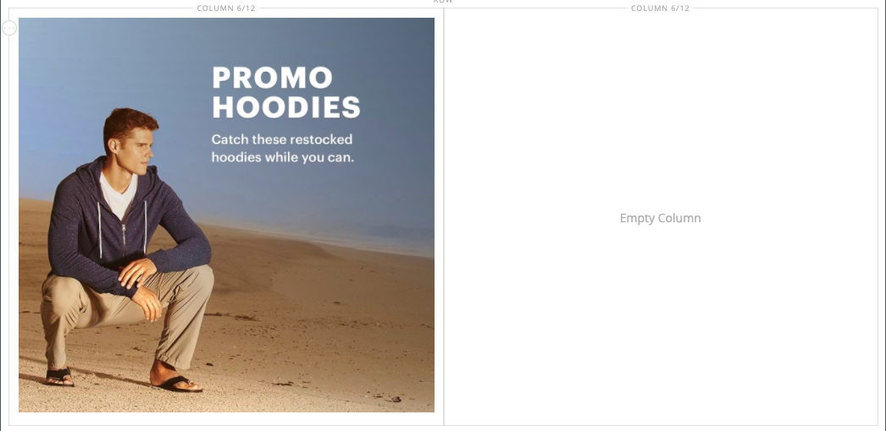
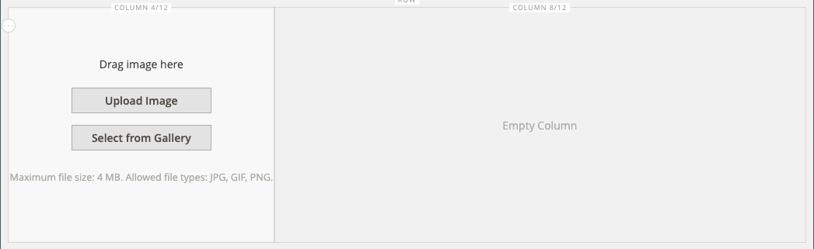
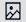

# [!DNL Page Builder] チュートリアル第 1 部：シンプルなページ

この 3 部構成の演習に従って、独自のデザインのコンテンツに富んだページを簡単に作成できるシンプルなページを作成することで、[!DNL Page Builder] Workspace に精通します。

{width="700" zoomable="yes"}

>[!NOTE]
>
>これらのチュートリアルの演習は、2.4.1 リリースの [!DNL Page Builder] ワークスペースに対する最近の変更を反映して更新されました。

## 始める前に

この演習を開始する前に、[ 管理者セッションの有効期間 ](../systems/security-admin.md) を増やして、作業中にセッションがタイムアウトしないようにすることをお勧めします。

必要なコンテンツ管理設定を確認します。

- WYSIWYG エディターは、[WYSIWYG オプション ](../content-design/editor.md#configure-the-editor) 設定で有効になっています。

- [Advanced Content Tools](setup.md) 設定で [!DNL Page Builder] が有効になっている。

### チュートリアル画像アセットのダウンロード

1. [`simple-page-assets`](./assets/simple-page-assets.zip) ファイルをダウンロードし、ローカルシステムに保存します。

1. ダウンロードしたファイルに移動し、zip 形式のファイルを解凍します。

   Windows システムでは、右クリックしてファイル **[!UICONTROL Extract All]** 選択します。 次に、宛先フォルダーを選択し、「**[!UICONTROL Extract]**」をクリックします。

   Mac システムでは、zip ファイルをダブルクリックするだけで、抽出したファイルを保存先フォルダーに移動できます。

   フォルダーには、次の画像ファイルが含まれています。

   ![[!DNL Page Builder] チュートリアルファイル – 単純なページアセット ](./assets/pb-tutorial-simple-page-assets.png){width="500"}

このチュートリアルの 3 つの部分を順番に実行します。

## パート 1：バナー付きフルブリード行

シンプルなページの演習のこの部分では、裁ち落とし行とバナーが満杯のページを作成します。 行の背景画像は、デスクトップとモバイルデバイスで異なります。

バ ![[!DNL Page Builder] ナー付きフルブリードロー ](./assets/pb-tutorial1-full-bleed-with-banner.png){width="700" zoomable="yes"}

### 手順 1：ページを作成する

1. _管理者_ サイドバーで、**[!UICONTROL Content]**/_[!UICONTROL Elements]_/**[!UICONTROL Pages]**&#x200B;に移動します。

1. 右上隅の「**[!UICONTROL Add New Page]**」をクリックして、次の操作を行います。

   - このページがストアで公開されないようにするには、**[!UICONTROL Enable Page]** を `No` に設定します。

   - **[!UICONTROL Page Title]** には、`Simple Page` と入力します。

   {width="600" zoomable="yes"}

1. 「」を展開し、「**[!UICONTROL Design]**」セクションを展開します。

   **[!UICONTROL Layout]** は、デフォルトで `Page -- Full Width` に設定されています。 5 つの標準の [ レイアウト ](../content-design/page-layout.md) オプションに加えて、[!DNL Page Builder] は、ページ、カテゴリ、製品に全幅のレイアウトを追加します。

1. サンプルデータが使用可能な場合は、**[!UICONTROL New Theme]** を `Magento Luma` に設定します。 それ以外の場合は、別の使用可能なテーマを選択するか、空白のままにしてデフォルトのテーマを使用できます。

   _[!UICONTROL New Theme]_&#x200B;設定を使用して、デフォルトのテーマを上書きしたり、ページに別のテーマを適用したりできます。

   >[!NOTE]
   >
   >全幅レイアウトは、互換性のある [ テーマ ](../content-design/themes.md) でのみ使用できます。

   {width="600" zoomable="yes"}

1. 右上隅の「**[!UICONTROL Save]**」をクリックします。

   ページを保存すると、ページの左上隅に _シンプルなページ_ という名前が表示されます。

### 手順 2：行のフォーマット

1. 「」を展開し、「**[!UICONTROL Content]**」セクションを展開します。

   このアクションは、[!DNL Page Builder] プレビューを空の行で表示します。

   >[!NOTE]
   >
   >「[ コンテンツ見出し ](workspace.md)」フィールドはオプションです。 デフォルトでは、テーマに従って見出しレベル 1 （H1）の形式になっています。 この演習では、_コンテンツ見出し_ は空白のままになります。

   {width="600" zoomable="yes"}

1. コンテンツプレビュー領域の **[!UICONTROL Edit with Page Builder]** または内側をクリックします。

   展開された [!DNL Page Builder] [ ワークスペース ](workspace.md) の左側のパネルには、ステージでコンテンツを作成するためのコンテンツツールが表示されます。

1. 空の行の上にマウスポインターを置くと、ツールボックスが表示されます。

   各コンテンツコンテナには、同様のオプションのセットを持つツールボックスがあります。

   ![[!DNL Page Builder] 行ツールボックス ](./assets/pb-layout-page-add-content-row-tools.png){width="600" zoomable="yes"}

1. 行ツールボックスで、_設定_ （{width="20"} アイコンを選択します。

1. 「_[!UICONTROL Appearance]_」で「**フルブリードアウト**」を選択します。

   フルブリードアピアランスの設定では、行と背景のコンテンツ領域の左右の境界線がページの全幅に拡張されます。

   {width="600" zoomable="yes"}

1. 「_[!UICONTROL Advanced]_」セクションまでスクロールし、すべての&#x200B;**[!UICONTROL Margins and Padding]**&#x200B;設定を「`0`」に設定します。

   この設定により、バナーが行の全幅を拡張します。

   {width="600" zoomable="yes"}

1. 設定を保存して [!DNL Page Builder] ワークスペースに戻るには、ページの上部まで上にスクロールし、右上隅の「**[!UICONTROL Save]**」をクリックします。

### 手順 3：バナーの追加

>[!NOTE]
>
>[!DNL Page Builder] には、この手順で紹介する _バナー_ という新しいコンテンツタイプがあります。 以前はコンテンツメニューの _バナー_ オプションでしたが、現在は _動的ブロック_ になっています。

1. [!DNL Page Builder] パネルで **[!UICONTROL Media]** を展開し、「**バナー**」プレースホルダーをステージにドラッグします。

   {width="600" zoomable="yes"}
1. バナーコンテナの上にマウスポインターを置くと、ツールボックスが表示されます。

   >[!NOTE]
   >
   >ステージに 2 つのコンテンツコンテナが追加され、それぞれに個別のツールボックスが表示されます。 バナーは行内にネストされているので、正しいツールボックスで作業していることを確認してください。

   ツールボックスに加えて、_画像をアップロード_ ボタンと _ギャラリーから選択_ ボタンが含まれており、ステージから直接バナーに素早く変更を加えることができます。

   {width="600" zoomable="yes"}

1. バナーツールボックスで、_設定_ （{width="20"}）アイコンを選択します。

1. 「_[!UICONTROL Appearance]_」で、「**[!UICONTROL Collage Right]**」を選択します。

   右にコラージュ設定では、コンテンツがバナーの右側に配置されます。

   {width="600" zoomable="yes"}

1. _[!UICONTROL Background]_&#x200B;のセクションまでスクロールし、バナーの背景画像を設定します。

   - **[!UICONTROL Background Image]** しくは、「**アップロード**」をクリックします。

     {width="600" zoomable="yes"}

     抽出したシンプルなページアセットを保存したディレクトリに移動して、`wide-banner-background.jpg` ファイルを選択します。

     画像がアップロードされ、アップロードされた画像のサムネールが表示されます。 ファイル名、画像のサイズおよびファイルサイズについては、以下で説明します。

     {width="600" zoomable="yes"}

   - **[!UICONTROL Background Mobile Image]** しくは、「**アップロード**」をクリックします。

     同じファイルディレクトリで、`wide-banner-background-mobile.jpg` ファイルを選択します。

     モバイルの背景画像はモバイルデバイスで使用され、デスクトップブラウザーウィンドウのサイズがモバイルデバイスの幅に変更された場合にも使用されます。

     {width="600" zoomable="yes"}

   - ページの上部までスクロールして戻り、「**[!UICONTROL Save]**」をクリックして設定を保存し、[!DNL Page Builder] ワークスペースに戻ります。

     背景がステージ上に表示され、行の全幅を拡張します。

     {width="600" zoomable="yes"}

   行の右側にプレースホルダーテキストが表示されます。 このテキストの位置は、「右にコラージュ _の外観の設定を反映し_ います。

1. プレースホルダーテキストをクリックし、次のメッセージを 2 行で入力します。

   `Get fit and look fab in new seasonal styles.`

   `New LUMA yoga collection`

   テキストボックスの上にエディターツールバーが表示されます。 テキストの入力と書式設定は、ステージから直接行うことも、バナーツールボックスの _設定_ を選択して行うこともできます。

   {width="600" zoomable="yes"}

1. テキストに書式を適用する：

   - テキストの 1 行目を選択します。 次に、エディターツールバーの **形式** の下で、`Heading 2` を選択します。

     {width="600" zoomable="yes"}

   - 2 行目のテキストを選択します。 次に、エディターツールバーの **形式** の下で、`Paragraph` を選択します。

   形式設定は、現在のテーマに関連付けられているスタイルシートのスタイルを適用します。

   {width="600" zoomable="yes"}
__

1. カーソルを合わせてバナーツールボックスを表示し、_設定_ （{width="20"}）アイコンをもう一度選択してから、「_[!UICONTROL Content]_」セクションまでスクロールします。

   テキストが「_メッセージテキスト_ ボックスに表示されます。 テキストの入力と編集は、ステージまたはバナー設定の _[!UICONTROL Content]_&#x200B;セクションから行うことができます。

   {width="600" zoomable="yes"}

1. _[!UICONTROL Content]_&#x200B;のセクションに進み、バナーリンクとボタンを設定します。

   - **リンク** を `Category` に設定し、**[!UICONTROL Select]** をクリックしてカテゴリツリーを表示します。

   - リンクされたカテゴリとして「`What's New`」を選択します。

     {width="600" zoomable="yes"}

   - **[!UICONTROL Show Button]** を `Always` に設定します。

   - **[!UICONTROL Button Text]** の場合、ボタンに表示するテキストとして `Shop Now` と入力します。

   - **[!UICONTROL Button Type]** の場合は、`Primary` のデフォルトを受け入れます。

     現在のテーマのボタンのスタイルによって、ボタンの形式が決まります。

1. バナーオーバーレイを設定します。

   オーバーレイを使用して、アピアランス設定で定義されたアクティブなコンテンツ領域に背景色を適用できます。 バナーの背景画像は、バナーの全幅に対して表示されたままになります。

   - **[!UICONTROL Show Overlay]** を `Always` に設定します。

   - **[!UICONTROL Overlay Color]** の場合、次のいずれかの操作を行います。

      - カラーの四角形をクリックし、白いスウォッチを選択します。
      - 「_カラーなし_」テキストボックスをクリックし、`White` または 16 進数値 `#ffffff` を入力します。

     次に、「**[!UICONTROL Apply]**」をクリックします。

     {width="600" zoomable="yes"}

   - ページの上部までスクロールして戻り、「**[!UICONTROL Save]**」をクリックして設定を保存し、[!DNL Page Builder] ワークスペースに戻ります。

     ボタンは、ステージのバナーメッセージの下に表示されます。

     {width="600" zoomable="yes"}

1. ステージの右上隅にある _フルスクリーンを閉じる_ （）アイコンをクリックします。

   このアイコンをクリックすると、ページの「_[!UICONTROL Content]_」セクションに戻り、プレビューが表示されます。

   2 つのワークスペースモードは、必要に応じていつでも切り替えることができます。

1. 右上隅の **[!UICONTROL Save]** 矢印をクリックし、「**[!UICONTROL Save & Close]**」を選択します。

1. プロンプトが表示されたら、ページ上部のメッセージにある [ キャッシュ管理 ](../systems/cache-management.md) リンクをクリックし、無効なキャッシュを更新します。

## パート 2:2 つの等しい列を持つ行

演習のこの部分では、ページに行を追加し、その行を 2 つの等しい列に分割します。 次に、各列にリンク画像を追加します。 指示では、新しい行がそれぞれ最初の行の前に追加され、[!DNL Page Builder] のパネルがステージに合うようになります。 演習の最後では、簡単なページの例と一致するように行を並べ替えます。

{width="600" zoomable="yes"}

### 手順 1：行を追加

1. ページグリッドで、この演習の最初の部分で作成した _シンプルなページ_ を見つけ、_[!UICONTROL Action]_&#x200B;の列の&#x200B;**[!UICONTROL Edit]**&#x200B;を選択します。

1. 「」を展開し、「**[!UICONTROL Content]**」セクションを展開します。

1. コンテンツプレビュー領域の **[!UICONTROL Edit with Page Builder]** または内側をクリックします。

1. _[!UICONTROL Layout]_&#x200B;の下の [!DNL Page Builder] パネルで、**[!UICONTROL Row]**&#x200B;プレースホルダーをステージにドラッグし、バナーの上に配置します。

   赤いガイドラインは、2 行の境界を示します。

   {width="600" zoomable="yes"}

1. 新しい行にカーソルを合わせてツールボックスを表示し、「_設定_」（{width="20"}）アイコンを選択します。

   {width="600" zoomable="yes"}

1. 「_[!UICONTROL Appearance]_」で、「含まれる&#x200B;**デフォルト設定**&#x200B;を受け入れます。

   この設定により、テーマで定義されているページの幅に行のコンテンツ領域が制限されます。

   {width="600" zoomable="yes"}

1. 右上隅の「**[!UICONTROL Save]**」をクリックして設定を保存し、[!DNL Page Builder] ワークスペースに戻ります。

### 手順 2：列の追加

1. [!DNL Page Builder] パネルの _[!UICONTROL Layout]_&#x200B;の下で、**[!UICONTROL Column]**&#x200B;のプレースホルダーを新しい行にドラッグします。

   {width="600" zoomable="yes"}

   これで、行が同じ幅の 2 つの列に分割されました。 各列は、コンテンツ用の個別のコンテナであり、専用のオプションのツールボックスを持ちます。

   {width="600" zoomable="yes"}

1. 最初の列の左上隅にある円形の _Grid_ コントロール （）をクリックして、グリッド ガイドラインを表示します。

   グリッドにより、コンテンツの一貫性が確保され、デスクトップとモバイルデバイスの両方で正しくレンダリングされます。 グリッド サイズの構成については、「[!DNL Page Builder] 設定」トピックの [ 構成  [!DNL Page Builder]](setup.md#configure-page-builder) セクションを参照してください。

   各列コンテナの上部の境界線の括弧内の数字（6/12）は、各列のグリッド分割数と、行内の分割数の合計を示します。

   {width="600" zoomable="yes"}

### 手順 3：リンクを使用した画像の追加

この手順では、画像をバナーにアップロードする方法を説明します。

1. [!DNL Page Builder] パネルで、「**[!UICONTROL Media]**」セクションを展開し、**[!UICONTROL Image]** プレースホルダーを最初の列にドラッグします。

   {width="600" zoomable="yes"}

1. サンプル画像をプレースホルダに挿入します。

   {width="600" zoomable="yes"}

   システム上の画像の場合は、次のいずれかの方法を選択できます。

   - **画像ファイルをアップロードします**：最初の列で、「アップロー **[!UICONTROL Upload Image]**」をクリックします。 次に、抽出したシンプルなページアセットを保存したディレクトリに移動し、`small-banner-1.jpg` ファイルを選択します。

     {width="600" zoomable="yes"}

     この操作を繰り返して、`small-banner-2.jpg` ファイルを 2 番目の列に追加します。

   - **画像ファイルをドラッグします**: デスクトップで、シンプルページアセットフォルダーを開き、[!DNL Page Builder] のステージを操作している管理者ブラウザーウィンドウの横に配置します。 次に、ファイル `small-banner-1.jpg` を simple page assets フォルダーからドラッグし、最初の列にドロップします。

     {width="600" zoomable="yes"}

     この操作を繰り返して、`small-banner-2.jpg` ファイルを 2 番目の列に追加します。

1. 各画像にリンクするページをカタログから決定します。

1. 最初の列の画像の上にマウスポインターを置くと、ツールボックスが表示され、_設定_ （{width="20"}）アイコンを選択します。

   {width="600" zoomable="yes"}

1. 画像をカテゴリにリンクする：

   - 下にスクロールして、**リンク** を `Category` に設定します。

   - カテゴリツリーでドリルダウンし、`Men's Hoodies & Sweatshirt` のカテゴリを選択します。

   - 右上隅にある設定を **[!UICONTROL Save]** リックし、[!DNL Page Builder] ワークスペースに戻ります。

1. 前の手順を繰り返して、2 列目の画像を _歯車_ カテゴリにリンクします。

1. ステージの右上隅にある _フルスクリーンを閉じる_ （）アイコンをクリックします。

   このアイコンをクリックすると、ページの「_[!UICONTROL Content]_」セクションに戻り、プレビューが表示されます。

1. 右上隅の **[!UICONTROL Save]** 矢印をクリックし、「**[!UICONTROL Save & Close]**」を選択します。

1. プロンプトが表示されたら、ページ上部のメッセージに含まれている [ キャッシュ管理 ](../systems/cache-management.md) リンクをクリックし、無効なキャッシュを更新します。

## パート 3：列が等しくない全幅の行

このページの最後の行には、製品レビューのコンテンツが表示されます。 全幅の行を追加し、幅の異なる 2 つの列に分割します。 最初の列に背景画像が追加され、一致する背景色が行に適用されて、統一された効果が得られます。

{width="500"}

### 手順 1：行を追加

1. ページグリッドで、この演習の最初の部分で作成した _シンプルなページ_ を見つけ、_[!UICONTROL Action]_&#x200B;の列の&#x200B;**[!UICONTROL Edit]**&#x200B;を選択します。

1. 「」を展開し、「**[!UICONTROL Content]**」セクションを展開します。

1. コンテンツプレビュー領域の **[!UICONTROL Edit with Page Builder]** または内側をクリックします。

1. _[!UICONTROL Layout]_&#x200B;の下の [!DNL Page Builder] パネルで、**[!UICONTROL Row]**&#x200B;プレースホルダーをステージにドラッグし、この演習の 2 番目の部分で作成した行の上に配置します。

   赤いガイドラインは、2 行の境界を示します。

   {width="600" zoomable="yes"}

1. 新しい行にカーソルを合わせてツールボックスを表示し、_設定_ （{width="20"}）アイコンを選択します。

   {width="600" zoomable="yes"}

1. _[!UICONTROL Appearance]_&#x200B;の下の [ 行の編集 ] ページで、[**[!UICONTROL Full Width]**] を選択します。

   この設定により、コンテンツ領域が、テーマで定義されている最大ページ幅に制限されます。 背景色や画像に制限はなく、行の全幅を広げます。

   {width="600" zoomable="yes"}

1. 「_[!UICONTROL Background]_」セクションで、**[!UICONTROL Background Color]**&#x200B;として `#f1f1f1` と入力します。

   {width="600" zoomable="yes"}

1. _[!UICONTROL Advanced]_&#x200B;セクションまで下にスクロールし、すべての&#x200B;**余白とパディング**&#x200B;の値を `0` に設定します。

   {width="600" zoomable="yes"}

1. ページの上部までスクロールして戻り、「**[!UICONTROL Save]**」をクリックして設定を保存し、[!DNL Page Builder] ワークスペースに戻ります。

   行の背景色が淡いベージュになります。

   {width="600" zoomable="yes"}

### 手順 2：異なる幅の列の追加

1. _[!UICONTROL Layout]_&#x200B;の下の [!DNL Page Builder] パネルで、**[!UICONTROL Column]**&#x200B;のプレースホルダーをステージの一番上の行にドラッグします。

   {width="600" zoomable="yes"}

1. 最初の列の右側の境界線を、グリッド上の 4 つの 12 （`4/12`）の位置にドラッグします。

   2 番目の列のサイズは、12 の 8 に調整されます（`8/12`）。

   {width="600" zoomable="yes"}

1. 最初の列コンテナにカーソルを合わせてツールボックスを表示し、_設定_ （{width="20"}）アイコンを選択します。

1. _[!UICONTROL Advanced]_&#x200B;セクションまで下にスクロールし、すべての&#x200B;**余白とパディング**&#x200B;の値を `0` に設定します。

   {width="600" zoomable="yes"}

1. ページの上部までスクロールして戻り、「**[!UICONTROL Save]**」をクリックして設定を保存し、[!DNL Page Builder] ワークスペースに戻ります。

### 手順 3：最初の列への画像の追加

1. [!DNL Page Builder] パネルで **[!UICONTROL Media]** を展開し、**[!UICONTROL Image]** コンテンツタイプを最初の列にドラッグします。

   {width="600" zoomable="yes"}

1. 画像のプレースホルダーで、「**[!UICONTROL Upload Image]**」をクリックします。

   {width="600" zoomable="yes"}

1. 抽出したシンプルなページアセットを保存したディレクトリに移動して、`review-image.jpg` ファイルを選択します。

   アップロードされた画像は最初の列に表示され、行の背景色とシームレスにブレンドされます。

   {width="600" zoomable="yes"}

### 手順 4:2 列目へのレビューコンテンツの追加

行の 2 番目の列には、顧客レビューのコンテンツ（5 つ星評価の画像と書式設定されたテキストメッセージを含む）が含まれている必要があります。

1. [!DNL Page Builder] パネルで、「**[!UICONTROL Elements]**」セクションを展開し、**[!UICONTROL Text]** コンテンツタイプを 2 番目の列にドラッグします。

   {width="600" zoomable="yes"}

1. テキスト要素内をクリックして、エディターツールバーを表示します。

1. ツールバーで _画像を挿入_ （）アイコンをクリックし、次の手順を実行します。

   {width="600" zoomable="yes"}

   - _[!UICONTROL Insert/edit image]_&#x200B;ダイアログで、_[!UICONTROL Source]_ フィールドの横にある _検索_ （） アイコンをクリックします。

     {width="600" zoomable="yes"}

   - _[!UICONTROL Select Images]_&#x200B;ページで「**[!UICONTROL Choose Files]**」をクリックします。

   - シンプルなページアセットを保存したフォルダーで、「`rating.png`」を選択します。

   - ページに戻り、画像タイルをダブルクリックして選択し、Source フィールドに URL を挿入します。

     {width="600" zoomable="yes"}

   - **[!UICONTROL Image Description]** の場合は、`5-Star Rating` と入力して **[!UICONTROL OK]** をクリックし、画像を列に挿入します。

   - エディターツールバーで、**中央揃え** （）をクリックして、画像を列の中央に配置します。

     {width="600" zoomable="yes"}

1. 5 つ星の画像の直後に挿入ポイントを置き、Enter/Return キーを押して新しい行を開始し、次のテキストを入力します。

   `Awesome Tank!`

   `I'm a long distance runner and it keeps me pretty comfortable, although these companies always act like their shirts are magical and really it's just pretty basic stuff. Still it's a great shirt, and I would recommend it.`

   `Antonia Racer Tank – Reviewed by Allyson`

   入力したテキストが中央揃えになります。

   {width="600" zoomable="yes"}

1. テキストの書式を設定します。

   - テキストの 1 行目の任意の場所をクリックし、エディターツールバーの **形式** の下で、`Heading 2` を選択します。

   - 残りのテキストを選択し、エディターツールバーの **形式** で `Paragraph` を選択します。

   テキストは、テーマに関連付けられたスタイルシートに従って書式設定されます。

1. コンテンツを垂直方向に列の中央に配置できるように、画像のサイズを取得します。

   - 最初の列の画像の上にマウスポインターを置いてツールボックスを表示し、_設定_ （「設定」アイコン {width="20"} ます。

   - 画像のサムネールの下に、画像のサイズが表示されます。

     {width="600" zoomable="yes"}

   - 右上隅にある「**閉じる** をクリックします。

1. コンテンツを 2 列目に垂直方向の中央に配置します。

   - 2 番目の列の上にマウスポインターを置いてツールボックスを表示し、_設定_ （{width="20"}） アイコンを選択します。

   >[!NOTE]
   >
   >正しいツールボックスを表示するには、必ずテキストコンテナではなく列コンテナを選択します。

   - **[!UICONTROL Minimum Height]** の場合、最初の列の画像の高さをピクセル単位で `450` と入力します。

   - **[!UICONTROL Vertical Alignment]** を `Center` に設定します。

   {width="600" zoomable="yes"}

1. _[!UICONTROL Advanced]_&#x200B;セクションまでスクロールし、すべての&#x200B;**[!UICONTROL Margins and Padding]**&#x200B;値をゼロに設定します（`0`）。

   {width="600" zoomable="yes"}

1. ページの先頭までスクロールして戻り、右上隅の「**[!UICONTROL Save]**」をクリックして設定を保存し、[!DNL Page Builder] ワークスペースに戻ります。

   {width="600" zoomable="yes"}

### 手順 5：カタログ製品リンクの挿入

1. `Antonia Racer Tank` テキストを選択し、エディターツールバーの _リンクを挿入_ （） アイコンをクリックします。

1. _リンクを挿入_ ダイアログで、カタログ製品へのリンクを指定します。

   - 製品 **[!UICONTROL URL]** を入力します。

     相対 URL または完全修飾 URL のいずれかを入力できます。 この例では、次の相対リンクが入力されます。

     `../antonia-racer-tank.html`

   - （オプション） **タイトル** には、製品名を入力します。

     タイトルリンク属性は、一部のブラウザーでツールヒントとして使用されます。

     {width="600" zoomable="yes"}

   - 完了したら、「**[!UICONTROL OK]**」をクリックしてリンクを保存します。

     リンクされたテキストがバナーでハイライト表示されます。

     {width="600" zoomable="yes"}

1. ステージの右上隅にある _フルスクリーンを閉じる_ （）アイコンをクリックします。

   このアイコンをクリックすると、ページの「_[!UICONTROL Content]_」セクションに戻り、プレビューが表示されます。

1. 右上隅の「**[!UICONTROL Save]**」をクリックします。

### 手順 6：行の並べ替え

3 つの行がすべて完了したら、最後の手順は、元の _単純なページ_ 例に一致するように行を再配置することです。 元の例と一致させるには、最初の行を一番下に、最後の行を一番上に移動する必要があります。

1. 必要に応じて、「拡張セレクター ![ の「**[!UICONTROL Content]**」セクション ](../assets/icon-display-expand.png) 展開します。

1. コンテンツプレビュー領域の **[!UICONTROL Edit with Page Builder]** または内側をクリックします。

1. ステージの最初の行の上にマウスポインターを置いてツールボックスを表示し、「_移動_」（「）アイコンを選択します。

   {width="600" zoomable="yes"}

1. マウスボタンを押したまま、行内のすべてのコンテンツが選択されていることを確認し、行をページ下部の赤いガイドラインの下にドラッグします。

   >[!NOTE]
   >
   >コンテンツの一部（画像など）のみを誤って移動した場合は、コンテンツが属する場所にコンテンツを戻して、もう一度試してください。

   {width="600" zoomable="yes"}

1. この手順を繰り返して、1 行目を 2 行目に移動します。

   ページの行の順序が、シンプルなページの例と一致するようになりました。

1. ステージの右上隅にある _フルスクリーンを閉じる_ （）アイコンをクリックします。

   このアイコンをクリックすると、ページの「_[!UICONTROL Content]_」セクションに戻り、プレビューが表示されます。

1. 右上隅の **[!UICONTROL Save]** 矢印をクリックし、「**[!UICONTROL Save & Close]**」を選択します。

1. プロンプトが表示されたら、ページ上部のメッセージにある [ キャッシュ管理 ](../systems/cache-management.md) リンクをクリックし、無効なキャッシュを更新します。

これで、シンプルなページの演習は完了です。 作成した作業は保持しておくと、後で参照できます。

準備が整ったら、[ パート 2：ブロック ](2-blocks.md) に進みます。
