# [!DNL Page Builder] チュートリアル パート 2: ブロック

次の演習では、[単純ブロック ](../content-design/blocks.md)と[動的ブロック ](dynamic-block.md)の違いと、[!DNL Page Builder]を使用して各タイプのブロックを作成する方法を示します。

>[!NOTE]
>
>[!DNL Page Builder]には、_バナー_&#x200B;という新しいコンテンツタイプがあります。これは、最初のチュートリアル演習で取り上げられており、以前のバナー機能とは関係ありません。 [ コンテンツメニュー](../content-design/content-menu.md)の以前のバナーオプションは、_動的ブロック_&#x200B;になりました。

{width="700" zoomable="yes"}

この演習では、前提条件と[ ダウンロード済みのサンプルファイル ](./assets/simple-page-assets.zip)を含む、[ パート 1：単純ページ ](1-simple-page.md)を完了したことを前提としています。 このチュートリアル演習の各部分を順番に実行します。

>[!NOTE]
>
>これらのチュートリアル演習は、2.4.1 リリースの[!DNL Page Builder] ワークスペースに対する最近の変更を反映するように更新されます。

## パート 1：シンプルなブロックを作成する

このチュートリアルの演習では、[!DNL Google Maps]のコンテンツを含むシンプルなブロックを作成します。 コンテンツが変更されないため、単純ブロックは&#x200B;_CMS ブロック_&#x200B;または&#x200B;_静的ブロック_&#x200B;と呼ばれることもあります。 シンプルなブロックは、再利用したいコンテンツに最適です。

### 手順1：ブロックの作成

1. _管理者_ サイドバーで、**[!UICONTROL Content]** > _[!UICONTROL Elements]_>**[!UICONTROL Blocks]**に移動します。

1. 右上隅の「**[!UICONTROL Add New Block]**」をクリックします。

1. **[!UICONTROL Block Title]**&#x200B;に対して、`Google Map`と入力します。

1. **[!UICONTROL Identifier]**&#x200B;に対して、`google-map`と入力します。

1. ブロックを利用できる&#x200B;**[!UICONTROL Store View]**&#x200B;を選択します。

   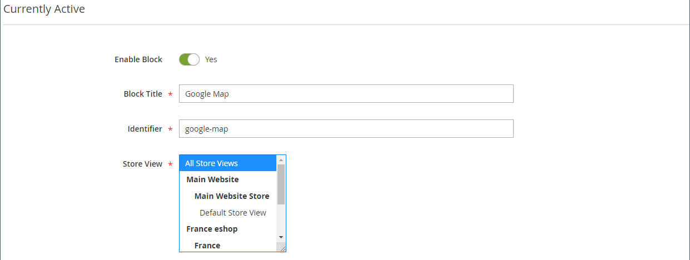{width="600" zoomable="yes"}

1. 右上隅の「**[!UICONTROL Save]**」をクリックします。

### 手順2: [!DNL Google Map]を追加

1. [!DNL Page Builder] コンテンツのプレビュー（現在空）まで下にスクロールして、**[!UICONTROL Edit with Page Builder]**&#x200B;をクリックします。

1. [!DNL Page Builder] パネルで、**[!UICONTROL Media]**&#x200B;を展開し、**[!UICONTROL Map]** プレースホルダーをステージにドラッグします。

   {width="600" zoomable="yes"}

   [!DNL Google Maps]がストア用に設定されている場合、ストアの場所へのマップが表示されます。

   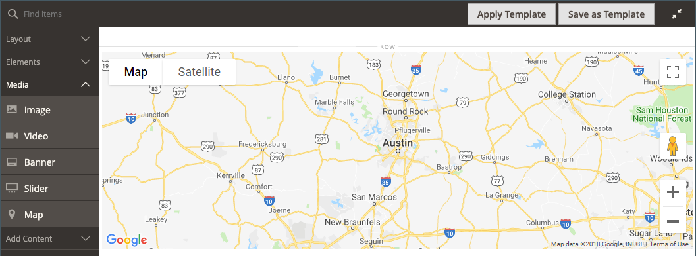{width="600" zoomable="yes"}

   [!DNL Google Maps]がまだストアに設定されていない場合は、プレースホルダーマップが表示されます。

   ![[!DNL Google Maps] プレースホルダー](./assets/pb-tutorial2-media-map-not-configured.png){width="600" zoomable="yes"}

1. ステージの右上隅で、_フルスクリーンを閉じる_ （）アイコンをクリックします。

   このアイコンをクリックすると、プレビューが表示されたブロックの&#x200B;_[!UICONTROL Content]_セクションに戻ります。

1. 右上隅の&#x200B;**[!UICONTROL Save]**&#x200B;矢印をクリックし、**[!UICONTROL Save & Close]**&#x200B;を選択します。

### 手順3: [!DNL Google Maps]の設定

[!DNL Google Maps]がストア用に既に設定されている場合は、この手順をスキップして、次の手順に進むことができます。

1. [Google Cloud Platform Console](https://console.cloud.google.com/google/maps-apis/overview)に移動します。

1. プロジェクト ドロップダウンをクリックし、API キーを追加するプロジェクトを選択または作成します。

1. API資格情報を設定するには、[!DNL Google Maps] ドキュメントの[手順](https://developers.google.com/maps/documentation/javascript/get-api-key)に従ってください。

1. API キーをクリップボードにコピーします。

1. [!DNL Commerce]管理者に戻り、**[!UICONTROL Stores]** > _[!UICONTROL Settings]_>**[!UICONTROL Configuration]**に移動します。

1. _[!UICONTROL General]_の下の左側のパネルで、**[!UICONTROL Content Management]**を選択します。

1.  **[!UICONTROL Advanced Content Tools]**&#x200B;を展開します。

   {width="600" zoomable="yes"}

   [!UICONTROL Content Management Advanced Tools]設定オプションについて詳しくは、[_設定リファレンスガイド_](../configuration-reference/general/content-management.md)&#x200B;を参照してください。

1. **[!UICONTROL Google Maps API Key]**&#x200B;の場合、コピーしたキーを貼り付けます。

1. **[!UICONTROL Test Key]**&#x200B;をクリックします。

   キーに問題がある場合は、[!DNL Google Maps] Platform サイトに戻って問題を解決してください。 次に、もう一度試してください。

1. キーを確認したら、**[!UICONTROL Save Config]**&#x200B;をクリックします。

### 手順4：ブロックをページに追加する

1. _管理者_ サイドバーで、**[!UICONTROL Content]** > _[!UICONTROL Elements]_>**[!UICONTROL Pages]**に移動します。

1. グリッドで、最初のチュートリアルで作成した&#x200B;_[!UICONTROL Simple Page]_を見つけ、_[!UICONTROL Action]_&#x200B;列の&#x200B;**[!UICONTROL Edit]**&#x200B;を選択します。

1. **[!UICONTROL Content]** セクションのを展開し、**[!UICONTROL Edit with Page Builder]**&#x200B;またはコンテンツプレビュー領域内をクリックします。

1. _[!UICONTROL Layout]_の下の[!DNL Page Builder] パネルで、**[!UICONTROL Row]**プレースホルダーをステージの上部にドラッグします。

   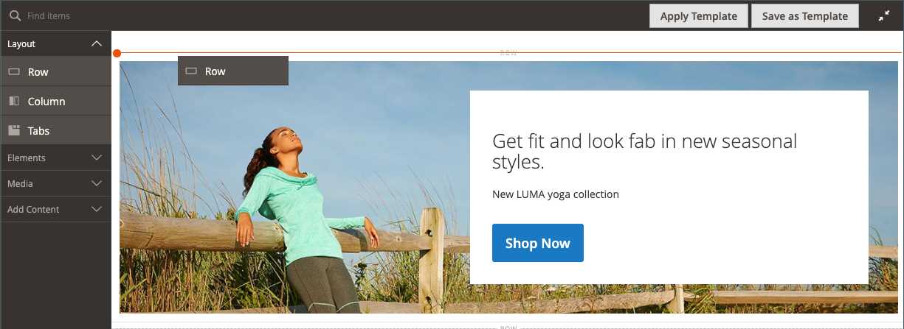{width="600" zoomable="yes"}

1. [!DNL Page Builder] パネルで、**[!UICONTROL Add Content]**&#x200B;を展開し、**[!UICONTROL Block]** プレースホルダーを新しい行にドラッグします。

1. 空のブロックコンテナにカーソルを合わせてツールボックスを表示し、_設定_ （{width="20"}）アイコンを選択します。

   {width="600" zoomable="yes"}

1. ブロックを編集ページで、**[!UICONTROL Select Block]**&#x200B;をクリックします。

   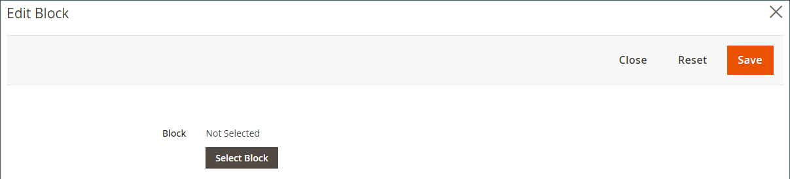{width="600" zoomable="yes"}

1. 検索ボックスに「`map`」と入力し、Enter/Return キーを押して、作成したブロックを検索します。

   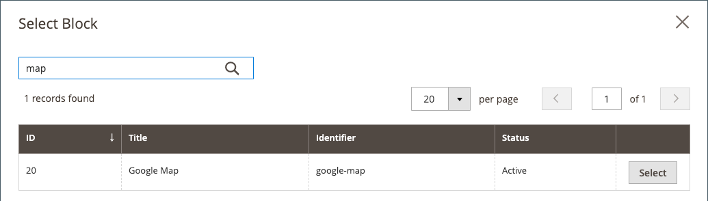{width="600" zoomable="yes"}

1. グリッドで、**[!UICONTROL Select]**&#x200B;をクリックして[!DNL Google Maps] ブロックを選択します。

1. 右上隅の「**[!UICONTROL Save]**」をクリックして設定を保存し、[!DNL Page Builder] ワークスペースに戻ります。

1. ステージの右上隅で、_フルスクリーンを閉じる_ （）アイコンをクリックします。

   このアイコンをクリックすると、プレビューが表示されたページの&#x200B;_[!UICONTROL Content]_セクションに戻ります。

1. 右上隅の&#x200B;**[!UICONTROL Save]**&#x200B;矢印をクリックし、**[!UICONTROL Save & Close]**&#x200B;を選択します。

**おめでとうございます！** ブロック演習の最初の部分が完了しました。 参考までに、必ず作品を保管してください。

## パート 2：ダイナミックブロックの作成

動的ブロックには、そのブロックが表示される場所、タイミング、対象を決定するロジックが含まれます。 このチュートリアルでは、価格ルールの条件が満たされたときにトリガーされ、特定の顧客セグメントにのみ表示されるプロモーションのダイナミックブロックを作成します。 この例の結果は、最初の演習で作成したバナーと似ていますが、ストアフロントに表示されるタイミングを制御するロジックを使用しています。

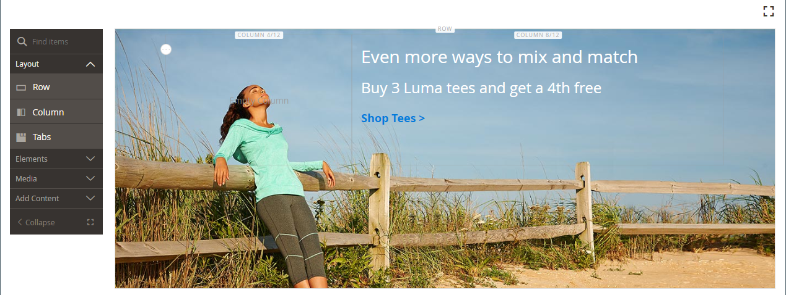{width="600" zoomable="yes"}

### 手順1：新しいダイナミックブロックの作成

1. _管理者_ サイドバーで、**[!UICONTROL Content]** > _[!UICONTROL Elements]_>**[!UICONTROL Dynamic Blocks]**に移動します。

   {width="700" zoomable="yes"}

1. 右上隅の「**[!UICONTROL Add Dynamic Block]**」をクリックします。

   {width="600" zoomable="yes"}

1. 新しいダイナミックブロックの基本設定を完了します。

   - **[!UICONTROL Enable Dynamic Block]**&#x200B;を`Yes`に設定します。

   - **[!UICONTROL Dynamic Block Name]**&#x200B;に対して、`Tee Shirt Promo`と入力します。

   - **[!UICONTROL Dynamic Block Type]**&#x200B;を`Content Area`に設定し、**[!UICONTROL Done]**&#x200B;をクリックします。

     動的ブロックの種類によって、[ ページレイアウト ](../content-design/page-layout.md)内でブロックが配置される場所が決まります。 ストアのダイナミックブロックを設定する際には、使用可能なスペースを有効に活用できるように、ページレイアウトと[ テーマ ](../content-design/themes.md)の両方を考慮してください。 一部のストアでは、固定幅に制限されたアクティブなコンテンツ領域を持っていますが、他のストアでは画面の全幅を拡張しています。

     {width="600" zoomable="yes"}

   - **[!UICONTROL Customer Segment]**&#x200B;の場合、動的ブロックに適用する各セグメントのチェックボックスを選択し、**完了**&#x200B;をクリックしてセグメントのリストを保存します。

     次の例では、登録済み顧客を性別で識別する2つの[顧客セグメント ](../customers/customer-segments.md)があります。 このダイナミックブロックは、店舗での買い物中にアカウントにログインしている登録済みの女性顧客にのみ表示されます。

     {width="600" zoomable="yes"}

### 手順2：設定を完了する

空の[!DNL Page Builder] コンテンツのプレビューが表示される&#x200B;_[!UICONTROL Content]_セクションまで下にスクロールして、**[!UICONTROL Edit with Page Builder]**をクリックします。 次に、次のタスクを実行します。

**タスク 1:**&#x200B;背景画像を追加

1. 行コンテナにカーソルを合わせてツールボックスを表示し、_設定_ （{width="20"}）アイコンを選択します。

1. _[!UICONTROL Appearance]_で、**[!UICONTROL Full Bleed]**を選択します。

1. **[!UICONTROL Minimum Height]**&#x200B;に対して、`400px`と入力します。

1. _[!UICONTROL Background]_セクションまでスクロールし、**[!UICONTROL Select from Gallery]**をクリックして、最初のチュートリアルにアップロードされた`wide-banner-background.png`画像を選択し、**[!UICONTROL Background Image]**を設定します。

1. 右上隅の「**[!UICONTROL Save]**」をクリックして設定を適用し、[!DNL Page Builder] ワークスペースに戻ります。

   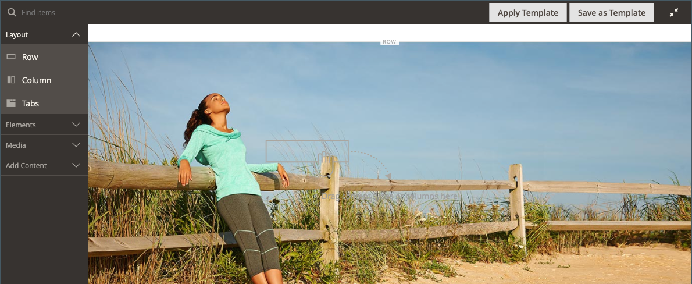{width="600" zoomable="yes"}

**タスク 2:**&#x200B;列を追加

_[!UICONTROL Layout]_の下の[!DNL Page Builder] パネルで、**[!UICONTROL Column]**プレースホルダーを行にドラッグします。

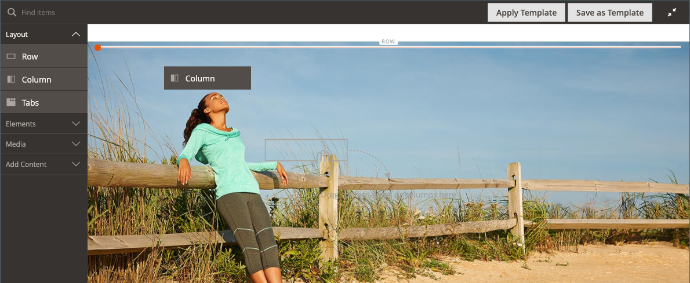{width="600" zoomable="yes"}

行は同じ幅の2つの列に分けられます。

**タスク 3:** テキストを追加

1. [!DNL Page Builder] パネルで、**[!UICONTROL Elements]**&#x200B;を展開し、**テキスト** プレースホルダーを2番目の列にドラッグします。

   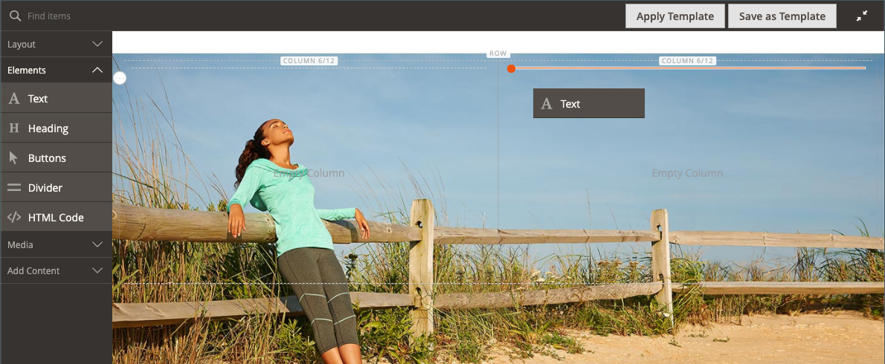{width="600" zoomable="yes"}

1. 次の3行のテキストをエディターに入力します。

   `Even more ways to mix and match.`

   `Buy 3 Luma tees and get a 4th free.`

   `Shop Tees >`

   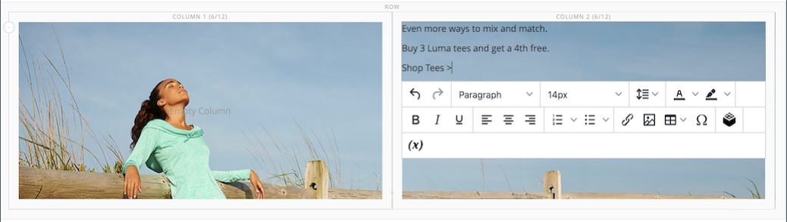{width="600" zoomable="yes"}

1. 3行のテキストをすべて選択し、ツールバーを使用して&#x200B;**行の高さ**&#x200B;を`40px`に設定します。

   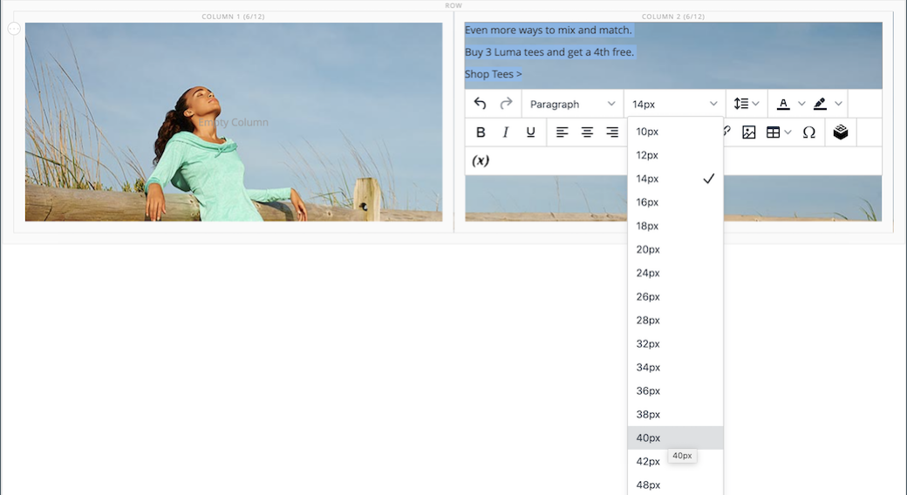{width="600" zoomable="yes"}

1. 各行の&#x200B;**[!UICONTROL Font Size]**&#x200B;を次のように設定します。

   | 折れ線グラフ | フォントサイズ |
   |-----| ---------- |
   | 1行目： | `28px` |
   | 2行目： | `24px` |
   | 3行目： | `18px` |

   このブロックはページ上の任意の場所に配置できるので、見出しレベルではなくデフォルトの段落スタイルを使用します。 また、テキストがまだ列で正しく折り返されないことを心配しないでください。  

   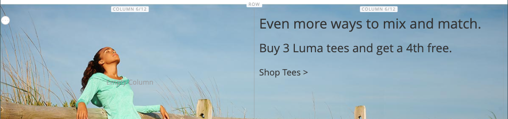{width="600" zoomable="yes"}

**タスク 4:** リンクを追加

最初の演習では、[ ボタン ](buttons.md) コンテンツタイプを使用してリンクを作成する方法を学習しました。 次の例では、エディターツールバーからリンクを挿入する方法を示します。

1. 別のブラウザータブで、ストアフロントを開き、リンクのターゲット先となるページに移動します。

   完全修飾URLまたはストアドメインへの参照を省略する相対URLを使用できます。

   完全URL
: `https://mystore.com/women/tops-women/tees-women.html`

   相対URL
: `../women/tops-women/tees-women.html`

1. [!DNL Page Builder] ワークスペース タブとテキストエディターに戻り、3行目の`Shop Tees >` テキストを選択し、エディターツールバーで&#x200B;**太字** （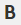）を選択します。

1. 3行目の`Shop Tees >` テキストを選択したまま、エディターツールバーで&#x200B;**リンクの挿入/編集** （）を選択します。

   {width="600" zoomable="yes"}

1. **[!UICONTROL URL]**&#x200B;に、準備した相対リンクを入力します。

1. **[!UICONTROL Target]**&#x200B;を`None`に設定します。

   この設定では、新しいタブを開くのではなく、同じブラウザーウィンドウでページが開きます。

1. **[!UICONTROL Title]**&#x200B;に対して、`Shop Tees`と入力します。

   タイトルリンク属性は、一部のブラウザーでツールチップとして使用されます。

1. リンクを保存して[!DNL Page Builder] ワークスペースに戻るには、**[!UICONTROL OK]**&#x200B;をクリックします。

   {width="600" zoomable="yes"}

1. ステージの右上隅で、_フルスクリーンを閉じる_ （）アイコンをクリックします。

   このアイコンをクリックすると、プレビューが表示されたダイナミックブロックの&#x200B;_[!UICONTROL Content]_セクションに戻ります。

1. 右上隅の「**[!UICONTROL Save]**」をクリックします。

### 手順3：価格ルールの追加

1. _T シャツのプロモ_&#x200B;動的ブロックを編集モードで再度開きます。

1. **[!UICONTROL Related Promotions]** セクションのを展開し、**[!UICONTROL Add Cart Price Rules]**&#x200B;をクリックします。

   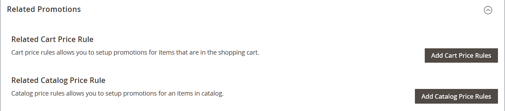{width="600" zoomable="yes"}

1. _関連するカート価格ルールを追加_ ページで、_購入3枚のT シャツのチェックボックスを選択し、4番目の無料_&#x200B;価格ルールを取得して、**[!UICONTROL Add Selected]**&#x200B;をクリックします。

   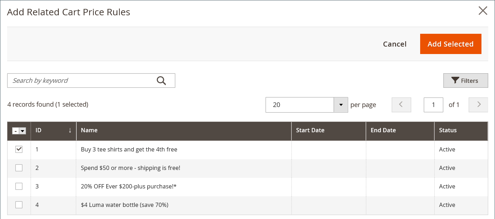{width="600" zoomable="yes"}

   価格ルールは、_関連カート価格ルール_&#x200B;の下の&#x200B;_関連プロモーション_ セクションに表示されます。 複数の価格ルールを動的ブロックに関連付けることができます。 しかし、この単純な例では1つしか使用しません。

   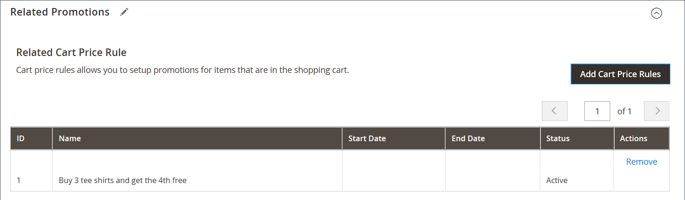{width="600" zoomable="yes"}

1. 右上隅の「**[!UICONTROL Save]**」をクリックします。

### 手順4：ページへのダイナミックブロックの追加

1. _管理者_ サイドバーで、**[!UICONTROL Content]** > _[!UICONTROL Elements]_>**[!UICONTROL Pages]**に移動します

1. [最初のチュートリアル演習](1-simple-page.md)で作成した&#x200B;_シンプル ページ_&#x200B;を見つけて、編集モードで開きます。

1. **[!UICONTROL Content]** セクションのを展開し、**[!UICONTROL Edit with Page Builder]**&#x200B;をクリックします。

1. ダイナミックブロックと同じ画像を持つ一番上の行にカーソルを合わせると、ツールボックスと&#x200B;_削除_ （{width="20"}）アイコンが表示されます。

   ページから行を削除することを確認するには、「**[!UICONTROL OK]**」をクリックします。

1. _[!UICONTROL Layout]_の下の[!DNL Page Builder] パネルで、新しい&#x200B;**[!UICONTROL Row]**プレースホルダーをステージの上部にドラッグします。

1. [!DNL Page Builder] パネルで、**[!UICONTROL Add Content]**&#x200B;を展開し、**[!UICONTROL Dynamic Block]** プレースホルダーを新しい行にドラッグします。

   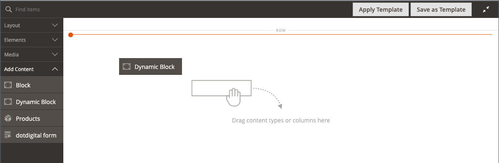{width="600" zoomable="yes"}

1. 動的ブロックコンテナにカーソルを合わせてツールボックスを表示し、_設定_ （{width="20"}）アイコンを選択します。

   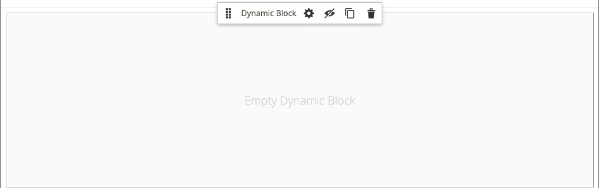{width="600" zoomable="yes"}

1. _[!UICONTROL Edit Dynamic Block]_ページで、**[!UICONTROL Select Dynamic Block]**をクリックします。

   {width="600" zoomable="yes"}

1. 作成した&#x200B;_[!DNL Tee Shirt Promo]_動的ブロックを見つけて、**[!UICONTROL Select]**をクリックします。

   ダイナミックブロック情報の概要を以下に示します。

   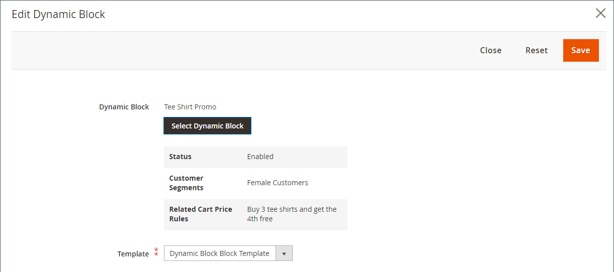{width="600" zoomable="yes"}

1. 既定の&#x200B;**[!UICONTROL Template]**、`Dynamic Block Block Template`を受け入れます。

1. 完了したら、**[!UICONTROL Save]**&#x200B;をクリックして設定を保存し、[!DNL Page Builder] ワークスペースに戻ります。

   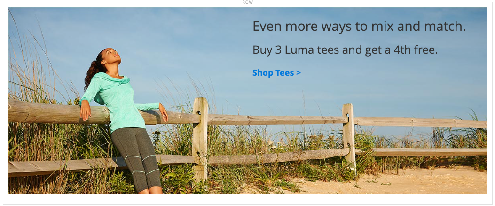{width="600" zoomable="yes"}

1. ステージの右上隅で、_フルスクリーンを閉じる_ （）アイコンをクリックします。

   このアイコンをクリックすると、プレビューが表示されたページの&#x200B;_[!UICONTROL Content]_セクションに戻ります。

1. 右上隅の&#x200B;**[!UICONTROL Save]**&#x200B;矢印をクリックし、**[!UICONTROL Save & Close]**&#x200B;を選択します。

ブロック演習の2番目の部分を完了しました。 参考までに、必ず作品を保管してください。

## パート 3：動的ブロックの更新

この演習の最後の部分では、ページがストアに存在する間にダイナミックブロックを編集します。 次に、顧客セグメントのメンバーとしてストアにログインして、ブロックを表示します。

{width="600" zoomable="yes"}

### 手順1：ダイナミックブロックの編集

1. _管理者_ サイドバーで、**[!UICONTROL Content]** > _[!UICONTROL Elements]_>**[!UICONTROL Dynamic Blocks]**に移動します。

1. グリッドで&#x200B;_[!DNL Tee Shirt Promo]_動的ブロックを見つけ、編集モードで開きます。

1. **[!UICONTROL Content]** セクションのを展開し、**[!UICONTROL Edit with Page Builder]**&#x200B;をクリックします。

1. 列幅を変更します。

   - 2つの列の境界線にカーソルを合わせます。

   - マウスボタンを押しながら、境界線を2つの分割で左にドラッグします。

     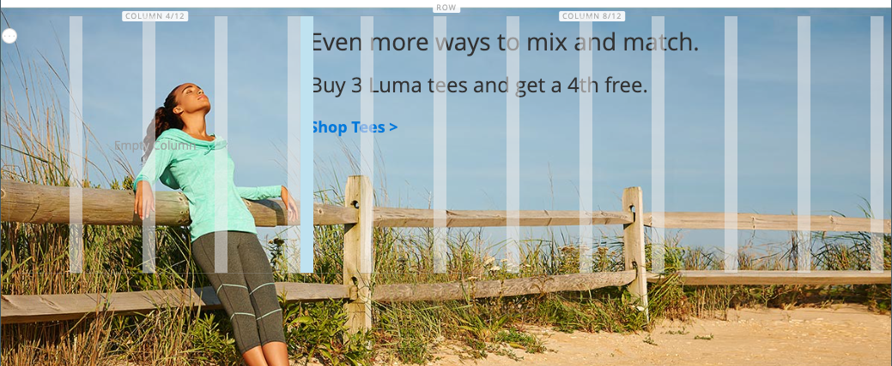{width="600" zoomable="yes"}

     最初の列は12のグリッド分割のうち4つ（4/12）幅になり、2番目の列は12のグリッド分割のうち8つ（8/12）幅になります。

     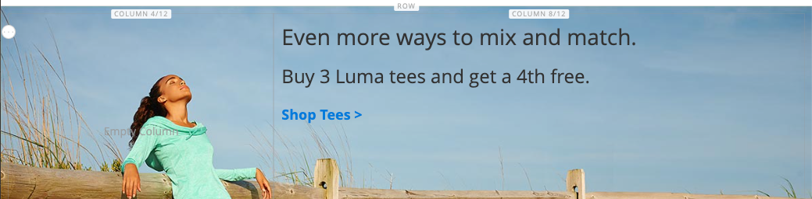{width="600" zoomable="yes"}

1. テキストの色を変更します。

   - 最初の2行のテキストを選択します。

   - エディターツールバーで、**[!UICONTROL Text Color]**&#x200B;を選択し、**[!UICONTROL White]** スウォッチをクリックします。

   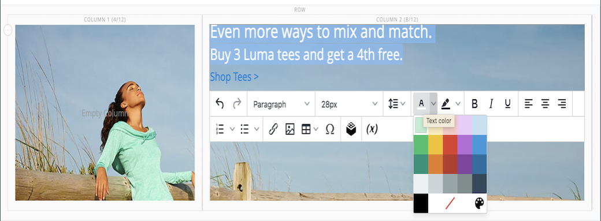{width="600" zoomable="yes"}

1. ステージの右上隅で、_フルスクリーンを閉じる_ （）アイコンをクリックします。

   このアイコンをクリックすると、プレビューが表示されたダイナミックブロックの&#x200B;_[!UICONTROL Content]_セクションに戻ります。

1. 右上隅の「**[!UICONTROL Save]**」をクリックします。

### 手順2：動的ブロックの表示

このダイナミックブロックは特定の顧客セグメントのメンバーにのみ表示されるため、プロモーションを表示するには、顧客セグメントのメンバーである顧客としてログインする必要があります。 この例では、ブロックは女性顧客にのみ表示されます。

1. ストアフロントのブラウザーウィンドウを開きます。

1. サンプルページを表示するには、アドレスバーのURLを次のように変更します。

   mystore.com/sample-page

   ストアがhtml サフィックスを含めるように設定されている場合は、次のようにサフィックスを含めます。

   mystore.com/sample-page.html

1. 女性顧客としてログイン：

   - ホームページの右上隅にある「**[!UICONTROL Sign In]**」をクリックします。

   - サンプル Luma データがシステムにインストールされている場合は、次の資格情報を使用します。

     **[!UICONTROL Email]** - `roni_cost@example.com`

     **[!UICONTROL Password]** -  `roni_cost3@example.com`

   - **[!UICONTROL Sign In]**&#x200B;をクリックします。

   - サンプルページに戻り、ティーシャツプロモーションで作成したダイナミックブロックを確認します。

   顧客セグメントに対して{width="700" zoomable="yes"}

ブロックの演習が完了しました。 参考までに、必ず作品を保管してください。

準備ができたら、[ パート 3: カタログ コンテンツ ](3-catalog-content.md)に進みます
