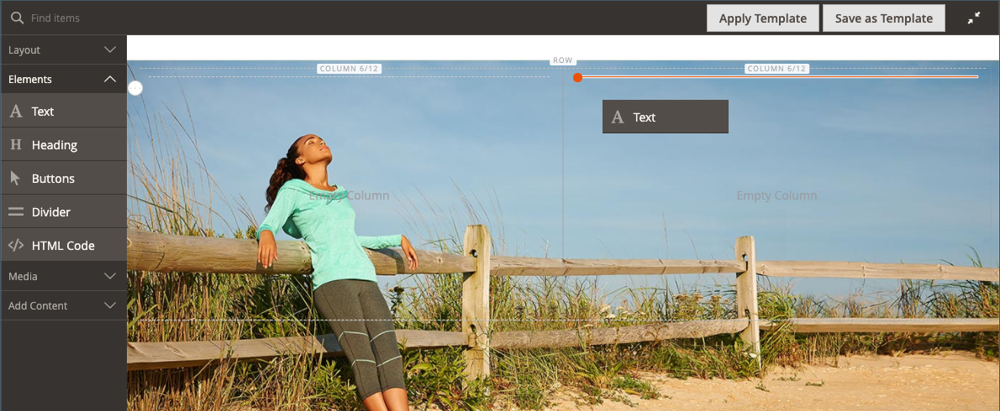

# [!DNL Page Builder] チュートリアル第 2 部：ブロック

次の演習では、[ 単純ブロック ](../content-design/blocks.md) と [ ダイナミック ブロック ](dynamic-block.md) の違いと、[!DNL Page Builder] を使用して各タイプのブロックを作成する方法について説明します。

>[!NOTE]
>
>[!DNL Page Builder] には、_バナー_ という名前の新しいコンテンツタイプがあります。このコンテンツタイプは、最初のチュートリアルの演習で取り上げられるものであり、以前のバナー機能とは無関係です。 以前は [ コンテンツメニュー ](../content-design/content-menu.md) の「バナー」オプションでしたが、現在は _動的ブロック_ になっています。

{width="700" zoomable="yes"}

この演習では、前提条件や [ ダウンロードされたサンプルファイル ](1-simple-page.md) を含め、[ パート 1：簡単なページ ](./assets/simple-page-assets.zip) が完了していることを前提としています。 このチュートリアル演習の各部分に順番に従います。

>[!NOTE]
>
>これらのチュートリアルの演習は、2.4.1 リリースの [!DNL Page Builder] ワークスペースに対する最近の変更を反映して更新されました。 以前のAdobe Commerce リリースを使用している場合は、[[!DNL Commerce] 2.3 ユーザーガイド ](https://docs.magento.com/user-guide/v2.3/cms/page-builder-learn.html) に含まれている [!DNL Page Builder] の演習を使用してください。

## パート 1：シンプルなブロックの作成

このチュートリアル演習では、[!DNL Google Maps] のコンテンツを含むシンプルなブロックを作成します。 単純なブロックは、コンテンツが変更されないので、_CMS ブロック_ または _静的ブロック_ と呼ばれることがあります。 再利用が必要なコンテンツには、シンプルなブロックが最適です。

### 手順 1：ブロックの作成

1. _管理者_ サイドバーで、**[!UICONTROL Content]**/_[!UICONTROL Elements]_/**[!UICONTROL Blocks]**に移動します。

1. 右上隅の「**[!UICONTROL Add New Block]**」をクリックします。

1. **[!UICONTROL Block Title]** には、`Google Map` と入力します。

1. **[!UICONTROL Identifier]** には、`google-map` と入力します。

1. ブロックを使用できる **[!UICONTROL Store View]** を選択します。

   {width="600" zoomable="yes"}

1. 右上隅の「**[!UICONTROL Save]**」をクリックします。

### 手順 2:[!DNL Google Map] を追加

1. 下にスクロールして [!DNL Page Builder] コンテンツプレビュー（現在空）を表示し、「**[!UICONTROL Edit with Page Builder]**」をクリックします。

1. [!DNL Page Builder] パネルで **[!UICONTROL Media]** を展開し、**[!UICONTROL Map]** プレースホルダーをステージにドラッグします。

   {width="600" zoomable="yes"}

   ストアに対してマッピングが設定されている場合 [!DNL Google Maps]、ストアの場所へのマッピングが表示されます。

   {width="600" zoomable="yes"}

   ストアに対して [!DNL Google Maps] が設定されていない場合は、プレースホルダーマップが表示されます。

   ![[!DNL Google Maps] プレースホルダー ](./assets/pb-tutorial2-media-map-not-configured.png){width="600" zoomable="yes"}

1. ステージの右上隅にある _フルスクリーンを閉じる_ （）アイコンをクリックします。

   このアイコンをクリックすると、ブロックの _[!UICONTROL Content]_セクションに戻り、プレビューが表示されます。

1. 右上隅の **[!UICONTROL Save]** 矢印をクリックし、「**[!UICONTROL Save & Close]**」を選択します。

### 手順 3:[!DNL Google Maps] の設定

[!DNL Google Maps] がストア用に既に設定されている場合は、この手順をスキップして次に進むことができます。

1. [Google Cloud Platform コンソール ](https://console.cloud.google.com/google/maps-apis/overview) に移動します。

1. 「プロジェクト」ドロップダウンをクリックし、API キーを追加するプロジェクトを選択または作成します。

1. API 資格情報を設定するには、[!DNL Google Maps] ドキュメントの [ 手順 ][1] に従ってください。

1. API キーをクリップボードにコピーします。

1. [!DNL Commerce] Admin に戻り、**[!UICONTROL Stores]**/_[!UICONTROL Settings]_/**[!UICONTROL Configuration]**に移動します。

1. _[!UICONTROL General]_の下の左パネルで、「**[!UICONTROL Content Management]**」を選択します。

1.  **[!UICONTROL Advanced Content Tools]** を展開します。

   {width="600" zoomable="yes"}

   [!UICONTROL Content Management Advanced Tools] 設定オプションについて詳しくは、[_設定リファレンスガイド_](../configuration-reference/general/content-management.md) を参照してください。

1. **[!UICONTROL Google Maps API Key]**: コピーしたキーを貼り付けます。

1. 「**[!UICONTROL Test Key]**」をクリックします。

   キーに問題がある場合は、[!DNL Google Maps] Platform サイトに戻って問題を解決してください。 その後、もう一度試してください。

1. キーが確認されたら、「**[!UICONTROL Save Config]**」をクリックします。

### 手順 4：ページへのブロックの追加

1. _管理者_ サイドバーで、**[!UICONTROL Content]**/_[!UICONTROL Elements]_/**[!UICONTROL Pages]**に移動します。

1. グリッドで、最初のチュートリアルで作成した _[!UICONTROL Simple Page]_を見つけ、_[!UICONTROL Action]_ の列の **[!UICONTROL Edit]** を選択します。

1.  「**[!UICONTROL Content]**」セクションを展開し、コンテンツプレビュー領域 **[!UICONTROL Edit with Page Builder]** または内側をクリックします。

1. [!DNL Page Builder] パネルの _[!UICONTROL Layout]_の下で、**[!UICONTROL Row]**のプレースホルダーをステージの上部にドラッグします。

   {width="600" zoomable="yes"}

1. [!DNL Page Builder] パネルで **[!UICONTROL Add Content]** を展開し、**[!UICONTROL Block]** プレースホルダーを新しい行にドラッグします。

1. 空のブロックコンテナにカーソルを合わせてツールボックスを表示し、_設定_ （{width="20"}）アイコンを選択します。

   {width="600" zoomable="yes"}

1. [ ブロックを編集 ] ページで、[**[!UICONTROL Select Block]**] をクリックします。

   {width="600" zoomable="yes"}

1. 検索ボックスに `map` と入力し、Enter/Return キーを押して、作成したブロックを検索します。

   {width="600" zoomable="yes"}

1. グリッドで **[!UICONTROL Select]** をクリックして、[!DNL Google Maps] のブロックを選択します。

1. 右上隅の「**[!UICONTROL Save]**」をクリックして設定を保存し、[!DNL Page Builder] ワークスペースに戻ります。

1. ステージの右上隅にある _フルスクリーンを閉じる_ （）アイコンをクリックします。

   このアイコンをクリックすると、ページの「_[!UICONTROL Content]_」セクションに戻り、プレビューが表示されます。

1. 右上隅の **[!UICONTROL Save]** 矢印をクリックし、「**[!UICONTROL Save & Close]**」を選択します。

**これで完了です。** ブロックの演習の最初の部分を完了しました。 必ず作業内容を参照用に保持してください。

## パート 2：ダイナミック ブロックを作成する

動的ブロックには、表示する場所、タイミング、および対象を決定するロジックが含まれています。 このチュートリアルの演習では、価格ルールの条件が満たされた場合にトリガーされ、特定の顧客セグメントにのみ表示されるプロモーションの動的ブロックを作成します。 この例の結果は、最初の演習で作成したバナーと似ていますが、ストアフロントに表示されるタイミングを制御するロジックを備えています。

{width="600" zoomable="yes"}

### 手順 1：新しいダイナミック ブロックを作成する

1. _管理者_ サイドバーで、**[!UICONTROL Content]**/_[!UICONTROL Elements]_/**[!UICONTROL Dynamic Blocks]**に移動します。

   {width="700" zoomable="yes"}

1. 右上隅の「**[!UICONTROL Add Dynamic Block]**」をクリックします。

   {width="600" zoomable="yes"}

1. 新しいダイナミック ブロックの基本設定を行います。

   - **[!UICONTROL Enable Dynamic Block]** を `Yes` に設定します。

   - **[!UICONTROL Dynamic Block Name]** には、`Tee Shirt Promo` と入力します。

   - **[!UICONTROL Dynamic Block Type]** を `Content Area` に設定し、「**[!UICONTROL Done]**」をクリックします。

     動的ブロックタイプは、[ ページレイアウト ](../content-design/page-layout.md) 内でブロックを配置する場所を決定します。 ストアの動的ブロックを設定する際は、ページレイアウトと [ テーマ ](../content-design/themes.md) の両方を考慮すると、使用可能なスペースを有効活用できます。 アクティブなコンテンツ領域の幅が固定されているストアもあれば、画面の全幅を拡張しているストアもあります。

     {width="600" zoomable="yes"}

   - **[!UICONTROL Customer Segment]**：ダイナミックブロックに適用する各セグメントのチェックボックスをオンにして、「**完了**」をクリックしてセグメントのリストを保存します。

     次の例では、登録顧客を性別で識別する [ 顧客セグメント ](../customers/customer-segments.md) が 2 つあります。 この動的ブロックは、ストアでのショッピング中にアカウントにログインした登録済みの女性のお客様にのみ表示されます。

     {width="600" zoomable="yes"}

### 手順 2：設定を完了する

_[!UICONTROL Content]_セクションまでスクロールし、空の [!DNL Page Builder] コンテンツプレビューを表示して、「**[!UICONTROL Edit with Page Builder]**」をクリックします。 次に、以下のタスクを実行します。

**タスク 1:** 背景画像の追加

1. 行コンテナの上にマウスポインターを置いてツールボックスを表示し、_設定_ （{width="20"}） アイコンを選択します。

1. 「_[!UICONTROL Appearance]_」で、「**[!UICONTROL Full Bleed]**」を選択します。

1. **[!UICONTROL Minimum Height]** には、`400px` と入力します。

1. 「_[!UICONTROL Background]_」セクションまでスクロールし、**[!UICONTROL Select from Gallery]**をクリックして、最初のチュートリアルでアップロードした `wide-banner-background.png` 画像を選択することで、**[!UICONTROL Background Image]**を設定します。

1. 右上隅にある「**[!UICONTROL Save]**」をクリックして設定を適用し、[!DNL Page Builder] ワークスペースに戻ります。

   {width="600" zoomable="yes"}

**タスク 2:** 列の追加

[!DNL Page Builder] パネルの _[!UICONTROL Layout]_の下で、**[!UICONTROL Column]**のプレースホルダーを行にドラッグします。

{width="600" zoomable="yes"}

これで、行が同じ幅の 2 つの列に分割されました。

**タスク 3:** テキストの追加

1. [!DNL Page Builder] パネルで「**[!UICONTROL Elements]**」を展開し、「**テキスト**」プレースホルダーを 2 番目の列にドラッグします。

   {width="600" zoomable="yes"}

1. エディターに次の 3 行のテキストを入力します。

   `Even more ways to mix and match.`

   `Buy 3 Luma tees and get a 4th free.`

   `Shop Tees >`

   {width="600" zoomable="yes"}

1. 3 行のテキストをすべて選択し、ツールバーを使用して **行の高さ** を `40px` に設定します。

   {width="600" zoomable="yes"}

1. 各行の **[!UICONTROL Font Size]** を次のように設定します。

   | ライン | フォントサイズ |
   |-----| ---------- |
   | ライン 1: | `28px` |
   | 2 行目： | `24px` |
   | 行 3: | `18px` |

   このブロックはページ上のどこにでも配置できるので、見出しレベルではなくデフォルトの段落スタイルを使用します。 また、テキストが列でまだ正しく折り返されていないことを心配する必要はありません。  

   {width="600" zoomable="yes"}

**タスク 4:** リンクの追加

最初の演習では、[ ボタン ](buttons.md) コンテンツタイプを使用してリンクを作成する方法を学びました。 この例では、エディターツールバーからリンクを挿入する方法を示します。

1. 別のブラウザータブで、ストアフロントを開き、リンクのターゲットにするページに移動します。

   完全修飾 URL またはストアドメインへの参照を省略する相対 URL を使用できます。

   完全な URL
:`https://mystore.com/women/tops-women/tees-women.html`

   相対 URL
:`../women/tops-women/tees-women.html`

1. [!DNL Page Builder] Workspace タブとテキストエディターに戻り、3 行目で `Shop Tees >` テキストを選択して、エディターツールバーで **太字** （）を選択します。

1. 3 行目の `Shop Tees >` テキストが選択されたままの状態で、エディターツールバーの **リンクを挿入/編集** （）を選択します。

   {width="600" zoomable="yes"}

1. **[!UICONTROL URL]**：準備した相対リンクを入力します。

1. **[!UICONTROL Target]** を `None` に設定します。

   この設定の場合、ページは新しいタブを開かずに同じブラウザーウィンドウで開きます。

1. **[!UICONTROL Title]** には、`Shop Tees` と入力します。

   タイトルリンク属性は、一部のブラウザーでツールヒントとして使用されます。

1. リンクを保存して [!DNL Page Builder] ワークスペースに戻るには、「**[!UICONTROL OK]**」をクリックします。

   {width="600" zoomable="yes"}

1. ステージの右上隅にある _フルスクリーンを閉じる_ （）アイコンをクリックします。

   このアイコンをクリックすると、ダイナミック ブロックの _[!UICONTROL Content]_セクションに戻り、プレビューが表示されます。

1. 右上隅の「**[!UICONTROL Save]**」をクリックします。

### 手順 3：価格ルールの追加

1. _Tee Shirt Promo_ ダイナミックブロックを再度編集モードで開きます。

1. 「 「**[!UICONTROL Related Promotions]**」セクションを展開し、「**[!UICONTROL Add Cart Price Rules]**」をクリックします。

   {width="600" zoomable="yes"}

1. _関連する買い物かご価格ルールを追加_ ページで、「_3 枚の T シャツを購入」のチェックボックスを選択し、4 番目の無料_ 価格ルールを取得して、「**[!UICONTROL Add Selected]**」をクリックします。

   {width="600" zoomable="yes"}

   価格ルールは、「関連する買い物かご価格ルール _の下の「関連するプロモーション_ セクションに表示されます _。_ 複数の価格ルールを動的ブロックに関連付けることができます。 ただし、この単純な例では、1 つだけを使用します。

   {width="600" zoomable="yes"}

1. 右上隅の「**[!UICONTROL Save]**」をクリックします。

### 手順 4：ページへの動的ブロックの追加

1. _管理者_ サイドバーで、**[!UICONTROL Content]**/_[!UICONTROL Elements]_/**[!UICONTROL Pages]**に移動します。

1. [ 最初のチュートリアルの演習 _で作成した_ シンプルなページ ](1-simple-page.md) を見つけて、編集モードで開きます。

1. 「 「**[!UICONTROL Content]**」セクションを展開し、「**[!UICONTROL Edit with Page Builder]**」をクリックします。

1. ダイナミックブロックと同じ画像の一番上の行にカーソルを合わせると、ツールボックスと _削除_ （{width="20"}）アイコンが表示されます。

   ページからの行の削除を確認するには、「削 **[!UICONTROL OK]**」をクリックします。

1. [!DNL Page Builder] パネルの _[!UICONTROL Layout]_の下で、新しい&#x200B;**[!UICONTROL Row]**プレースホルダーをステージの上部にドラッグします。

1. [!DNL Page Builder] パネルで **[!UICONTROL Add Content]** を展開し、**[!UICONTROL Dynamic Block]** プレースホルダーを新しい行にドラッグします。

   {width="600" zoomable="yes"}

1. 動的ブロックコンテナにカーソルを合わせてツールボックスを表示し、_設定_ （{width="20"}）アイコンを選択します。

   {width="600" zoomable="yes"}

1. _[!UICONTROL Edit Dynamic Block]_ページで「**[!UICONTROL Select Dynamic Block]**」をクリックします。

   {width="600" zoomable="yes"}

1. 作成した _[!DNL Tee Shirt Promo]_ダイナミック ブロックを見つけて、[**[!UICONTROL Select]**] をクリックします。

   ダイナミック ブロック情報の概要が下に表示されます。

   {width="600" zoomable="yes"}

1. デフォルトの **[!UICONTROL Template]**、`Dynamic Block Block Template` を受け入れます。

1. 完了したら、「**[!UICONTROL Save]**」をクリックして設定を保存し、[!DNL Page Builder] ワークスペースに戻ります。

   {width="600" zoomable="yes"}

1. ステージの右上隅にある _フルスクリーンを閉じる_ （）アイコンをクリックします。

   このアイコンをクリックすると、ページの「_[!UICONTROL Content]_」セクションに戻り、プレビューが表示されます。

1. 右上隅の **[!UICONTROL Save]** 矢印をクリックし、「**[!UICONTROL Save & Close]**」を選択します。

ブロックの演習の 2 番目のパートを完了しました。 必ず作業内容を参照用に保持してください。

## パート 3：ダイナミックブロックの更新

演習のこの最後のパートでは、ページがストアに格納されている間に動的ブロックを編集します。 次に、顧客セグメントのメンバーとしてストアにログインすると、ブロックが表示されます。

{width="600" zoomable="yes"}

### 手順 1：ダイナミックブロックを編集する

1. _管理者_ サイドバーで、**[!UICONTROL Content]**/_[!UICONTROL Elements]_/**[!UICONTROL Dynamic Blocks]**に移動します。

1. グリッドで _[!DNL Tee Shirt Promo]_のダイナミック ブロックを探し、編集モードで開きます。

1. 「 「**[!UICONTROL Content]**」セクションを展開し、「**[!UICONTROL Edit with Page Builder]**」をクリックします。

1. 列の幅を変更します。

   - 2 つの列の境界線にポインタを合わせます。

   - マウス ボタンを押したまま、境界を 2 つの分割分だけ左にドラッグします。

     {width="600" zoomable="yes"}

     最初の列は現在、幅 12 （4/12）のグリッド分割の 4 つになり、2 番目の列は幅 12 （8/12）のグリッド分割の 8 つになります。

     {width="600" zoomable="yes"}

1. テキストのカラーを変更します。

   - テキストの最初の 2 行を選択します。

   - エディターツールバーで **[!UICONTROL Text Color]** を選択し、**[!UICONTROL White]** のスウォッチをクリックします。

   {width="600" zoomable="yes"}

1. ステージの右上隅にある _フルスクリーンを閉じる_ （）アイコンをクリックします。

   このアイコンをクリックすると、ダイナミック ブロックの _[!UICONTROL Content]_セクションに戻り、プレビューが表示されます。

1. 右上隅の「**[!UICONTROL Save]**」をクリックします。

### 手順 2：動的ブロックの表示

この動的ブロックは、特定の顧客セグメントのメンバーにのみ表示されるので、プロモーションを確認するには、顧客セグメントのメンバーである顧客としてログインする必要があります。 この例では、ブロックは女性の顧客にのみ表示されます。

1. ストアフロントにブラウザーウィンドウを開きます。

1. サンプルページを表示するには、アドレスバーの URL を次のように変更します。

   mystore.com/sample-page

   ストアが html サフィックスを含むように設定されている場合、次のようにサフィックスを含めます。

   mystore.com/sample-page.html

1. 女性のユーザーとしてログインする：

   - ホームページの右上隅にある「**[!UICONTROL Sign In]**」をクリックします。

   - サンプル Luma データがシステムにインストールされている場合は、次の資格情報を使用します。

     **[!UICONTROL Email]** - `roni_cost@example.com`

     **[!UICONTROL Password]** - `roni_cost3@example.com`

   - 「**[!UICONTROL Sign In]**」をクリックします。

   - サンプルページに戻り、Tee Shirt プロモで作成した動的ブロックを確認します。

   {width="700" zoomable="yes"}

ブロックの演習が完了しました。 必ず作業内容を参照用に保持してください。

準備が整ったら、[ パート 3：カタログのコンテンツ ](3-catalog-content.md) に進みます。

[1]: https://developers.google.com/maps/documentation/javascript/get-api-key
