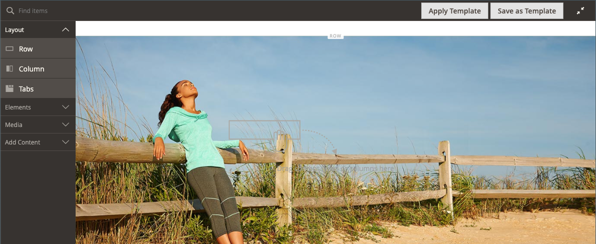
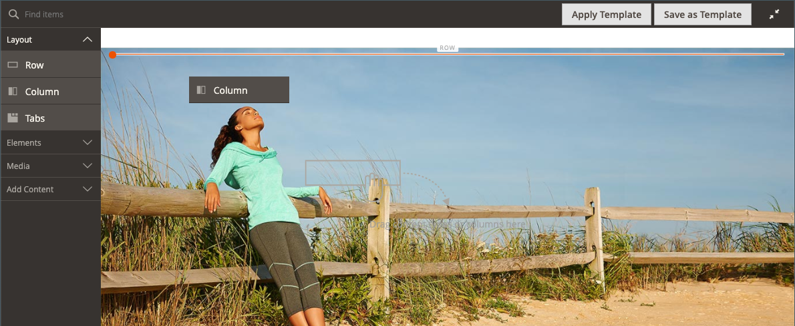
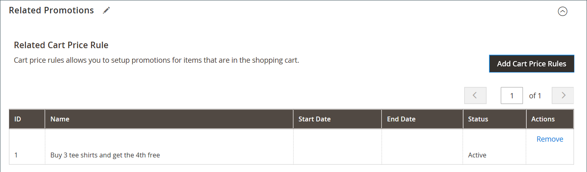

# [!DNL Page Builder] ウォークスルー（パート 2）：ブロック

次の演習では、の違いを説明します [単純ブロック](../content-design/blocks.md) および [ダイナミック ブロック](dynamic-block.md)、および使用方法 [!DNL Page Builder] 各タイプのブロックを作成します。

>[!NOTE]
>
>[!DNL Page Builder] には、という名前の新しいコンテンツタイプがあります _バナー_&#x200B;この機能は最初のチュートリアルの演習で取り上げており、以前のバナー機能とは無関係です。 以前はバナーのオプションは何でしたか？ [コンテンツメニュー](../content-design/content-menu.md)、現在 _動的ブロック_.

{width="700" zoomable="yes"}

この演習では、を完了していることを前提としています [第 1 部：シンプルなページ](1-simple-page.md)前提条件と条件を含む [ダウンロードしたサンプルファイル](./assets/simple-page-assets.zip). このチュートリアル演習の各部分に順番に従います。

>[!NOTE]
>
>これらのチュートリアルの演習は、の最近の変更を反映して更新されました [!DNL Page Builder] workspace 2.4.1 リリース。 以前のAdobe Commerce リリースを使用している場合は、 [!DNL Page Builder] に含まれている演習 [[!DNL Commerce] 2.3 ユーザーガイド](https://docs.magento.com/user-guide/v2.3/cms/page-builder-learn.html).

## パート 1：シンプルなブロックの作成

このチュートリアル演習では、コンテンツを含んだシンプルなブロックをから作成します。 [!DNL Google Maps]. 単純なブロックは次のように呼ばれます _CMS ブロック_ または _静的ブロック_&#x200B;コンテンツは変更されないので、 再利用が必要なコンテンツには、シンプルなブロックが最適です。

### 手順 1：ブロックの作成

1. 日 _Admin_ サイドバー、に移動 **[!UICONTROL Content]** > _[!UICONTROL Elements]_>**[!UICONTROL Blocks]**.

1. 右上隅のをクリックします。 **[!UICONTROL Add New Block]**.

1. の場合 **[!UICONTROL Block Title]**、と入力します `Google Map`.

1. の場合 **[!UICONTROL Identifier]**、と入力します `google-map`.

1. を選択します。 **[!UICONTROL Store View]** ブロックを使用できる場所。

   {width="600" zoomable="yes"}

1. 右上隅のをクリックします。 **[!UICONTROL Save]**.

### 手順 2：を追加 [!DNL Google Map]

1. にスクロール ダウンします。 [!DNL Page Builder] コンテンツプレビュー（現在空）をクリックし、 **[!UICONTROL Edit with Page Builder]**.

1. が含まれる [!DNL Page Builder] パネル、展開 **[!UICONTROL Media]** をドラッグします。 **[!UICONTROL Map]** ステージへのプレースホルダー。

   {width="600" zoomable="yes"}

   次の場合は、ストアの場所へのマップが表示されます [!DNL Google Maps] ストアに対してが設定されています。

   {width="600" zoomable="yes"}

   次の場合は、プレースホルダーマップが表示されます [!DNL Google Maps] は、お使いのストアに対してまだ設定されていません。

   ![[!DNL Google Maps] プレースホルダー](./assets/pb-tutorial2-media-map-not-configured.png){width="600" zoomable="yes"}

1. ステージの右上隅にあるをクリックします _全画面表示を閉じる_ （） アイコンをクリックします。

   このアイコンをクリックすると、に戻ります _[!UICONTROL Content]_プレビューが表示されたブロックのセクション。

1. 右上隅のをクリックします **[!UICONTROL Save]** 矢印と選択 **[!UICONTROL Save & Close]**.

### 手順 3：の設定 [!DNL Google Maps]

次の場合 [!DNL Google Maps] がストア用に既に設定されています。この手順をスキップして次の手順に進むことができます。

1. に移動します [Google Cloud Platform コンソール](https://console.cloud.google.com/google/maps-apis/overview).

1. 「プロジェクト」ドロップダウンをクリックし、API キーを追加するプロジェクトを選択または作成します。

1. API 資格情報を設定するには、次に従います。 [指示][1] が含まれる [!DNL Google Maps] ドキュメント。

1. API キーをクリップボードにコピーします。

1. に戻る [!DNL Commerce] 管理者して、に移動します **[!UICONTROL Stores]** > _[!UICONTROL Settings]_>**[!UICONTROL Configuration]**.

1. の下の左パネルで _[!UICONTROL General]_、を選択&#x200B;**[!UICONTROL Content Management]**.

1. を展開  **[!UICONTROL Advanced Content Tools]**.

   {width="600" zoomable="yes"}

   について [!UICONTROL Content Management Advanced Tools] 設定オプションについては、を参照してください [_設定リファレンスガイド_](../configuration-reference/general/content-management.md).

1. の場合 **[!UICONTROL Google Maps API Key]**&#x200B;コピーしたキーをペーストします。

1. クリック **[!UICONTROL Test Key]**.

   キーに問題がある場合は、に戻ります [!DNL Google Maps] 問題を解決する Platform サイト。 その後、もう一度試してください。

1. キーが確認されたら、 **[!UICONTROL Save Config]**.

### 手順 4：ページへのブロックの追加

1. 日 _Admin_ サイドバー、に移動 **[!UICONTROL Content]** > _[!UICONTROL Elements]_>**[!UICONTROL Pages]**.

1. グリッドで、を見つけます _[!UICONTROL Simple Page]_最初のチュートリアルで作成し、を選択していること&#x200B;**[!UICONTROL Edit]**が含まれる_[!UICONTROL Action]_ 列。

1. を展開  この **[!UICONTROL Content]** セクションでクリック **[!UICONTROL Edit with Page Builder]** またはコンテンツプレビュー領域内です。

1. が含まれる [!DNL Page Builder] 下のパネル _[!UICONTROL Layout]_、ドラッグ：**[!UICONTROL Row]**ステージの上部へのプレースホルダー。

   {width="600" zoomable="yes"}

1. が含まれる [!DNL Page Builder] パネル、展開 **[!UICONTROL Add Content]** をドラッグします。 **[!UICONTROL Block]** 新しい行へのプレースホルダー。

1. 空のブロックコンテナにカーソルを合わせてツールボックスを表示し、 _設定_ （{width="20"} ） アイコンをクリックします。

   {width="600" zoomable="yes"}

1. [ ブロックを編集 ] ページで、 **[!UICONTROL Select Block]**.

   {width="600" zoomable="yes"}

1. 検索ボックスに、 `map` 次に、Enter/Return キーを押して、作成したブロックを検索します。

   {width="600" zoomable="yes"}

1. グリッドで、をクリックします **[!UICONTROL Select]** を選択します [!DNL Google Maps] ブロック。

1. 右上隅のをクリックします。 **[!UICONTROL Save]** 設定を保存し、に戻ります [!DNL Page Builder] ワークスペース。

1. ステージの右上隅にあるをクリックします _全画面表示を閉じる_ （） アイコンをクリックします。

   このアイコンをクリックすると、に戻ります _[!UICONTROL Content]_プレビューが表示されたページの「」セクション。

1. 右上隅のをクリックします **[!UICONTROL Save]** 矢印と選択 **[!UICONTROL Save & Close]**.

**これで、** ブロックの演習の最初の部分を完了しました。 必ず作業内容を参照用に保持してください。

## パート 2：ダイナミック ブロックを作成する

動的ブロックには、表示する場所、タイミング、および対象を決定するロジックが含まれています。 このチュートリアルの演習では、価格ルールの条件が満たされた場合にトリガーされ、特定の顧客セグメントにのみ表示されるプロモーションの動的ブロックを作成します。 この例の結果は、最初の演習で作成したバナーと似ていますが、ストアフロントに表示されるタイミングを制御するロジックを備えています。

{width="600" zoomable="yes"}

### 手順 1：新しいダイナミック ブロックを作成する

1. 日 _Admin_ サイドバー、に移動 **[!UICONTROL Content]** > _[!UICONTROL Elements]_>**[!UICONTROL Dynamic Blocks]**.

   {width="700" zoomable="yes"}

1. 右上隅のをクリックします。 **[!UICONTROL Add Dynamic Block]**.

   {width="600" zoomable="yes"}

1. 新しいダイナミック ブロックの基本設定を行います。

   - を設定 **[!UICONTROL Enable Dynamic Block]** 対象： `Yes`.

   - の場合 **[!UICONTROL Dynamic Block Name]**、と入力します `Tee Shirt Promo`.

   - を設定 **[!UICONTROL Dynamic Block Type]** 対象： `Content Area` をクリックして、 **[!UICONTROL Done]**.

     ダイナミック ブロック タイプは、内の場所を決定します。 [ページレイアウト](../content-design/page-layout.md) ブロックが配置されていること。 ストアの動的ブロックを設定する場合は、ページレイアウトと [テーマ](../content-design/themes.md)を使用すると、使用可能なスペースを有効に利用できます。 アクティブなコンテンツ領域の幅が固定されているストアもあれば、画面の全幅を拡張しているストアもあります。

     {width="600" zoomable="yes"}

   - の場合 **[!UICONTROL Customer Segment]**&#x200B;を選択し、ダイナミックブロックに適用する各セグメントのチェックボックスをオンにして、 **完了** セグメントのリストを保存します。

     次の例では、次の 2 つがあります [顧客セグメント](../customers/customer-segments.md) 性別で登録顧客を識別します。 この動的ブロックは、ストアでのショッピング中にアカウントにログインした登録済みの女性のお客様にのみ表示されます。

     {width="600" zoomable="yes"}

### 手順 2：設定を完了する

にスクロール ダウンします。 _[!UICONTROL Content]_セクション：空が表示されます [!DNL Page Builder] コンテンツのプレビューとクリック&#x200B;**[!UICONTROL Edit with Page Builder]**. 次に、以下のタスクを実行します。

**タスク 1:** 背景画像の追加

1. 行コンテナにカーソルを合わせてツールボックスを表示し、 _設定_ （{width="20"} ） アイコンをクリックします。

1. 次の下 _[!UICONTROL Appearance]_、を選択&#x200B;**[!UICONTROL Full Bleed]**.

1. の場合 **[!UICONTROL Minimum Height]**、と入力します `400px`.

1. スクロール先： _[!UICONTROL Background]_セクションに移動して、**[!UICONTROL Background Image]**クリックして&#x200B;**[!UICONTROL Select from Gallery]**を選択し、 `wide-banner-background.png` 最初のチュートリアルでアップロードされた画像。

1. 右上隅のをクリックします。 **[!UICONTROL Save]** 設定を適用し、 [!DNL Page Builder] ワークスペース。

   {width="600" zoomable="yes"}

**タスク 2:** 列を追加

が含まれる [!DNL Page Builder] 下のパネル _[!UICONTROL Layout]_、ドラッグ：**[!UICONTROL Column]**行の上にプレースホルダーを配置します。

{width="600" zoomable="yes"}

これで、行が同じ幅の 2 つの列に分割されました。

**タスク 3:** テキストを追加

1. が含まれる [!DNL Page Builder] パネル、展開 **[!UICONTROL Elements]** をドラッグします。 **テキスト** 2 番目の列へのプレースホルダー。

   {width="600" zoomable="yes"}

1. エディターに次の 3 行のテキストを入力します。

   `Even more ways to mix and match.`

   `Buy 3 Luma tees and get a 4th free.`

   `Shop Tees >`

   {width="600" zoomable="yes"}

1. 3 行のテキストをすべて選択し、ツールバーを使用して **行の高さ** 対象： `40px`.

   {width="600" zoomable="yes"}

1. を **[!UICONTROL Font Size]** 各行で次のように設定します。

   | ライン | フォントサイズ |
   |-----| ---------- |
   | ライン 1: | `28px` |
   | 2 行目： | `24px` |
   | 行 3: | `18px` |

   このブロックはページ上のどこにでも配置できるので、見出しレベルではなくデフォルトの段落スタイルを使用します。 また、テキストが列でまだ正しく折り返されていないことを心配する必要はありません。  

   {width="600" zoomable="yes"}

**タスク 4:** リンクを追加

最初の練習では、の使用方法を学習しました [ボタン](buttons.md) コンテンツタイプを使用してリンクを作成します。 この例では、エディターツールバーからリンクを挿入する方法を示します。

1. 別のブラウザータブで、ストアフロントを開き、リンクのターゲットにするページに移動します。

   完全修飾 URL またはストアドメインへの参照を省略する相対 URL を使用できます。

   完全な URL : `https://mystore.com/women/tops-women/tees-women.html`

   相対 URL : `../women/tops-women/tees-women.html`

1. に戻る [!DNL Page Builder] 「ワークスペース」タブと「テキストエディター」で、 `Shop Tees >` 3 行目のテキストで、次のオプションを選択します **太字** （）を選択します。

1. （を使用） `Shop Tees >` 3 行目のテキストが選択されたままの状態で、 **リンクを挿入/編集** （）を選択します。

   {width="600" zoomable="yes"}

1. の場合 **[!UICONTROL URL]**&#x200B;に、作成した相対リンクを入力します。

1. を設定 **[!UICONTROL Target]** 対象： `None`.

   この設定の場合、ページは新しいタブを開かずに同じブラウザーウィンドウで開きます。

1. の場合 **[!UICONTROL Title]**、と入力します `Shop Tees`.

   タイトルリンク属性は、一部のブラウザーでツールヒントとして使用されます。

1. リンクを保存して、に戻るには [!DNL Page Builder] ワークスペース、クリック **[!UICONTROL OK]**.

   {width="600" zoomable="yes"}

1. ステージの右上隅にあるをクリックします _全画面表示を閉じる_ （） アイコンをクリックします。

   このアイコンをクリックすると、に戻ります _[!UICONTROL Content]_プレビューが表示されたダイナミック ブロックのセクション。

1. 右上隅のをクリックします。 **[!UICONTROL Save]**.

### 手順 3：価格ルールの追加

1. を開きます _T シャツのプロモ_ 編集モードのダイナミックブロックが再び表示されます。

1. を展開  この **[!UICONTROL Related Promotions]** セクションでクリック **[!UICONTROL Add Cart Price Rules]**.

   {width="600" zoomable="yes"}

1. 日 _関連する買い物かご価格ルールを追加_ ページのチェックボックスをオンにします _3 枚の T シャツを購入し、4 枚目を無料で入手してください_ 価格ルールとクリック **[!UICONTROL Add Selected]**.

   {width="600" zoomable="yes"}

   価格ルールが次に表示されます _関連するプロモーション_ セクション、 _関連する買い物かご価格ルール_. 複数の価格ルールを動的ブロックに関連付けることができます。 ただし、この単純な例では、1 つだけを使用します。

   {width="600" zoomable="yes"}

1. 右上隅のをクリックします。 **[!UICONTROL Save]**.

### 手順 4：ページへの動的ブロックの追加

1. が含まれる _Admin_ サイドバー、に移動 **[!UICONTROL Content]** > _[!UICONTROL Elements]_>**[!UICONTROL Pages]**

1. の検索 _シンプルなページ_ で作成したもの [最初のチュートリアルの演習](1-simple-page.md) そして、編集モードで開きます。

1. を展開  この **[!UICONTROL Content]** セクションでクリック **[!UICONTROL Edit with Page Builder]**.

1. 動的ブロックと同じ画像の一番上の行にカーソルを合わせると、ツールボックスと _削除_ （ {width="20"} ） アイコンをクリックします。

   ページからのローの削除を確定するには、次のボタンをクリックします。  **[!UICONTROL OK]** .

1. が含まれる [!DNL Page Builder] 下のパネル _[!UICONTROL Layout]_、新規ドラッグ&#x200B;**[!UICONTROL Row]**ステージの上部へのプレースホルダー。

1. が含まれる [!DNL Page Builder] パネル、展開 **[!UICONTROL Add Content]** をドラッグします。 **[!UICONTROL Dynamic Block]** 新しい行へのプレースホルダー。

   {width="600" zoomable="yes"}

1. 動的ブロックコンテナにカーソルを合わせてツールボックスを表示し、 _設定_ （ {width="20"} ） アイコンをクリックします。

   {width="600" zoomable="yes"}

1. 日 _[!UICONTROL Edit Dynamic Block]_ページ、クリック&#x200B;**[!UICONTROL Select Dynamic Block]**.

   {width="600" zoomable="yes"}

1. の検索 _[!DNL Tee Shirt Promo]_作成したダイナミック ブロックをクリックし、**[!UICONTROL Select]**.

   ダイナミック ブロック情報の概要が下に表示されます。

   {width="600" zoomable="yes"}

1. デフォルトを使用 **[!UICONTROL Template]**, `Dynamic Block Block Template`.

1. 完了したら、 **[!UICONTROL Save]** 設定を保存し、に戻ります [!DNL Page Builder] ワークスペース。

   {width="600" zoomable="yes"}

1. ステージの右上隅にあるをクリックします _全画面表示を閉じる_ （） アイコンをクリックします。

   このアイコンをクリックすると、に戻ります _[!UICONTROL Content]_プレビューが表示されたページの「」セクション。

1. 右上隅のをクリックします **[!UICONTROL Save]** 矢印と選択 **[!UICONTROL Save & Close]**.

ブロックの演習の 2 番目のパートを完了しました。 必ず作業内容を参照用に保持してください。

## パート 3：ダイナミックブロックの更新

演習のこの最後のパートでは、ページがストアに格納されている間に動的ブロックを編集します。 次に、顧客セグメントのメンバーとしてストアにログインすると、ブロックが表示されます。

{width="600" zoomable="yes"}

### 手順 1：ダイナミックブロックを編集する

1. が含まれる _Admin_ サイドバー、に移動 **[!UICONTROL Content]** > _[!UICONTROL Elements]_>**[!UICONTROL Dynamic Blocks]**.

1. の検索 _[!DNL Tee Shirt Promo]_ダイナミック ブロックをグリッドに追加し、編集モードで開きます。

1. を展開  この **[!UICONTROL Content]** セクションでクリック **[!UICONTROL Edit with Page Builder]**.

1. 列の幅を変更します。

   - 2 つの列の境界線にポインタを合わせます。

   - マウス ボタンを押したまま、境界を 2 つの分割分だけ左にドラッグします。

     {width="600" zoomable="yes"}

     最初の列は現在、幅 12 （4/12）のグリッド分割の 4 つになり、2 番目の列は幅 12 （8/12）のグリッド分割の 8 つになります。

     {width="600" zoomable="yes"}

1. テキストのカラーを変更します。

   - テキストの最初の 2 行を選択します。

   - エディターツールバーで、を選択します **[!UICONTROL Text Color]** をクリックし、 **[!UICONTROL White]** スウォッチ。

   {width="600" zoomable="yes"}

1. ステージの右上隅にあるをクリックします _全画面表示を閉じる_ （） アイコンをクリックします。

   このアイコンをクリックすると、に戻ります _[!UICONTROL Content]_プレビューが表示されたダイナミック ブロックのセクション。

1. 右上隅のをクリックします。 **[!UICONTROL Save]**.

### 手順 2：動的ブロックの表示

この動的ブロックは、特定の顧客セグメントのメンバーにのみ表示されるので、プロモーションを確認するには、顧客セグメントのメンバーである顧客としてログインする必要があります。 この例では、ブロックは女性の顧客にのみ表示されます。

1. ストアフロントにブラウザーウィンドウを開きます。

1. サンプルページを表示するには、アドレスバーの URL を次のように変更します。

   mystore.com/sample-page

   ストアが html サフィックスを含むように設定されている場合、次のようにサフィックスを含めます。

   mystore.com/sample-page.html

1. 女性のユーザーとしてログインする：

   - ホームページの右上隅にある「」をクリックします **[!UICONTROL Sign In]**.

   - サンプル Luma データがシステムにインストールされている場合は、次の資格情報を使用します。

     **[!UICONTROL Email]** - `roni_cost@example.com`

     **[!UICONTROL Password]** -  `roni_cost3@example.com`

   - クリック **[!UICONTROL Sign In]**.

   - サンプルページに戻り、Tee Shirt プロモで作成した動的ブロックを確認します。

   {width="700" zoomable="yes"}

ブロックの演習が完了しました。 必ず作業内容を参照用に保持してください。

準備ができたら、次に進みます。 [第 3 部：カタログのコンテンツ](3-catalog-content.md)

[1]: https://developers.google.com/maps/documentation/javascript/get-api-key
