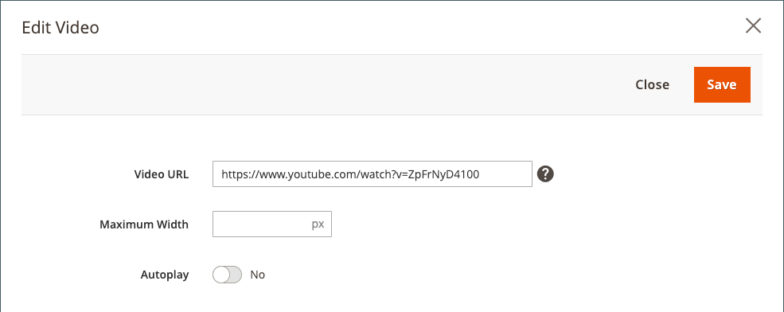

# [!DNL Page Builder] チュートリアル第 3 部：カタログのコンテンツ

この演習では、製品リストをページに追加したり、製品ページをカスタマイズしたり、[!DNL Page Builder] ワークスペースを製品属性セットに追加するカスタム属性を作成したりするのがいかに簡単かを示します。

{width="600" zoomable="yes"}

この演習では、前提条件やダウンロード済みのサンプルファイルを含め、[ パート 1：簡単なページ ](1-simple-page.md) および [ パート 2：ブロック ](2-blocks.md) が完了していることを前提としています。 この演習の 3 つの部分を順番に実行します。

## パート 1：製品リストの追加

[!DNL Page Builder] を使用すると、製品リストをステージに簡単に追加できます。 この例では、製品リストがページに直接追加されます。

### 手順 1：ステージへの製品リストの追加

1. _管理者_ サイドバーで、**[!UICONTROL Content]**/_[!UICONTROL Elements]_/**[!UICONTROL Pages]**に移動します。

1. 最初の演習で作成し、2 番目の演習で変更した _シンプルなページ_ を見つけ、_[!UICONTROL Action]_の列の&#x200B;**[!UICONTROL Edit]**を選択します。

1.  「**[!UICONTROL Content]**」セクションを展開し、コンテンツプレビュー領域 **[!UICONTROL Edit with Page Builder]** または内側をクリックします。

1. _[!UICONTROL Layout]_の下の [!DNL Page Builder] パネルで、**[!UICONTROL Row]**をステージの上部にドラッグします。

1. [!DNL Page Builder] パネルで **[!UICONTROL Add Content]** を展開し、**[!UICONTROL Products]** プレースホルダーを新しい行にドラッグします。

   {width="600" zoomable="yes"}

### 手順 2：条件を作成する

1. 空の products コンテナにポインタを合わせてツールボックスを表示し、「_設定_」（{width="20"}）アイコンを選択します。

   {width="600" zoomable="yes"}

1. **[!UICONTROL Select Products By]** の場合は、「`Condition`」を選択します。

1. 条件を追加します。

   - _追加_ （）アイコンをクリックします。

   - 「_[!UICONTROL Product Attribute]_」で、「**[!UICONTROL Category]**」を選択します。

     {width="600" zoomable="yes"}

   - 条件の _[!UICONTROL Category is]..._ の一部を完了するには、その他（...）アイコンをクリックし、_選択_ （）アイコンをクリックします。

     {width="600" zoomable="yes"}

   - カテゴリツリーで、**Women > Tops** カテゴリにドリルダウンし、「**Tees**」チェックボックスを選択します。

     {width="600" zoomable="yes"}

   - チェックマーク（）アイコンをクリックします。

     対応するカテゴリ ID がフィールドに表示され、条件が完了します。

### 手順 3：設定を完了する

1. **[!UICONTROL Number of Products to Display]** を入力します。

   デフォルトでは、リストには 5 つの製品が表示されます。

1. 必要に応じて、残りの設定を完了します。

   必要に応じて、[ コンテンツを追加 – 製品 ](products.md) ページの最後にあるフィールドの説明を参照するために使用します。

1. 完了したら、「**[!UICONTROL Save]**」をクリックして設定を保存し、[!DNL Page Builder] ワークスペースに戻ります。

   {width="600" zoomable="yes"}

1. ステージの右上隅にある _フルスクリーンを閉じる_ （{width="20"}）アイコンをクリックします。

   このアイコンをクリックすると、ページの「_[!UICONTROL Content]_」セクションに戻り、プレビューが表示されます。

1. 右上隅の **[!UICONTROL Save]** 矢印をクリックし、「**[!UICONTROL Save & Close]**」を選択します。

## 第 2 部：製品ページのカスタマイズ

>[!NOTE]
>
>管理者ユーザーが [!UICONTROL Edit with Page Builder] のボタンを表示し、ページビルダーを使用するには、[ 役割の範囲 ](../systems/permissions-user-roles.md) に対する [!UICONTROL Content] 権限が必要です。

演習のこの部分では、製品ページ上の一連のタブの下にビデオを配置することで、製品ページを簡単にカスタマイズする方法を説明します。 [ カテゴリページ ](../catalog/categories-content-settings.md) コンテンツを更新する手順は、基本的に同じです。

1. _管理者_ サイドバーで、**[!UICONTROL Catalog]**/**[!UICONTROL Products]** に移動します。

1. この例で使用できる簡単な製品を見つけて、編集モードで開きます。

1. 下にスクロールして、「**[!UICONTROL Content]**」セクションの  を展開します。

1. 「_[!UICONTROL Description]_」の横にある「**[!UICONTROL Edit with Page Builder]**」をクリックします。

   {width="600" zoomable="yes"}

   商品の説明が以前に [!DNL Page Builder] なしで入力された場合、現在の説明は、[HTMLコード ](html-code.md) コンテナのHTMLとして表示されます。 Luma テーマを使用すると、製品の説明が「詳細」タブに表示されます。

1. _[!UICONTROL Layout]_の下の [!DNL Page Builder] パネルで、**[!UICONTROL Row]**をステージにドラッグして、HTMLコードコンテナの下に配置します。

   行が正しい位置にあるときに表示される赤いガイドラインを探します。

   {width="600" zoomable="yes"}

1. [!DNL Page Builder] パネルで **[!UICONTROL Media]** を展開し、**[!UICONTROL Video]** プレースホルダーを新しい行にドラッグします。

   {width="600" zoomable="yes"}

1. 空のビデオコンテナにカーソルを合わせてツールボックスを表示し、_設定_ （{width="20"}）アイコンを選択します。

   {width="500" zoomable="yes"}

1. **[!UICONTROL Video URL]** を入力します。

   ビデオは [YouTube][1] または [Vimeo][2] でホストできます。 この例のビデオは、YouTubeの次の URL で見つかります。

   `https://www.youtube.com/watch?v=ZpFrNyD4100`

   {width="500" zoomable="yes"}

1. ビデオディスプレイの **[!UICONTROL Maximum Width]** をピクセル単位で入力します。

   このオプションを空白のままにすると、ビデオは使用可能なスペースいっぱいに表示されます。

1. 「**[!UICONTROL Save]**」をクリックして設定を保存し、[!DNL Page Builder] ワークスペースに戻ります。

   {width="600" zoomable="yes"}

1. ステージの右上隅にある _フルスクリーンを閉じる_ （{width="20"}）アイコンをクリックします。

   このアイコンをクリックすると、ページの「_[!UICONTROL Content]_」セクションに戻り、プレビューが表示されます。

1. 右上隅の **[!UICONTROL Save]** 矢印をクリックし、「**[!UICONTROL Save & Close]**」を選択します。

ストアフロントでは、ビデオは一連のタブの下に表示されます。 モバイルデバイスでのページの外観を確認するには、ウィンドウのサイズを変更します。

{width="600" zoomable="yes"}

**これで完了です。** カタログのコンテンツ チュートリアルの 2 番目のパートを完了しました。 作成した作業は保持しておくと、後で参照できます。

## 第 3 部：カスタム属性の追加

[!DNL Page Builder] カスタム属性を使用して、魅力的なコンテンツの作成に使用できる、完全に機能する [!DNL Page Builder] ワークスペースを製品ページに追加します。 演習のこのパートでは、[!DNL Page Builder] 入力タイプを使用してカスタム属性を作成し、カタログの製品ページに適用する方法を学びます。 これらの属性について詳しくは、[ 製品属性 ](../catalog/product-attributes.md) を参照してください。

### 手順 1：製品を作成する

ライブストアが変更されないようにするには、説明されたプロパティを使用して製品を作成します。

1. _管理者_ サイドバーで、**[!UICONTROL Catalog]**/**[!UICONTROL Products]** に移動します。

1. 右上隅の「**[!UICONTROL Add Product]**」をクリックします。

1. 次のプロパティを持つ製品を作成します。

   - 
     [!UICONTROL 属性セット]: Default
   - [!UICONTROL Product Name]: My Product
   - 
     [!UICONTROL SKU]: Tutorial
   - 
     [!UICONTROL Price]: 75.00
   - 
     [!UICONTROL Quantity]: 100
   - [!UICONTROL Stock Status]：在庫あり
   - 
     [!UICONTROL Weight]: 1
   - [!UICONTROL Categories]：女性/トップス/T 型

1. 右上隅の **[!UICONTROL Save]** 矢印をクリックし、「**[!UICONTROL Save & Close]**」を選択します。

### 手順 2：カスタム属性の作成

この手順では、[!DNL Page Builder] とテキストエディターの入力タイプを使用する方法を示す 2 つの新しいカスタム属性を作成します。

1. _管理者_ サイドバーで、**[!UICONTROL Stores]**/_[!UICONTROL Attributes]_/**[!UICONTROL Product]**に移動します。

1. 右上隅の「**[!UICONTROL Add New Attribute]**」をクリックします。

1. 属性の **[!UICONTROL Default Label]** を入力します。

   この例では、ラベルに `My Page Builder Attribute` を使用します。

1. **[!UICONTROL Catalog Input Type for Store Owner]** を `Page Builder` に設定します。

   カスタム アトリビュートを作成する場合は、`Page Builder` または標準の WYSIWYG `Text Editor` として、アプリケーションに最適なエディタを指定できます。

   ![[!DNL Page Builder] 入力タイプ ](./assets/pb-attribute-page-builder.png){width="600" zoomable="yes"}

1. **[!UICONTROL Advanced Attribute Properties]** のセクションの  を展開し、次の設定を行います。

   - [!UICONTROL Attribute Code]：属性コードをスペースではなくハイフンを使用して、小文字で入力します。 この例では、`my_page_builder_attribute` を使用します。
   - [!UICONTROL Scope]: デフォルト値 `Store View` を使用します。
   - [!UICONTROL Default Value]：属性のデフォルト値を入力します。
   - 
     [!UICONTROL Unique Value]: `No`
   - 
     [!UICONTROL Add to Column Options]: `No`
   - 
     [!UICONTROL Use in Filter Options]: `Yes`

1. 左側の _[!UICONTROL Attribute Information]_パネルで「**[!UICONTROL Storefront Properties]**」を選択し、次の設定を行います。

   - 
     [!UICONTROL Use for Promo Rule Conditions]: `Yes`
   - 
     [!UICONTROL Visible on Catalog Pages on Storefront]: `Yes`
   - 
     [!UICONTROL Used in Product Listing]: `Yes`

1. 完了したら、「**[!UICONTROL Save Attribute]**」をクリックします。

1. 上記の手順を繰り返して、同じ基本プロパティを持ち、テキストエディター入力タイプが次のような 2 番目の属性を作成します。

   - [!UICONTROL Default Label]: My Text Editor 属性
   - [!UICONTROL Catalog Input Type for Store Owner]：テキストエディター
   - 
     [!UICONTROL 属性コード]: `my_text_editor_attribute`

### 手順 3：製品属性セットの更新

1. _管理者_ サイドバーで、**[!UICONTROL Stores]**/_[!UICONTROL Attributes]_/**[!UICONTROL Attribute Set]**に移動します。

   この例では、新しい属性を一時的に `default` 属性セットに追加します。 この演習の最後では、カタログに影響を与えないように、属性セットから属性を削除します。

   >[!NOTE]
   >
   >ライブストアを変更しない場合は、属性セットを更新せずにそれに従うことができます。

1. リストで _[!UICONTROL Default]_属性セットを見つけてダブルクリックし、編集モードで開きます。

1. _未割り当て属性_ リストで、作成した新しい属性を見つけて、**[!UICONTROL Content]** の下の _[!UICONTROL Groups]_の列にドラッグします。

   [!UICONTROL Groups] 列内の属性の場所によって、ページ上の表示場所が決まります。

   {width="600" zoomable="yes"}

1. 「属性セット」リストに戻るには、「**[!UICONTROL Save]**」をクリックします。

1. プロンプトが表示されたら、ページ上部の **[!UICONTROL Cache Management]** リンクをクリックし、無効なキャッシュを更新します。

### 手順 4：製品をアップデートする

1. _管理者_ サイドバーで、**[!UICONTROL Catalog]**/**[!UICONTROL Products]** に移動します。

1. 製品グリッドで _My Product_ を探し、編集モードで開きます。

1. 下にスクロールして、「**[!UICONTROL Content]**」セクションの  を展開します。

   セクションの上部には、製品コンテンツの 2 つの標準属性があります。

   - _簡単な説明_：標準の WYSIWYG [ エディター ](../content-design/editor.md) を使用します。
   - _説明_:[!DNL Page Builder] プレビューが表示されます。

   {width="600" zoomable="yes"}

   セクションの下半分までスクロールすると、作成して割り当てた属性が 2 つあります。

   - _My [!DNL Page Builder] Attribute_:[!DNL Page Builder] プレビューを表示します。
   - _テキストエディター属性_：標準の WYSIWYG エディターを使用します。

   {width="600" zoomable="yes"}

1. **My Text Editor Attribute** エディタで、`Text Editor Attribute placeholder text` と入力します。

   - 右上隅の **[!UICONTROL Save]** 矢印をクリックし、「**[!UICONTROL Save & Close]**」を選択します。

1. 「**マイページビルダー属性**」で「**[!UICONTROL Edit with Page Builder]**」をクリックし、説明テキストを追加します。

   - [!DNL Page Builder] パネルで **[!UICONTROL Elements]** を展開し、**[!UICONTROL Text object]** をステージにドラッグします。

   - `Page Builder attribute placeholder text` と入力します。

   - ステージの右上隅にある _フルスクリーンを閉じる_ （{width="20"}）アイコンをクリックします。

     {width="600" zoomable="yes"}

1. **[!UICONTROL Description]** までスクロールし、**[!UICONTROL Edit with Page Builder]** をクリックし、前の手順と同じ方法を使用して任意のテキストを追加します。

1. 製品ページの右上隅にある **[!UICONTROL Save]** 矢印をクリックし、「**[!UICONTROL Save & Close]**」を選択します。

1. プロンプトが表示されたら、ページ上部のメッセージに含まれている **[!UICONTROL Cache Management]** リンクをクリックし、無効なキャッシュを更新します。

### 手順 5：結果の表示

1. ストアフロントのサンプル製品ページに移動します。

   この例では、製品は上部ナビゲーションの女性/ トップス / T 型の下にあります。

1. _My Page Builder 属性_ 情報までスクロールします。

   製品ページ上の属性の位置は、テーマによって決定されます。 Luma テーマでは、新しい属性は製品の説明の直後に配置されます。

   ストアフロントの ![[!DNL Page Builder] およびテキストエディター属性 ](./assets/pb-storefront-product-attribute.png){width="600" zoomable="yes"}

[!DNL Page Builder] カタログのコンテンツの演習を完了しました。 作成した作業は保持しておくと、後で参照できます。

[1]: https://www.youtube.com/
[2]: https://vimeo.com/
