# [!DNL Page Builder] チュートリアル パート 3: カタログ コンテンツ

この演習では、製品リストをページに追加し、製品ページをカスタマイズし、製品属性セットに[!DNL Page Builder] ワークスペースを追加するカスタム属性を作成することがいかに簡単かを示します。

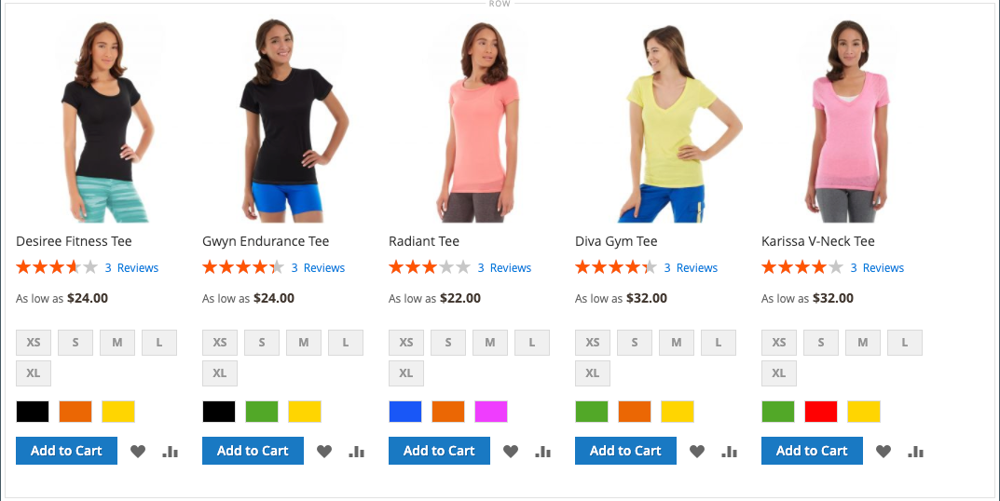{width="600" zoomable="yes"}

この演習では、前提条件とダウンロードしたサンプルファイルを含む、[&#x200B; パート 1：単純ページ &#x200B;](1-simple-page.md)と[&#x200B; パート 2：ブロック &#x200B;](2-blocks.md)を完了したことを前提としています。 この演習の3つの部分を順番に進めます。

## パート 1：製品リストの追加

[!DNL Page Builder]を使用すると、製品リストをステージに簡単に追加できます。 この例では、製品リストがページに直接追加されます。

### 手順1：製品リストをステージに追加する

1. _管理者_ サイドバーで、**[!UICONTROL Content]** > _[!UICONTROL Elements]_>**[!UICONTROL Pages]**&#x200B;に移動します。

1. 最初の演習で作成し、2番目の演習で変更した&#x200B;_シンプル ページ_&#x200B;を見つけ、_[!UICONTROL Action]_&#x200B;列の&#x200B;**[!UICONTROL Edit]**&#x200B;を選択します。

1. **[!UICONTROL Content]** セクションのを展開し、**[!UICONTROL Edit with Page Builder]**&#x200B;またはコンテンツプレビュー領域内をクリックします。

1. _[!UICONTROL Layout]_&#x200B;の下の[!DNL Page Builder] パネルで、**[!UICONTROL Row]**&#x200B;をステージの上部にドラッグします。

1. [!DNL Page Builder] パネルで、**[!UICONTROL Add Content]**&#x200B;を展開し、**[!UICONTROL Products]** プレースホルダーを新しい行にドラッグします。

   {width="600" zoomable="yes"}

### 手順2：条件の作成

1. 空の製品コンテナにカーソルを合わせてツールボックスを表示し、_設定_ （{width="20"}）アイコンを選択します。

   {width="600" zoomable="yes"}

1. **[!UICONTROL Select Products By]**&#x200B;に対して、`Condition`を選択します。

1. 条件を追加：

   - _追加_ （）アイコンをクリックします。

   - _[!UICONTROL Product Attribute]_&#x200B;で、**[!UICONTROL Category]**&#x200B;を選択します。

     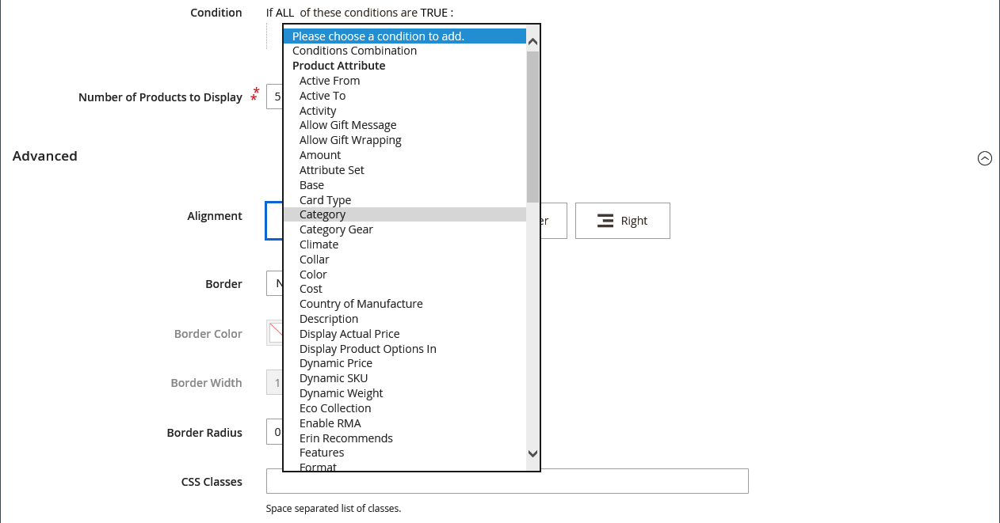{width="600" zoomable="yes"}

   - 詳細（。..）をクリックして、条件の&#x200B;_[!UICONTROL Category is]..._&#x200B;部分を完了します。 アイコンをクリックし、_Chooser_ （）アイコンをクリックします。

     {width="600" zoomable="yes"}

   - カテゴリーツリーで、**女性/ トップス** カテゴリにドリルダウンし、**ティー** チェックボックスを選択します。

     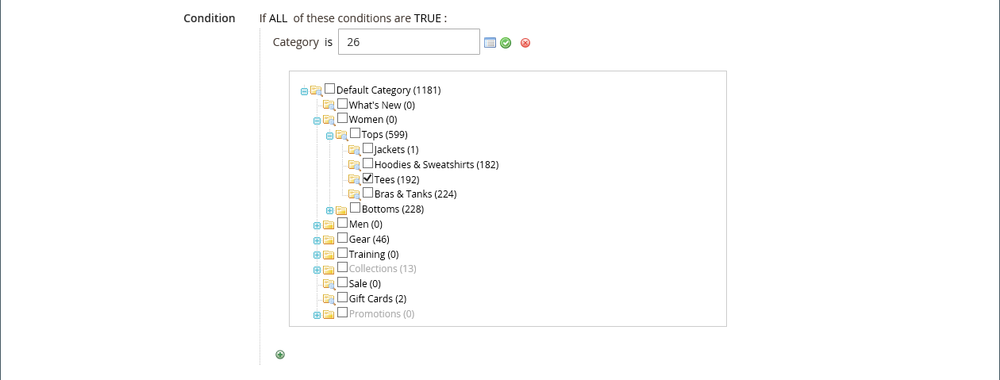{width="600" zoomable="yes"}

   - チェックマーク （）アイコンをクリックします。

     対応するカテゴリ IDがフィールドに表示され、条件が完了します。

### 手順3：設定を完了する

1. **[!UICONTROL Number of Products to Display]**&#x200B;を入力します。

   デフォルトでは、リストには5つの商品が表示されます。

1. 必要に応じて、残りの設定を完了します。

   必要に応じて、[&#x200B; コンテンツを追加 – 製品](products.md) ページの最後にあるフィールドの説明を参照に使用します。

1. 完了したら、**[!UICONTROL Save]**&#x200B;をクリックして設定を保存し、[!DNL Page Builder] ワークスペースに戻ります。

   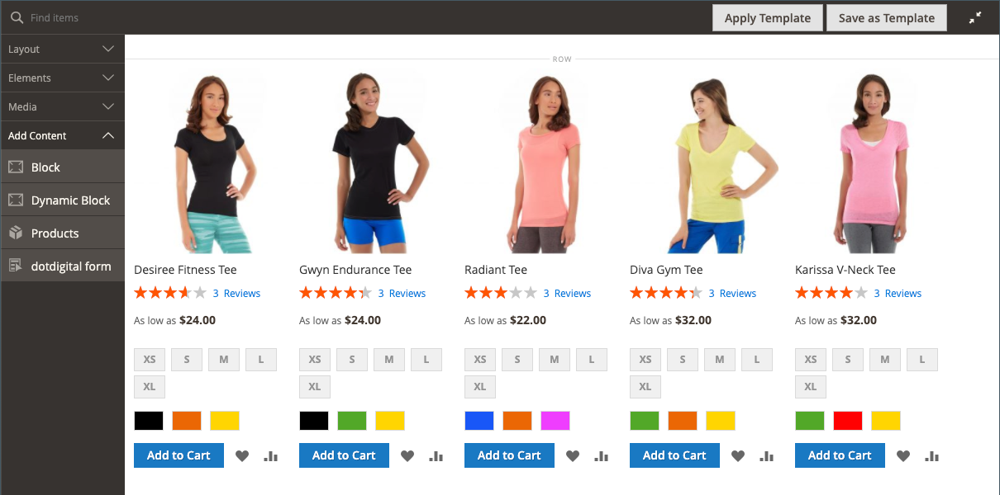{width="600" zoomable="yes"}

1. ステージの右上隅で、_フルスクリーンを閉じる_ （{width="20"}）アイコンをクリックします。

   このアイコンをクリックすると、プレビューが表示されたページの&#x200B;_[!UICONTROL Content]_&#x200B;セクションに戻ります。

1. 右上隅の&#x200B;**[!UICONTROL Save]**&#x200B;矢印をクリックし、**[!UICONTROL Save & Close]**&#x200B;を選択します。

## パート 2：製品ページのカスタマイズ

>[!NOTE]
>
>[!UICONTROL Edit with Page Builder] ボタンを表示し、ページビルダーを使用するには、管理者ユーザーが[役割スコープ &#x200B;](../systems/permissions-user-roles.md)に対して[!UICONTROL Content]権限を持っている必要があります。

この演習では、製品ページの一連のタブの下にビデオを配置して、製品ページを簡単にカスタマイズする方法を説明します。 [&#x200B; カテゴリーページ &#x200B;](../catalog/categories-content-settings.md)のコンテンツを更新するプロセスは、基本的に同じです。

1. _管理者_ サイドバーで、**[!UICONTROL Catalog]** > **[!UICONTROL Products]**&#x200B;に移動します。

1. この例で使用できる簡単な製品を見つけて、編集モードで開きます。

1. 下にスクロールして、**[!UICONTROL Content]** セクションのを展開します。

1. _[!UICONTROL Description]_&#x200B;の横にある「**[!UICONTROL Edit with Page Builder]**」をクリックします。

   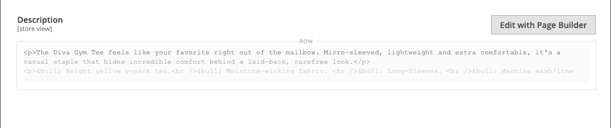{width="600" zoomable="yes"}

   以前に[!DNL Page Builder]なしで商品説明が入力された場合、現在の説明は[HTML Code](html-code.md) コンテナにHTMLとして表示されます。 Luma テーマを使用すると、製品の説明が「詳細」タブに表示されます。

1. _[!UICONTROL Layout]_&#x200B;の下の[!DNL Page Builder] パネルで、**[!UICONTROL Row]**&#x200B;をステージにドラッグし、HTML コードコンテナの下に配置します。

   行が正しい位置にあるときに表示される赤いガイドラインを探します。

   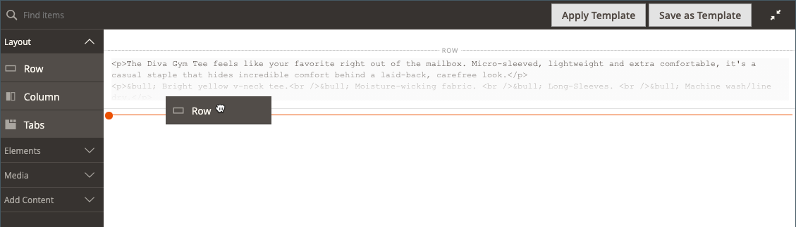{width="600" zoomable="yes"}

1. [!DNL Page Builder] パネルで、**[!UICONTROL Media]**&#x200B;を展開し、**[!UICONTROL Video]** プレースホルダーを新しい行にドラッグします。

   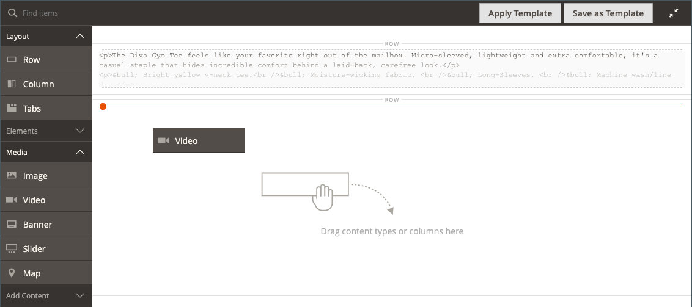{width="600" zoomable="yes"}

1. 空のビデオコンテナにカーソルを合わせてツールボックスを表示し、_設定_ （{width="20"}）アイコンを選択します。

   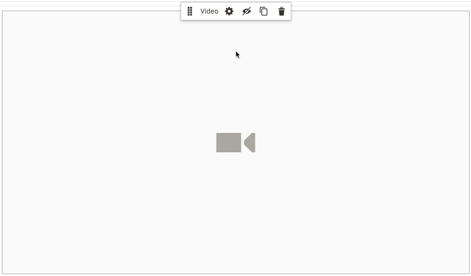{width="500" zoomable="yes"}

1. **[!UICONTROL Video URL]**&#x200B;を入力します。

   ビデオは、[YouTube](https://www.youtube.com/)または[Vimeo](https://vimeo.com/)のいずれかでホストできます。 この例のビデオは、次のURLにあるYouTubeにあります。

   `https://www.youtube.com/watch?v=ZpFrNyD4100`

   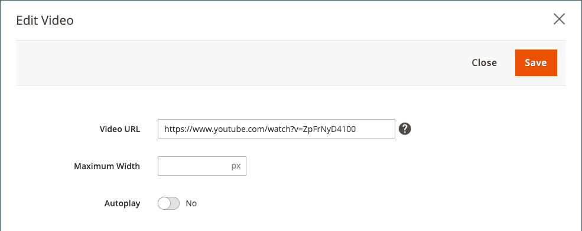{width="500" zoomable="yes"}

1. ビデオ表示の&#x200B;**[!UICONTROL Maximum Width]**&#x200B;をピクセル単位で入力します。

   このオプションを空白のままにすると、ビデオが使用可能なスペースに入力されます。

1. **[!UICONTROL Save]**&#x200B;をクリックして設定を保存し、[!DNL Page Builder] ワークスペースに戻ります。

   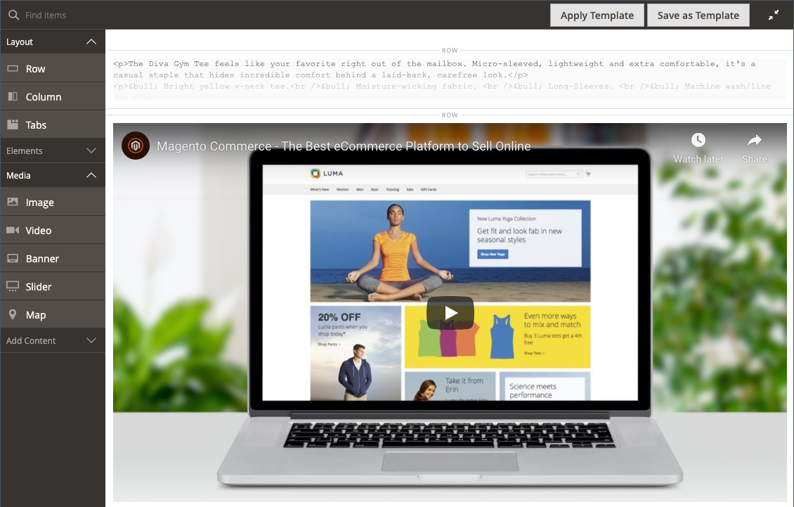{width="600" zoomable="yes"}

1. ステージの右上隅で、_フルスクリーンを閉じる_ （{width="20"}）アイコンをクリックします。

   このアイコンをクリックすると、プレビューが表示されたページの&#x200B;_[!UICONTROL Content]_&#x200B;セクションに戻ります。

1. 右上隅の&#x200B;**[!UICONTROL Save]**&#x200B;矢印をクリックし、**[!UICONTROL Save & Close]**&#x200B;を選択します。

ストアフロントでは、一連のタブの下にビデオが表示されます。 モバイルデバイスでのページの表示を確認するには、ウィンドウのサイズを変更します。

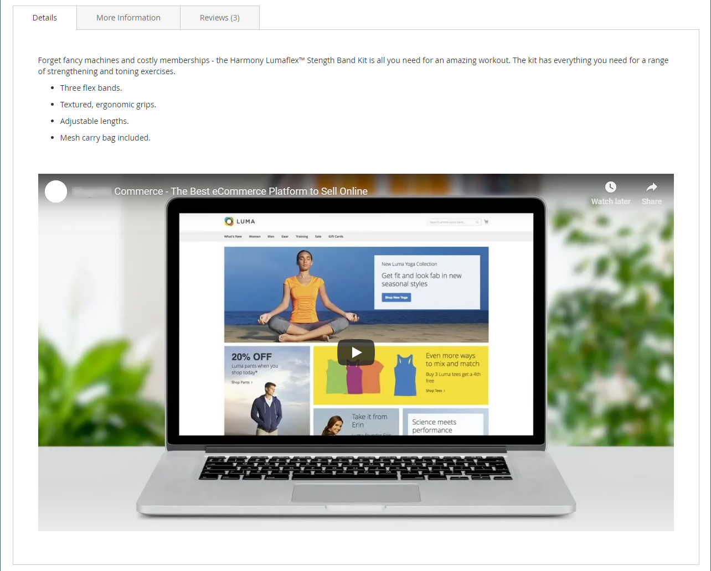{width="600" zoomable="yes"}

**おめでとうございます！** カタログコンテンツのチュートリアルの2番目の部分を完了しました。 後で参照できるように、作成した作業を保存します。

## パート 3：カスタム属性の追加

[!DNL Page Builder] カスタム属性を使用して、完全に機能する[!DNL Page Builder] ワークスペースを製品ページに追加します。このワークスペースを使用すると、魅力的なコンテンツを作成できます。 このパートでは、[!DNL Page Builder]入力タイプを使用してカスタム属性を作成し、カタログ内の製品ページに適用する方法について説明します。 これらの属性について詳しくは、[製品属性](../catalog/product-attributes.md)を参照してください。

### ステップ 1：商品の作成

ライブストアへの変更を避けるには、説明されているプロパティを使用して製品を作成します。

1. _管理者_ サイドバーで、**[!UICONTROL Catalog]** > **[!UICONTROL Products]**&#x200B;に移動します。

1. 右上隅の「**[!UICONTROL Add Product]**」をクリックします。

1. 次のプロパティを持つ製品を作成します。

   - &#x200B;
     [!UICONTROL 属性セット]: Default
   - [!UICONTROL Product Name]：自分の製品
   - &#x200B;
     [!UICONTROL SKU]: Tutorial
   - &#x200B;
     [!UICONTROL Price]: 75.00
   - &#x200B;
     [!UICONTROL Quantity]: 100
   - [!UICONTROL Stock Status]：在庫
   - &#x200B;
     [!UICONTROL Weight]: 1
   - [!UICONTROL Categories]：女性> トップス > ティー

1. 右上隅の&#x200B;**[!UICONTROL Save]**&#x200B;矢印をクリックし、**[!UICONTROL Save & Close]**&#x200B;を選択します。

### 手順2：カスタム属性の作成

この手順では、2つの新しいカスタム属性を作成して、[!DNL Page Builder]とテキストエディターの入力タイプの使用方法を示します。

1. _管理者_ サイドバーで、**[!UICONTROL Stores]** > _[!UICONTROL Attributes]_>**[!UICONTROL Product]**&#x200B;に移動します。

1. 右上隅の「**[!UICONTROL Add New Attribute]**」をクリックします。

1. 属性に&#x200B;**[!UICONTROL Default Label]**&#x200B;を入力します。

   この例では、ラベルに`My Page Builder Attribute`を使用します。

1. **[!UICONTROL Catalog Input Type for Store Owner]**&#x200B;を`Page Builder`に設定します。

   カスタム属性を作成する際に、アプリケーションに最も適したエディターを`Page Builder`または標準のWYSIWYG `Text Editor`として指定できます。

   ![[!DNL Page Builder]入力タイプ &#x200B;](./assets/pb-attribute-page-builder.png){width="600" zoomable="yes"}

1. **[!UICONTROL Advanced Attribute Properties]** セクションのを展開し、次の設定を行います。

   - [!UICONTROL Attribute Code]: スペースの代わりにハイフンを使用して、属性コードを小文字で入力します。 この例では、`my_page_builder_attribute`を使用します。
   - [!UICONTROL Scope]: デフォルト値である`Store View`を受け入れます。
   - [!UICONTROL Default Value]：属性の既定値を入力します。
   - &#x200B;
     [!UICONTROL Unique Value]: `No`
   - &#x200B;
     [!UICONTROL Add to Column Options]: `No`
   - &#x200B;
     [!UICONTROL Use in Filter Options]: `Yes`

1. 左側の&#x200B;_[!UICONTROL Attribute Information]_&#x200B;パネルで、**[!UICONTROL Storefront Properties]**&#x200B;を選択し、次の設定を行います。

   - &#x200B;
     [!UICONTROL Use for Promo Rule Conditions]: `Yes`
   - &#x200B;
     [!UICONTROL Visible on Catalog Pages on Storefront]: `Yes`
   - &#x200B;
     [!UICONTROL Used in Product Listing]: `Yes`

1. 完了したら、**[!UICONTROL Save Attribute]**&#x200B;をクリックします。

1. 前の手順を繰り返して、同じ基本プロパティを持つ2つ目の属性を作成しますが、テキストエディターの入力タイプは次のようになります。

   - [!UICONTROL Default Label]：自分のテキストエディター属性
   - [!UICONTROL Catalog Input Type for Store Owner]: テキストエディター
   - &#x200B;
     [!UICONTROL 属性コード]: `my_text_editor_attribute`

### 手順3：製品属性セットの更新

1. _管理者_ サイドバーで、**[!UICONTROL Stores]** > _[!UICONTROL Attributes]_>**[!UICONTROL Attribute Set]**&#x200B;に移動します。

   この例では、新しい属性を`default`属性セットに一時的に追加します。 この演習の最後に、属性セットから属性を削除して、カタログに影響を与えないようにします。

   >[!NOTE]
   >
   >ライブストアを変更したくない場合は、属性セットを更新せずにフォローできます。

1. リストで設定されている&#x200B;_[!UICONTROL Default]_&#x200B;属性を見つけ、ダブルクリックして編集モードで開きます。

1. _未割り当ての属性_ リストで、作成した新しい属性を見つけ、それぞれを&#x200B;**[!UICONTROL Content]**&#x200B;の下の&#x200B;_[!UICONTROL Groups]_&#x200B;列にドラッグします。

   [!UICONTROL Groups]列の属性の場所によって、ページ上のどこに表示されるかが決まります。

   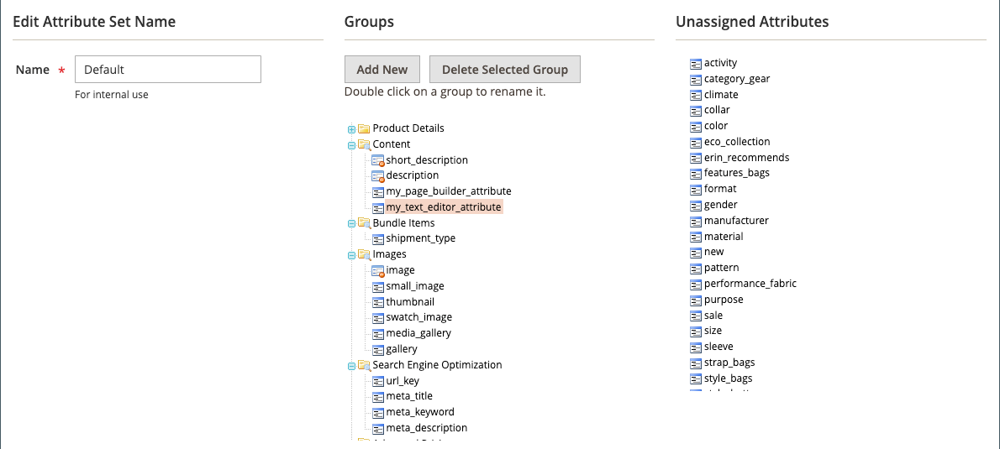{width="600" zoomable="yes"}

1. **[!UICONTROL Save]**&#x200B;をクリックして、属性セット リストに戻ります。

1. プロンプトが表示されたら、ページの上部にある&#x200B;**[!UICONTROL Cache Management]** リンクをクリックし、無効なキャッシュを更新します。

### 手順4：製品の更新

1. _管理者_ サイドバーで、**[!UICONTROL Catalog]** > **[!UICONTROL Products]**&#x200B;に移動します。

1. 製品グリッドで、_My Product_&#x200B;を見つけて、編集モードで開きます。

1. 下にスクロールして、**[!UICONTROL Content]** セクションのを展開します。

   セクションの上部には、製品コンテンツの2つの標準属性があります。

   - 標準のWYSIWYG [editor](../content-design/editor.md)を使用する&#x200B;_簡単な説明_。
   - _説明_。[!DNL Page Builder]のプレビューが表示されます。

   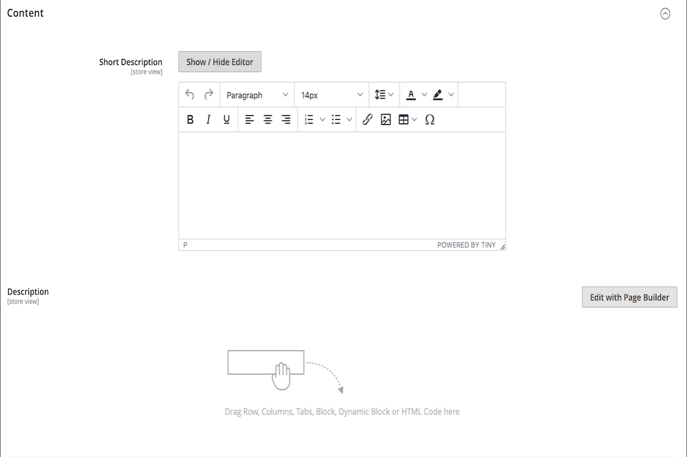{width="600" zoomable="yes"}

   セクションの下半分までスクロールすると、作成して割り当てた2つの属性が表示されます。

   - _My [!DNL Page Builder]属性_: [!DNL Page Builder]のプレビューが表示されます。
   - _標準のWYSIWYG エディターを使用するMy Text Editor Attribute_。

   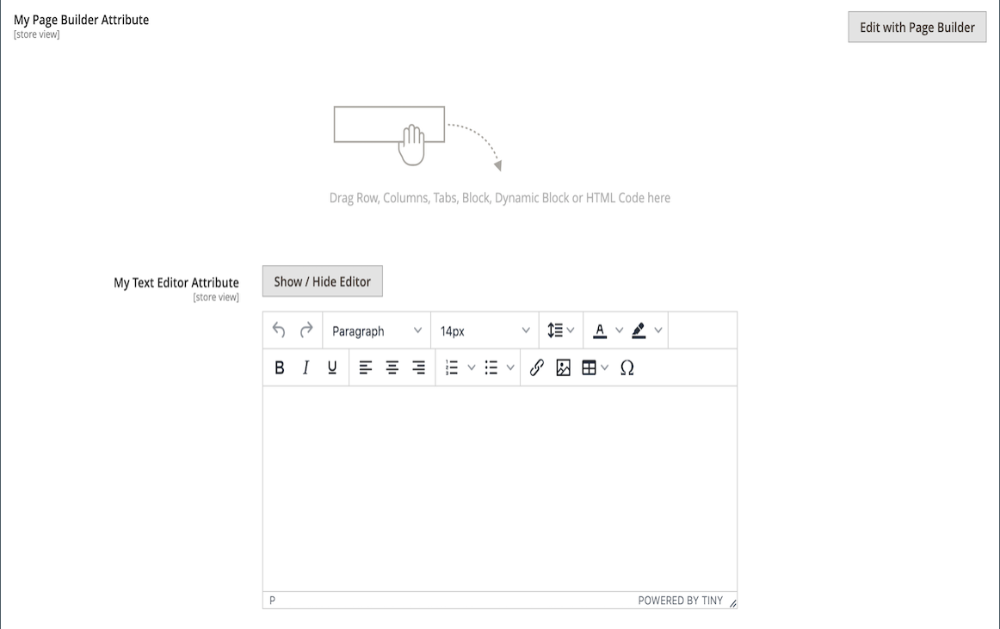{width="600" zoomable="yes"}

1. **My Text Editor Attribute** エディターで、`Text Editor Attribute placeholder text`と入力します。

   - 右上隅の&#x200B;**[!UICONTROL Save]**&#x200B;矢印をクリックし、**[!UICONTROL Save & Close]**&#x200B;を選択します。

1. **My Page Builder Attribute**&#x200B;で、**[!UICONTROL Edit with Page Builder]**&#x200B;をクリックし、説明テキストを追加します。

   - [!DNL Page Builder] パネルで、**[!UICONTROL Elements]**&#x200B;を展開し、**[!UICONTROL Text object]**&#x200B;をステージにドラッグします。

   - `Page Builder attribute placeholder text`と入力します。

   - ステージの右上隅で、_フルスクリーンを閉じる_ （{width="20"}）アイコンをクリックします。

     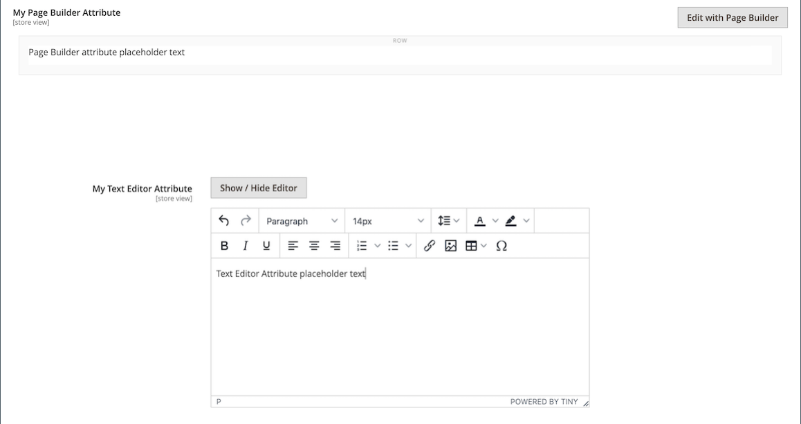{width="600" zoomable="yes"}

1. **[!UICONTROL Description]**&#x200B;までスクロールし、**[!UICONTROL Edit with Page Builder]**&#x200B;をクリックして、前の手順と同じ方法を使用して好きなテキストを追加します。

1. 製品ページの右上隅にある&#x200B;**[!UICONTROL Save]**&#x200B;矢印をクリックし、**[!UICONTROL Save & Close]**&#x200B;を選択します。

1. メッセージが表示されたら、ページの上部にあるメッセージの&#x200B;**[!UICONTROL Cache Management]** リンクをクリックし、無効なキャッシュを更新します。

### 手順5：結果の表示

1. ストアフロントのサンプル製品ページに移動します。

   この例では、製品は上部ナビゲーションの女性/トップス/ティーに表示されます。

1. _マイページビルダー属性_&#x200B;情報までスクロールします。

   製品ページ上の属性の位置は、テーマによって決まります。 Luma テーマでは、新しい属性は製品説明のすぐ後にあります。

   ストアフロントの![[!DNL Page Builder]およびテキストエディター属性](./assets/pb-storefront-product-attribute.png){width="600" zoomable="yes"}

[!DNL Page Builder] カタログ コンテンツの演習が完了しました。 後で参照できるように、作成した作業を保存します。
