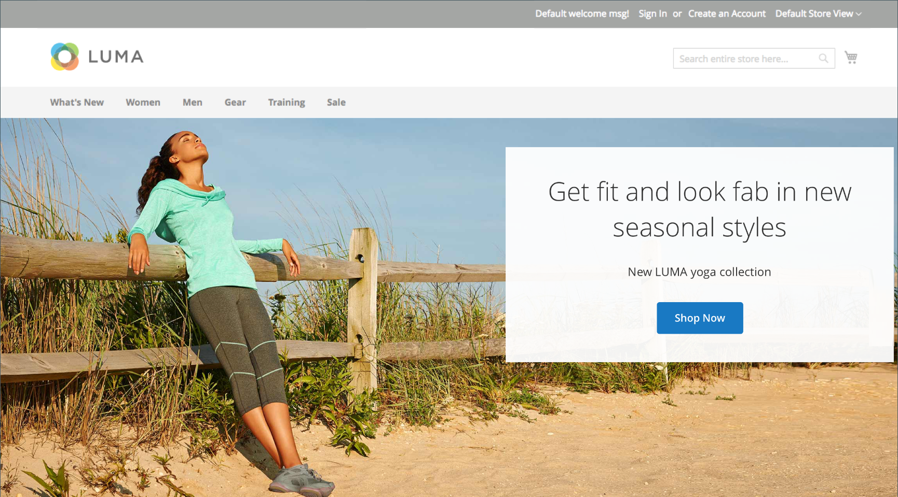

# メディア – バナー

_Banner_ コンテンツ タイプを使用して、ユーザーを[[!DNL Page Builder]  ステージ &#x200B;](workspace.md#stage)のcall to actionとボタンで惹きつける、イラスト化されたインタラクティブなコンポーネントを追加します。

>[!NOTE]
>
>コンテンツメニューの以前の&#x200B;_バナー_ オプションは、[動的ブロック &#x200B;](../content-design/dynamic-blocks.md)になりました。

{width="700" zoomable="yes"}

{{$include /help/_includes/page-builder-save-timeout.md}}

## バナーツールボックス

バナーコンテナにカーソルを合わせると、バナーツールボックスが表示されます。

{width="600" zoomable="yes"}

| ツール | アイコン | 説明 |
|--- |--- |--- |
| 移動 | {width="25"} | バナーをステージ上の別の位置に移動します。 |
| （ラベル） | バナー | 現在のコンテンツコンテナをバナーとして識別します。 コンテナにカーソルを合わせると、ツールボックスが表示されます。 |
| 設定 | {width="25"} | バナーを編集ページが開き、バナーとコンテナのプロパティを変更できます。 |
| 非表示 | {width="25"} | 現在のバナーを非表示にします。 |
| 表示 | {width="25"} | 非表示のバナーを表示します。 |
| 重複 | {width="25"} | バナーのコピーを作成します。 |
| 削除 | {width="25"} | ステージからバナーを削除します。 |
| [!UICONTROL Upload New Image] |  | ローカルファイルシステムからバナーの背景のギャラリーに画像をアップロードします。 |
| [!UICONTROL Select from Gallery] |  | バナーの背景にギャラリーの既存の画像を使用します。 |

{style="table-layout:auto"}

{{$include /help/_includes/page-builder-hidden-element-note.md}}

## バナーを追加

1. [!DNL Page Builder] パネルで、**[!UICONTROL Media]**&#x200B;を展開し、**[!UICONTROL Banner]** プレースホルダーをステージにドラッグします。

   {width="600" zoomable="yes"}

   _[!UICONTROL Upload Image]_&#x200B;と_[!UICONTROL Select from Gallery]_&#x200B;のボタンが含まれているため、ステージから直接バナーコンテンツを素早く変更できます。 _[!UICONTROL Edit Banner]_&#x200B;ページのコンテンツを変更することもできます。

1. バナーのプレースホルダーをクリックして[&#x200B; テキストエディター](../content-design/editor.md)を表示し、バナーのコンテンツを入力します。

   [&#x200B; コンテンツ &#x200B;](#content)設定を使用して、より複雑なバナーコンテンツを含めることもできます。

## バナー設定の変更

1. バナーコンテナにカーソルを合わせてツールボックスを表示し、_設定_ （）アイコンを選択します。

1. 使用可能な設定の更新について詳しくは、次の節を参照してください。

   - [[!UICONTROL Appearance]](#appearance)
   - [[!UICONTROL Content]](#content)
   - [[!UICONTROL Background]](#background)
   - [[!UICONTROL Advanced]](#advanced)

1. 完了したら、右上隅の&#x200B;**[!UICONTROL Save]**&#x200B;をクリックして、_[!UICONTROL Edit Banner]_&#x200B;ページを閉じます。

1. 右上隅の「**[!UICONTROL Save]**」をクリックして設定を適用し、[!DNL Page Builder] ワークスペースに戻ります。

## [!UICONTROL Appearance]

バナーは、4つの定義済みテンプレートのいずれかに基づいているため、設定や保守が容易です。

- 次のいずれかのバナー配置タイプを選択します。

  | プレースメント | 説明 |
  | --------- | ----------- |
  | [!UICONTROL Poster] | コンテンツとボタンをバナーに配置します。 オーバーレイを使用すると、バナーの全幅が拡張されます。 |
  | [!UICONTROL Collage Left] | バナーの左側の定義された領域にコンテンツとボタンを配置します。 オーバーレイを使用する場合は、定義された領域のみをカバーします。 |
  | [!UICONTROL Collage Center] | バナーの中央にある定義された領域にコンテンツとボタンを配置します。 オーバーレイを使用する場合は、定義された領域のみをカバーします。 |
  | [!UICONTROL Collage Right] | バナーの右側の定義された領域にコンテンツとボタンを配置します。 オーバーレイを使用する場合は、定義された領域のみをカバーします。 |

  {style="table-layout:auto"}

  {width="600" zoomable="yes"}

- （オプション）行の&#x200B;**[!UICONTROL Minimum Height]**&#x200B;を入力します。

  最小の高さは、有効なCSS単位（`100px`、`50%`、`50em`、`100vh`など）または計算（`100vh - 237px`など）を含む数値にすることができます。

  例えば、バナーの最小高さを設定して、ページ全体の高さを伸ばすことで、ページ全体の背景画像やビデオに対して魅力的なオプションを提供できます。

## [!UICONTROL Background]

バナーの背景表示を定義するための多くのオプションがあります。 シンプルなカラーまたは背景画像を適用し、より洗練された効果を管理できます。

### [!UICONTROL Background Color]

色見本を選択するか、カラーピッカーをクリックするか、有効なカラー名または同等の16進数値を入力して、背景色を指定します。 この設定により、行の背景色が決まります。 カラーの不透明度を調整することもできます。

{width="200"}

値は、次の3つの方法のいずれかで設定できます。

- `White`などの定義済みのカラー名
- カラーの16進数カラー値（`#ffffff`など）
- カラーのrgba値。不透明度パーセント（`rgba(255, 255, 255, 0.75)`など）

カラーを選択する場合は、「_カラーなし_」ボックスの左側にあるスウォッチをクリックします。

{width="600" zoomable="yes"}

カラーボックスをクリックしてカラーピッカーを再度開くと、スライダーの下のボックスに、現在の赤、緑、青、アルファの値（rgba）が表示されます。 最後の数値は、現在の不透明度の割合を10進数で示しています。 スライダーを使用して不透明度を調整したり、必要な小数値を入力したりできます。

{width="600" zoomable="yes"}

>[!NOTE]
>
>[!DNL Page Builder]は、様々な不透明度を持つ背景の作成に使用できる背景画像で、透明レイヤー（_アルファチャンネル_）もサポートしています。

### [!UICONTROL Background Type]

背景タイプには、画像またはビデオを使用できます。 [!DNL Page Builder]はデフォルトで`Image`に設定され、様々な画像設定が表示されます。 `Video`を選択すると、[!DNL Page Builder]は画像設定をビデオ設定に置き換えます。 両方の背景タイプの設定については、次の節で説明します。

{width="200"}

### 画像タイプの設定

_背景タイプ_&#x200B;を`Image`に設定した場合は、次の設定を使用して背景画像表示を定義します。

{width="600" zoomable="yes"}

- **[!UICONTROL Background Image]** – 必要に応じて、提供されたツールを使用して、バナーに適用する背景画像を選択します。

  | ツール | 説明 |
  | ---- | ----------- |
  | [!UICONTROL Upload] | ローカルコンピューターからギャラリーに画像ファイルをアップロードし、バナーの背景画像として適用します。 |
  | [!UICONTROL Select from Gallery] | ギャラリーの既存の画像をバナーの背景画像として選択するよう求めるプロンプトが表示されます。 |
  | {width="25"} | 画像をカメラタイルにドラッグするか、ローカルファイルシステムで画像を参照できます。 |

  {style="table-layout:auto"}

- **[!UICONTROL Background Mobile Image]** – 必要に応じて、同じツールを使用して、モバイルデバイスでの表示に使用する異なる背景画像を選択します。

- **[!UICONTROL Background Size]** – このオプションを設定すると、バナーの幅に対する背景画像の拡大・縮小の方法を指定できます。

  | オプション | 説明 |
  | ------ | ----------- |
  | `Cover` | 背景画像はバナーの全幅をカバーしています。 |
  | `Contain` | 背景画像は、コンテンツ領域の幅に制限されます。 |
  | `Auto` | 現在のスタイルシートのサイズを適用します。 |

  {style="table-layout:auto"}

  {width="200"}

- **[!UICONTROL Background Position]** – このオプションを設定して、バナーに対する背景画像のアンカー方法を決定します。

  | アンカー | Positions |
  | ------ | ----------- |
  | `Top` | 左/中央/右 |
  | `Center` | 左/中央/右 |
  | `Bottom` | 左/中央/右 |

  {style="table-layout:auto"}

  アンカーポイントは、指定した背景位置のバナーに画像を取り付けるプッシュピンのようなものです。

- **[!UICONTROL Background Attachment]** – 添付ファイルの種類を設定して、背景画像がスクロール ページに対してどのように移動するかを決定します。

  | オプション | 説明 |
  | ------ | ----------- |
  | `Scroll` | 添付された背景画像は、ページのスクロールに合わせて下に移動するように同期されます。 |
  | `Fixed` | （モバイルでは利用できません） コンテナが画像をスクロールしても背景の画像が移動せず、指定した背景位置に固定されます。 |

  {style="table-layout:auto"}

- **[!UICONTROL Background Repeat]** – 背景画像を繰り返してスペースを塗りつぶす場合は、この設定`Yes`を変更します。

### ビデオタイプの設定

_[!UICONTROL Background Type]_&#x200B;を`Video`に設定する場合は、次の設定を使用して背景画像表示を定義します。

- **[!UICONTROL Video URL]** – 有効なビデオ URLを入力してください。 有効なビデオ URLは、次のリンクに設定できます。

   - YouTube ビデオ：`https://youtu.be/CoDhMRUUjeI`
   - Vimeo ビデオ：`https://vimeo.com/190156113`
   - 有効なビデオファイル （`.mp4`をお勧めします）: `https://myvideos.com/spiral.mp4`

  {width="200"}

- **[!UICONTROL Overlay Color]** – 色を選択して、ビデオに透明な色合いを適用します。

- **[!UICONTROL Infinite Loop]** - ビデオを1回再生して停止するには、`No`に設定します。 `Yes`に設定すると（デフォルト）、ビデオは無限ループで繰り返されます。

- **[!UICONTROL Lazy Load]** - `No`に設定すると、表示されていない場合でも、ページでビデオが読み込まれます。 `Yes`に設定されている場合（デフォルト）、ビデオは画面に表示されている場合にのみソースから読み込まれます。

- **[!UICONTROL Play Only When Visible]** - ビデオが読み込まれた直後から、表示されているかどうかに関係なくビデオの再生を開始するには、`No`に設定します。 `Yes` （デフォルト）に設定されている場合、ビデオは表示されているときにのみ再生を開始します。

- **[!UICONTROL Fallback Image]** – 必要に応じて、ビデオが読み込まれる前に画面に表示する画像を指定し、何らかの理由でビデオが読み込まれない場合は、画像を指定します。

## [!UICONTROL Content]

バナーコンテンツは、ステージ上または設定を変更する際に直接変更できます。 この設定には、バナーのリンクやボタン、オーバーレイなど、より複雑なコンテンツ機能が用意されています。 コンテンツの位置は、[&#x200B; アピアランス &#x200B;](#appearance)のプレースメント設定を反映しています。

### ステージ上のシンプルなコンテンツ

1. プレースホルダーテキストをクリックし、バナーに表示するテキストを入力します。

   エディターツールバーがテキストボックスの上に表示されます。

   {width="600" zoomable="yes"}

1. エディターツールバーを使用して、テキストを入力および書式設定したり、リンク、画像、ウィジェットなどの要素を挿入したりできます。

   {width="600" zoomable="yes"}

### 設定の複雑なコンテンツ

1. バナーコンテナにカーソルを合わせてツールボックスを表示し、_設定_ （{width="25"}）アイコンを選択します。

1. _[!UICONTROL Content]_&#x200B;セクションまでスクロールし、**[!UICONTROL Message Text]**&#x200B;エディターを使用してバナーテキストを入力し、書式設定します。

   テキストリンク、画像、ウィジェットなどの要素を挿入することもできます。

   {width="600" zoomable="yes"}

1. 必要に応じて、バナーの&#x200B;**[!UICONTROL Link]**&#x200B;を指定します。

   リンクは、顧客がバナーのボタンまたは領域をクリックしたときに表示される宛先ページです。 次の3つのリンクタイプのいずれかを使用できます。

   - **[!UICONTROL URL]** – 相対URLまたは完全修飾URLのいずれかにリンクします。
   - **[!UICONTROL Product]** – 製品名またはSKUに基づいて宛先ページを識別します。 部分的または完全な名前に基づいて、製品を名前で検索します。 検索結果リストから商品を選択します。
   - **[!UICONTROL Category]** – 宛先ページをカテゴリ ツリー内の特定のカテゴリまたはサブカテゴリとして識別します。 部分的または完全な名前に基づいてカテゴリを検索します。 表示されたツリーの展開されたセクションからカテゴリを選択します。
   - **[!UICONTROL Page]** – 宛先ページを特定のコンテンツ ページとして識別します。 部分的または完全な名前に基づいてページを検索します。 検索結果リストからページを選択します。

   >[!NOTE]
   >
   >2.4.1 リリース以降、[!DNL Page Builder]では、ストアフロントでの表示に関する問題により、ネストされたテキスト内のバナーとリンクのリンクがサポートされなくなりました。 _[!UICONTROL Message Text]_&#x200B;でリンクを使用している場合は、_[!UICONTROL Link]_ オプションを設定できません。 バナー全体に1つのリンクを使用する場合は、テキストからすべてのリンクを削除できます。 
   >
   >{width="200"}

1. 必要に応じて、ボタンを追加して、顧客にリンクのフォローを促します。

   バナーのアピアランス設定では、テキストの下に単一のリンクまたはボタンが配置されます。 追加するリンクまたはボタンのプロパティを入力します。

   {width="600" zoomable="yes"}

   >[!NOTE]
   >
   >バナーに[&#x200B; ブロック &#x200B;](block.md)を追加して、複数のボタンまたはリンクを使用することもできます。 競合を避けるために、すべてのリンクまたはボタンを別のブロックに保存し、リンクまたはボタンをバナーに直接追加しないでください。

   - **[!UICONTROL Show Button]**&#x200B;を次のいずれかに設定します：

     | オプション | 説明 |
     | ------ | ----------- |
     | `Always` | ボタンは常にバナーに表示されます。 |
     | `On Hover` | バナーにボタンが表示されるのは、カーソルを合わせたときだけです。 |
     | `Never Show` | バナーにボタンが表示されることはありません。 |

     {style="table-layout:auto"}

   - **[!UICONTROL Button Text]**&#x200B;を入力してボタンに表示します。

   - **[!UICONTROL Button Type]**&#x200B;を次のいずれかに設定します：

     | オプション | 説明 |
     | ------ | ----------- |
     | `Primary` | 現在のスタイルシートからプライマリボタンのスタイルを適用します。 |
     | `Secondary` | 該当する場合は、現在のスタイルシートからセカンダリボタンスタイルを適用します。 |
     | `Link` | ボタンではなくハイパーリンクを作成します。 |

     {style="table-layout:auto"}

     現在のテーマのボタンスタイルによって、ボタンの形式が決まります。 通常、プライマリボタンは、セカンダリボタンよりも背景色が目立ちます。

1. **[!UICONTROL Show Overlay]**&#x200B;を次のいずれかに設定します：

   | オプション | 説明 |
   | ------ | ----------- |
   | `Always` | オーバーレイは常に表示されます。 |
   | `On Hover` | オーバーレイはカーソルを合わせたときにのみ表示されます。 |
   | `Never Show` | オーバーレイは表示されません。 |

   {style="table-layout:auto"}

   オーバーレイを使用して、[!UICONTROL Appearance]設定で定義されているアクティブなコンテンツ領域に背景色を適用できます。 バナーの背景画像は、バナーの全幅にわたって表示されたままになります。

   オーバーレイを表示する場合は、**[!UICONTROL Overlay Color]**&#x200B;を設定します。

   - 「**カラーなし**」スウォッチをクリックし、スウォッチを選択します。
   - 「**カラーなし**」フィールドに、有効なカラー名または16進数値を入力します。

   {width="600" zoomable="yes"}

1. 右上隅の「**[!UICONTROL Save]**」をクリックして設定を適用し、[!DNL Page Builder] ワークスペースに戻ります。

   {width="600" zoomable="yes"}

## [!UICONTROL Search Engine Optimization] {#seo}

これらの設定のテキストは、検索エンジンに表示され、ページのインデックス作成方法を改善します。

- 「**[!UICONTROL Alternative Text]**」に、表示するデジタルアクセシビリティツールの&#x200B;_alt_ テキスト説明を入力します。

  代替テキストの使用はアクセシビリティのベストプラクティスであり、一部のロケールでは法律で義務付けられています。 HTMLでは、`alt`属性は`image` タグ `<image title="tooltip" alt="description" src="image.jpg">`のサブセットです。

- **[!UICONTROL Title Attribute]**&#x200B;の場合、マウスオーバーにツールチップとして表示するテキストを入力します。

  ベストプラクティスとして、説明的でキーワードが豊富なタイトルを選択して、検索エンジンによる画像のインデックス付け方法を改善します。 HTMLでは、`title`属性は`image` タグ `<image title="tooltip" alt="description" src="image.jpg">`のサブセットです。

## [!UICONTROL Advanced]

1. バナーに追加されるコンテンツコンテナの水平方向の配置を制御するには、**[!UICONTROL Alignment]**&#x200B;を選択します。

   | オプション | 説明 |
   | ------ | ----------- |
   | `Default` | 現在のテーマのスタイルシートで指定されている整列のデフォルト設定を適用します。 |
   | `Left` | コンテンツコンテナをバナーコンテナの左端に沿って整列させ、指定されたパディングを許可します。 |
   | `Center` | バナーコンテナの中央にコンテンツコンテナを配置し、指定されたパディングを許可します。 |
   | `Right` | コンテンツコンテナをバナーコンテナの右端に沿って整列させ、指定されたパディングを許可します。 |

   {style="table-layout:auto"}

1. バナーコンテナのすべての4つの側面に適用される&#x200B;**[!UICONTROL Border]** スタイルを設定します。

   | オプション | 説明 |
   | ------ | ----------- |
   | `Default` | 関連付けられたスタイルシートで指定されたデフォルトの境界線スタイルを適用します。 |
   | `None` | コンテナの境界を表示しません。 |
   | `Dotted` | コンテナの境界線が点線で表示されます。 |
   | `Dashed` | コンテナの境界線が破線で表示されます。 |
   | `Solid` | コンテナの境界線が実線として表示されます。 |
   | `Double` | コンテナの境界線が2行で表示されます。 |
   | `Groove` | コンテナの境界線は、溝付き線として表示されます。 |
   | `Ridge` | コンテナの境界線は、うね付きの線として表示されます。 |
   | `Inset` | コンテナの境界線がインセット線として表示されます。 |
   | `Outset` | コンテナの境界線がアウトセット線として表示されます。 |

   {style="table-layout:auto"}

1. `None`以外の境界線スタイルを設定する場合は、境界線の表示オプションを完了します。

   - **[!UICONTROL Border Color]** – 色見本を選択するか、カラーピッカーをクリックするか、有効なカラー名または同等の16進数値を入力して、カラーを指定します。

     {width="600" zoomable="yes"}

   - **[!UICONTROL Border Width]** – 境界線の幅のピクセル数を入力します。

   - **[!UICONTROL Border Radius]** – 境界線の各隅を丸めるために使用する半径のサイズを定義するピクセル数を入力します。

1. （オプション）バナーコンテナに適用する現在のスタイルシートから&#x200B;**[!UICONTROL CSS classes]**&#x200B;の名前を指定します。

   複数のクラス名はスペースで区切ります。

1. **[!UICONTROL Margins and Padding]**&#x200B;の値をピクセル単位で入力して、バナーの外側の余白と内側の余白を指定します。

   バナーコンテナダイアグラムに対応する各値を入力します。

   | オプション | 説明 |
   | ------ | ----------- |
   | [!UICONTROL Margins] | コンテナのすべての側面の外側のエッジに適用される空白スペースの量。 |
   | [!UICONTROL Padding] | コンテナのすべての側面の内側エッジに適用される空白スペースの量。 |

   {style="table-layout:auto"}

<!-- Last updated from includes: 2023-09-11 14:30:19 -->
