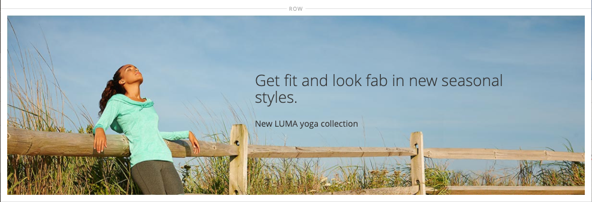

# メディア – バナー

の使用 _バナー_ コンテンツタイプ：コールトゥアクションとボタンでユーザーを引きつける図解されたインタラクティブなコンポーネントを [[!DNL Page Builder] ステージ](workspace.md#stage).

>[!NOTE]
>
>以前は何でしたか？ _バナー_ コンテンツメニューの「」オプションが、 [動的ブロック](../content-design/dynamic-blocks.md).

{width="700" zoomable="yes"}

{{$include /help/_includes/page-builder-save-timeout.md}}

## バナーツールボックス

バナーツールボックスは、バナーコンテナにカーソルを合わせると表示されます。

{width="600" zoomable="yes"}

| ツール | アイコン | 説明 |
|--- |--- |--- |
| 移動 | {width="25"} | バナーをステージ上の別の位置に移動します。 |
| （ラベル） | バナー | 現在のコンテンツコンテナをバナーとして識別します。 コンテナの上にマウスポインターを置くと、ツールボックスが表示されます。 |
| 設定 | {width="25"} | バナーを編集ページを開きます。このページで、バナーとコンテナのプロパティを変更できます。 |
| Hide | {width="25"} | 現在のバナーを非表示にします。 |
| 表示 | {width="25"} | 非表示のバナーを表示します。 |
| 複製 | {width="25"} | バナーをコピーします。 |
| 削除 | {width="25"} | ステージからバナーを削除します。 |
| [!UICONTROL Upload New Image] |  | バナーの背景用に、ローカルファイルシステムからギャラリーに画像をアップロードします。 |
| [!UICONTROL Select from Gallery] |  | バナーの背景にギャラリーの既存の画像を使用します。 |

{style="table-layout:auto"}

{{$include /help/_includes/page-builder-hidden-element-note.md}}

## バナーを追加

1. が含まれる [!DNL Page Builder] パネル、展開 **[!UICONTROL Media]** をドラッグします。 **[!UICONTROL Banner]** ステージへのプレースホルダー。

   {width="600" zoomable="yes"}

   この _[!UICONTROL Upload Image]_および_[!UICONTROL Select from Gallery]_ ボタンを使用すると、ステージから直接バナーコンテンツをすばやく変更できます。 のコンテンツを _[!UICONTROL Edit Banner]_ページ。

1. バナープレースホルダーをクリックすると、 [テキストエディター](../content-design/editor.md) と、バナーのコンテンツを入力します。

   を使用して、より複雑なバナーコンテンツを含めることもできます [コンテンツ](#content) 設定。

## バナー設定の変更

1. バナーコンテナにカーソルを合わせてツールボックスを表示し、 _設定_ （） アイコンをクリックします。

1. 使用可能な設定の更新について詳しくは、次の節を参照してください。

   - [[!UICONTROL Appearance]](#appearance)
   - [[!UICONTROL Content]](#content)
   - [[!UICONTROL Background]](#background)
   - [[!UICONTROL Advanced]](#advanced)

1. 完了したら、 **[!UICONTROL Save]** を閉じるために右上隅にある _[!UICONTROL Edit Banner]_ページ。

1. 右上隅のをクリックします。 **[!UICONTROL Save]** 設定を適用し、 [!DNL Page Builder] ワークスペース。

## [!UICONTROL Appearance]

バナーは、4 つの定義済みテンプレートのいずれかに基づいているので、設定と管理が簡単です。

- 次のいずれかのバナー配置タイプを選択します。

  | プレースメント | 説明 |
  | --------- | ----------- |
  | [!UICONTROL Poster] | コンテンツとボタンをバナーの中央に配置します。 オーバーレイを使用すると、バナーの全幅が拡張されます。 |
  | [!UICONTROL Collage Left] | バナーの左側の定義済み領域に、コンテンツとボタンを配置します。 オーバーレイを使用すると、定義した領域のみがオーバーレイ対象になります。 |
  | [!UICONTROL Collage Center] | バナーの中央にある定義済みの領域にコンテンツとボタンを配置します。 オーバーレイを使用すると、定義した領域のみがオーバーレイ対象になります。 |
  | [!UICONTROL Collage Right] | バナーの右側の定義済み領域にコンテンツとボタンを配置します。 オーバーレイを使用すると、定義した領域のみがオーバーレイ対象になります。 |

  {style="table-layout:auto"}

  {width="600" zoomable="yes"}

- （任意） **[!UICONTROL Minimum Height]** 行に使用します。

  最小の高さは、有効な任意の CSS 単位（など）を持つ数値にすることができます `100px`, `50%`, `50em`, `100vh`）または計算（など `100vh - 237px`）に設定します。

  例えば、バナーの最小の高さを設定して、ページの完全な高さを引き伸ばすことができ、完全なページの背景画像やビデオに対して魅力的なオプションを提供できます。

## [!UICONTROL Background]

バナーの背景表示を定義するオプションは多数あります。 シンプルなカラーまたは背景画像を適用し、より高度な効果を管理できます。

### [!UICONTROL Background Color]

スウォッチを選択するか、カラーピッカーをクリックするか、有効なカラー名または同等の 16 進数値を入力して、背景色を指定します。 この設定により、行の背景色が決まります。 また、カラーの不透明度を調整することもできます。

{width="200"}

次の 3 つの方法のいずれかで値を設定できます。

- 事前定義済みのカラー名（など） `White`
- カラーの 16 進数値（例：） `#ffffff`
- 次のような、不透明度のパーセントを使用したカラーの rgba 値 `rgba(255, 255, 255, 0.75)`

カラーを選択する場合は、の左側にあるスウォッチをクリックします _カラーなし_ ボックス。

{width="600" zoomable="yes"}

カラーボックスをクリックして再度カラーピッカーを開くと、スライダの下のボックスに現在の赤、緑、青、アルファ値（rgba）が表示されます。 最後の数値は、現在の不透明度の割合を小数で示します。 スライダを使用して、不透明度を調整したり、必要な小数値を入力したりできます。

{width="600" zoomable="yes"}

>[!NOTE]
>
>[!DNL Page Builder] では、透明度レイヤーもサポートされています。 _アルファチャネル_：様々な不透明度の背景を作成するために使用できる背景画像。

### [!UICONTROL Background Type]

背景の種類は、画像またはビデオです。 [!DNL Page Builder] デフォルトは `Image` 様々な画像設定を表示します。 を選択する場合 `Video`, [!DNL Page Builder] 画像設定をビデオ設定にスワップします。 両方の背景タイプの設定について、次の節で説明します。

{width="200"}

### 画像タイプの設定

を設定した場合 _背景の種類_ 対象： `Image`以下の設定を使用して、背景画像の表示を定義します。

{width="600" zoomable="yes"}

- **[!UICONTROL Background Image]**  – 必要に応じて、提供されたツールを使用してバナーに適用する背景画像を選択します。

  | ツール | 説明 |
  | ---- | ----------- |
  | [!UICONTROL Upload] | ローカルコンピューターからギャラリーに画像ファイルをアップロードし、それをバナーの背景画像として適用します。 |
  | [!UICONTROL Select from Gallery] | バナーの背景画像として、ギャラリーから既存の画像を選択するように求めるプロンプトを表示します。 |
  | {width="25"} | 画像をカメラタイルにドラッグするか、ローカルファイルシステム内の画像を参照できます。 |

  {style="table-layout:auto"}

- **[!UICONTROL Background Mobile Image]**  – 必要に応じて、同じツールを使用して、モバイルデバイスでの表示に使用する別の背景画像を選択します。

- **[!UICONTROL Background Size]**  – このオプションを設定して、バナーの幅に対する背景画像の拡大縮小を指定します。

  | オプション | 説明 |
  | ------ | ----------- |
  | `Cover` | 背景画像はバナーの全幅をカバーしています。 |
  | `Contain` | 背景画像は、コンテンツ領域の幅に制限されます。 |
  | `Auto` | 現在のスタイル シートからサイズを適用します。 |

  {style="table-layout:auto"}

  {width="200"}

- **[!UICONTROL Background Position]**  – 背景画像をバナーに対してどのように固定するかを指定するには、このオプションを設定します。

  | アンカー | 位置 |
  | ------ | ----------- |
  | `Top` | 左/中央/右 |
  | `Center` | 左/中央/右 |
  | `Bottom` | 左/中央/右 |

  {style="table-layout:auto"}

  アンカーポイントは、プッシュピンのようなもので、指定した背景位置で画像をバナーにアタッチします。

- **[!UICONTROL Background Attachment]**  – 添付ファイルタイプを設定して、スクロールするページに対する背景画像の移動を指定します。

  | オプション | 説明 |
  | ------ | ----------- |
  | `Scroll` | 添付された背景画像は、ページがスクロールすると下に移動するように同期されます。 |
  | `Fixed` | （モバイルでは使用できません）コンテナが画像の上をスクロールし、指定された背景位置に固定されるので、背景画像は移動しません。 |

  {style="table-layout:auto"}

- **[!UICONTROL Background Repeat]**  – 背景画像をスペースいっぱいに繰り返す場合は、この設定を変更します `Yes`.

### ビデオタイプの設定

を設定した場合 _[!UICONTROL Background Type]_対象： `Video`以下の設定を使用して、背景画像の表示を定義します。

- **[!UICONTROL Video URL]**  – 有効なビデオ URL を入力します。 有効なビデオ URL は、次へのリンクです。

   - YouTube ビデオ： `https://youtu.be/CoDhMRUUjeI`
   - Vimeo 動画： `https://vimeo.com/190156113`
   - 有効なビデオファイル （`.mp4` 推奨）: `https://myvideos.com/spiral.mp4`

  {width="200"}

- **[!UICONTROL Overlay Color]** - ビデオに透明な色合いを適用するカラーを選択します。

- **[!UICONTROL Infinite Loop]**  – に設定 `No` ビデオを一度再生して停止します。 に設定されている場合 `Yes` （デフォルト）ビデオは無限ループで繰り返されます。

- **[!UICONTROL Lazy Load]**  – に設定 `No` 表示されていない場合でも、ビデオをページと共に読み込むことができるようにする。 に設定されている場合 `Yes` （デフォルト）ソースからビデオが読み込まれるのは、画面に表示されている場合のみです。

- **[!UICONTROL Play Only When Visible]**  – に設定 `No` ビデオが表示されているかどうかに関係なく、ビデオの読み込み直後に再生を開始します。 に設定されている場合 `Yes` （デフォルト）ビデオは、表示されている場合にのみ再生を開始します。

- **[!UICONTROL Fallback Image]**  – 必要に応じて、ビデオが読み込まれる前および何らかの理由でビデオが読み込まれない場合に、画面に表示する画像を指定します。

## [!UICONTROL Content]

バナーコンテンツは、ステージ上で直接変更することも、設定を変更する場合に変更することもできます。 設定では、バナーリンク、ボタン、オーバーレイなど、より複雑なコンテンツ機能が提供されます。 コンテンツの位置には、 [外観](#appearance) プレースメントの設定。

### ステージ上のシンプルなコンテンツ

1. プレースホルダーテキストをクリックし、バナーに表示するテキストを入力します。

   テキストボックスの上にエディターツールバーが表示されます。

   {width="600" zoomable="yes"}

1. エディターツールバーを使用して、テキストの入力や書式設定のほか、リンク、画像、ウィジェットなどの要素を挿入します。

   {width="600" zoomable="yes"}

### 設定の複雑なコンテンツ

1. バナーコンテナにカーソルを合わせてツールボックスを表示し、 _設定_ （ {width="25"} ） アイコンをクリックします。

1. にスクロール ダウンします。 _[!UICONTROL Content]_セクションと使用&#x200B;**[!UICONTROL Message Text]**バナーテキストを入力および書式設定するエディターです。

   テキストリンク、画像、ウィジェットなどの要素を挿入することもできます。

   {width="600" zoomable="yes"}

1. 必要に応じて、 **[!UICONTROL Link]** バナー用。

   リンクは、顧客がバナーボタンまたは領域をクリックすると表示される宛先ページです。 次の 3 つのリンクタイプのいずれかを使用できます。

   - **[!UICONTROL URL]**  – 相対 URL または完全修飾 URL へのリンク。
   - **[!UICONTROL Product]**  – 製品名または SKU に基づいて宛先ページを識別します。 部分的または完全な名前に基づいて、名前で製品を検索します。 検索結果リストから製品を選択します。
   - **[!UICONTROL Category]**  – 宛先ページをカテゴリツリー内の特定のカテゴリまたはサブカテゴリとして識別します。 名前の一部または全部に基づいてカテゴリを検索します。 表示されたツリーの展開セクションからカテゴリを選択します。
   - **[!UICONTROL Page]**  – 宛先ページを特定のコンテンツページとして識別します。 名前の一部または全部に基づいてページを検索します。 検索結果リストからページを選択します。

   >[!NOTE]
   >
   >2.4.1 リリース以降、 [!DNL Page Builder] ストアフロントでの表示に関する問題により、はバナーとネストされたテキスト内のリンクのリンクをサポートしなくなりました。 でリンクを使用する場合 _[!UICONTROL Message Text]_を設定することはできません。_[!UICONTROL Link]_ オプション。 バナー全体に 1 つのリンクを使用する場合は、テキストからすべてのリンクを削除できます。 
   >
   >{width="200"}

1. 必要に応じて、リンクをたどるように顧客に促すボタンを追加します。

   バナーの外観を設定すると、テキストの下に 1 つのリンクまたはボタンが配置されます。 追加するリンクまたはボタンのプロパティを入力します。

   {width="600" zoomable="yes"}

   >[!NOTE]
   >
   >を追加して、複数のボタンやリンクを使用することもできます。 [ブロック](block.md) をバナーに追加します。 競合を避けるために、すべてのリンクまたはボタンを個別のブロックに保持し、リンクまたはボタンをバナーに直接追加しないでください。

   - を設定 **[!UICONTROL Show Button]** を次のいずれかに変更します。

     | オプション | 説明 |
     | ------ | ----------- |
     | `Always` | ボタンは常にバナーに表示されます。 |
     | `On Hover` | ボタンは、マウスポインターを置いたときにのみバナーに表示されます。 |
     | `Never Show` | ボタンがバナーに表示されない。 |

     {style="table-layout:auto"}

   - を入力 **[!UICONTROL Button Text]** をボタンに表示します。

   - を設定 **[!UICONTROL Button Type]** を次のいずれかに変更します。

     | オプション | 説明 |
     | ------ | ----------- |
     | `Primary` | 現在のスタイル シートからプライマリ ボタン スタイルを適用します。 |
     | `Secondary` | 現在のスタイル シートからセカンダリ ボタン スタイルを適用します（該当する場合）。 |
     | `Link` | ボタンではなくハイパーリンクを作成します。 |

     {style="table-layout:auto"}

     現在のテーマのボタンのスタイルによって、ボタンの形式が決まります。 通常、プライマリボタンの背景色は、セカンダリボタンの背景色よりも目立ちます。

1. を設定 **[!UICONTROL Show Overlay]** を次のいずれかに変更します。

   | オプション | 説明 |
   | ------ | ----------- |
   | `Always` | オーバーレイは常に表示されます。 |
   | `On Hover` | オーバーレイは、カーソルを合わせたときにのみ表示されます。 |
   | `Never Show` | オーバーレイが表示されません。 |

   {style="table-layout:auto"}

   オーバーレイを使用して、で定義されたアクティブなコンテンツ領域に背景色を適用することができます。 [!UICONTROL Appearance] の設定値。 バナーの背景画像は、バナーの全幅に対して表示されたままになります。

   オーバーレイの表示を選択した場合は、 **[!UICONTROL Overlay Color]**:

   - 「」をクリックします **カラーなし** スウォッチを選択し、スウォッチを選択します。
   - が含まれる **カラーなし** フィールドに、有効なカラー名または 16 進数値を入力します。

   {width="600" zoomable="yes"}

1. 右上隅のをクリックします。 **[!UICONTROL Save]** 設定を適用し、 [!DNL Page Builder] ワークスペース。

   {width="600" zoomable="yes"}

## [!UICONTROL Search Engine Optimization] {#seo}

これらの設定のテキストは、検索エンジンに表示され、ページのインデックス作成方法が改善されます。

- の場合 **[!UICONTROL Alternative Text]**、を入力 _alt_ 表示するデジタルアクセシビリティツールのテキスト説明。

  代替テキストの使用は、アクセシビリティのベストプラクティスであり、一部のロケールでは法律で義務付けられています。 HTMLでは、 `alt` attribute は、のサブセットです。 `image` タグ : `<image title="tooltip" alt="description" src="image.jpg">`.

- の場合 **[!UICONTROL Title Attribute]**&#x200B;マウスオーバーしたときにツールヒントとして表示するテキストを入力します。

  ベストプラクティスとして、説明的でキーワードの多いタイトルを選択すると、検索エンジンによる画像のインデックス作成方法が改善されます。 HTMLでは、 `title` attribute は、のサブセットです。 `image` タグ : `<image title="tooltip" alt="description" src="image.jpg">`.

## [!UICONTROL Advanced]

1. バナーに追加されるコンテンツコンテナの水平方向の位置を制御するには、 **[!UICONTROL Alignment]**:

   | オプション | 説明 |
   | ------ | ----------- |
   | `Default` | 現在のテーマのスタイル シートで指定されている線形の既定の設定を適用します。 |
   | `Left` | 指定したパディングを許可して、バナーコンテナの左境界線に沿ってコンテンツコンテナを揃えます。 |
   | `Center` | コンテンツコンテナをバナーコンテナの中央に揃え、指定したパディングを許容します。 |
   | `Right` | 指定したパディングを考慮して、コンテンツコンテナをバナーコンテナの右端に沿って配置します。 |

   {style="table-layout:auto"}

1. を **[!UICONTROL Border]** バナーコンテナの 4 つの側面すべてに適用されるスタイル：

   | オプション | 説明 |
   | ------ | ----------- |
   | `Default` | 関連付けられたスタイル シートで指定されている既定の罫線スタイルを適用します。 |
   | `None` | コンテナの境界線の表示はしません。 |
   | `Dotted` | コンテナの境界線は点線で表示されます。 |
   | `Dashed` | コンテナの境界線は破線で表示されます。 |
   | `Solid` | コンテナの境界線は実線で表示されます。 |
   | `Double` | コンテナの境界線は二重線で表示されます。 |
   | `Groove` | コンテナの境界線は溝付き線で表示されます。 |
   | `Ridge` | コンテナの境界線は、境界線として表示されます。 |
   | `Inset` | コンテナの境界線は、インセットされた線として表示されます。 |
   | `Outset` | コンテナの境界線は、先頭行として表示されます。 |

   {style="table-layout:auto"}

1. 境界線のスタイルを `None`の場合は、次のボーダー表示オプションを入力します。

   - **[!UICONTROL Border Color]** - スウォッチを選択するか、カラーピッカーをクリックするか、有効なカラー名または同等の 16 進数値を入力して、カラーを指定します。

     {width="600" zoomable="yes"}

   - **[!UICONTROL Border Width]**  – 境界線の幅のピクセル数を入力します。

   - **[!UICONTROL Border Radius]**  – 境界線の各コーナーを丸めるために使用する半径のサイズを定義するピクセル数を入力します。

1. （オプション）の名前を指定します **[!UICONTROL CSS classes]** 現在のスタイルシートからバナーコンテナに適用します。

   複数のクラス名はスペースで区切ります。

1. 次の値をピクセル単位で入力 **[!UICONTROL Margins and Padding]** バナーの外側の余白と内側のパディングを指定します。

   対応する各値をバナーコンテナ図に入力します。

   | オプション | 説明 |
   | ------ | ----------- |
   | [!UICONTROL Margins] | コンテナのすべての側面の外側の端に適用される空白スペースの量。 |
   | [!UICONTROL Padding] | コンテナのすべての側面の内側の端に適用される空白のスペースの量です。 |

   {style="table-layout:auto"}
