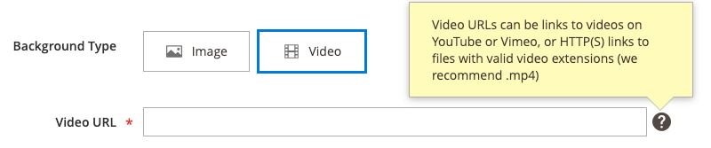

# メディア — バナー

以下を使用します。 _バナー_ ユーザーがのコールトゥアクションやボタンを使用して操作する、図解化されたインタラクティブなコンポーネントを追加するコンテンツタイプ [[!DNL Page Builder] ステージ](workspace.md#stage).

>[!NOTE]
>
>以前は _バナー_ 」オプションを使用して、 [ダイナミックブロック](../content-design/dynamic-blocks.md).

{width="700" zoomable="yes"}

{{$include /help/_includes/page-builder-save-timeout.md}}

## バナーツールボックス

バナーコンテナの上にマウスポインターを置くと、バナーツールボックスが表示されます。

{width="600" zoomable="yes"}

| ツール | アイコン | 説明 |
|--- |--- |--- |
| 移動 | {width="25"} | バナーをステージ上の別の位置に移動します。 |
| （ラベル） | バナー | 現在のコンテンツコンテナをバナーとして識別します。 コンテナの上にマウスポインターを置くと、ツールボックスが表示されます。 |
| 設定 | {width="25"} | バナーを編集ページを開きます。このページで、バナーとコンテナのプロパティを変更できます。 |
| 非表示 | {width="25"} | 現在のバナーを非表示にします。 |
| 表示 | {width="25"} | 非表示のバナーを表示します。 |
| 複製 | {width="25"} | バナーのコピーを作成します。 |
| 削除 | {width="25"} | ステージからバナーを削除します。 |
| [!UICONTROL Upload New Image] |  | バナーの背景に使用する画像をローカルファイルシステムからギャラリーにアップロードします。 |
| [!UICONTROL Select from Gallery] |  | ギャラリー内の既存の画像をバナーの背景に使用します。 |

{style="table-layout:auto"}

{{$include /help/_includes/page-builder-hidden-element-note.md}}

## バナーを追加

1. Adobe Analytics の [!DNL Page Builder] パネル、展開 **[!UICONTROL Media]** をクリックし、 **[!UICONTROL Banner]** プレースホルダーをステージに追加します。

   {width="600" zoomable="yes"}

   The _[!UICONTROL Upload Image]_および_[!UICONTROL Select from Gallery]_ ボタンが含まれているので、バナーコンテンツをステージから直接すばやく変更できます。 また、 _[!UICONTROL Edit Banner]_ページに貼り付けます。

1. バナープレースホルダーをクリックして、 [テキストエディター](../content-design/editor.md) バナーのコンテンツを入力します。

   また、 [コンテンツ](#content) 設定。

## バナー設定の変更

1. バナーコンテナの上にマウスポインターを置いてツールボックスを表示し、 _設定_ () アイコンをクリックします。

1. 使用可能な設定の更新について詳しくは、次のセクションを参照してください。

   - [[!UICONTROL Appearance]](#appearance)
   - [[!UICONTROL Content]](#content)
   - [[!UICONTROL Background]](#background)
   - [[!UICONTROL Advanced]](#advanced)

1. 完了したら、「 **[!UICONTROL Save]** を閉じるには、を右上隅に _[!UICONTROL Edit Banner]_ページに貼り付けます。

1. 右上隅で、 **[!UICONTROL Save]** 設定を適用し、に戻るには、次の手順に従います。 [!DNL Page Builder] ワークスペース。

## [!UICONTROL Appearance]

バナーは、事前に定義された 4 つのテンプレートの 1 つに基づいているので、簡単に設定および管理できます。

- 次のバナー配置タイプのいずれかを選択します。

  | プレースメント | 説明 |
  | --------- | ----------- |
  | [!UICONTROL Poster] | コンテンツとボタンをバナーの中央に配置します。 オーバーレイを使用すると、バナーの幅が全幅に広がります。 |
  | [!UICONTROL Collage Left] | コンテンツとボタンを、バナーの左側にある定義済みの領域に配置します。 オーバーレイを使用すると、定義された領域のみがオーバーレイ表示されます。 |
  | [!UICONTROL Collage Center] | コンテンツとボタンを、バナーの中央に配置する定義済み領域に配置します。 オーバーレイを使用すると、定義された領域のみがオーバーレイ表示されます。 |
  | [!UICONTROL Collage Right] | コンテンツとボタンを、バナーの右側の定義済み領域に配置します。 オーバーレイを使用すると、定義された領域のみがオーバーレイ表示されます。 |

  {style="table-layout:auto"}

  {width="600" zoomable="yes"}

- （オプション） **[!UICONTROL Minimum Height]** 行の。

  最小の高さは、任意の有効な CSS 単位 ( `100px`, `50%`, `50em`, `100vh`) または計算 ( `100vh - 237px`) をクリックします。

  例えば、バナーの最小の高さを設定して、ページの高さを最大限に引き伸ばすことができます。この設定により、ページ全体の背景画像やビデオに対する魅力的なオプションを指定できます。

## [!UICONTROL Background]

バナーの背景表示を定義するには、多くのオプションがあります。 単純なカラーまたは背景画像を適用し、より高度な効果を管理できます。

### [!UICONTROL Background Color]

スウォッチを選択するか、カラーピッカーをクリックするか、有効なカラー名または同等の 16 進値を入力して、背景色を指定します。 この設定は、行の背景色を決定します。 また、カラーの不透明度を調整することもできます。

{width="200"}

値は、次の 3 つの方法のいずれかで設定できます。

- 事前定義済みの色名（例： ） `White`
- 色の 16 進数カラー値（例： ） `#ffffff`
- 色の rgba 値（不透明度の割合を含む）。次に例を示します。 `rgba(255, 255, 255, 0.75)`

カラーを選択する場合は、 _カラーなし_ ボックス。

{width="600" zoomable="yes"}

カラーボックスをクリックしてカラーピッカーを再度開くと、スライダの下のボックスに現在の赤、緑、青、アルファの値 (rgba) が表示されます。 最後の数値は、現在の不透明度の割合を小数で示します。 スライダーを使用して不透明度を調整したり、必要な 10 進数値を入力したりできます。

{width="600" zoomable="yes"}

>[!NOTE]
>
>[!DNL Page Builder] は、透明度レイヤーをサポートしています。 _アルファチャンネル_：様々な不透明度の背景の作成に使用できる背景画像。

### [!UICONTROL Background Type]

背景の種類には、画像またはビデオがあります。 [!DNL Page Builder] デフォルト： `Image` およびは、様々な画像設定を表示します。 次を選択した場合、 `Video`, [!DNL Page Builder] 画像設定をビデオ設定と入れ替えます。 次の節では、両方の背景の種類の設定について説明します。

{width="200"}

### 画像タイプの設定

次の場合、 _背景の種類_ から `Image`の場合は、次の設定を使用して背景画像表示を定義します。

{width="600" zoomable="yes"}

- **[!UICONTROL Background Image]**  — 必要に応じて、提供されているツールを使用して、バナーに適用する背景画像を選択します。

  | ツール | 説明 |
  | ---- | ----------- |
  | [!UICONTROL Upload] | ローカルコンピューターからギャラリーに画像ファイルをアップロードし、バナーの背景画像として適用します。 |
  | [!UICONTROL Select from Gallery] | ギャラリーから既存の画像をバナーの背景画像として選択するように求めるプロンプトが表示されます。 |
  | {width="25"} | 画像をカメラタイルにドラッグするか、ローカルファイルシステム内の画像を参照することができます。 |

  {style="table-layout:auto"}

- **[!UICONTROL Background Mobile Image]**  — 必要に応じて、同じツールを使用して、モバイルデバイスでの表示に使用する別の背景画像を選択します。

- **[!UICONTROL Background Size]**  — バナーの幅に対する背景画像の拡大/縮小方法を指定するには、このオプションを設定します。

  | オプション | 説明 |
  | ------ | ----------- |
  | `Cover` | 背景画像はバナーの全幅に表示されます。 |
  | `Contain` | 背景画像は、コンテンツ領域の幅に制限されます。 |
  | `Auto` | 現在のスタイルシートからサイズを適用します。 |

  {style="table-layout:auto"}

  {width="200"}

- **[!UICONTROL Background Position]**  — 背景画像をバナーに対してアンカーする方法を指定するには、このオプションを設定します。

  | アンカー | 位置 |
  | ------ | ----------- |
  | `Top` | 左/中央/右 |
  | `Center` | 左/中央/右 |
  | `Bottom` | 左/中央/右 |

  {style="table-layout:auto"}

  アンカーポイントは、指定した背景位置で画像をバナーにアタッチするプッシュピンのようなものです。

- **[!UICONTROL Background Attachment]**  — 添付ファイルのタイプを設定して、背景画像がスクロールページに対してどのように移動するかを指定します。

  | オプション | 説明 |
  | ------ | ----------- |
  | `Scroll` | 添付された背景画像は、ページがスクロールするたびに下に移動するように同期されます。 |
  | `Fixed` | （モバイルでは使用できません）コンテナが画像をスクロールすると、背景画像は移動せず、指定された背景位置で固定されます。 |

  {style="table-layout:auto"}

- **[!UICONTROL Background Repeat]**  — 背景画像を繰り返してスペースを埋める場合は、この設定を変更します `Yes`.

### ビデオタイプ設定

次の場合、 _[!UICONTROL Background Type]_から `Video`の場合は、次の設定を使用して背景画像表示を定義します。

- **[!UICONTROL Video URL]**  — 有効なビデオの URL を入力します。 有効なビデオの URL は次のリンクになります。

   - YouTubeビデオ： `https://youtu.be/CoDhMRUUjeI`
   - Vimeo ビデオ： `https://vimeo.com/190156113`
   - 有効なビデオファイル (`.mp4` をお勧めします )。 `https://myvideos.com/spiral.mp4`

  {width="200"}

- **[!UICONTROL Overlay Color]**  — 色を選択して、ビデオに透明の色合いを適用します。

- **[!UICONTROL Infinite Loop]**  — に設定 `No` ビデオを 1 回再生して停止させる場合。 次のように設定されている場合： `Yes` （デフォルト）。ビデオは無限ループで繰り返されます。

- **[!UICONTROL Lazy Load]**  — に設定 `No` ページが表示されていない場合でも、ビデオをページと共に読み込む。 次のように設定されている場合： `Yes` （デフォルト）。ビデオは、画面に表示されている場合にのみ、ソースから読み込まれます。

- **[!UICONTROL Play Only When Visible]**  — に設定 `No` ビデオが表示されているかどうかに関係なく、読み込まれた直後にビデオの再生を開始する場合。 次のように設定されている場合： `Yes` （デフォルト）。ビデオの再生は表示されているときにのみ開始されます。

- **[!UICONTROL Fallback Image]**  — 必要に応じて、ビデオが読み込まれる前に画面に表示する画像を指定します。また、何らかの理由でビデオが読み込まれない場合も指定します。

## [!UICONTROL Content]

バナーのコンテンツは、ステージ上または設定を変更する際に直接変更できます。 この設定では、バナーのリンクやボタン、オーバーレイなど、より複雑なコンテンツ機能を提供します。 コンテンツの位置は、 [外観](#appearance) 配置設定を使用します。

### ステージ上のシンプルなコンテンツ

1. プレースホルダーテキストをクリックし、バナーに表示するテキストを入力します。

   テキストボックスの上にエディターツールバーが表示されます。

   {width="600" zoomable="yes"}

1. エディターのツールバーを使用して、テキストの入力と書式設定、およびリンク、画像、ウィジェットなどの要素の挿入を行います。

   {width="600" zoomable="yes"}

### 設定内の複雑なコンテンツ

1. バナーコンテナの上にマウスポインターを置いてツールボックスを表示し、 _設定_ ( {width="25"} ) アイコンをクリックします。

1. 下にスクロールして、 _[!UICONTROL Content]_セクションの&#x200B;**[!UICONTROL Message Text]**エディターを使用して、バナーテキストを入力および書式設定します。

   また、テキストリンク、画像、ウィジェットなどの要素を挿入することもできます。

   {width="600" zoomable="yes"}

1. 必要に応じて、 **[!UICONTROL Link]** バナー用。

   リンクとは、顧客がバナーのボタンまたは領域をクリックすると表示される宛先ページです。 次の 3 つのリンクタイプのいずれかを使用できます。

   - **[!UICONTROL URL]**  — 相対 URL または完全修飾 URL へのリンク。
   - **[!UICONTROL Product]**  — 製品名または SKU に基づいて宛先ページを識別します。 部分的または完全な名前に基づいて、製品を名前で検索します。 検索結果のリストから製品を選択します。
   - **[!UICONTROL Category]**  — リンク先のページを、カテゴリツリー内の特定のカテゴリまたはサブカテゴリとして識別します。 名前の一部または完全に一致するものに基づいてカテゴリを検索します。 表示されたツリーの展開済みのセクションからカテゴリを選択します。
   - **[!UICONTROL Page]**  — リンク先のページを特定のコンテンツページとして識別します。 名前の一部または完全などに基づいてページを検索します。 検索結果のリストからページを選択します。

   >[!NOTE]
   >
   >2.4.1 リリース以降、 [!DNL Page Builder] ストアフロントでの表示に問題があるので、は、ネストされたテキスト内のバナーとリンクのリンクをサポートしなくなりました。 リンクを _[!UICONTROL Message Text]_を設定しない場合、_[!UICONTROL Link]_ オプション。 バナー全体に 1 つのリンクを使用する場合は、テキストからすべてのリンクを削除できます。 
   >
   >{width="200"}

1. 必要に応じて、リンクをたどるように促すボタンを追加します。

   バナーの「外観」設定では、テキストの下に 1 つのリンクまたはボタンが配置されます。 追加するリンクまたはボタンのプロパティを入力します。

   {width="600" zoomable="yes"}

   >[!NOTE]
   >
   >また、複数のボタンやリンクを使用する場合は、 [ブロック](block.md) をバナーに追加します。 競合を避けるには、すべてのリンクまたはボタンを別々のブロックに残し、リンクまたはボタンをバナーに直接追加しないでください。

   - 設定 **[!UICONTROL Show Button]** を次のいずれかに変更します。

     | オプション | 説明 |
     | ------ | ----------- |
     | `Always` | ボタンは常にバナーに表示されます。 |
     | `On Hover` | ボタンは、マウスポインターを置いたときにのみバナーに表示されます。 |
     | `Never Show` | バナーにはボタンは表示されません。 |

     {style="table-layout:auto"}

   - 次を入力します。 **[!UICONTROL Button Text]** をクリックして、ボタンに表示されます。

   - 設定 **[!UICONTROL Button Type]** を次のいずれかに変更します。

     | オプション | 説明 |
     | ------ | ----------- |
     | `Primary` | 現在のスタイルシートからプライマリボタンのスタイルを適用します。 |
     | `Secondary` | 該当する場合は、現在のスタイルシートからセカンダリボタンのスタイルを適用します。 |
     | `Link` | ボタンではなくハイパーリンクを作成します。 |

     {style="table-layout:auto"}

     現在のテーマのボタンのスタイルによって、ボタンの形式が決まります。 通常、プライマリボタンの背景色はセカンダリボタンよりも目立ちます。

1. 設定 **[!UICONTROL Show Overlay]** を次のいずれかに変更します。

   | オプション | 説明 |
   | ------ | ----------- |
   | `Always` | オーバーレイは常に表示されます。 |
   | `On Hover` | オーバーレイは、カーソルを合わせたときにのみ表示されます。 |
   | `Never Show` | オーバーレイが表示されません。 |

   {style="table-layout:auto"}

   オーバーレイを使用して、 [!UICONTROL Appearance] 設定。 バナーの背景画像は、バナーの幅全体にわたって表示されたままになります。

   オーバーレイを表示する場合は、 **[!UICONTROL Overlay Color]**:

   - 次をクリック： **カラーなし** スウォッチを選択し、スウォッチを選択します。
   - Adobe Analytics の **カラーなし** フィールドに、有効な色の名前を入力するか、16 進値を入力します。

   {width="600" zoomable="yes"}

1. 右上隅で、 **[!UICONTROL Save]** 設定を適用し、に戻るには、次の手順に従います。 [!DNL Page Builder] ワークスペース。

   {width="600" zoomable="yes"}

## [!UICONTROL Search Engine Optimization] {#seo}

これらの設定のテキストは検索エンジンで表示され、ページのインデックス付け方法が改善されます。

- の場合 **[!UICONTROL Alternative Text]**、 _alt_ 表示するデジタルアクセシビリティツールのテキスト説明。

  代替テキストの使用はアクセシビリティのベストプラクティスであり、一部のロケールでは法律で必須となっています。 HTMLでは、 `alt` 属性は、 `image` タグ： `<image title="tooltip" alt="description" src="image.jpg">`.

- の場合 **[!UICONTROL Title Attribute]**&#x200B;に値を入力する場合は、マウスオーバー時にツールチップとして表示するテキストを入力します。

  ベストプラクティスとしては、説明的でキーワードが豊富なタイトルを選択し、検索エンジンによる画像のインデックス作成方法を改善します。 HTMLでは、 `title` 属性は、 `image` タグ： `<image title="tooltip" alt="description" src="image.jpg">`.

## [!UICONTROL Advanced]

1. バナーに追加されるコンテンツコンテナの水平方向の位置を制御するには、 **[!UICONTROL Alignment]**:

   | オプション | 説明 |
   | ------ | ----------- |
   | `Default` | 現在のテーマのスタイルシートで指定された位置揃えの既定の設定を適用します。 |
   | `Left` | コンテンツコンテナをバナーコンテナの左の境界線に沿って揃えます。指定されたパディングに適した値になります。 |
   | `Center` | コンテンツコンテナをバナーコンテナの中央に揃えます。指定されたパディングの分だけを使用します。 |
   | `Right` | コンテンツコンテナをバナーコンテナの右側の境界線に沿って揃えます。指定されたパディングの値だけを使用します。 |

   {style="table-layout:auto"}

1. を設定します。 **[!UICONTROL Border]** バナーコンテナの 4 つの側面すべてに適用されるスタイル：

   | オプション | 説明 |
   | ------ | ----------- |
   | `Default` | 関連するスタイルシートで指定された既定の罫線のスタイルを適用します。 |
   | `None` | コンテナの境界線を表示しません。 |
   | `Dotted` | コンテナの境界線は点線で表示されます。 |
   | `Dashed` | コンテナの境界線は破線で表示されます。 |
   | `Solid` | コンテナの境界線は実線で表示されます。 |
   | `Double` | コンテナの境界線は二重線で表示されます。 |
   | `Groove` | コンテナ境界は溝付きの線として表示されます。 |
   | `Ridge` | コンテナの境界線は、稜線として表示されます。 |
   | `Inset` | コンテナの境界線は、挿入線として表示されます。 |
   | `Outset` | コンテナの境界線は、アウトセット行として表示されます。 |

   {style="table-layout:auto"}

1. 次の条件を満たさない境界線のスタイルを設定した場合： `None`、境界線の表示オプションを設定します。

   - **[!UICONTROL Border Color]**  — スウォッチを選択するか、カラーピッカーをクリックするか、有効なカラー名または同等の 16 進値を入力して、カラーを指定します。

     {width="600" zoomable="yes"}

   - **[!UICONTROL Border Width]**  — 境界線の線幅のピクセル数を入力します。

   - **[!UICONTROL Border Radius]**  — 境界線の各隅を囲むために使用する半径のサイズを定義するピクセル数を入力します。

1. （オプション） **[!UICONTROL CSS classes]** 現在のスタイルシートからバナーコンテナに適用します。

   複数のクラス名はスペースで区切ります。

1. 次の値をピクセル単位で入力します。 **[!UICONTROL Margins and Padding]** ：バナーの外側の余白と内側の余白を指定します。

   対応する各値をバナーコンテナダイアグラムに入力します。

   | オプション | 説明 |
   | ------ | ----------- |
   | [!UICONTROL Margins] | コンテナのすべての側面の外側の端に適用される空白の量。 |
   | [!UICONTROL Padding] | コンテナのすべての側面の内側の端に適用される空白の量。 |

   {style="table-layout:auto"}
