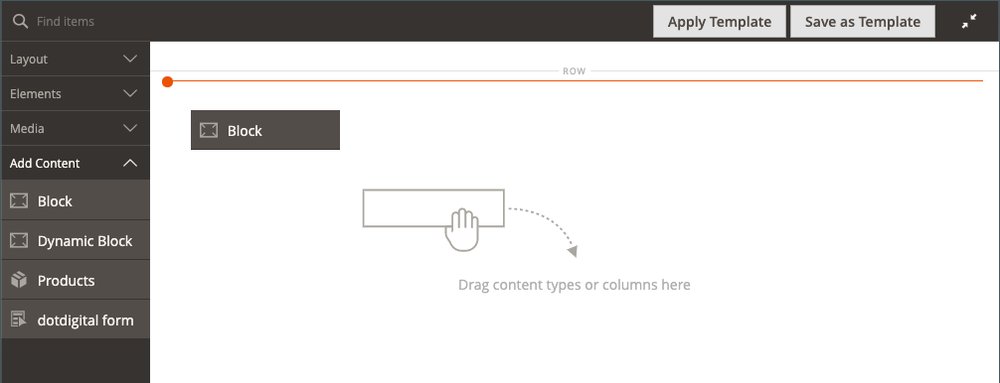

# コンテンツを追加 — ブロック

以下を使用します。 _ブロック_ 既存のアクティブなコンテンツタイプを追加する [ブロック](../content-design/blocks.md) から [[!DNL Page Builder] ステージ](workspace.md#stage). 次の例では、最初の列に、ページのサイドメニューを含むブロックが含まれています。 2 番目の列には画像が含まれます。

{width="600" zoomable="yes"}

{{$include /help/_includes/page-builder-save-timeout.md}}

## ブロックツールボックス

| ツール | アイコン | 説明 |
| --------- | -------- | ------------- |
| 移動 |  | ブロックコンテナとそのコンテンツをステージ上の別の位置に移動します。 |
| 設定 |  | ブロックを編集ページが開き、ブロックを選択したり、コンテナのプロパティを変更したりできます。 |
| 非表示 |  | 現在のブロックコンテナとそのコンテンツを非表示にします。 |
| 表示 |  | 非表示のブロックコンテナとそのコンテンツを表示します。 |
| 複製 |  | ブロックコンテナとそのコンテンツのコピーを作成します。 |
| 削除 |  | ステージからブロックコンテナとそのコンテンツを削除します。 |

{style="table-layout:auto"}

{{$include /help/_includes/page-builder-hidden-element-note.md}}

## 既存のブロックを追加

1. 次に移動： [!DNL Page Builder] ワークスペース（ターゲットページ、ブロック、動的ブロック、製品、カテゴリ）。

1. Adobe Analytics の [!DNL Page Builder] パネル、展開 **[!UICONTROL Add Content]** をクリックし、 **[!UICONTROL Block]** プレースホルダーをステージに追加します。

   {width="600" zoomable="yes"}

1. 空のブロックコンテナの上にマウスポインターを置いてツールボックスを表示し、 _設定_ ( {width="25"} ) アイコンをクリックします。

1. クリック **[!UICONTROL Select Block]**.

   {width="200"}

1. 追加するブロックの行で、 **[!UICONTROL Select]** 」と入力します。

   {width="600" zoomable="yes"}

   選択したブロックの名前がページに表示されます。

   {width="200"}

1. 必要に応じて、このページの最後にあるフィールドの説明を参照しながら、残りの設定を実行します。

1. 完了したら、「 **[!UICONTROL Save]** 設定を適用し、に戻るには、次の手順に従います。 [!DNL Page Builder] ワークスペース。

### 詳細設定

1. 親コンテナ内でのブロックの位置を制御するには、 **[!UICONTROL Alignment]**:

   | オプション | 説明 |
   | ------ | ----------- |
   | `Default` | 現在のテーマのスタイルシートで指定された位置揃えの既定の設定を適用します。 |
   | `Left` | リストを親コンテナの左側の境界線に沿って揃えます。指定されたパディングの値を使用します。 |
   | `Center` | 指定されたパディングを許容して、親コンテナの中央にリストを揃えます。 |
   | `Right` | 指定されたパディングの値を使用して、親コンテナの右側の境界線に沿ってブロックを揃えます。 |

   {style="table-layout:auto"}

1. を設定します。 **[!UICONTROL Border]** ブロックコンテナの 4 つの側面すべてに適用されるスタイル：

   | オプション | 説明 |
   | ------ | ----------- |
   | `Default` | 関連するスタイルシートで指定された既定の罫線のスタイルを適用します。 |
   | `None` | コンテナの境界線を表示しません。 |
   | `Dotted` | コンテナの境界線は点線で表示されます。 |
   | `Dashed` | コンテナの境界線は破線で表示されます。 |
   | `Solid` | コンテナの境界線は実線で表示されます。 |
   | `Double` | コンテナの境界線は二重線で表示されます。 |
   | `Groove` | コンテナ境界は溝付きの線として表示されます。 |
   | `Ridge` | コンテナの境界線は、稜線として表示されます。 |
   | `Inset` | コンテナの境界線は、挿入線として表示されます。 |
   | `Outset` | コンテナの境界線は、アウトセット行として表示されます。 |

   {style="table-layout:auto"}

1. 次の条件を満たさない境界線のスタイルを設定した場合： `None`、境界線の表示オプションを設定します。

   | オプション | 説明 |
   | ------ |------------ |
   | [!UICONTROL Border Color] | スウォッチを選択するか、カラーピッカーをクリックするか、有効なカラー名または同等の 16 進値を入力して、カラーを指定します。 |
   | [!UICONTROL Border Width] | 境界線の幅のピクセル数を入力します。 |
   | [!UICONTROL Border Radius] | ピクセル数を入力して、境界線の各隅を囲むために使用する半径のサイズを定義します。 |

   {style="table-layout:auto"}

1. （オプション） **[!UICONTROL CSS classes]** 現在のスタイルシートからコンテナに適用します。

   複数のクラス名はスペースで区切ります。

1. 次の値をピクセル単位で入力します。 **[!UICONTROL Margins and Padding]** ブロックコンテナの外側の余白と内側の余白を決定します。

   ダイアグラムに対応する値を入力します。

   | コンテナ領域 | 説明 |
   | -------------- | ----------- |
   | [!UICONTROL Margins] | コンテナのすべての側面の外側の端に適用される空白の量。 オプション： `Top` / `Right` / `Bottom` / `Left` |
   | [!UICONTROL Padding] | コンテナのすべての側面の内側の端に適用される空白の量。 オプション： `Top` / `Right` / `Bottom` / `Left` |

   {style="table-layout:auto"}

## ブロック設定を編集

1. ブロックコンテナの上にマウスポインターを置いて、 _設定_ ( {width="25"} ) アイコンをクリックします。

   {width="600" zoomable="yes"}

1. 別のブロックを選択するには、 **[!UICONTROL Select Block]**.

   - アクティブなブロックの一覧で、 **[!UICONTROL Select]** 追加するブロック。
   - クリック **[!UICONTROL Add Selected]**.

1. 必要に応じて、このページの最後にあるフィールドの説明を参照用に使用して、残りの設定を更新します。

1. 完了したら、「 **[!UICONTROL Save]** 設定を適用し、に戻るには、次の手順に従います。 [!DNL Page Builder] ワークスペース。

## ブロックを複製

1. ブロックコンテナの上にマウスポインターを置いてツールボックスを表示し、 _複製_ () アイコンをクリックします。

   複製は元の画像のすぐ下に表示されます。

1. 新しいブロックを新しい位置に移動するには、コンテナの上にマウスポインターを置いて、 _移動_ () をツールボックスに追加します。

1. ブロックを選択し、赤いガイドラインが新しい位置に表示されるまでドラッグします。

   各コンテナの上と下の境界線は、ブロックを移動する際に破線で表示されます。

## ステージからブロックを削除

1. ブロックコンテナの上にマウスポインターを置いてツールボックスを表示し、 _削除_ () アイコンをクリックします。

1. 確認するメッセージが表示されたら、「 **[!UICONTROL OK]**.
