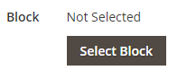

# コンテンツを追加 – ブロック

_ブロック_ コンテンツタイプを使用して、アクティブな既存の [ ブロック ](../content-design/blocks.md) を [[!DNL Page Builder]  ステージ ](workspace.md#stage) に追加します。 次の例では、最初の列にページのサイドメニューを含むブロックが含まれています。 2 番目の列には画像が含まれます。

{width="600" zoomable="yes"}

{{$include /help/_includes/page-builder-save-timeout.md}}

## ブロック ツールボックス

| ツール | アイコン | 説明 |
| --------- | -------- | ------------- |
| 移動 |  | ブロックコンテナとその内容をステージ上の別の位置に移動します。 |
| 設定 |  | 「ブロックの編集」ページが開きます。このページでブロックを選択し、コンテナのプロパティを変更できます。 |
| Hide |  | 現在のブロックコンテナとそのコンテンツを非表示にします。 |
| 表示 |  | 非表示のブロックコンテナとその内容を表示します。 |
| 複製 |  | ブロックコンテナとその内容のコピーを作成します。 |
| 削除 |  | ブロックコンテナとそのコンテンツをステージから削除します。 |

{style="table-layout:auto"}

{{$include /help/_includes/page-builder-hidden-element-note.md}}

## 既存のブロックを追加

1. ターゲットページ、ブロック、ダイナミックブロック、製品またはカテゴリの [!DNL Page Builder] ワークスペースに移動します。

1. [!DNL Page Builder] パネルで **[!UICONTROL Add Content]** を展開し、**[!UICONTROL Block]** プレースホルダーをステージにドラッグします。

   {width="600" zoomable="yes"}

1. 空のブロックコンテナにカーソルを合わせてツールボックスを表示し、_設定_ （{width="25"}）アイコンを選択します。

1. 「**[!UICONTROL Select Block]**」をクリックします。

   {width="200"}

1. 追加するブロックの行で、最後の列の **[!UICONTROL Select]** をクリックします。

   {width="600" zoomable="yes"}

   選択したブロックの名前がページに表示されます。

   {width="200"}

1. 必要に応じて、このページの最後にあるフィールドの説明を参考にして、残りの設定を完了します。

1. 完了したら、「**[!UICONTROL Save]**」をクリックして設定を適用し、[!DNL Page Builder] ワークスペースに戻ります。

### 詳細設定

1. 親コンテナ内のブロックの位置をコントロールするには、**[!UICONTROL Alignment]** のいずれかを選択します。

   | オプション | 説明 |
   | ------ | ----------- |
   | `Default` | 現在のテーマのスタイル シートで指定されている線形の既定の設定を適用します。 |
   | `Left` | 親コンテナの左罫線に沿ってリストを配置します。指定したパディングはすべて許可されます。 |
   | `Center` | 親コンテナの中央にリストを揃えます。指定したパディングに対する許容値を使用します。 |
   | `Right` | 親コンテナの右端に沿ってブロックを配置します。指定したパディングは許可されます。 |

   {style="table-layout:auto"}

1. ブロックコンテナの 4 つの側面すべてに適用される **[!UICONTROL Border]** スタイルを設定します。

   | オプション | 説明 |
   | ------ | ----------- |
   | `Default` | 関連付けられたスタイル シートで指定されている既定の罫線スタイルを適用します。 |
   | `None` | コンテナの境界線の表示はしません。 |
   | `Dotted` | コンテナの境界線は点線で表示されます。 |
   | `Dashed` | コンテナの境界線は破線で表示されます。 |
   | `Solid` | コンテナの境界線は実線で表示されます。 |
   | `Double` | コンテナの境界線は二重線で表示されます。 |
   | `Groove` | コンテナの境界線は溝付き線で表示されます。 |
   | `Ridge` | コンテナの境界線は、境界線として表示されます。 |
   | `Inset` | コンテナの境界線は、インセットされた線として表示されます。 |
   | `Outset` | コンテナの境界線は、先頭行として表示されます。 |

   {style="table-layout:auto"}

1. `None` 以外の境界線のスタイルを設定する場合は、境界線の表示オプションを完了します。

   | オプション | 説明 |
   | ------ |------------ |
   | [!UICONTROL Border Color] | 見本を選択するか、カラーピッカーをクリックするか、有効なカラー名または同等の 16 進数値を入力して、カラーを指定します。 |
   | [!UICONTROL Border Width] | 境界線の幅のピクセル数を入力します。 |
   | [!UICONTROL Border Radius] | ピクセル数を入力して、境界線の各コーナーを丸めるために使用する半径のサイズを定義します。 |

   {style="table-layout:auto"}

1. （オプション）コンテナに適用する現在のスタイルシートの **[!UICONTROL CSS classes]** の名前を指定します。

   複数のクラス名はスペースで区切ります。

1. ブロック **[!UICONTROL Margins and Padding]** ンテナの外側の余白と内側のパディングを決定する値をピクセル単位で入力します。

   対応する値を図に入力します。

   | コンテナ領域 | 説明 |
   | -------------- | ----------- |
   | [!UICONTROL Margins] | コンテナのすべての側面の外側の端に適用される空白スペースの量。 オプション：`Top`/`Right`/`Bottom`/`Left` |
   | [!UICONTROL Padding] | コンテナのすべての側面の内側の端に適用される空白のスペースの量です。 オプション：`Top`/`Right`/`Bottom`/`Left` |

   {style="table-layout:auto"}

## ブロック設定を編集

1. ブロックコンテナにカーソルを合わせ、ツールボックスの _設定_ （{width="25"}） アイコンを選択します。

   {width="600" zoomable="yes"}

1. 別のブロックを選択するには、[**[!UICONTROL Select Block]**] をクリックします。

   - アクティブなブロックの一覧で、追加す **[!UICONTROL Select]** ブロックをクリックします。
   - 「**[!UICONTROL Add Selected]**」をクリックします。

1. 必要に応じて、このページの最後にあるフィールドの説明を参照して、残りの設定を更新します。

1. 完了したら、「**[!UICONTROL Save]**」をクリックして設定を適用し、[!DNL Page Builder] ワークスペースに戻ります。

## ブロックの複製

1. ブロックコンテナにカーソルを合わせてツールボックスを表示し、_複製_ （）アイコンを選択します。

   複製は、元の画像のすぐ下に表示されます。

1. 新しいブロックを新しい位置に移動するには、コンテナの上にマウスポインターを置き、ツールボックスの _移動_ （）をクリックします。

1. 新しい位置に赤いガイドラインが表示されるまで、ブロックを選択してドラッグします。

   各コンテナの上部と下部の境界線は、ブロックを移動すると破線で表示されます。

## ステージからブロックを削除

1. ブロックコンテナにカーソルを合わせてツールボックスを表示し、_削除_ （）アイコンを選択します。

1. 確認を求めるメッセージが表示されたら、「**[!UICONTROL OK]**」をクリックします。
