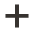
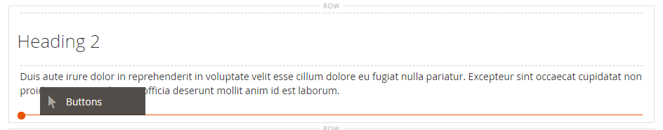
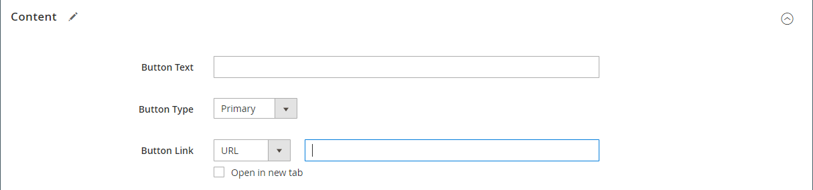
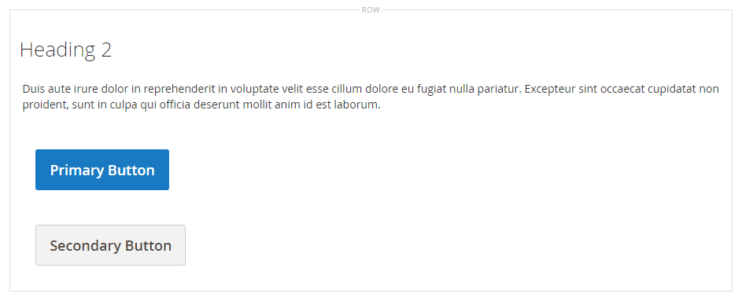
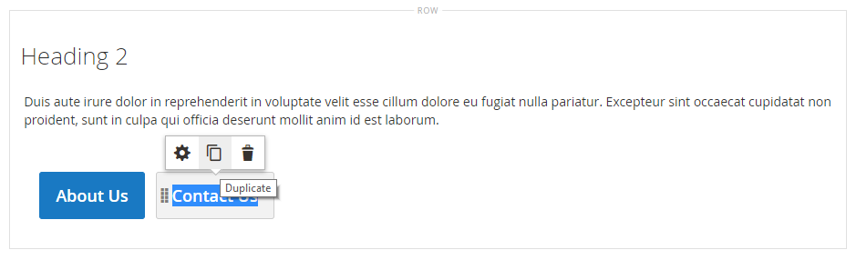
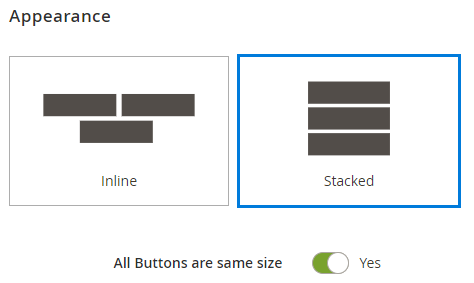
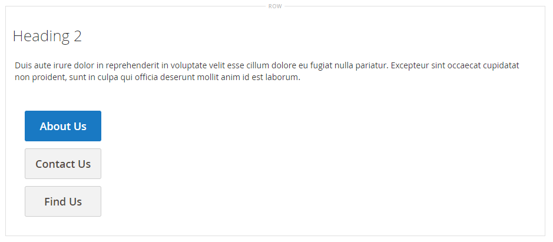
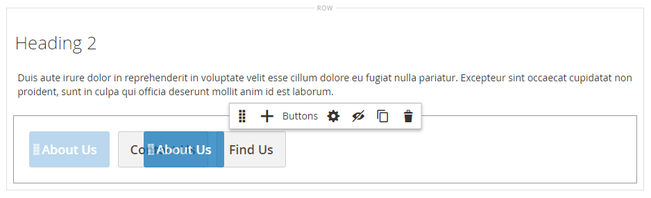

# エレメント — ボタン

以下を使用します。 _ボタン_ 個々のボタンまたは [[!DNL Page Builder] ステージ](workspace.md#stage). ボタンは、水平または垂直に配置し、ステージ上の行、列、タブおよびバナーに直接追加できます。

{width="600" zoomable="yes"}

{{$include /help/_includes/page-builder-save-timeout.md}}

## ツールボックス

Buttons コンテンツタイプを操作する場合、個々のボタンと、1 つ以上のボタンを保持するボタンコンテナを追加および編集します。 各ツールボックスには、 [!DNL Page Builder] ステージ。

### 個々のボタンツールボックス

{width="500" zoomable="yes"}

| ツール | アイコン | 説明 |
| --------- | -------- | -------------- |
| 設定 | {width="25"} | 編集ボタンページが開き、ボタンのプロパティを変更できます。 |
| 複製 | {width="25"} | ボタンのコピーを作成します。 |
| 削除 | {width="25"} | ステージからボタンを削除します。 |

{style="table-layout:auto"}

### ボタンコンテナツールボックス

{width="500" zoomable="yes"}

| ツール | アイコン | 説明 |
| --------- | ----------------- | ----------- |
| 移動 | {width="25"} | ボタンコンテナをページ上の別の有効な場所に移動します。 |
| 追加 | {width="25"} | コンテナにボタンを追加します。 |
| （ラベル） | ボタン | 現在のコンテナをボタン要素として識別します。 |
| 設定 | {width="25"} | 「ボタンを編集」ページを開き、コンテナのプロパティを変更できます。 |
| 非表示 | {width="25"} | ボタンコンテナを非表示にします。 |
| 表示 | {width="25"} | 非表示のボタンコンテナを表示します。 |
| 複製 | {width="25"} | ボタンコンテナのコピーを作成します。 |
| 削除 | {width="25"} | ボタンコンテナとその内容をステージから削除します。 |

{style="table-layout:auto"}

{{$include /help/_includes/page-builder-hidden-element-note.md}}

## 個々のボタンの追加

1. Adobe Analytics の [!DNL Page Builder] パネル、展開 **[!UICONTROL Elements]** をクリックし、 **[!UICONTROL Buttons]** プレースホルダーをステージ上の行、列またはタブセットに追加します。

   {width="500" zoomable="yes"}

1. ボタンの上にマウスポインターを置いてツールボックスを表示し、 _設定_ () アイコンをクリックします。

1. 次を入力します。 **[!UICONTROL Button Text]** ボタンに表示されます。

   {width="600" zoomable="yes"}

1. 設定 **[!UICONTROL Button Type]** を次のいずれかに変更します。

   | タイプ | 説明 |
   | ------ | ----------- |
   | `Primary` | 現在のスタイルシートからプライマリボタンのスタイルを適用します。 |
   | `Secondary` | 該当する場合は、現在のスタイルシートからセカンダリボタンのスタイルを適用します。 |
   | `Link` | ボタンではなくハイパーリンクを作成します。 |

   {style="table-layout:auto"}

   {width="500" zoomable="yes"}

1. を設定します。 **[!UICONTROL Button Link]** 次のいずれかのタイプを使用します。

   - **[!UICONTROL URL]**  — リンクのリンク先 URL を入力します。

     この URL は、ストア内の製品やページへの相対リンクまたは完全修飾 URL のどちらかです。

     相対 URL の例 — `../luma-analog-watch.html`

     完全修飾 URL の例 — `http://mystore.com/luma-analog-watch.html`

     リンク先が別の Web サイトである場合は、現在のページをストアで開いたままにすることができます。そのためには、リンクを新しいブラウザータブで開きます。

     訪問者がストアから離れないようにするには、 **[!UICONTROL Open in new tab]** チェックボックス。

   - **[!UICONTROL Product]**  — 製品名（一部または完全）または SKU を入力し、リストから製品名を選択します。

     >[!NOTE]
     >
     >製品は、 _在庫切れの製品を表示_ 設定。 複数ソースのマーチャントの場合は、 [Inventory management](../inventory-management/introduction.md)の場合、製品リストは、デフォルトの Web サイトに割り当てられたソースによってのみ制限されます。

     {width="600" zoomable="yes"}

   - **[!UICONTROL Category]**  — カテゴリ名（一部または完全）を入力するか、空白のフィールドをクリックしてカテゴリツリーを表示します。 次に、ツリーでカテゴリ名を選択します。

     {width="600" zoomable="yes"}

   - **[!UICONTROL Page]** - CMS ページの名前（一部または完全）を入力するか、空白のフィールドをクリックして完全なリストを表示します。 次に、検索結果リストでページの名前を選択します。

     {width="600" zoomable="yes"}

1. 次を完了： [詳細設定][advanced-settings] 必要に応じて。

1. 完了したら、「 **[!UICONTROL Save]** 右上隅で設定を適用し、 [!DNL Page Builder] ワークスペース。

## 一連のボタンを追加する

次の節では、個々のボタンから開始し、ボタンコンテナ内に 3 つのボタンのセットを作成する一連の手順について説明します。 個々のボタンがまだない場合は、前述の手順に従って、個々のボタンをステージに追加します。

### 手順 1:2 番目のボタンを作成する

1. ボタンコンテナの上にマウスポインターを置いてツールボックスを表示し、 _追加_ ( {width="20"} ) アイコンをクリックします。

   {width="500" zoomable="yes"}

1. 2 番目のボタンに表示するテキストを入力します。

1. 新しいボタンをクリックしてツールボックスを表示し、 _設定_ ( {width="20"} ) アイコンをクリックします。

   {width="500" zoomable="yes"}

1. 設定 **[!UICONTROL Button Type]** から `Secondary`.

1. を設定します。 **[!UICONTROL Button Link]** 必要に応じて。

   次の例では、リンクは、 [お問い合わせ](../getting-started/store-details.md#contact-us-form) ページに貼り付けます。

   {width="600" zoomable="yes"}

1. 次を完了： [詳細設定][advanced-settings] 必要に応じて。

1. 完了したら、「 **[!UICONTROL Save]** 設定を適用し、に戻るには、次の手順に従います。 [!DNL Page Builder] ワークスペース。

### 手順 2:3 番目のボタンの作成

1. ステージで 2 番目のボタンを再度クリックし、「 _複製_ ( {width="20"} ) アイコンをクリックします。

   {width="500" zoomable="yes"}

1. 3 番目のボタンに表示するテキストを入力します。

1. 3 番目のボタンをクリックしてツールボックスを表示し、 _設定_ ( {width="20"} ) アイコンをクリックします。

   {width="500" zoomable="yes"}

1. を更新します。 **[!UICONTROL Button Link]** 必要に応じて。

1. 右上隅で、 **[!UICONTROL Save]** 設定を適用し、に戻るには、次の手順に従います。 [!DNL Page Builder] ワークスペース。

### 手順 3：ボタンコンテナの更新

1. ボタンコンテナの上にマウスポインターを置いてツールボックスを表示し、 _設定_ ( {width="20"} ) アイコンをクリックします。

   {width="500" zoomable="yes"}

1. の下 _[!UICONTROL Appearance]_を選択します。**[!UICONTROL Stacked]**.

1. 設定 **[!UICONTROL All Buttons are same size]** から `Yes`.

   {width="300"}

1. 必要に応じて、残りの設定を更新します。その際には、 [ボタンコンテナの設定を変更する][button-container].

1. 完了したら、「 **[!UICONTROL Save]** 設定を適用し、に戻るには、次の手順に従います。 [!DNL Page Builder] ワークスペース。

   完全な積み重ねボタンセットがステージに表示され、1 つのプライマリボタンと 2 つのセカンダリボタンが表示されます。

   {width="500" zoomable="yes"}

## ボタンの移動

1. 移動するボタンをクリックします。

1. 「移動」( {width="20"} ) アイコン ( ボタンテキストの直前に表示され、ボタンコンテナ内のボタンの新しい位置に配置されます。

   {width="500" zoomable="yes"}

## ボタンの設定の変更

1. ステージ上のボタンをクリックしてツールボックスを表示し、 _設定_ ( {width="20"} ) アイコンをクリックします。

   {width="500" zoomable="yes"}

1. 必要に応じて標準設定を更新します。

   - **[!UICONTROL Button Text]**  — ボタンに表示するテキストを入力します（ステージから直接更新することもできます）。

   - **[!UICONTROL Button Type]**  — ボタンのフォーマットを決定します。

     | タイプ | 説明 |
     | ------ | ----------- |
     | `Primary` | 現在のスタイルシートからプライマリボタンのスタイルを適用します。 |
     | `Secondary` | 該当する場合は、現在のスタイルシートからセカンダリボタンのスタイルを適用します。 |
     | `Link` | ボタンではなくハイパーリンクを作成します。 |

     {style="table-layout:auto"}

   - **[!UICONTROL Button Link]**  — ボタンがクリックされたときに提供される宛先ページを決定します。

     | オプション | 説明 |
     | ------ | ----------- |
     | `URL` | リンク先ページを識別するために、相対 URL または完全修飾 URL を使用します。 |
     | `Product` | 製品名または SKU に基づいて宛先ページを識別します。 製品名は、部分的または完全な名前に基づいて検索できます。 その後、製品が検索結果リストから選択されます。 |
     | `Category` | リンク先のページを、カテゴリツリー内の特定のカテゴリまたはサブカテゴリとして識別します。 |
     | `Page` | リンク先のページを特定の CMS ページとして識別します。 |

     {style="table-layout:auto"}

1. 次を完了： [詳細設定][advanced-settings] 必要に応じて。

1. 設定を保存してに戻るには、以下を実行します。 [!DNL Page Builder] ワークスペース、クリック **[!UICONTROL Save]** をクリックします。

## ボタンコンテナの設定を変更する

1. ボタンコンテナの上にマウスポインターを置いてツールボックスを表示し、 _設定_ ( {width="20"} ) アイコンをクリックします。

1. を更新します。 **[!UICONTROL Appearance]** 必要に応じて設定します。

   - コンテナ内でボタンを水平または垂直に表示するには、次の配置オプションを使用します。

     | オプション | 説明 |
     | ------ | ----------- |
     | `Inline` | ボタンを水平に配置します。 |
     | `Stacked` | ボタンを垂直方向に並べます。 |

     {style="table-layout:auto"}

   - を設定します。 **[!UICONTROL All buttons are same size]** オプションを選択します。

     に設定する場合 `Yes`を指定した場合、コンテナ内のすべてのボタンのサイズは、最も長いボタンテキストの長さに基づいて一定になります。

1. 次を完了： [詳細設定][advanced-settings] 必要に応じて。

1. 完了したら、「 **[!UICONTROL Save]** 設定を適用し、に戻るには、次の手順に従います。 [!DNL Page Builder] ワークスペース。

## 詳細設定の変更

次の項目を変更できます。 _[!UICONTROL Advanced]_個々のボタンの設定と、ボタンコンテナの設定。

1. 親コンテナ内の位置を制御するには、 **[!UICONTROL Alignment]**:

   | オプション | 説明 |
   | ------ | ----------- |
   | `Default` | 現在のテーマのスタイルシートで指定された位置揃えの既定の設定を適用します。 |
   | `Left` | 指定されたパディングを許容して、親コンテナの左の境界線に沿ってコンテンツを揃えます。 |
   | `Center` | 指定されたパディングを許容して、親コンテナの中央にコンテンツを揃えます。 |
   | `Right` | 指定されたパディングを許容して、親コンテナの右の境界線に沿ってコンテンツを揃えます。 |

   {style="table-layout:auto"}

1. を設定します。 **[!UICONTROL Border]** ボタンコンテナまたはボタンコンテナの 4 つの側面すべてに適用されるスタイル：

   | オプション | 説明 |
   | ------ | ----------- |
   | `Default` | 関連するスタイルシートで指定された既定の罫線のスタイルを適用します。 |
   | `None` | コンテナの境界線を表示しません。 |
   | `Dotted` | コンテナの境界線は点線で表示されます。 |
   | `Dashed` | コンテナの境界線は破線で表示されます。 |
   | `Solid` | コンテナの境界線は実線で表示されます。 |
   | `Double` | コンテナの境界線は二重線で表示されます。 |
   | `Groove` | コンテナ境界は溝付きの線として表示されます。 |
   | `Ridge` | コンテナの境界線は、稜線として表示されます。 |
   | `Inset` | コンテナの境界線は、挿入線として表示されます。 |
   | `Outset` | コンテナの境界線は、アウトセット行として表示されます。 |

   {style="table-layout:auto"}

1. 次の条件を満たさない境界線のスタイルを設定した場合： `None`、境界線の表示オプションを設定します。

   | オプション | 説明 |
   | ------ |------------ |
   | [!UICONTROL Border Color] | スウォッチを選択するか、カラーピッカーをクリックするか、有効なカラー名または同等の 16 進値を入力して、カラーを指定します。 |
   | [!UICONTROL Border Width] | 境界線の幅のピクセル数を入力します。 |
   | [!UICONTROL Border Radius] | ピクセル数を入力して、境界線の各隅を囲むために使用する半径のサイズを定義します。 |

   {style="table-layout:auto"}

1. （オプション） **[!UICONTROL CSS classes]** 現在のスタイルシートから、ボタンコンテナまたはボタンコンテナに適用します。

   複数のクラス名はスペースで区切ります。

1. 次の値をピクセル単位で入力します。 **[!UICONTROL Margins and Padding]** を使用して、ボタンコンテナまたはボタンコンテナの外側の余白と内側の余白を指定します。

   ダイアグラムに対応する値を入力します。

   | コンテナ領域 | 説明 |
   | -------------- | ----------- |
   | [!UICONTROL Margins] | コンテナのすべての側面の外側の端に適用される空白の量。 オプション： `Top` / `Right` / `Bottom` / `Left` |
   | [!UICONTROL Padding] | コンテナのすべての側面の内側の端に適用される空白の量。 オプション： `Top` / `Right` / `Bottom` / `Left` |

   {style="table-layout:auto"}

[advanced-settings]: #change-advanced-settings
[button-container]: #change-settings-for-a-button-container
