# 要素 – ボタン

_ボタン_ コンテンツタイプを使用して、個別のボタンまたは[[!DNL Page Builder]  ステージ ](workspace.md#stage)の一連のボタンのいずれかを追加します。 ボタンを水平または垂直に配置し、ステージの行、列、タブ、バナーに直接追加できます。

{width="600" zoomable="yes"}

{{$include /help/_includes/page-builder-save-timeout.md}}

## ツールボックス

ボタンコンテンツタイプを使用する場合は、個々のボタンと、1つ以上のボタンを保持するボタンコンテナを追加して編集します。 それぞれに独自のツールボックスがあり、[!DNL Page Builder] ステージのボタンをデザインするために使用します。

### 個別ボタンツールボックス

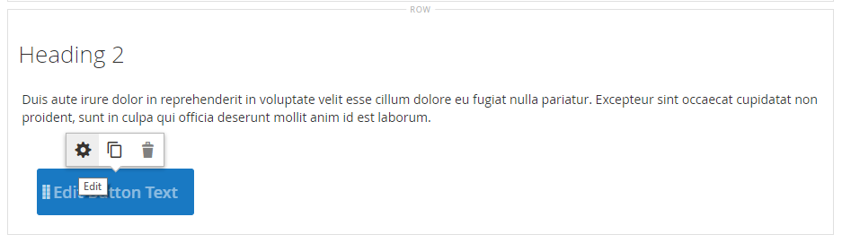{width="500" zoomable="yes"}

| ツール | アイコン | 説明 |
| --------- | -------- | -------------- |
| 設定 | {width="25"} | ボタンのプロパティを変更できる「ボタンを編集」ページが開きます。 |
| 重複 | {width="25"} | ボタンのコピーを作成します。 |
| 削除 | {width="25"} | ステージからボタンを削除します。 |

{style="table-layout:auto"}

### ボタンコンテナツールボックス

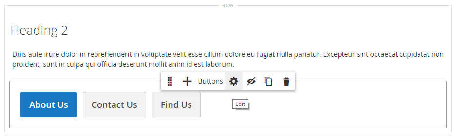{width="500" zoomable="yes"}

| ツール | アイコン | 説明 |
| --------- | ----------------- | ----------- |
| 移動 | {width="25"} | ボタンコンテナをページ上の別の有効な場所に移動します。 |
| 追加 | 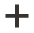{width="25"} | コンテナにボタンを追加します。 |
| （ラベル） | ボタン | 現在のコンテナをボタン要素として識別します。 |
| 設定 | {width="25"} | ボタンを編集ページが開き、コンテナのプロパティを変更できます。 |
| 非表示 | {width="25"} | ボタンコンテナを非表示にします。 |
| 表示 | {width="25"} | 非表示のボタンコンテナを表示します。 |
| 重複 | {width="25"} | ボタンコンテナのコピーを作成します。 |
| 削除 | {width="25"} | ボタン コンテナとそのコンテンツをステージから削除します。 |

{style="table-layout:auto"}

{{$include /help/_includes/page-builder-hidden-element-note.md}}

## 個別のボタンを追加

1. [!DNL Page Builder] パネルで、**[!UICONTROL Elements]**&#x200B;を展開し、**[!UICONTROL Buttons]** プレースホルダーをステージ上の行、列、またはタブ セットにドラッグします。

   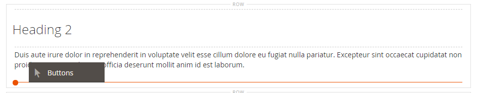{width="500" zoomable="yes"}

1. ボタンにカーソルを合わせてツールボックスを表示し、_設定_ （）アイコンを選択します。

1. ボタンに表示する&#x200B;**[!UICONTROL Button Text]**&#x200B;を入力します。

   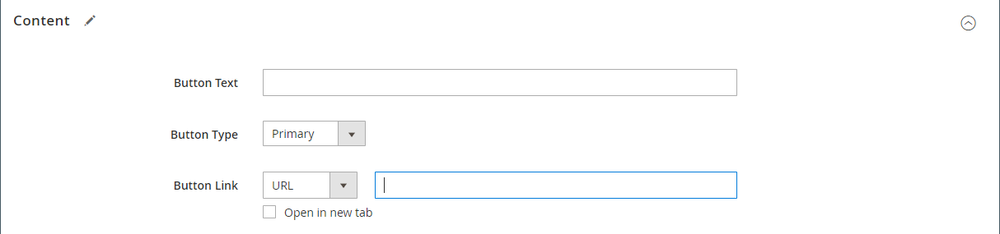{width="600" zoomable="yes"}

1. **[!UICONTROL Button Type]**&#x200B;を次のいずれかに設定します：

   | タイプ | 説明 |
   | ------ | ----------- |
   | `Primary` | 現在のスタイルシートからプライマリボタンのスタイルを適用します。 |
   | `Secondary` | 該当する場合は、現在のスタイルシートからセカンダリボタンスタイルを適用します。 |
   | `Link` | ボタンではなくハイパーリンクを作成します。 |

   {style="table-layout:auto"}

   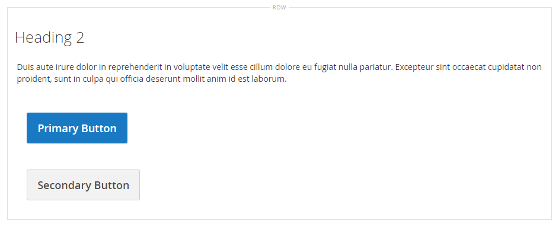{width="500" zoomable="yes"}

1. 次のいずれかのタイプを使用して&#x200B;**[!UICONTROL Button Link]**&#x200B;を設定します。

   - **[!UICONTROL URL]** - リンクの宛先URLを入力します。

     URLには、ストア内の商品またはページへの相対リンク、または完全修飾URLを使用できます。

     相対URLの例 – `../luma-analog-watch.html`

     完全修飾URLの例 – `http://mystore.com/luma-analog-watch.html`

     リンクが別のweb サイトに移動した場合は、新しいブラウザータブでリンクを開くことで、現在のページをストアに開いたままにできます。

     訪問者がストアから離れるのを防ぐには、**[!UICONTROL Open in new tab]** チェックボックスをオンにします。

   - **[!UICONTROL Product]** – 製品名（部分または完全）またはSKUを入力し、リストから製品名を選択します。

     >[!NOTE]
     >
     >商品は、_在庫切れ商品を表示_&#x200B;の設定に従ってリストに表示されます。 [Inventory management](../inventory-management/introduction.md)を使用している複数のSource マーチャントの場合、商品リストは、デフォルトのweb サイトのみに割り当てられたソースによって制限されます。

     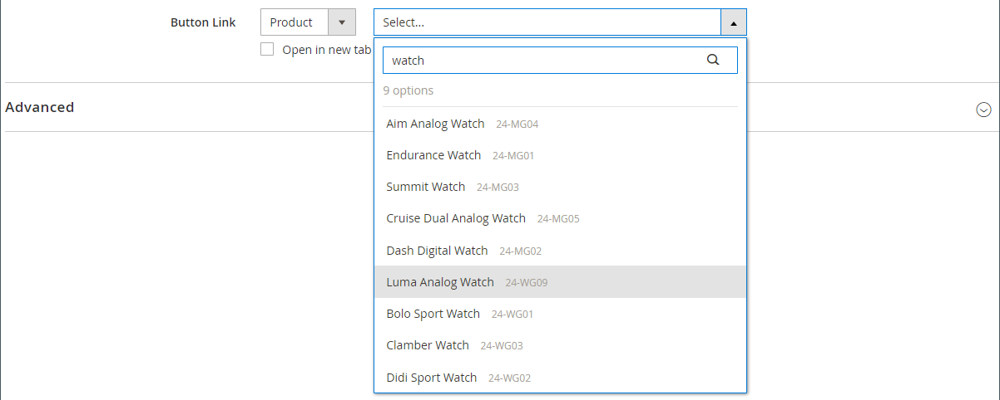{width="600" zoomable="yes"}

   - **[!UICONTROL Category]** - カテゴリ名（部分的または完全）を入力するか、空白フィールドをクリックしてカテゴリーツリーを表示します。 次に、ツリー内のカテゴリ名を選択します。

     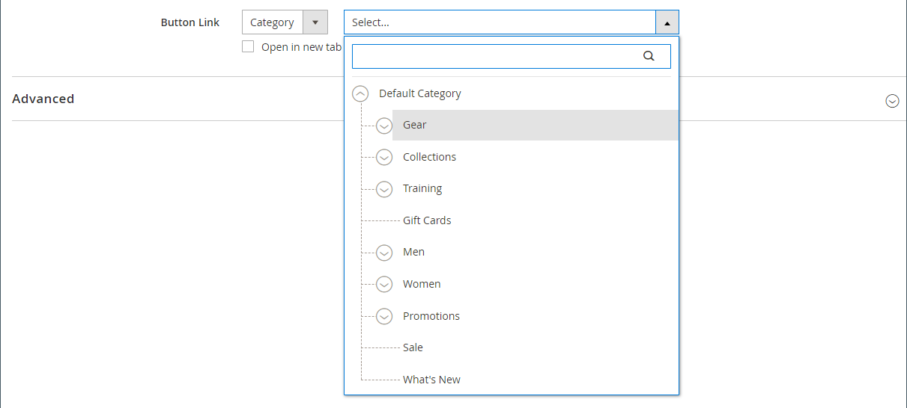{width="600" zoomable="yes"}

   - **[!UICONTROL Page]** - CMS ページの名前（一部または完全）を入力するか、空白フィールドをクリックして完全なリストを表示します。 次に、検索結果リストでページの名前を選択します。

     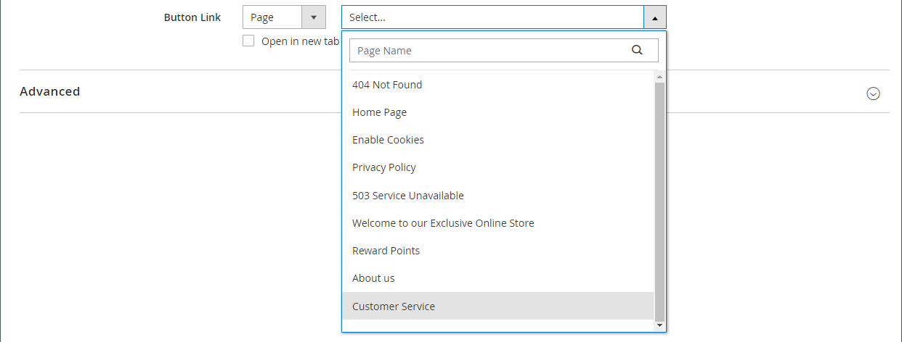{width="600" zoomable="yes"}

1. 必要に応じて[詳細設定](#change-advanced-settings)を完了します。

1. 完了したら、右上隅の&#x200B;**[!UICONTROL Save]**&#x200B;をクリックして設定を適用し、[!DNL Page Builder] ワークスペースに戻ります。

## ボタンのセットの追加

次の節では、個々のボタンから始めて、ボタンコンテナ内に3つのボタンのセットを作成するための一連の手順について説明します。 個別ボタンがない場合は、前の手順に従って個別ボタンをステージに追加します。

### 手順1:2番目のボタンの作成

1. ボタンコンテナにカーソルを合わせてツールボックスを表示し、_追加_ （{width="20"}）アイコンを選択します。

   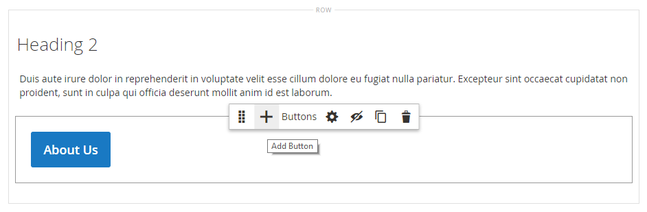{width="500" zoomable="yes"}

1. 2番目のボタンに表示するテキストを入力します。

1. 新しいボタンをクリックしてツールボックスを表示し、_設定_ （{width="20"}）アイコンを選択します。

   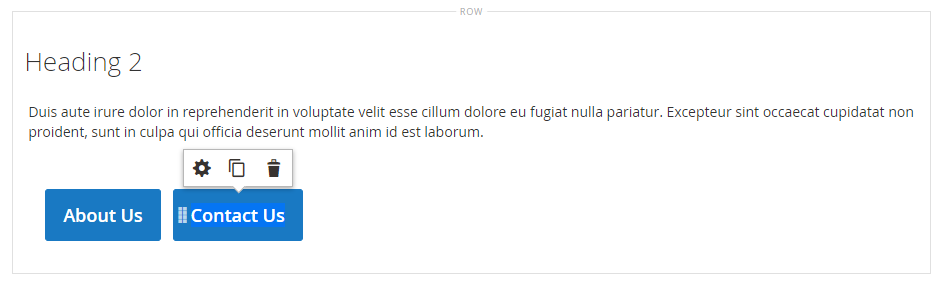{width="500" zoomable="yes"}

1. **[!UICONTROL Button Type]**&#x200B;を`Secondary`に設定します。

1. 必要に応じて&#x200B;**[!UICONTROL Button Link]**&#x200B;を設定します。

   次の例では、リンクは[お問い合わせ](../getting-started/store-details.md#contact-us-form) ページに移動する相対URLです。

   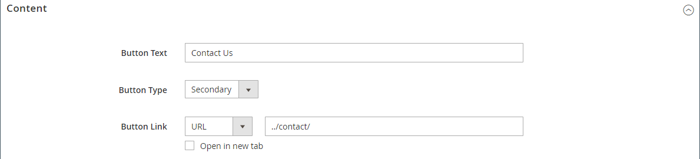{width="600" zoomable="yes"}

1. 必要に応じて[詳細設定](#change-advanced-settings)を完了します。

1. 完了したら、**[!UICONTROL Save]**&#x200B;をクリックして設定を適用し、[!DNL Page Builder] ワークスペースに戻ります。

### ステップ 2:3番目のボタンを作成する

1. ステージの2番目のボタンをもう一度クリックし、_複製_ （{width="20"}）アイコンを選択します。

   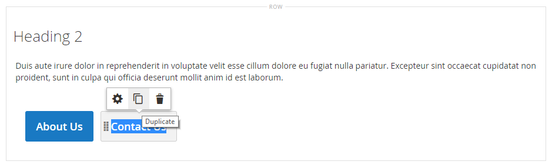{width="500" zoomable="yes"}

1. 3番目のボタンに表示するテキストを入力します。

1. 3番目のボタンをクリックしてツールボックスを表示し、_設定_ （{width="20"}）アイコンを選択します。

   3番目のボタンの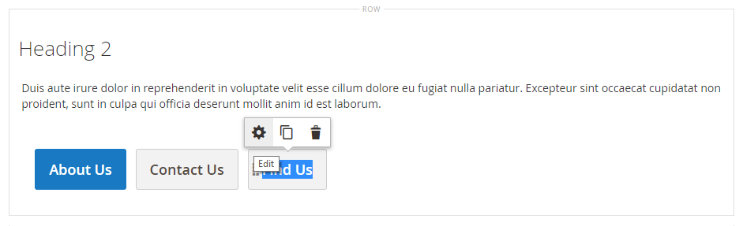{width="500" zoomable="yes"}

1. 必要に応じて&#x200B;**[!UICONTROL Button Link]**&#x200B;を更新します。

1. 右上隅の「**[!UICONTROL Save]**」をクリックして設定を適用し、[!DNL Page Builder] ワークスペースに戻ります。

### 手順3：ボタンコンテナの更新

1. ボタンコンテナにカーソルを合わせてツールボックスを表示し、_設定_ （{width="20"}）アイコンを選択します。

   {width="500" zoomable="yes"}

1. _[!UICONTROL Appearance]_で、**[!UICONTROL Stacked]**を選択します。

1. **[!UICONTROL All Buttons are same size]**&#x200B;を`Yes`に設定します。

   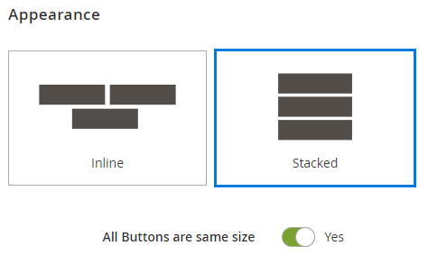{width="300"}

1. 必要に応じて、残りの設定を更新します。[ ボタンコンテナの設定を変更](#change-settings-for-a-button-container)の説明を使用します。

1. 完了したら、**[!UICONTROL Save]**&#x200B;をクリックして設定を適用し、[!DNL Page Builder] ワークスペースに戻ります。

   完全な積み重ねボタンセットがステージに表示され、1つのプライマリボタンと2つのセカンダリボタンが表示されます。

   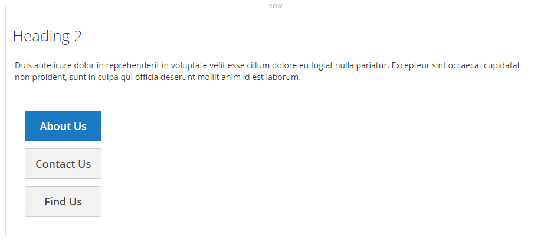{width="500" zoomable="yes"}

## ボタンの移動

1. 移動するボタンをクリックします。

1. ボタンのテキストの直前に表示される移動（{width="20"}）アイコンを選択して、ボタンコンテナ内のボタンの新しい位置にドラッグします。

   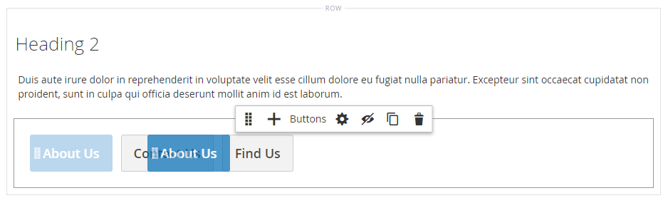{width="500" zoomable="yes"}

## ボタンの設定の変更

1. ステージのボタンをクリックしてツールボックスを表示し、_設定_ （{width="20"}）アイコンを選択します。

   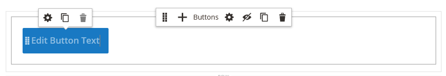{width="500" zoomable="yes"}

1. 必要に応じて標準設定を更新します。

   - **[!UICONTROL Button Text]** - ボタンに表示するテキストを入力します（ステージから直接更新することもできます）。

   - **[!UICONTROL Button Type]** - ボタンの形式を指定します。

     | タイプ | 説明 |
     | ------ | ----------- |
     | `Primary` | 現在のスタイルシートからプライマリボタンのスタイルを適用します。 |
     | `Secondary` | 該当する場合は、現在のスタイルシートからセカンダリボタンスタイルを適用します。 |
     | `Link` | ボタンではなくハイパーリンクを作成します。 |

     {style="table-layout:auto"}

   - **[!UICONTROL Button Link]** - ボタンがクリックされたときに提供される宛先ページを決定します。

     | オプション | 説明 |
     | ------ | ----------- |
     | `URL` | 相対URLまたは完全修飾URLを使用して、宛先ページを識別します。 |
     | `Product` | 製品名またはSKUに基づいて宛先ページを識別します。 製品名は、部分的または完全な名前に基づいて検索できます。 次に、検索結果リストから商品が選択されます。 |
     | `Category` | カテゴリーツリー内の特定のカテゴリまたはサブカテゴリとして、宛先ページを識別します。 |
     | `Page` | 宛先ページを特定のCMS ページとして指定します。 |

     {style="table-layout:auto"}

1. 必要に応じて[詳細設定](#change-advanced-settings)を完了します。

1. 設定を保存して[!DNL Page Builder] ワークスペースに戻るには、右上隅の「**[!UICONTROL Save]**」をクリックします。

## ボタンコンテナの設定の変更

1. ボタンコンテナにカーソルを合わせてツールボックスを表示し、_設定_ （{width="20"}）アイコンを選択します。

1. 必要に応じて&#x200B;**[!UICONTROL Appearance]**&#x200B;設定を更新します。

   - 配置オプションを使用して、コンテナ内でボタンを水平方向または垂直方向に表示します。

     | オプション | 説明 |
     | ------ | ----------- |
     | `Inline` | ボタンを水平方向に配置します。 |
     | `Stacked` | ボタンを垂直方向に配置します。 |

     {style="table-layout:auto"}

   - 好みに応じて&#x200B;**[!UICONTROL All buttons are same size]** オプションを設定します。

     `Yes`に設定すると、コンテナ内のすべてのボタンは、最も長いボタンテキストの長さに基づいて、一貫したサイズになります。

1. 必要に応じて[詳細設定](#change-advanced-settings)を完了します。

1. 完了したら、**[!UICONTROL Save]**&#x200B;をクリックして設定を適用し、[!DNL Page Builder] ワークスペースに戻ります。

## 詳細設定を変更

個々のボタンとボタンコンテナの&#x200B;_[!UICONTROL Advanced]_設定を変更できます。

1. 親コンテナ内の位置を制御するには、**[!UICONTROL Alignment]**&#x200B;を選択します。

   | オプション | 説明 |
   | ------ | ----------- |
   | `Default` | 現在のテーマのスタイルシートで指定されている整列のデフォルト設定を適用します。 |
   | `Left` | 親コンテナの左端に沿ってコンテンツを整列させ、指定されたパディングを許可します。 |
   | `Center` | 親コンテナの中央にあるコンテンツを、指定された任意のパディングを許可して整列させます。 |
   | `Right` | 親コンテナの右端に沿ってコンテンツを整列させ、指定されたパディングを許可します。 |

   {style="table-layout:auto"}

1. ボタンまたはボタンコンテナのすべての4つの側面に適用される&#x200B;**[!UICONTROL Border]** スタイルを設定します。

   | オプション | 説明 |
   | ------ | ----------- |
   | `Default` | 関連付けられたスタイルシートで指定されたデフォルトの境界線スタイルを適用します。 |
   | `None` | コンテナの境界を表示しません。 |
   | `Dotted` | コンテナの境界線が点線で表示されます。 |
   | `Dashed` | コンテナの境界線が破線で表示されます。 |
   | `Solid` | コンテナの境界線が実線として表示されます。 |
   | `Double` | コンテナの境界線が2行で表示されます。 |
   | `Groove` | コンテナの境界線は、溝付き線として表示されます。 |
   | `Ridge` | コンテナの境界線は、うね付きの線として表示されます。 |
   | `Inset` | コンテナの境界線がインセット線として表示されます。 |
   | `Outset` | コンテナの境界線がアウトセット線として表示されます。 |

   {style="table-layout:auto"}

1. `None`以外の境界線スタイルを設定する場合は、境界線の表示オプションを完了します。

   | オプション | 説明 |
   | ------ |------------ |
   | [!UICONTROL Border Color] | 色見本を選択するか、カラーピッカーをクリックするか、有効なカラー名または同等の16進数値を入力して、カラーを指定します。 |
   | [!UICONTROL Border Width] | 境界線の幅のピクセル数を入力します。 |
   | [!UICONTROL Border Radius] | 境界線の各隅を丸めるために使用する半径のサイズを定義するピクセル数を入力します。 |

   {style="table-layout:auto"}

1. （オプション）ボタンまたはボタンコンテナに適用する&#x200B;**[!UICONTROL CSS classes]**&#x200B;の名前を現在のスタイルシートから指定します。

   複数のクラス名はスペースで区切ります。

1. **[!UICONTROL Margins and Padding]**&#x200B;の値をピクセル単位で入力して、ボタンまたはボタンコンテナの外側の余白と内側の余白を決定します。

   対応する値をダイアグラムに入力します。

   | コンテナ領域 | 説明 |
   | -------------- | ----------- |
   | [!UICONTROL Margins] | コンテナのすべての側面の外側のエッジに適用される空白スペースの量。 オプション：`Top` / `Right` / `Bottom` / `Left` |
   | [!UICONTROL Padding] | コンテナのすべての側面の内側エッジに適用される空白スペースの量。 オプション：`Top` / `Right` / `Bottom` / `Left` |

   {style="table-layout:auto"}

<!-- Last updated from includes: 2023-09-11 14:30:19 -->
