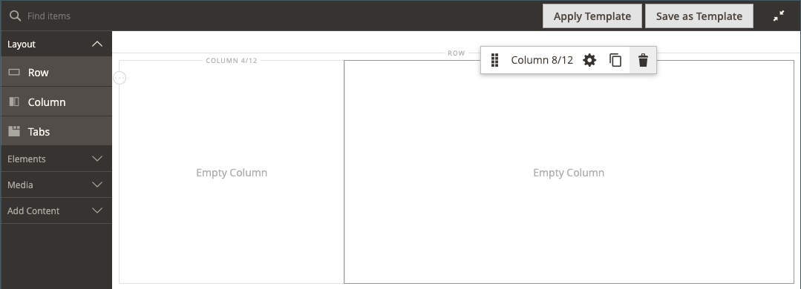
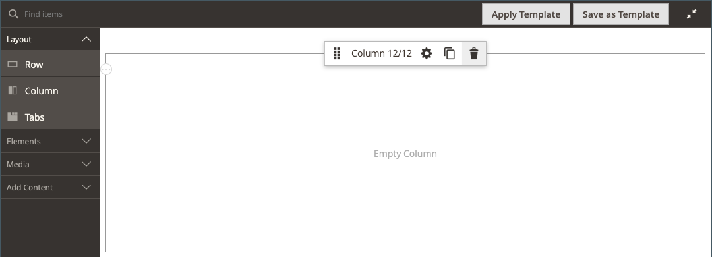

# レイアウト — 列

以下を使用します。 _列_ ページを [[!DNL Page Builder] ステージ](workspace.md#stage). 列を行やタブ、または直接ステージに追加する場合、列グループは最初は同じ幅の 2 つの列に分割されます。 必要に応じて、列を追加または削除できます。 列は、2 つの列の間の境界線をドラッグしてサイズ変更できます。 次の列の幅は、行、タブまたはステージ内の使用可能なスペースを埋めるように調整されます。 1 つの列が、ステージまたはそのコンテナの幅全体に広がります。

{width="600" zoomable="yes"}

{{$include /help/_includes/page-builder-save-timeout.md}}

## 2.4.5 リリースの更新点

ページビルダー機能は、ユーザーが _[!DNL Columns]_を個々の列の親コンテナとして使用します。 また、この新しいコンテナは、背景のプロパティをサポートし、列を行に折り返す必要がなくなりました。 不要なマークアップを減らし、ストアフロントの表示と操作性をより細かく制御できます。

レイアウトを変更するには、 [!DNL Columns] コンテナをドラッグします。 これにより、開発者がカスタマイズをおこなう必要なく、新しい様々なレイアウトの組み合わせが開きます。

このビデオで、 [!DNL Columns] コンテナを使用して、ページレイアウトを調整できます。

>[!VIDEO](https://video.tv.adobe.com/v/345828?quality=12)

## 列ツールボックス

各列には、コンテナの上にマウスポインターを置くと表示されるオプションのツールボックスがあります。

| ツール | アイコン | 説明 |
|--- |--- |--- |
| 移動 | {width="25"} | 他の列を基準にして、列とその内容を別の位置に移動します。 |
| （ラベル） | 列 | 現在のコンテナを列として識別します。 列コンテナの上にマウスポインターを置くと、ツールボックスが表示されます。 |
| 設定 | {width="25"} | 列の編集ページを開き、コンテナのプロパティを変更できます。 |
| 複製 | {width="25"} | 現在の列のコピーを作成します。 |
| 削除 | {width="25"} | 現在の列とその内容を削除します。 |

{style="table-layout:auto"}

## 列グリッド

The [グリッド](workspace.md) では、コンテンツが一貫して列に配置され、デスクトップとモバイルデバイスの両方でページが正しくレンダリングされるようにします。 詳しくは、 [高度なコンテンツツール](setup.md) のセクション [!DNL Page Builder] 設定。

{width="500" zoomable="yes"}

次の 2 列の例では、各列コンテナの上の境界線にある括弧内の数字(6/12)は、各列のグリッド分割数と合計分割数を示しています。 この場合、列は合計 12 個のうち、6 個のグリッド単位の幅になります。

{width="600" zoomable="yes"}

## 列を追加

1. Adobe Analytics の [!DNL Page Builder] 下のパネル _[!UICONTROL Layout]_、**[!UICONTROL Column]**をステージに追加します。

   {width="600" zoomable="yes"}

   これで、列グループが同じ幅の 2 つの列に分割されました。 各列はコンテンツ用の個別のコンテナで、独自のツールボックスオプションのセットを持ちます。

   {width="600" zoomable="yes"}

1. 列グループの左上隅で、 _グリッド_ ツール () をクリックし、必要に応じてグリッドサイズを調整します。

   グリッドにコンテンツを配置すると、コンテンツを一貫して配置し、デスクトップとモバイルの両方のデバイスでページを正しくレンダリングするのに役立ちます。 詳しくは、 [高度なコンテンツツール](../configuration-reference/general/content-management.md) のセクション [!DNL Page Builder] 設定。

   {width="600" zoomable="yes"}

## 列のサイズ変更

1. 2 つの列の境界線の上にマウスポインターを置きます。

   境界線がハイライト表示され、選択した列のツールボックスが表示されます。

   {width="600" zoomable="yes"}

1. マウスボタンを押しながらグリッドを表示し、枠線をグリッド上の新しい位置にドラッグします。

   両方の列の幅は、変更を反映するように調整されます。 各列の新しい幅は、ラベルの後に表示されます。例： `4/12` （12 のうち 4）と `8/12` （12 のうち 8）。

   {width="600" zoomable="yes"}

## 列の削除

1. 削除する列の上にマウスポインターを置いてツールボックスを表示し、 _削除_ ( {width="20"} ) アイコンをクリックします。

   {width="600" zoomable="yes"}

1. 列にコンテンツが含まれる場合は、 **[!UICONTROL OK]** をクリックして確定します。

   今後の処理をスピードアップさせるには、確認手順をスキップし、 **[!UICONTROL Do not show this again]** チェックボックス。

   これで、列グループの列が(12/12)とグリッドのみになりました。 グリッドは列に対してのみ使用できるので、この方法を使用してグリッドを表示できます。

   {width="600" zoomable="yes"}

1. 列グループで残りの列を行またはステージの幅全体に拡張する場合は、次の手順に従います。

   - 列の上にマウスポインターを置いてツールボックスを表示し、 _設定_ ( {width="20"} ) アイコンをクリックします。

   - 下にスクロールして、 _[!UICONTROL Advanced]_セクションと 4 つすべてを設定&#x200B;**[!UICONTROL Padding]**の値 `0`.

     {width="600" zoomable="yes"}

   - 右上隅で、 **[!UICONTROL Save]** 閉じる _[!UICONTROL Edit Column]_ページに貼り付けます。

1. 次をクリック： _全画面表示を閉じる_ ( {width="20"} ) アイコンをクリックし、 **[!UICONTROL Save]** をクリックします。

## 列設定の変更

1. 列の上にマウスポインターを置いてツールボックスを表示し、 _設定_ ( {width="20"} ) アイコンをクリックします。

   {width="600" zoomable="yes"}

1. 次を変更： **[!UICONTROL Appearance]** 必要に応じて設定します。

   - コンテナに対する列の位置を決定する整列設定を選択します。

     | オプション | 説明 |
     | ------ | ----------- |
     | `Full Height` | この列は、コンテナの高さを最大限に拡張します。 |
     | `Top Aligned` | 列はコンテナの上部に整列します。 |
     | `Centered` | コンテナの中央に配置された列。 |
     | `Bottom Aligned` | 列は、コンテナの下部に整列します。 |

     {style="table-layout:auto"}

   - 必要に応じて、 **[!UICONTROL Minimum Height]** 」と入力します。 例えば、背景画像の高さに合わせて最小の高さを設定できます。

   - 最小の高さを設定した場合は、 **[!UICONTROL Vertical Alignment]**  列に追加されるコンテンツコンテナの位置を制御するには (`Top`, `Center`または `Bottom`) をクリックします。

1. 列コンテンツの背景を変更します。

   - **[!UICONTROL Background Color]**  — スウォッチを選択するか、カラーピッカーをクリックするか、有効なカラー名または同等の 16 進値を入力して、カラーを指定します。 この設定は、列の背景色を決定します。

   - **[!UICONTROL Background Image]**  — 必要に応じて、提供されているツールを使用して、列に適用する背景画像を選択します。

     | ツール | 説明 |
     | ------ | ----------- |
     | [!UICONTROL Upload] | ローカルコンピューターからギャラリーに画像ファイルをアップロードし、それを列の背景画像として適用します。 |
     | [!UICONTROL Select from Gallery] | ギャラリーから既存の画像を列の背景画像として選択するように求めるプロンプトが表示されます。 |
     | {width="25"} | 画像をカメラタイルにドラッグするか、ローカルファイルシステム内の画像を参照することができます。 |

     {style="table-layout:auto"}

   - **[!UICONTROL Background Mobile Image]**  — 必要に応じて、同じツールを使用して、モバイルデバイスでの表示に使用する別の背景画像を選択します。

   - **[!UICONTROL Background Size]**  — この設定を変更して、列の幅に対する背景画像の拡大/縮小方法を指定します。

     | オプション | 説明 |
     | ------ | ----------- |
     | `Cover` | 背景画像は、列の全幅を覆います。 |
     | `Contain` | 背景画像は、コンテンツ領域の幅に制限されます。 |
     | `Auto` | 現在のテーマのスタイルシートで指定された既定の背景サイズを適用します。 |

     {style="table-layout:auto"}

   - **[!UICONTROL Background Position]**  — この設定を変更して、列に対する画像のアンカーポイントを決定します。 オプション： `Top Left`, `Top Center`, `Top Right`, `Center Left`, `Center`, `Center Right`, `Bottom Left`, `Bottom Center`または `Bottom Right`

   - **[!UICONTROL Background Attachment]**  — 背景画像がスクロールページに対してどのように移動するかを指定するには、この設定を変更します。

     | オプション | 説明 |
     | ------ | ----------- |
     | `Scroll` | 背景画像は、ページがスクロールするたびに下に移動するように同期されます。 |
     | `Fixed` | （モバイルでは使用できません）背景画像は、コンテナが画像をスクロールするたびに移動せず、指定された背景位置で固定されます。 |

     {style="table-layout:auto"}

   - **[!UICONTROL Background Repeat]**  — 背景画像を繰り返してスペースを埋める場合は、この設定を変更します `Yes`.

1. を更新します。 _[!UICONTROL Advanced]_必要に応じて設定します。

   - 列に追加されるコンテンツコンテナの水平方向の位置を制御するには、 **[!UICONTROL Alignment]**:

     | オプション | 説明 |
     | ------ | ----------- |
     | `Default` | 現在のテーマのスタイルシートで指定された位置揃えの既定の設定を適用します。 |
     | `Left` | 指定されたパディングの代わりに、コンテンツコンテナを列コンテナの左の境界線に沿って揃えます。 |
     | `Center` | コンテンツコンテナを列コンテナの中央に揃えます。指定されたパディングの分だけを使用します。 |
     | `Right` | コンテンツコンテナを列コンテナの右側の境界線に沿って揃えます。指定されたパディングの値を使用します。 |

     {style="table-layout:auto"}

   - を設定します。 **[!UICONTROL Border]** スタイル。列コンテナの 4 つの側面すべてに適用されます。

     | オプション | 説明 |
     | ------ | ----------- |
     | `Default` | 関連するスタイルシートで指定された既定の罫線のスタイルを適用します。 |
     | `None` | コンテナの境界線を表示しません。 |
     | `Dotted` | コンテナの境界線は点線で表示されます。 |
     | `Dashed` | コンテナの境界線は破線で表示されます。 |
     | `Solid` | コンテナの境界線は実線で表示されます。 |
     | `Double` | コンテナの境界線は二重線で表示されます。 |
     | `Groove` | コンテナ境界は溝付きの線として表示されます。 |
     | `Ridge` | コンテナの境界線は、稜線として表示されます。 |
     | `Inset` | コンテナの境界線は、挿入線として表示されます。 |
     | `Outset` | コンテナの境界線は、アウトセット行として表示されます。 |

     {style="table-layout:auto"}

   - 次の条件を満たさない境界線のスタイルを設定した場合： `None`、境界線の表示オプションを設定します。

     | オプション | 説明 |
     | ------ |------------ |
     | [!UICONTROL Border Color] | スウォッチを選択するか、カラーピッカーをクリックするか、有効なカラー名または同等の 16 進値を入力して、カラーを指定します。 |
     | [!UICONTROL Border Width] | 境界線の幅のピクセル数を入力します。 |
     | [!UICONTROL Border Radius] | ピクセル数を入力して、境界線の各隅を囲むために使用する半径のサイズを定義します。 |

     {style="table-layout:auto"}

   - （オプション） **[!UICONTROL CSS classes]** 現在のスタイルシートから列コンテナに適用します。

     複数のクラス名はスペースで区切ります。

   - 次の値をピクセル単位で入力します。 **[!UICONTROL Margins and Padding]** をクリックして、列の外側の余白と内側の余白を指定します。

     列コンテナ図で、対応する各値を入力します。

     | コンテナ領域 | 説明 |
     | -------------- | ----------- |
     | [!UICONTROL Margins] | コンテナのすべての側面の外側の端に適用される空白の量。 オプション： `Top` / `Right` / `Bottom` / `Left` |
     | [!UICONTROL Padding] | コンテナのすべての側面の内側の端に適用される空白の量。 オプション： `Top` / `Right` / `Bottom` / `Left` |

     {style="table-layout:auto"}

1. 完了したら、「 **[!UICONTROL Save]** 設定を適用し、に戻るには、次の手順に従います。 [!DNL Page Builder] ワークスペース。
