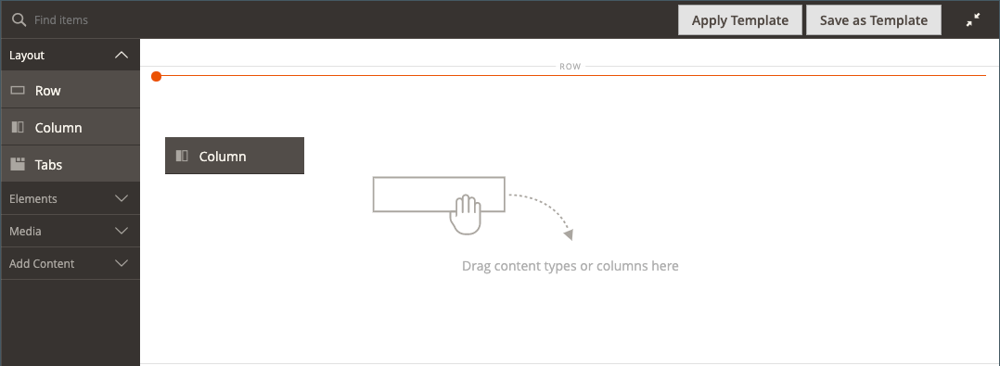
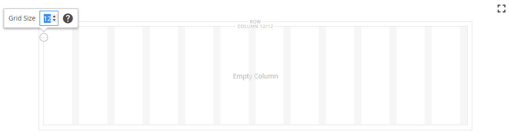
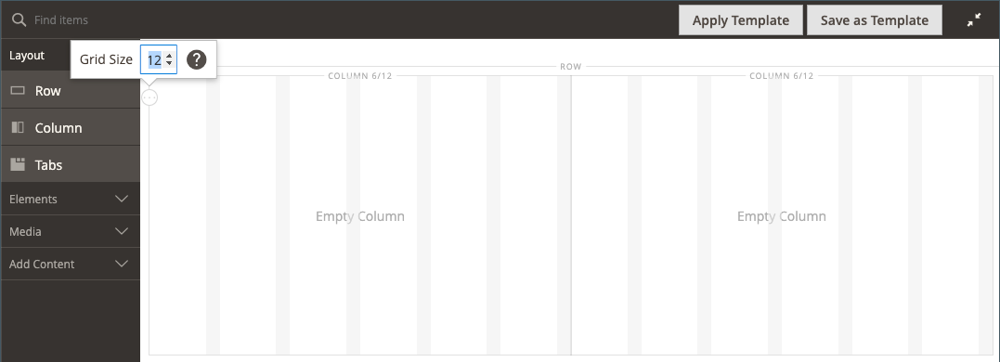
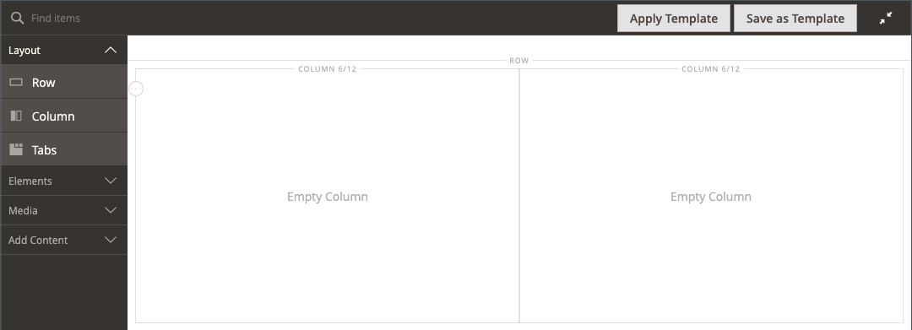
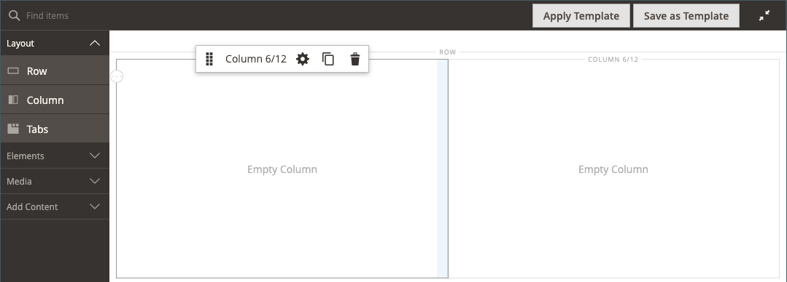
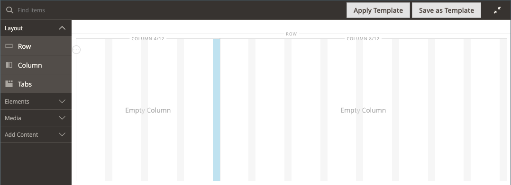
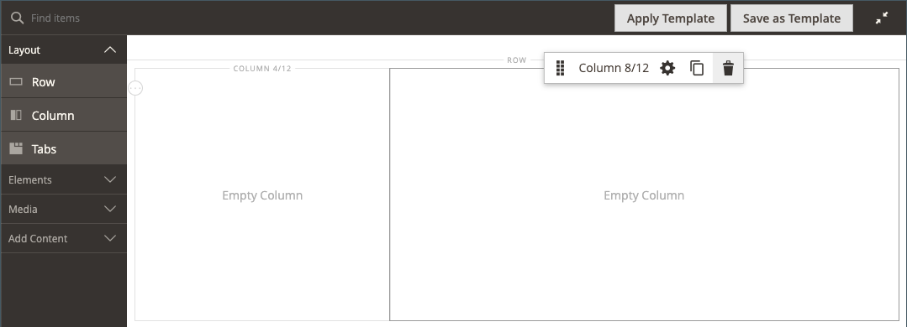
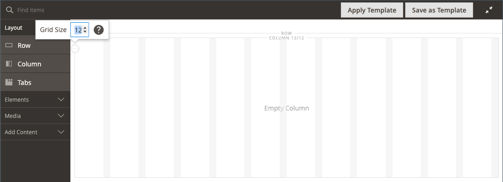
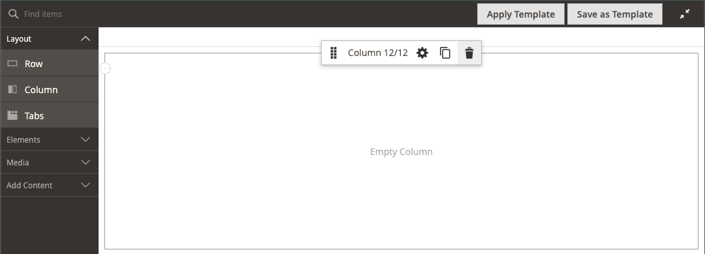

# レイアウト – 列

_列_ コンテンツタイプを使用して、ページを[[!DNL Page Builder]  ステージ &#x200B;](workspace.md#stage)の複数の列に分割します。 列を行またはタブに追加するか、ステージに直接追加すると、列グループは最初に同じ幅の2つの列に分割されます。 必要に応じて、列を追加または削除できます。 列の境界線を2つの列の間にドラッグすることで、列のサイズを変更できます。 次の列の幅は、行、タブ、またはステージ内の使用可能なスペースに合わせて調整されます。 1つの列は、ステージまたはそのコンテナの全幅を拡張します。

{width="600" zoomable="yes"}

{{$include /help/_includes/page-builder-save-timeout.md}}

## 2.4.5 リリースのアップデート

ページビルダー機能は2.4.5 リリースで更新され、ユーザーは個々の列の親コンテナとして&#x200B;_[!DNL Columns]_&#x200B;を使用できるようになりました。 この新しいコンテナは、背景のプロパティもサポートしており、列を行にラップする必要はありません。 不要なマークアップを減らし、ストアフロントの表示と体験をより細かく制御できます。

[!DNL Columns] コンテナのレイアウトを変更するには、グループ内の他の列の上または下に列をドラッグして、それらを積み重ねます。 これにより、開発者によるカスタマイズを必要とせずに実現できる、新しい様々なレイアウトの組み合わせが可能になります。

[!DNL Columns] コンテナを使用してページレイアウトを調整する方法のデモについては、このビデオをご覧ください。

>[!VIDEO](https://video.tv.adobe.com/v/345828?quality=12&learn=on)

## 列ツールボックス

各列には、コンテナにカーソルを合わせると表示されるオプションのツールボックスがあります。

| ツール | アイコン | 説明 |
|--- |--- |--- |
| 移動 | {width="25"} | 列とその内容を、他の列に関連する別の位置に移動します。 |
| （ラベル） | 列 | 現在のコンテナを列として識別します。 列コンテナにカーソルを合わせると、ツールボックスが表示されます。 |
| 設定 | {width="25"} | 列を編集ページが開き、コンテナのプロパティを変更できます。 |
| 重複 | {width="25"} | 現在の列のコピーを作成します。 |
| 削除 | {width="25"} | 現在の列とその内容を削除します。 |

{style="table-layout:auto"}

## 棒グリッド

[grid](workspace.md)を使用すると、コンテンツが列で一貫して整列され、デスクトップとモバイルデバイスの両方でページが正しくレンダリングされるようになります。 詳しくは、[!DNL Page Builder]設定の「[高度なコンテンツツール &#x200B;](setup.md)」セクションを参照してください。

{width="500" zoomable="yes"}

次の2列の例では、各列コンテナの上端の括弧（6/12）の数値は、各列のグリッド分割数と合計分割数を示します。 この場合、列は合計12個のうち6個のグリッドユニットの幅になります。

{width="600" zoomable="yes"}

## 列を追加

1. _[!UICONTROL Layout]_&#x200B;の下の[!DNL Page Builder] パネルで、**[!UICONTROL Column]**&#x200B;をステージにドラッグします。

   {width="600" zoomable="yes"}

   列グループは、同じ幅の2つの列に分割されました。 各列はコンテンツ用の個別のコンテナであり、独自のツールボックスオプションのセットがあります。

   {width="600" zoomable="yes"}

1. 列グループの左上隅にある&#x200B;_グリッド_ ツール （）をクリックし、必要に応じてグリッドサイズを調整します。

   コンテンツをグリッドに配置することで、コンテンツを一貫して調整し、デスクトップとモバイルデバイスの両方でページを正しくレンダリングすることができます。 詳しくは、[!DNL Page Builder]設定の「[高度なコンテンツツール &#x200B;](../configuration-reference/general/content-management.md)」セクションを参照してください。

   {width="600" zoomable="yes"}

## 列のサイズ変更

1. 2つの列の境界線にカーソルを合わせます。

   境界線がハイライト表示され、選択した列のツールボックスが表示されます。

   {width="600" zoomable="yes"}

1. マウスボタンを押しながらグリッドを表示し、境界線をグリッドの新しい位置にドラッグします。

   両方の列の幅は、変更を反映するように調整されます。 各列の新しい幅は、ラベルの後に表示されます。例えば、`4/12` （12人中4人）、`8/12` （12人中8人）などです。

   {width="600" zoomable="yes"}

## 列の削除

1. 削除する列にカーソルを合わせてツールボックスを表示し、_削除_ （{width="20"}）アイコンを選択します。

   {width="600" zoomable="yes"}

1. 列にコンテンツが含まれている場合は、**[!UICONTROL OK]**&#x200B;をクリックして確認します。

   今後のプロセスを高速化するには、**[!UICONTROL Do not show this again]** チェックボックスを選択して、確認ステップをスキップします。

   列グループに1つの列（12/12）とグリッドが追加されました。 グリッドは列でのみ使用できるため、この手法を使用してグリッドを表示できます。

   {width="600" zoomable="yes"}

1. 列グループで残りの列を行またはステージの全幅に拡張する場合は、次の手順を実行します。

   - 列にカーソルを合わせてツールボックスを表示し、_設定_ （{width="20"}）アイコンを選択します。

   - _[!UICONTROL Advanced]_&#x200B;セクションまでスクロールし、4つの&#x200B;**[!UICONTROL Padding]**&#x200B;値をすべて`0`に設定します。

     {width="600" zoomable="yes"}

   - 右上隅の「**[!UICONTROL Save]**」をクリックして、_[!UICONTROL Edit Column]_&#x200B;ページを閉じます。

1. ワークスペースの右上隅にある&#x200B;_フルスクリーンを閉じる_ （{width="20"}）アイコンをクリックし、右上隅にある&#x200B;**[!UICONTROL Save]**&#x200B;をクリックします。

## 列設定の変更

1. 列にカーソルを合わせてツールボックスを表示し、_設定_ （{width="20"}）アイコンを選択します。

   {width="600" zoomable="yes"}

1. 必要に応じて&#x200B;**[!UICONTROL Appearance]**&#x200B;設定を変更します。

   - コンテナに対する列の位置を決定する整列設定を選択します。

     | オプション | 説明 |
     | ------ | ----------- |
     | `Full Height` | 列は、コンテナの高さを完全に拡張します。 |
     | `Top Aligned` | 列は、コンテナの上部に配置されます。 |
     | `Centered` | の列は、コンテナの中央に配置されます。 |
     | `Bottom Aligned` | 列はコンテナの下部に配置されます。 |

     {style="table-layout:auto"}

   - 必要に応じて、列の&#x200B;**[!UICONTROL Minimum Height]**&#x200B;を入力します。 例えば、背景画像の高さに合わせて最小の高さを設定することができます。

   - 最小高さを設定する場合は、**[!UICONTROL Vertical Alignment]**&#x200B;を設定して、列（`Top`、`Center`、または`Bottom`）に追加されるコンテンツコンテナの位置を制御します。

1. 列の内容の背景を変更します。

   - **[!UICONTROL Background Color]** – 色見本を選択するか、カラーピッカーをクリックするか、有効なカラー名または同等の16進数値を入力して、カラーを指定します。 この設定により、列の背景色が決まります。

   - **[!UICONTROL Background Image]** – 必要に応じて、提供されたツールを使用して、列に適用する背景画像を選択します。

     | ツール | 説明 |
     | ------ | ----------- |
     | [!UICONTROL Upload] | ローカルコンピューターからギャラリーに画像ファイルをアップロードし、それを列の背景画像として適用します。 |
     | [!UICONTROL Select from Gallery] | ギャラリーの既存の画像を列の背景画像として選択するよう求めるプロンプトが表示されます。 |
     | {width="25"} | 画像をカメラタイルにドラッグするか、ローカルファイルシステムで画像を参照できます。 |

     {style="table-layout:auto"}

   - **[!UICONTROL Background Mobile Image]** – 必要に応じて、同じツールを使用して、モバイルデバイスでの表示に使用する異なる背景画像を選択します。

   - **[!UICONTROL Background Size]** – この設定を変更して、列の幅に対する背景画像の拡大縮小の方法を決定します。

     | オプション | 説明 |
     | ------ | ----------- |
     | `Cover` | 背景画像は、列の幅をカバーしています。 |
     | `Contain` | 背景画像は、コンテンツ領域の幅に制限されます。 |
     | `Auto` | 現在のテーマのスタイルシートで指定されているデフォルトの背景サイズを適用します。 |

     {style="table-layout:auto"}

   - **[!UICONTROL Background Position]** – この設定を変更して、列に対する画像のアンカーポイントを決定します。 オプション：`Top Left`、`Top Center`、`Top Right`、`Center Left`、`Center`、`Center Right`、`Bottom Left`、`Bottom Center`、または`Bottom Right`

   - **[!UICONTROL Background Attachment]** – この設定を変更して、スクロール ページに対して背景画像がどのように移動するかを決定します。

     | オプション | 説明 |
     | ------ | ----------- |
     | `Scroll` | 背景画像は、ページがスクロールするにつれて下に移動するように同期されます。 |
     | `Fixed` | （モバイルでは利用できません） コンテナが画像をスクロールしても背景の画像が移動せず、指定した背景位置に固定されます。 |

     {style="table-layout:auto"}

   - **[!UICONTROL Background Repeat]** – 背景画像を繰り返してスペースを塗りつぶす場合は、この設定`Yes`を変更します。

1. 必要に応じて&#x200B;_[!UICONTROL Advanced]_&#x200B;設定を更新します。

   - 列に追加されるコンテンツコンテナの水平方向の配置を制御するには、**[!UICONTROL Alignment]**&#x200B;を選択します。

     | オプション | 説明 |
     | ------ | ----------- |
     | `Default` | 現在のテーマのスタイルシートで指定されている整列のデフォルト設定を適用します。 |
     | `Left` | コンテンツコンテナを列コンテナの左端に沿って、指定された任意のパディングを許可して整列させます。 |
     | `Center` | コンテンツコンテナを列コンテナの中央に配置し、指定されたパディングを許可します。 |
     | `Right` | コンテンツコンテナを列コンテナの右端に沿って、指定された任意のパディングを許可して整列させます。 |

     {style="table-layout:auto"}

   - 列コンテナのすべての4つの側面に適用される&#x200B;**[!UICONTROL Border]** スタイルを設定します。

     | オプション | 説明 |
     | ------ | ----------- |
     | `Default` | 関連付けられたスタイルシートで指定されたデフォルトの境界線スタイルを適用します。 |
     | `None` | コンテナの境界を表示しません。 |
     | `Dotted` | コンテナの境界線が点線で表示されます。 |
     | `Dashed` | コンテナの境界線が破線で表示されます。 |
     | `Solid` | コンテナの境界線が実線として表示されます。 |
     | `Double` | コンテナの境界線が2行で表示されます。 |
     | `Groove` | コンテナの境界線は、溝付き線として表示されます。 |
     | `Ridge` | コンテナの境界線は、うね付きの線として表示されます。 |
     | `Inset` | コンテナの境界線がインセット線として表示されます。 |
     | `Outset` | コンテナの境界線がアウトセット線として表示されます。 |

     {style="table-layout:auto"}

   - `None`以外の境界線スタイルを設定する場合は、境界線の表示オプションを完了します。

     | オプション | 説明 |
     | ------ |------------ |
     | [!UICONTROL Border Color] | 色見本を選択するか、カラーピッカーをクリックするか、有効なカラー名または同等の16進数値を入力して、カラーを指定します。 |
     | [!UICONTROL Border Width] | 境界線の幅のピクセル数を入力します。 |
     | [!UICONTROL Border Radius] | 境界線の各隅を丸めるために使用する半径のサイズを定義するピクセル数を入力します。 |

     {style="table-layout:auto"}

   - （オプション）列コンテナに適用する現在のスタイルシートから&#x200B;**[!UICONTROL CSS classes]**&#x200B;の名前を指定します。

     複数のクラス名はスペースで区切ります。

   - **[!UICONTROL Margins and Padding]**&#x200B;の値をピクセル単位で入力して、列の外側の余白と内側の余白を指定します。

     列コンテナダイアグラムに対応する各値を入力します。

     | コンテナ領域 | 説明 |
     | -------------- | ----------- |
     | [!UICONTROL Margins] | コンテナのすべての側面の外側のエッジに適用される空白スペースの量。 オプション：`Top` / `Right` / `Bottom` / `Left` |
     | [!UICONTROL Padding] | コンテナのすべての側面の内側エッジに適用される空白スペースの量。 オプション：`Top` / `Right` / `Bottom` / `Left` |

     {style="table-layout:auto"}

1. 完了したら、**[!UICONTROL Save]**&#x200B;をクリックして設定を適用し、[!DNL Page Builder] ワークスペースに戻ります。

<!-- Last updated from includes: 2023-01-19 14:32:13 -->
