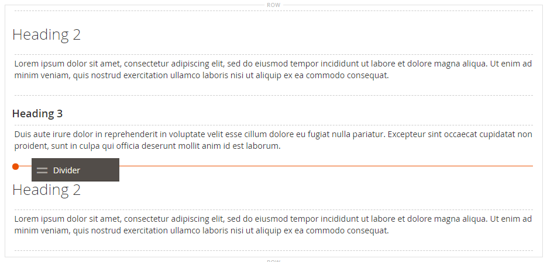
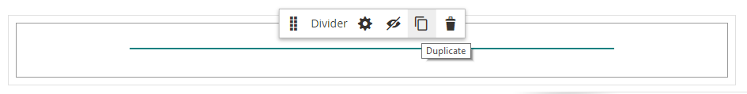

# 要素 – 区切り線

_ディバイダー_ コンテンツタイプを使用して、[[!DNL Page Builder]  ステージ ](workspace.md#stage) 内のコンテンツのセクション間の視覚的な区切りとしてルールを追加します。 分割線の色、太さ、幅を指定できます。 また、整列の制御、余白とパディングの設定、コンテナの境界線の形式の設定を行うこともできます。 デフォルトでは、区切りはコンテナの全幅を拡張するヘアーラインルールで、パディングに余裕があります。

{width="500" zoomable="yes"}

ほとんどのディバイダーコンテナは非表示ですが、次の例では、コンテナを赤い破線で囲み、ディバイダー、パディング、コンテナの関係を確認できます。 区切り線の上下のパディングを調整して、要素間の間隔を制御できます。

{width="500" zoomable="yes"}

{{$include /help/_includes/page-builder-save-timeout.md}}

## ディバイダーツールボックス

| ツール | アイコン | 説明 |
| ---- | --------------------| ------------|
| 移動 | {width="25"} | ディバイダーコンテナをページ上の別の有効な場所に移動します。 |
| （ラベル） | デバイダ | 現在のコンテナを分割要素として識別します。 |
| 設定 | {width="25"} | ディバイダーを編集ページが開きます。このページで、ディバイダーとそのコンテナのプロパティを変更できます。 |
| Hide | {width="25"} | ディバイダーコンテナを非表示にします。 |
| 表示 | {width="25"} | 非表示のディバイダーコンテナを表示します。 |
| 複製 | {width="25"} | ディバイダーコンテナをコピーします。 |
| 削除 | {width="25"} | ディバイダーコンテナとそのコンテンツをステージから削除します。 |

{style="table-layout:auto"}

{{$include /help/_includes/page-builder-hidden-element-note.md}}

## ディバイダーの追加

1. [!DNL Page Builder] パネルで **[!UICONTROL Elements]** を展開し、**[!UICONTROL Divider]** プレースホルダーをステージ上の行、列またはタブセットにドラッグします。

   赤いガイドラインを参考にして、ステージ上の別のコンテンツコンテナの前または後にディバイダーを配置します。

   {width="600" zoomable="yes"}

   次の使用例では、区切り記号を使用して文字列の新しいセクションの先頭を指定します。

   {width="500" zoomable="yes"}

1. 新しいディバイダーの設定を指定するには、次の手順に従います。

## ディバイダー設定の変更

1. ディバイダーコンテナにカーソルを合わせてツールボックスを表示し、_設定_ （{width="20"}）アイコンを選択します。

   {width="500" zoomable="yes"}

1. 次のいずれかの方法を使用して、ディバイダー **[!UICONTROL Line Color]** を変更します。

   - 有効な [HTMLカラー名 ][1] を入力してください。 例：`Teal`。
   - 16 進数のカラー値を入力します。 例：`#008080`。

   完了したら、「**[!UICONTROL Apply]**」をクリックします。

   {width="600" zoomable="yes"}

1. **[!UICONTROL Line Thickness]** をピクセル単位で入力します。

1. 測定単位を指定するには、**[!UICONTROL Line Width]** に続いて `px` または `%` を入力します。

   {width="600" zoomable="yes"}

1. 必要に応じて、_[!UICONTROL Advanced]_設定を更新します。

   - 親コンテナ内のディバイダーの位置を制御するには、**[!UICONTROL Alignment]** のオプションを選択します。

     | オプション | 説明 |
     | ------ | ----------- |
     | `Default` | 現在のテーマのスタイル シートで指定されている線形の既定の設定を適用します。 |
     | `Left` | 親コンテナの左罫線に沿ってリストを配置します。指定したパディングはすべて許可されます。 |
     | `Center` | 親コンテナの中央にリストを揃えます。指定したパディングに対する許容値を使用します。 |
     | `Right` | 親コンテナの右端に沿ってブロックを配置します。指定したパディングは許可されます。 |

     {style="table-layout:auto"}

     次の例では、ディバイダーに中央揃えを使用するようにオプションを設定しています。

     {width="600" zoomable="yes"}

   - ディバイダーコンテナの 4 つの辺すべてに適用する **[!UICONTROL Border]** スタイルを設定します。

     | オプション | 説明 |
     | ------ | ----------- |
     | `Default` | 関連付けられたスタイル シートで指定されている既定の罫線スタイルを適用します。 |
     | `None` | コンテナの境界線の表示はしません。 |
     | `Dotted` | コンテナの境界線は点線で表示されます。 |
     | `Dashed` | コンテナの境界線は破線で表示されます。 |
     | `Solid` | コンテナの境界線は実線で表示されます。 |
     | `Double` | コンテナの境界線は二重線で表示されます。 |
     | `Groove` | コンテナの境界線は溝付き線で表示されます。 |
     | `Ridge` | コンテナの境界線は、境界線として表示されます。 |
     | `Inset` | コンテナの境界線は、インセットされた線として表示されます。 |
     | `Outset` | コンテナの境界線は、先頭行として表示されます。 |

     {style="table-layout:auto"}

   - `None` 以外の境界線のスタイルを設定する場合は、境界線の表示オプションを完了します。

     | オプション | 説明 |
     | ------ |------------ |
     | [!UICONTROL Border Color] | 見本を選択するか、カラーピッカーをクリックするか、有効なカラー名または同等の 16 進数値を入力して、カラーを指定します。 |
     | [!UICONTROL Border Width] | 境界線の幅のピクセル数を入力します。 |
     | [!UICONTROL Border Radius] | ピクセル数を入力して、境界線の各コーナーを丸めるために使用する半径のサイズを定義します。 |

     {style="table-layout:auto"}

   - （オプション）コンテナに適用する現在のスタイルシートの **[!UICONTROL CSS classes]** の名前を指定します。

     複数のクラス名はスペースで区切ります。

   - ディバイダーコンテナの外側の余白と内側のパディングを決定する **[!UICONTROL Margins and Padding]** の値をピクセル単位で入力します。

     対応する値を図に入力します。

     | コンテナ領域 | 説明 |
     | -------------- | ----------- |
     | [!UICONTROL Margins] | コンテナのすべての側面の外側の端に適用される空白スペースの量。 オプション：`Top`/`Right`/`Bottom`/`Left` |
     | [!UICONTROL Padding] | コンテナのすべての側面の内側の端に適用される空白のスペースの量です。 オプション：`Top`/`Right`/`Bottom`/`Left` |

     {style="table-layout:auto"}

1. 完了したら、「**[!UICONTROL Save]**」をクリックして設定を適用し、[!DNL Page Builder] ワークスペースに戻ります。

   {width="500" zoomable="yes"}

## ディバイダーの複製

特定の設定を持つフォーマットされたディバイダーの場合は、新しいプレースホルダーでやり直すよりも、複製を作成する方が効率的です。

1. ディバイダーコンテナにカーソルを合わせてツールボックスを表示し、「_複製_」（{width="20"}）アイコンを選択します。

   重複したディバイダーコンテナは、オリジナルのすぐ下に表示されます。

   {width="500" zoomable="yes"}

1. 新しいディバイダーコンテナにカーソルを合わせてツールボックスを表示し、_移動_ （{width="20"}）アイコンを選択します。

   {width="500" zoomable="yes"}

1. ディバイダーを選択してドラッグし、赤いガイドラインが新しい位置を示すようにします。

   分割線を移動すると、各コンテナの上下の境界が破線で表示されます。

   {width="500" zoomable="yes"}

[1]: https://en.wikipedia.org/wiki/Web_colors
